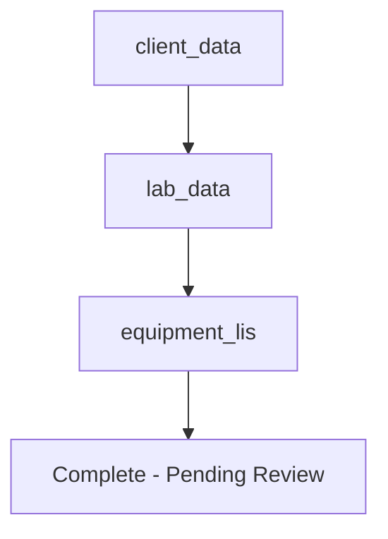
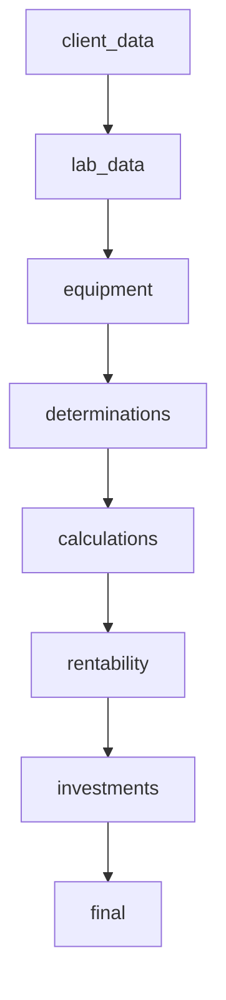

# Business Case Wizard - Technical Analysis Document

## Table of Contents
1. [Wizard Architecture Overview](#wizard-architecture-overview)
2. [Wizard State Model](#wizard-state-model)
3. [Role-Based Step Flows](#role-based-step-flows)
4. [Step-by-Step Analysis](#step-by-step-analysis)
5. [Data Flow Architecture](#data-flow-architecture)
6. [Implicit Business Rules](#implicit-business-rules)
7. [Known Technical Debt](#known-technical-debt)
8. [Automation Readiness Assessment](#automation-readiness-assessment)

---

## Wizard Architecture Overview

### System Architecture
```
Frontend (React)          Backend (Node.js/Express)     Database (PostgreSQL)
├── BusinessCaseWizard.jsx ├── businessCase.controller.js ├── business_cases
├── Wizard Steps           ├── BusinessCaseOrchestrator   ├── bc_economic_data
├── Wizard Context         ├── Equipment Compatibility    ├── equipment_models
└── UI Components          └── Calculation Engines        └── determinations
```

### Core Components
- **WizardProvider**: React Context for global state management
- **BusinessCaseWizard**: Main wizard component with step orchestration
- **Step Components**: Individual wizard steps (8 total)
- **BusinessCaseOrchestrator**: Backend workflow orchestration service
- **Calculation Engines**: ROI, investment, and cost analysis services

### State Persistence
- **Auto-save**: Every 2 seconds to localStorage with key `business_case_wizard_draft`
- **Draft Management**: Load/save wizard state across browser sessions
- **State Reset**: Manual draft clearing functionality

---

## Wizard State Model

### Complete State Structure
```javascript
{
  // Wizard Metadata
  businessCaseId: null,           // UUID when BC is created
  bcType: 'comodato_publico',     // 'comodato_publico' | 'comodato_privado'
  calculationMode: 'annual',      // 'annual' | 'monthly'

  // Step 1: Client/General Data
  generalData: {
    client: "",                   // Client name (required)
    clientType: "",              // Client classification
    contractingEntity: "",       // Legal contracting party
    processCode: "",             // Internal process identifier
    contractObject: "",          // Contract purpose description
    provinceCity: "",            // Geographic location
    notes: "",                   // Additional notes
    durationYears: 3,            // Contract duration (default: 3)
    targetMargin: 25,            // Target profit margin % (default: 25)

    // Laboratory Operational Data
    labWorkDaysPerWeek: "",      // Operating days per week
    labShiftsPerDay: "",         // Shifts per operating day
    labHoursPerShift: "",        // Hours per shift
    labQualityControlsPerShift: "", // QC tests per shift
    labControlLevels: "",        // QC control levels
    labRoutineQCFrequency: "",   // Routine QC frequency
    labSpecialTests: "",         // Special test requirements
    labSpecialQCFrequency: "",   // Special QC frequency

    // LIS (Laboratory Information System) Data
    lisIncludes: false,          // Whether LIS is included
    lisProvider: "",             // LIS vendor name
    lisIncludesHardware: false,  // Hardware included in LIS
    lisMonthlyPatients: "",      // Monthly patient volume
    lisInterfaceSystem: "",      // System to interface with
    lisInterfaceProvider: "",    // Interface provider
    lisInterfaceHardware: "",    // Interface hardware specs

    // Requirements and Timeline
    requirementsDeadlineMonths: "",     // Months to requirements completion
    requirementsProjectedDeadlineMonths: "", // Projected deadline
    deliveryType: "total",       // 'total' | 'progressive'
    effectiveDetermination: false // Special determination flag
  },

  // LIS Integration Data
  lisInterfaces: [],            // Array of LIS interface configurations

  // Step 2: Equipment Configuration
  equipmentConfig: {
    primary: null,              // Primary equipment object
    backup: null,               // Backup equipment object
    secondary: []               // Array of secondary equipment
  },

  // Equipment Pairs (New Compatibility System)
  equipmentPairs: [             // Array of equipment pair objects
    {
      id: Date.now(),
      primary: { /* equipment object */ },
      backup: { /* equipment object */ }
    }
  ],

  // Step 3: Determinations
  determinations: [],           // Array of determination configurations

  // Step 4: Calculations
  calculations: null,           // Calculation results object

  // Step 5: Investments
  investments: [],              // Array of investment entries

  // UI State (Derived)
  selectedEquipment: null,      // Currently selected equipment
  equipmentCost: 0             // Equipment cost override
}
```

### State Evolution Rules
1. **Initialization**: Load from localStorage or use defaults
2. **Auto-persistence**: Save to localStorage every 2 seconds
3. **Step Transitions**: Validate required data before advancing
4. **Data Dependencies**: Later steps depend on earlier step completion
5. **Reset Conditions**: Manual draft clearing or successful completion

### State Validation Rules
- `businessCaseId`: Must exist for steps 2+
- `generalData.client`: Required for step progression
- `equipmentConfig.primary`: Required for step 3
- `determinations`: Must have at least one entry for calculations

---

## Role-Based Step Flows

### Commercial User Workflow (3 Steps)


**Steps:**
1. **client_data**: `Step1ClientData` - Basic client information
2. **lab_data**: `Step2LabData` - Laboratory operational data
3. **equipment_lis**: `Step3EquipmentAndLis` - Equipment and LIS configuration

**Role Access**: `["comercial", "acp_comercial"]`

### Manager Workflow (8 Steps)


**Steps:**
1. **client_data**: `Step1ClientData` - Client information
2. **lab_data**: `Step2LabData` - Laboratory data
3. **equipment**: `Step2EquipmentSelector` - Equipment selection
4. **determinations**: `Step3DeterminationSelector` - Test configurations
5. **calculations**: `Step4CalculationsSummary` - Technical calculations
6. **rentability**: `Step4RentabilitySummary` - ROI and profitability
7. **investments**: `Step5Investments` - Investment breakdown
8. **final**: `FinalStep` - Final review and submission

**Role Access**: `["jefe_comercial", "gerencia", "gerencia_general", "admin"]`

### Step Dependencies
- **Sequential**: Each step requires previous step completion
- **Data Flow**: Later steps consume data from earlier steps
- **Validation**: Automatic validation before step transitions
- **Fallback**: Users can navigate back to modify previous steps

---

## Step-by-Step Analysis

### Step 1: Client Data (`Step1ClientData`)

#### 1. Step Overview
**Identifier**: `client_data`
**User Purpose**: Capture basic client information and contract details
**Technical Purpose**: Initialize business case with client context and basic requirements

#### 2. Entry Conditions
**Required Previous Steps**: None (first step)
**Required State Data**: None
**Preconditions**: User must be authenticated with appropriate role

#### 3. UI Flow
**Components Involved**:
- `Step1ClientData.jsx` - Main form component
- Form inputs for client data
- Navigation buttons (Next only, no Previous)

**User Interactions**:
- Fill client name (required)
- Select client type
- Enter contract details
- Add notes
- Click "Siguiente" to proceed

**Disabled/Enababled Conditions**:
- Next button: Always enabled (no validation on this step)
- Form validation: Client name required, others optional

**Conditional Rendering**:
- No conditional rendering
- All fields visible by default

#### 4. State Management
**Local State**: None (direct state updates)
**Global Wizard State Updates**:
```javascript
updateState({
  generalData: {
    client: "Hospital Central",
    clientType: "publico",
    contractingEntity: "MSP",
    // ... other fields
  }
})
```
**Derived/Computed Values**: None
**Default Values**: See `defaultState.generalData`

#### 5. Backend Interactions
**API Endpoints Called**: None (data stored locally until later steps)
**HTTP Methods**: N/A
**Request Payload**: N/A
**Response Structure**: N/A
**Error Scenarios**: N/A

#### 6. Database Dependencies
**Tables Queried**: None
**Views Used**: None
**Filters/Joins**: N/A
**Data Completeness Assumptions**: N/A

#### 7. Business Logic & Calculations
**Formulas Used**: None
**Decision Rules**: None
**Conditional Branches**: None
**Implicit Assumptions**:
- Client data is sufficient for business case initialization
- No validation required at this stage

#### 8. Error Handling & Edge Cases
**Validation Failures**: Client name empty (blocks progression)
**Missing/Inconsistent Data**: Handled by form validation
**Fallback Logic**: None required
**User-facing vs Silent Errors**: Form validation messages

#### 9. Outputs of the Step
**Data Persisted**: `state.generalData` object
**Data Passed**: Client context for subsequent steps
**Side Effects**: Auto-save to localStorage
**Next Step Dependencies**: Client name required for business case creation

---

### Step 2: Laboratory Data (`Step2LabData`)

#### 1. Step Overview
**Identifier**: `lab_data`
**User Purpose**: Define laboratory operational parameters and LIS requirements
**Technical Purpose**: Gather operational data for cost calculations and system sizing

#### 2. Entry Conditions
**Required Previous Steps**: Step 1 (client_data) must be completed
**Required State Data**: `generalData.client` must exist
**Preconditions**: Valid client data from previous step

#### 3. UI Flow
**Components Involved**:
- `Step2LabData.jsx` - Main form component
- Form sections: Operational Data, LIS Configuration
- Navigation buttons (Previous/Next)

**User Interactions**:
- Enter laboratory operational parameters
- Configure LIS requirements
- Toggle LIS inclusion
- Set delivery timelines
- Navigate between steps

**Disabled/Enabled Conditions**:
- Previous button: Always enabled
- Next button: Always enabled (no validation)
- LIS fields: Conditionally shown based on `lisIncludes` flag

**Conditional Rendering**:
```javascript
{state.generalData.lisIncludes && (
  <LISConfigurationFields />
)}
```

#### 4. State Management
**Local State**: None
**Global Wizard State Updates**:
```javascript
updateState({
  generalData: {
    ...prev.generalData,
    labWorkDaysPerWeek: 5,
    lisIncludes: true,
    lisProvider: "Cerner",
    // ... merged with existing data
  }
})
```
**Derived/Computed Values**: None
**Default Values**: See `defaultState.generalData`

#### 5. Backend Interactions
**API Endpoints Called**: None
**HTTP Methods**: N/A
**Request Payload**: N/A
**Response Structure**: N/A
**Error Scenarios**: N/A

#### 6. Database Dependencies
**Tables Queried**: None
**Views Used**: None
**Filters/Joins**: N/A
**Data Completeness Assumptions**: N/A

#### 7. Business Logic & Calculations
**Formulas Used**: None
**Decision Rules**:
- LIS fields visibility based on `lisIncludes` flag
- Delivery type affects timeline calculations (implicit)
**Conditional Branches**: LIS configuration section
**Implicit Assumptions**:
- Laboratory data determines system sizing requirements
- LIS inclusion affects total cost calculations

#### 8. Error Handling & Edge Cases
**Validation Failures**: None (all fields optional)
**Missing/Inconsistent Data**: Handled gracefully, defaults applied
**Fallback Logic**: Previous step navigation available
**User-facing vs Silent Errors**: None

#### 9. Outputs of the Step
**Data Persisted**: Updated `state.generalData` with lab/LIS data
**Data Passed**: Operational parameters for equipment sizing and cost calculations
**Side Effects**: Auto-save to localStorage
**Next Step Dependencies**: Lab data influences equipment recommendations

---

### Step 3: Equipment & LIS (Commercial) / Equipment (Manager) (`Step3EquipmentAndLis` / `Step2EquipmentSelector`)

#### 1. Step Overview
**Identifier**: `equipment_lis` (Commercial) / `equipment` (Manager)
**User Purpose**: Select primary equipment and configure backup options
**Technical Purpose**: Establish equipment configuration for cost and compatibility analysis

#### 2. Entry Conditions
**Required Previous Steps**: Steps 1 and 2 must be completed
**Required State Data**:
- `generalData.client` exists
- `businessCaseId` exists (for manager workflow)
**Preconditions**: Business case must be created in backend

#### 3. UI Flow
**Components Involved**:
- `Step3EquipmentAndLis.jsx` (Commercial) - Combined equipment/LIS form
- `Step2EquipmentSelector.jsx` (Manager) - Equipment selection with pairs
- `EquipmentCard` - Individual equipment display
- `AccordionSection` - Equipment pair management
- Navigation controls

**User Interactions**:
- Browse equipment catalog
- Filter by category/manufacturer
- Select primary equipment
- Configure backup equipment (Manager only)
- Set equipment costs
- Navigate steps

**Disabled/Enabled Conditions**:
- Previous: Always enabled
- Next: Primary equipment must be selected
- Backup selection: Only after primary selection

**Conditional Rendering**:
```javascript
// Manager workflow - equipment pairs
{equipmentPairs.map(pair => (
  <AccordionSection key={pair.id}>
    {/* Pair management UI */}
  </AccordionSection>
))}

// Commercial workflow - simplified selection
{!pair.primary ? (
  <EquipmentSelectionGrid />
) : (
  <SelectedEquipmentDisplay />
)}
```

#### 4. State Management
**Local State** (Manager workflow):
```javascript
const [equipmentPairs, setEquipmentPairs] = useState([]);
const [filters, setFilters] = useState({ search: "", category: "" });
const [loading, setLoading] = useState(false);
```

**Global Wizard State Updates**:
```javascript
// Manager workflow
updateState({
  equipmentPairs: [
    {
      id: 1234567890,
      primary: { id: 1, name: "Analyzer X" },
      backup: { id: 2, name: "Analyzer Y" }
    }
  ]
});

// Commercial workflow
updateState({
  equipmentConfig: {
    primary: selectedEquipment,
    backup: null
  }
});
```

**Derived/Computed Values**:
- Equipment compatibility candidates
- Filtered equipment lists
- Total equipment costs

#### 5. Backend Interactions

**API Endpoints Called**:
- `GET /equipment-catalog` - Load equipment catalog
- `POST /business-case/{id}/equipment` - Save equipment selection
- `GET /business-case/equipment/{id}/compatibility/backups` - Get backup candidates (NEW)

**HTTP Methods**: GET, POST
**Request Payload**:
```javascript
// Equipment selection
{
  equipmentId: 123,
  isPrimary: true
}

// Compatibility request (NEW)
{
  maxCandidates: 10,
  minCompatibilityScore: 0.3
}
```

**Response Structure**:
```javascript
// Equipment catalog
{
  ok: true,
  data: [
    {
      id: 123,
      name: "Analyzer X",
      capacity: 100,
      price: 50000,
      categories: ["hematology"]
    }
  ]
}

// Compatibility candidates (NEW)
{
  ok: true,
  data: [...],
  meta: {
    hasCompatibilityData: true,
    totalCandidates: 3
  }
}
```

**Error Scenarios**:
- Network failure: Toast error, retry option
- Invalid equipment ID: Validation error
- Business case not found: Redirect or error state

#### 6. Database Dependencies

**Tables Queried**:
- `equipment_models` - Equipment catalog
- `equipment_compatibility_matrix` - Compatibility relationships (NEW)
- `business_cases` - BC existence validation

**Views Used**:
- `v_equipment_with_compatibility` - Equipment with compatibility metadata (NEW)

**Filters/Joins**:
```sql
-- Equipment catalog query
SELECT * FROM equipment_models
WHERE status = 'operativo'
  AND (name ILIKE '%search%' OR category_type = 'category')
ORDER BY base_price ASC

-- Compatibility query (NEW)
SELECT * FROM equipment_compatibility_matrix m
JOIN equipment_models e ON e.id = m.backup_equipment_id
WHERE m.primary_equipment_id = $1
  AND m.is_active = true
  AND e.status = 'operativo'
ORDER BY m.compatibility_score DESC
```

**Data Completeness Assumptions**:
- Equipment catalog is populated
- Equipment status is current
- Compatibility matrix exists (with fallback to category matching)

#### 7. Business Logic & Calculations

**Formulas Used**:
- Equipment cost calculations
- Compatibility scoring (NEW)
- Capacity overlap analysis (NEW)

**Decision Rules**:
```javascript
// Primary equipment selection requirement
if (!equipmentPairs.some(p => p.primary)) {
  showToast("Todos los grupos deben tener equipo principal", "warning");
  return;
}

// Compatibility fallback logic (NEW)
const candidates = await getCompatibleBackupCandidates(primaryId);
if (!candidates.length) {
  // Fallback to legacy category matching
  return getLegacyBackupCandidates(primaryId);
}
```

**Conditional Branches**:
- Manager vs Commercial workflow
- Equipment availability checks
- Compatibility data existence

**Implicit Assumptions**:
- Equipment selection determines system capabilities
- Backup equipment provides redundancy
- Cost calculations affect ROI

#### 8. Error Handling & Edge Cases

**Validation Failures**:
- No primary equipment selected: Blocks progression
- Invalid equipment ID: API validation error
- Business case not created: Redirect to step 1

**Missing/Inconsistent Data**:
- Empty equipment catalog: Show empty state message
- Missing compatibility data: Fallback to category matching
- Network errors: Retry logic with user feedback

**Fallback Logic**:
```javascript
// Equipment selection fallback
try {
  await api.post(`/business-case/${bcId}/equipment`, payload);
} catch (error) {
  showToast("Error guardando equipo", "error");
  // Allow user to retry or navigate back
}

// Compatibility fallback (NEW)
const candidates = await getAdvancedBackupCandidates(primaryId);
if (!candidates.length) {
  logger.warn('No compatibility data, using legacy fallback');
  return getLegacyBackupCandidates(primaryId);
}
```

**User-facing vs Silent Errors**:
- Network errors: Toast notifications
- Validation errors: Inline form messages
- Data loading errors: Loading states with error fallbacks

#### 9. Outputs of the Step

**Data Persisted**:
```javascript
// Manager workflow
{
  equipmentPairs: [
    {
      id: 1234567890,
      primary: { /* equipment object */ },
      backup: { /* equipment object */ }
    }
  ]
}

// Commercial workflow
{
  equipmentConfig: {
    primary: selectedEquipment,
    backup: null
  }
}
```

**Data Passed**:
- Equipment configuration for determinations step
- Cost data for financial calculations
- Compatibility metadata for backup planning

**Side Effects**:
- Business case equipment association in database
- Auto-save to localStorage
- Toast notifications for user feedback

**Next Step Dependencies**:
- Primary equipment required for determinations
- Equipment capacity affects test volume calculations
- Cost data feeds into ROI calculations

---

### Step 4: Determinations (`Step3DeterminationSelector`)

#### 1. Step Overview
**Identifier**: `determinations`
**User Purpose**: Configure test volumes and parameters for selected equipment
**Technical Purpose**: Define operational workload for cost and capacity analysis

#### 2. Entry Conditions
**Required Previous Steps**: Steps 1-3 (equipment selection)
**Required State Data**:
- `businessCaseId` exists
- `equipmentConfig.primary` or `equipmentPairs[].primary` exists
**Preconditions**: Equipment must be associated with business case

#### 3. UI Flow
**Components Involved**:
- `Step3DeterminationSelector.jsx` - Main determinations form
- Table display of determinations
- Quantity input controls with debounced updates
- Calculation summary display

**User Interactions**:
- View determinations for selected equipment
- Set monthly/annual quantities for each test
- Real-time calculation updates
- Navigate between steps

**Disabled/Enabled Conditions**:
- Previous: Always enabled
- Next: Always enabled (determinations optional)
- Quantity inputs: Always editable

**Conditional Rendering**:
```javascript
{mode === "annual" ? (
  <AnnualQuantityInput />
) : (
  <MonthlyQuantityInput />
)}
```

#### 4. State Management
**Local State**:
```javascript
const [options, setOptions] = useState([]);        // Available determinations
const [saving, setSaving] = useState(false);       // Save operation state
const debounceRefs = useRef({});                   // Debounce timers
```

**Global Wizard State Updates**:
```javascript
updateState({
  determinations: [
    {
      id: 1,
      determinationId: 123,
      annual_quantity: 6000,
      monthly_quantity: 500,
      cost: 25.50,
      consumption: 2.5
    }
  ]
});
```

**Derived/Computed Values**:
```javascript
const subtotal = useMemo(() => ({
  totalCost: determinations.reduce((acc, det) => acc + (det.cost || 0), 0),
  totalQty: determinations.reduce((acc, det) => acc + (det[quantityField] || 0), 0)
}), [determinations, quantityField]);
```

#### 5. Backend Interactions

**API Endpoints Called**:
- `GET /equipment-catalog/{equipmentId}/determinations` - Load determinations
- `POST /business-case/{bcId}/determinations` - Save determination quantities
- `GET /business-case/{bcId}/determinations` - Refresh determinations data

**HTTP Methods**: GET, POST
**Request Payload**:
```javascript
// Save determination
{
  detId: 123,
  annualQty: 6000,  // or monthlyQty: 500
}

// Load determinations
GET /equipment-catalog/456/determinations
```

**Response Structure**:
```javascript
// Determinations list
{
  ok: true,
  data: [
    {
      id: 123,
      name: "Hemoglobin",
      category: "hematology",
      base_cost: 25.50
    }
  ]
}

// Saved determination
{
  ok: true,
  data: {
    id: 1,
    determinationId: 123,
    annual_quantity: 6000,
    cost: 25.50,
    consumption: 2.5
  }
}
```

**Error Scenarios**:
- Equipment not found: 404 error, user guidance
- Invalid quantities: Validation error with retry
- Network timeout: Debounced retry logic

#### 6. Database Dependencies

**Tables Queried**:
- `determinations_catalog` - Available determinations
- `equipment_determinations` - Equipment-determination mappings
- `bc_determinations` - Saved determination quantities

**Views Used**: None
**Filters/Joins**:
```sql
-- Load determinations for equipment
SELECT d.* FROM determinations_catalog d
JOIN equipment_determinations ed ON ed.determination_id = d.id
WHERE ed.equipment_id = $1
ORDER BY d.category, d.name

-- Save determination quantity
INSERT INTO bc_determinations (
  bc_id, determination_id, annual_quantity, monthly_quantity
) VALUES ($1, $2, $3, $4)
ON CONFLICT (bc_id, determination_id)
DO UPDATE SET annual_quantity = $3, monthly_quantity = $4
```

**Data Completeness Assumptions**:
- Determinations catalog is populated
- Equipment-determination mappings exist
- Cost data is current and accurate

#### 7. Business Logic & Calculations

**Formulas Used**:
```javascript
// Quantity field selection
const quantityField = mode === "annual" ? "annual_quantity" : "monthly_quantity";

// Subtotal calculations
const totalCost = determinations.reduce((acc, det) => acc + (det.cost || 0), 0);
const totalQty = determinations.reduce((acc, det) =>
  acc + (det[quantityField] || 0), 0);
```

**Decision Rules**:
- Annual vs Monthly mode affects quantity fields
- Debounced saves prevent excessive API calls
- Quantity validation (must be positive numbers)

**Conditional Branches**:
```javascript
if (state.calculationMode === "annual") {
  // Use annual_quantity field
  payload = { detId, annualQty: qty };
} else {
  // Use monthly_quantity field
  payload = { detId, monthlyQty: qty };
}
```

**Implicit Assumptions**:
- Determination quantities directly affect total costs
- Equipment capacity limits determination volumes
- Cost per test is fixed and known

#### 8. Error Handling & Edge Cases

**Validation Failures**:
- Negative quantities: Converted to 0
- Non-numeric input: Ignored with user feedback
- Empty determinations list: Show appropriate empty state

**Missing/Inconsistent Data**:
- Missing cost data: Display "N/A" with fallback
- Incomplete mappings: Filter out unmapped determinations
- Data loading failures: Retry with exponential backoff

**Fallback Logic**:
```javascript
// Debounced save with error recovery
const persistQuantity = async (detId, qty) => {
  try {
    await api.post(`/business-case/${bcId}/determinations`, payload);
    // Success: update local state
  } catch (error) {
    // Failure: show error but don't block UI
    showToast("Error guardando cantidad", "error");
  }
};
```

**User-facing vs Silent Errors**:
- Save failures: Toast notifications
- Data loading: Loading states with error messages
- Validation: Inline input feedback

#### 9. Outputs of the Step

**Data Persisted**:
```javascript
{
  determinations: [
    {
      id: 1,
      determinationId: 123,
      annual_quantity: 6000,
      monthly_quantity: 500,
      cost: 25.50,
      consumption: 2.5
    }
  ]
}
```

**Data Passed**:
- Determination volumes for cost calculations
- Consumption data for reagent planning
- Test mix data for equipment utilization analysis

**Side Effects**:
- Database updates with debounced saves
- Real-time calculation updates
- Auto-save to localStorage

**Next Step Dependencies**:
- Determinations data required for calculations step
- Quantities affect ROI and cost projections
- Test mix influences equipment recommendations

---

### Step 5: Calculations Summary (`Step4CalculationsSummary`)

#### 1. Step Overview
**Identifier**: `calculations`
**User Purpose**: Review technical calculations and system requirements
**Technical Purpose**: Compute operational costs and system specifications

#### 2. Entry Conditions
**Required Previous Steps**: Steps 1-4 (determinations)
**Required State Data**:
- `businessCaseId` exists
- `determinations` array has entries
- Equipment configuration exists
**Preconditions**: Previous steps completed with valid data

#### 3. UI Flow
**Components Involved**:
- `Step4CalculationsSummary.jsx` - Calculations display
- Technical specification tables
- Cost breakdown displays
- Navigation controls

**User Interactions**:
- Review calculation results
- View technical specifications
- Navigate to modify previous steps
- Proceed to rentability analysis

**Disabled/Enabled Conditions**:
- Previous: Always enabled
- Next: Always enabled (read-only step)
- All displays: Read-only

**Conditional Rendering**:
- Different calculation modes (annual/monthly)
- Equipment-specific calculations
- Cost breakdown sections

#### 4. State Management
**Local State**: Minimal (loading states)
**Global Wizard State Updates**:
```javascript
updateState({
  calculations: {
    technicalSpecs: { /* calculated specs */ },
    costBreakdown: { /* cost analysis */ },
    utilizationRates: { /* equipment utilization */ }
  }
});
```

#### 5. Backend Interactions

**API Endpoints Called**:
- `GET /business-case/{id}/calculations` - Load existing calculations
- `POST /business-case/{id}/recalculate` - Trigger recalculation

**HTTP Methods**: GET, POST
**Request Payload**:
```javascript
// Recalculation trigger
POST /business-case/{id}/recalculate
// Empty body or configuration overrides
```

**Response Structure**:
```javascript
{
  ok: true,
  data: {
    technical_calculations: {
      required_capacity: 150,
      peak_utilization: 85,
      reagent_consumption: 2500
    },
    cost_projections: {
      annual_cost: 150000,
      cost_per_test: 25.50,
      reagent_costs: 75000
    },
    equipment_utilization: {
      primary_equipment: 78,
      backup_equipment: 22
    }
  }
}
```

#### 6. Database Dependencies

**Tables Queried**:
- `bc_determinations` - Determination quantities
- `bc_equipment_details` - Equipment configuration
- `calculation_templates` - Calculation formulas
- `equipment_models` - Equipment specifications

**Views Used**:
- Calculation result views
- Cost aggregation views

#### 7. Business Logic & Calculations

**Formulas Used**:
- Capacity utilization: `(total_tests / equipment_capacity) * 100`
- Cost per test: `total_costs / total_test_volume`
- Reagent consumption: `test_volume * reagent_per_test`
- Peak utilization calculations

**Decision Rules**:
- Annual vs monthly calculation modes
- Equipment capacity constraints
- Reagent cost calculations

#### 8. Error Handling & Edge Cases
**Validation Failures**: Data consistency checks
**Missing/Inconsistent Data**: Fallback calculations
**Fallback Logic**: Simplified calculations when data incomplete

#### 9. Outputs of the Step
**Data Persisted**: `state.calculations` object
**Data Passed**: Technical data for rentability analysis

---

### Step 6: Rentability Summary (`Step4RentabilitySummary`)

#### 1. Step Overview
**Identifier**: `rentability`
**User Purpose**: Review ROI calculations and profitability analysis
**Technical Purpose**: Compute financial projections and investment returns

#### 2. Entry Conditions
**Required Previous Steps**: Steps 1-5 (calculations)
**Required State Data**: `calculations` object exists
**Preconditions**: Technical calculations completed

#### 3. UI Flow
**Components Involved**:
- `Step4RentabilitySummary.jsx` - ROI display
- Financial charts and tables
- Profitability metrics
- Investment return displays

#### 4. State Management
**Updates**: Financial calculation results stored

#### 5. Backend Interactions

**API Endpoints Called**:
- `POST /business-case/{id}/orchestrator/calculate-roi` - Calculate ROI
- `POST /business-case/{id}/orchestrator/evaluate-approval` - Evaluate approval

**Response Structure**:
```javascript
{
  success: true,
  data: {
    roi: 15.5,
    npv: 250000,
    irr: 18.2,
    payback_period: 3.5,
    approved: true
  }
}
```

#### 6. Database Dependencies
**Tables**: Investment and cost tables

#### 7. Business Logic & Calculations

**Formulas Used**:
- ROI: `(net_profit / investment) * 100`
- NPV: Net Present Value calculations
- IRR: Internal Rate of Return
- Payback Period: Investment recovery time

#### 8. Error Handling & Edge Cases
**Financial calculation errors**: Fallback to simplified models

#### 9. Outputs of the Step
**Data Persisted**: Financial analysis results

---

### Step 7: Investments (`Step5Investments`)

#### 1. Step Overview
**Identifier**: `investments`
**User Purpose**: Define and categorize investment components
**Technical Purpose**: Break down total investment by category

#### 2. Entry Conditions
**Required Previous Steps**: Steps 1-6 (rentability)
**Required State Data**: Rentability calculations exist

#### 3. UI Flow
**Components Involved**:
- `Step5Investments.jsx` - Investment form
- Investment category inputs
- Cost allocation tables

#### 4. State Management
**Updates**: `state.investments` array

#### 5. Backend Interactions

**API Endpoints Called**:
- `GET /business-case/{id}/investments` - Load investments
- `POST /business-case/{id}/investments` - Save investment
- `PUT /business-case/{id}/investments/{invId}` - Update investment
- `DELETE /business-case/{id}/investments/{invId}` - Delete investment

#### 6. Database Dependencies
**Tables**: `bc_investments` table

#### 7. Business Logic & Calculations
**Investment categorization and totaling**

#### 8. Error Handling & Edge Cases
**Investment validation and consistency checks**

#### 9. Outputs of the Step
**Data Persisted**: Complete investment breakdown

---

### Step 8: Final Step (`FinalStep`)

#### 1. Step Overview
**Identifier**: `final`
**User Purpose**: Final review and business case submission
**Technical Purpose**: Validate complete business case and trigger workflow

#### 2. Entry Conditions
**Required Previous Steps**: All previous steps completed
**Required State Data**: All required data present

#### 3. UI Flow
**Components Involved**:
- `FinalStep.jsx` - Final review component
- Complete BC summary
- Submission controls

#### 4. State Management
**Final state validation**

#### 5. Backend Interactions

**API Endpoints Called**:
- `GET /business-case/{id}/orchestrator/complete` - Get final BC
- Workflow transition endpoints

#### 6. Database Dependencies
**Complete BC data aggregation**

#### 7. Business Logic & Calculations
**Final validation and approval routing**

#### 8. Error Handling & Edge Cases
**Complete BC validation failures**

#### 9. Outputs of the Step
**Business case finalization and workflow initiation**

---

## Data Flow Architecture

### Database → Backend → Frontend Flow

```
Database Layer
├── business_cases (BC metadata)
├── bc_economic_data (Financial data)
├── equipment_models (Equipment catalog)
├── determinations_catalog (Test catalog)
├── bc_determinations (Test quantities)
├── bc_investments (Investment breakdown)
└── equipment_compatibility_matrix (NEW - Compatibility)

Backend Layer (Node.js/Express)
├── Controllers: Validation & API responses
├── Services: Business logic & calculations
├── Orchestrator: Workflow coordination
└── Compatibility Service: Equipment matching (NEW)

Frontend Layer (React)
├── Wizard Context: Global state management
├── Step Components: UI & user interactions
├── API Layer: HTTP request/response handling
└── Local Storage: Draft persistence
```

### Data Transformation Pipeline

1. **Raw Data** (Database) → **Business Objects** (Backend)
2. **Business Objects** → **API Responses** (JSON)
3. **API Responses** → **React State** (JavaScript objects)
4. **React State** → **UI Components** (Rendered elements)
5. **User Input** → **State Updates** → **API Calls** → **Database**

### State Synchronization

- **Auto-save**: Frontend → localStorage (every 2 seconds)
- **API Sync**: Frontend → Backend → Database (on step completion)
- **Data Loading**: Database → Backend → Frontend (on initialization)
- **Real-time Updates**: Backend → Frontend (calculations, validations)

---

## Implicit Business Rules

### Equipment Selection Rules
1. **Primary Equipment Required**: Every business case must have exactly one primary equipment
2. **Backup Optional**: Backup equipment improves reliability but not required
3. **Capacity Matching**: Selected equipment must support required test volumes
4. **Cost Constraints**: Equipment costs affect ROI calculations

### Financial Calculation Rules
1. **Contract Duration**: Default 3 years, affects NPV calculations
2. **Target Margin**: Default 25%, used for profitability analysis
3. **Cost Allocation**: Equipment, reagents, labor, maintenance categories
4. **ROI Threshold**: Minimum acceptable return on investment

### Workflow Progression Rules
1. **Sequential Completion**: Steps must be completed in order
2. **Data Dependencies**: Later steps require earlier step data
3. **Validation Gates**: Critical validations prevent progression
4. **Draft Persistence**: Work can be saved and resumed

### LIS Integration Rules
1. **Provider Selection**: LIS provider affects interface complexity
2. **Hardware Inclusion**: Hardware affects total investment
3. **Interface Requirements**: System integration affects timeline
4. **Patient Volume**: Monthly patients affects system sizing

---

## Known Technical Debt

### State Management Issues
1. **Complex State Object**: Wizard state object is deeply nested and complex
2. **State Synchronization**: Multiple sources of truth (localStorage, API, component state)
3. **State Validation**: Limited runtime validation of state consistency
4. **Memory Leaks**: Potential memory leaks from unsubscribed effects

### Code Structure Problems
1. **Mixed Responsibilities**: Step components handle UI, API calls, and business logic
2. **Tight Coupling**: Direct API calls in components instead of service layer
3. **Error Handling**: Inconsistent error handling patterns across steps
4. **Code Duplication**: Similar logic repeated across step components

### Performance Issues
1. **Auto-save Frequency**: Every 2 seconds may be excessive for large state objects
2. **API Call Frequency**: Debounced calls in determinations may still cause load
3. **Large Dataset Handling**: Equipment catalog loading without pagination
4. **Calculation Complexity**: Synchronous calculations blocking UI

### Data Consistency Issues
1. **Race Conditions**: Multiple API calls without proper sequencing
2. **Stale Data**: Local state may become stale without proper invalidation
3. **Partial Updates**: API failures can leave data in inconsistent states
4. **Validation Gaps**: Client-side validation not matching server-side rules

### Testing Gaps
1. **Integration Tests**: Limited testing of step transitions
2. **Error Scenarios**: Insufficient error condition testing
3. **Performance Testing**: No load testing for concurrent users
4. **Browser Compatibility**: Limited testing across browsers

---

## Automation Readiness Assessment

### Fully Deterministic Steps (Ready for Automation)
1. **Step 1 (Client Data)**: ❌ Manual input required
2. **Step 2 (Lab Data)**: ❌ Manual operational data input
3. **Step 3 (Equipment)**: ⚠️ Partially automatable with compatibility system
4. **Step 4 (Determinations)**: ❌ Manual quantity setting
5. **Step 5 (Calculations)**: ✅ Fully automated
6. **Step 6 (Rentability)**: ✅ Fully automated
7. **Step 7 (Investments)**: ⚠️ Template-based automation possible
8. **Step 8 (Final)**: ✅ Fully automated validation

### Automation Opportunities

#### High Impact - Easy Implementation
1. **Equipment Recommendations**: Use compatibility system for automated suggestions
2. **Default Quantities**: Statistical defaults based on equipment type
3. **Template Application**: Pre-configured business case templates

#### High Impact - Complex Implementation
1. **AI-Powered Equipment Selection**: Machine learning equipment recommendations
2. **Dynamic Pricing**: Real-time cost optimization
3. **Predictive Analytics**: Usage pattern forecasting

#### Medium Impact - Medium Complexity
1. **Bulk Determinations**: Batch quantity setting
2. **Investment Auto-calculation**: Automated cost allocation
3. **LIS Integration Estimation**: Automated interface complexity assessment

### Current Automation Level: 30%

### Recommended Automation Roadmap
1. **Phase 1 (3 months)**: Equipment compatibility automation (50% total)
2. **Phase 2 (6 months)**: Template-based automation (70% total)
3. **Phase 3 (12 months)**: AI-powered recommendations (90% total)

---

**Document Version**: 1.0
**Analysis Date**: January 2026
**System Version**: Business Case Wizard v2.0
**Analysis Scope**: Complete wizard flow and data dependencies
**Next Review**: March 2026
