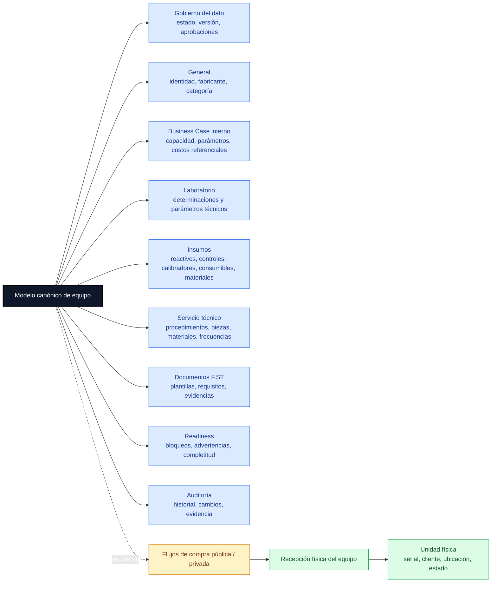
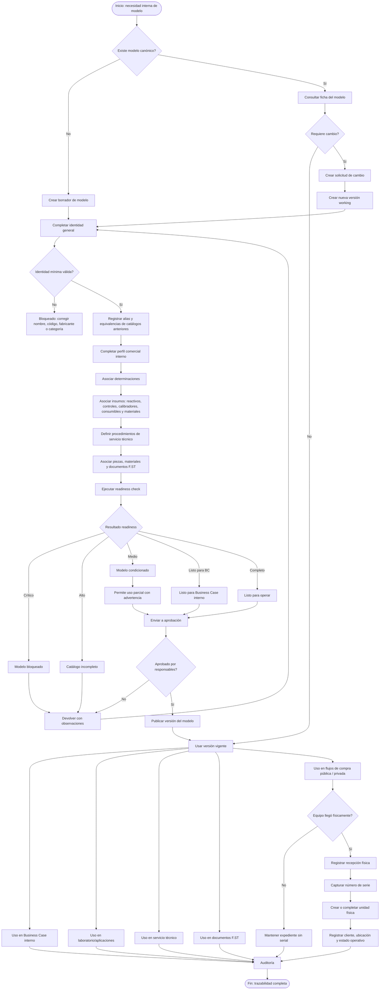
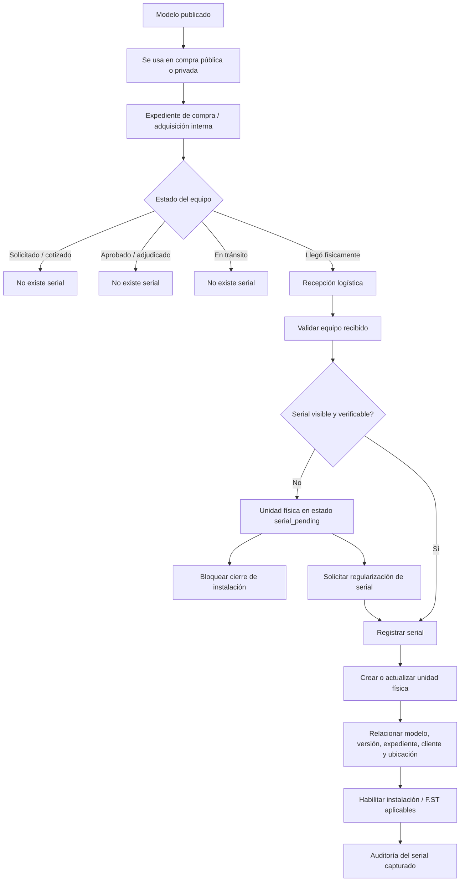
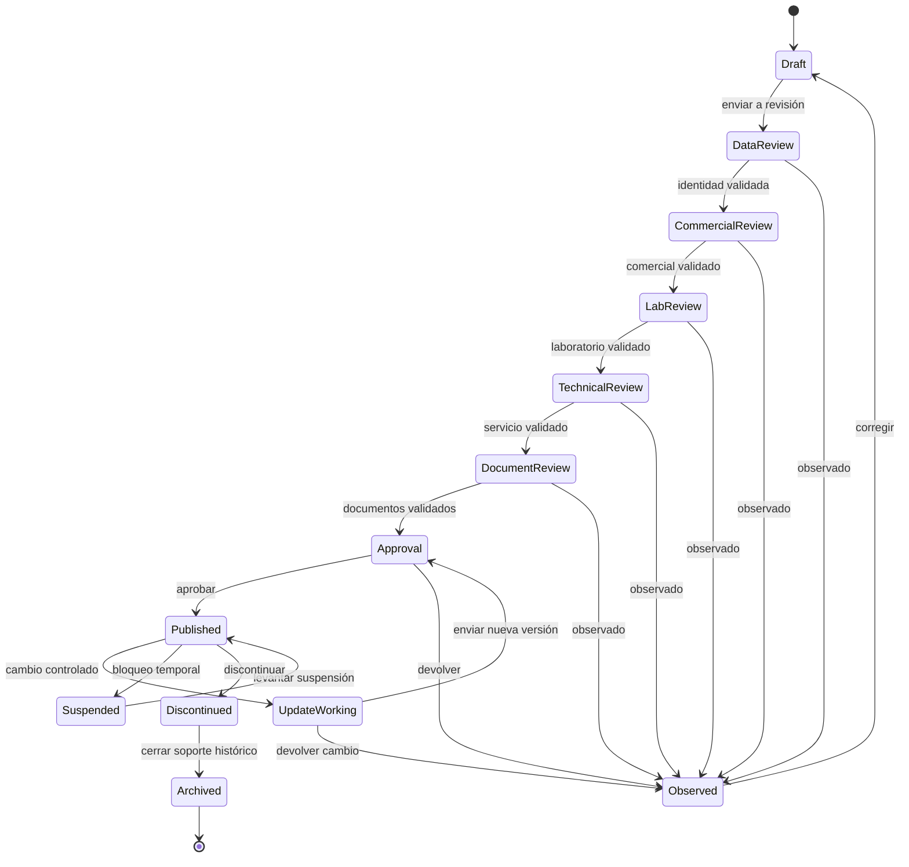
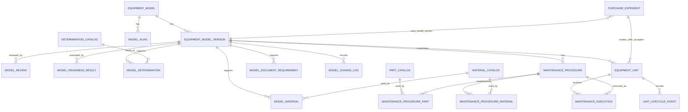
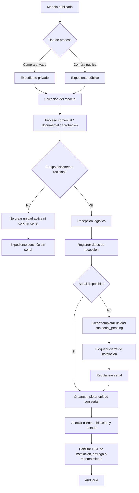
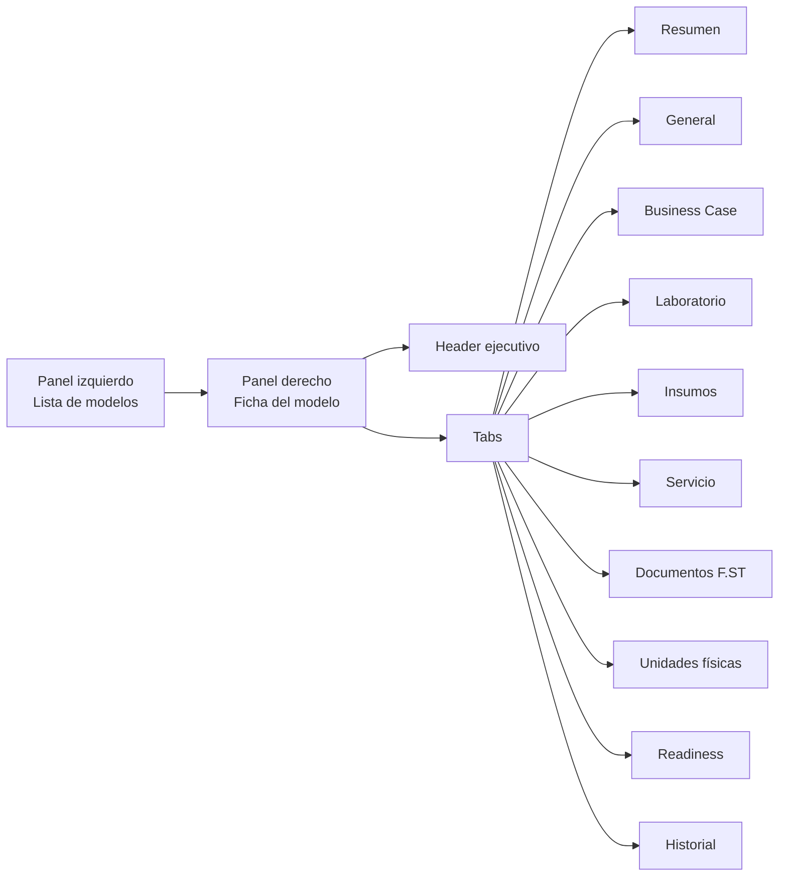

# FamSPI — Propuesta Avanzada: Workspace Maestro de Modelos de Equipo

**Sistema:** FamSPI — Sistema de Procesos Internos  
**Módulo propuesto:** Workspace Maestro de Modelos de Equipo  
**Versión:** 3.0  
**Fecha:** 2026-05-12  
**Enfoque:** procesos internos, trazabilidad operativa, aprobaciones, Business Case interno, laboratorio, servicio técnico, documentos F.ST, unidades físicas y auditoría.  
**Regla crítica incorporada:** el número de serie **no pertenece al modelo maestro** y **no debe capturarse al iniciar una compra**. Solo se registra cuando el equipo llega físicamente mediante el flujo de compra pública o privada.

---

## 0. Resumen ejecutivo

Esta propuesta define un **Workspace Maestro de Modelos de Equipo** dentro de FamSPI para centralizar la información técnica y operativa de los modelos de equipos usados en procesos internos.

El objetivo es evitar duplicidad de catálogos, mejorar la trazabilidad, controlar aprobaciones y permitir que los procesos de Business Case interno, laboratorio, servicio técnico, documentos F.ST y unidades físicas trabajen desde una fuente común.

La propuesta **no mezcla ERP, contabilidad, facturación ni gestión financiera externa**. FamSPI actúa como sistema interno de procesos, control documental, validación operativa y trazabilidad.

---

## 1. Alcance correcto

### 1.1 Dentro del alcance de FamSPI

| Área | Qué resuelve FamSPI |
|---|---|
| Comercial / ACP | Uso del modelo para Business Case interno y análisis operativo. |
| Laboratorio / Aplicaciones | Determinaciones, reactivos, controles, calibradores, consumibles y materiales por modelo. |
| Servicio Técnico | Procedimientos, frecuencias, piezas, materiales, documentos F.ST y evidencias técnicas. |
| Backoffice operativo | Consulta de información validada y soporte al proceso interno. |
| Gerencia / Responsables | Revisión, aprobación, observación, suspensión o publicación del modelo. |
| TICs / Admin FamSPI | Integridad del catálogo, migraciones, roles, permisos y auditoría. |
| Flujos de compra pública y privada | Generan la llegada física del equipo, momento en que se captura el serial. |
| Inventario técnico interno | Registro de unidades físicas reales derivadas de un modelo publicado. |

### 1.2 Fuera del alcance

FamSPI no debe asumir funciones propias de ERP, contabilidad o facturación.

Queda fuera del alcance:

- Facturación.
- Contabilidad.
- Cuentas por pagar o cobrar.
- Kardex financiero.
- Tributación.
- Órdenes de compra contables.
- Costeo financiero oficial.
- Sustitución de sistemas contables o financieros externos.

FamSPI puede registrar información referencial interna, como costos técnicos estimados, parámetros para Business Case, documentos de respaldo, evidencias y estados operativos, pero no debe convertirse en un sistema financiero.

---

## 2. Principio rector del dominio

La palabra **equipo** debe separarse en tres niveles, no solo en dos:

| Nivel | Concepto | Significado | Ejemplo | Momento en el flujo |
|---|---|---|---|---|
| 1 | Modelo de equipo | Referencia técnica y comercial reutilizable. | `cobas c111`, `XP 300`, `cobas b 123` | Se crea en el maestro de modelos. |
| 2 | Expediente de adquisición interna | Proceso de compra pública o privada relacionado con un modelo. | Compra privada de XP 300 para cliente X. | Se crea en flujo comercial/operativo. |
| 3 | Unidad física | Activo real con serial, cliente, ubicación y estado. | XP 300 serie ABC123. | Se crea o completa cuando el equipo llega físicamente. |

### 2.1 Regla crítica sobre seriales

El **número de serie no debe registrarse en el modelo maestro**.

Tampoco debe exigirse al inicio del flujo de compra pública o privada, porque en esa etapa todavía no existe certeza del equipo físico que llegará.

El serial solo puede capturarse cuando se cumple una de estas condiciones:

- El equipo llegó físicamente a bodega.
- El equipo fue recibido por logística.
- El equipo fue verificado en recepción visual.
- El equipo fue asignado a una instalación real.
- El proceso de compra pública o privada avanzó hasta una fase donde ya existe el activo físico.

---

## 3. Problema actual que se busca resolver

| Problema | Impacto |
|---|---|
| Existen catálogos duplicados de modelos. | Riesgo de relaciones ambiguas y datos inconsistentes. |
| El modelo, los insumos y el servicio técnico no están gobernados desde una sola ficha. | Cada área puede trabajar con información parcial. |
| El servicio preventivo/correctivo no está totalmente normalizado alrededor del modelo. | Se depende de texto libre o decisiones manuales. |
| El modelo podría usarse sin aprobación formal. | Riesgo de errores en Business Case o servicio técnico. |
| No existe versionamiento suficiente. | Cambios futuros pueden afectar cálculos o procesos históricos. |
| La unidad física puede confundirse con el modelo. | Se puede intentar registrar serial antes de que exista el equipo físico. |
| Las evidencias F.ST no están completamente integradas al ciclo de vida del modelo y la unidad. | Se pierde trazabilidad documental. |

---

## 4. Arquitectura funcional propuesta



---

## 5. Diagrama macro del workflow maestro



---

## 6. Flujo correcto para número de serie

Este flujo evita capturar el serial antes de tiempo.



### 6.1 Reglas del serial

| Regla | Severidad | Resultado |
|---|---|---|
| El modelo maestro no tiene serial. | Crítica | No debe existir campo serial en `equipment_model`. |
| El expediente de compra puede existir sin serial. | Crítica | No bloquear compra pública/privada por ausencia de serial temprano. |
| El serial solo se captura en recepción física. | Crítica | El backend debe validar la etapa del flujo. |
| No se puede cerrar instalación sin serial. | Alta | Permitir recepción pendiente, pero bloquear cierre técnico final. |
| Si el serial no es visible al recibir, usar `serial_pending`. | Alta | Crear unidad incompleta con regularización obligatoria. |
| El serial debe ser único cuando ya se confirma. | Crítica | Constraint único parcial o validación transaccional. |
| Todo cambio de serial debe auditarse. | Crítica | Guardar valor anterior, valor nuevo, usuario, fecha y motivo. |

---

## 7. Estados del modelo



### 7.1 Tabla de estados

| Estado | Descripción | Uso en BC | Uso en compra | Uso en servicio | Edición |
|---|---|---:|---:|---:|---|
| `draft` | Borrador inicial. | No | No | No | Sí |
| `data_review` | En revisión de identidad y catálogo. | No | No | No | Controlada |
| `commercial_review` | Revisión comercial interna. | Parcial | No | No | Comercial |
| `lab_review` | Revisión de laboratorio/aplicaciones. | Parcial | No | No | Lab/Insumos |
| `technical_review` | Revisión de servicio técnico. | Sí con advertencia | No | Parcial | Servicio |
| `document_review` | Revisión de F.ST y evidencias requeridas. | Sí con advertencia | No | Parcial | Documental |
| `observed` | Devuelto con observaciones. | No o parcial | No | No o parcial | Según observación |
| `published` | Vigente para procesos internos. | Sí | Sí | Sí | Solo nueva versión |
| `suspended` | Bloqueado temporalmente. | No nuevos casos | No nuevos casos | Sí para soporte existente | Restringida |
| `discontinued` | No disponible para nuevos procesos. | No nuevos BC | No nuevas compras | Sí histórico | Restringida |
| `archived` | Solo histórico. | No | No | No | No |

---

## 8. Estados de la unidad física

La unidad física nace desde el flujo real de llegada del equipo, no desde el modelo.

| Estado | Descripción | Serial requerido | Permite instalación | Permite cierre técnico |
|---|---|---:|---:|---:|
| `expected` | Equipo esperado por expediente de compra/adquisición. | No | No | No |
| `in_transit` | Equipo en tránsito. | No | No | No |
| `received_pending_serial` | Equipo recibido, serial no capturado o no visible. | No | Parcial | No |
| `received_with_serial` | Equipo recibido con serial validado. | Sí | Sí | No necesariamente |
| `assigned_to_client` | Equipo asignado a cliente/sucursal. | Sí | Sí | No necesariamente |
| `installed` | Equipo instalado. | Sí | Sí | Sí, si F.ST completos |
| `active` | Equipo activo operativamente. | Sí | Sí | Sí |
| `maintenance` | Equipo en mantenimiento. | Sí | No aplica | No aplica |
| `withdrawn` | Equipo retirado. | Sí | No | Sí histórico |
| `retired` | Equipo dado de baja operativa. | Sí | No | Sí histórico |

---

## 9. Responsables por fase

```mermaid
flowchart LR
    subgraph SOL[Solicitud / Origen]
        A1[Necesidad de modelo]
        A2[Nuevo modelo o actualización]
    end

    subgraph TIC[TICs / Admin FamSPI]
        B1[Crear estructura base]
        B2[Registrar alias]
        B3[Validar consistencia]
    end

    subgraph COM[Comercial / ACP]
        C1[Perfil comercial interno]
        C2[Capacidad, parámetros y BC]
        C3[Validar uso comercial]
    end

    subgraph LAB[Lab / Aplicaciones]
        D1[Determinaciones]
        D2[Reactivos, controles y calibradores]
        D3[Validar cálculo técnico]
    end

    subgraph ST[Servicio Técnico]
        E1[Procedimientos]
        E2[Piezas, materiales y F.ST]
        E3[Validar readiness técnico]
    end

    subgraph LOG[Logística / Recepción]
        L1[Confirmar llegada física]
        L2[Registrar recepción]
        L3[Capturar serial si aplica]
    end

    subgraph GER[Gerencia / Responsable autorizado]
        F1[Revisar completitud]
        F2[Aprobar publicación]
        F3[Autorizar cambios mayores]
    end

    A1 --> A2 --> B1 --> B2 --> B3
    B3 --> C1 --> C2 --> C3
    C3 --> D1 --> D2 --> D3
    D3 --> E1 --> E2 --> E3
    E3 --> F1 --> F2
    F2 --> G1[Uso en procesos internos]
    G1 --> L1 --> L2 --> L3

    F1 -->|Observado| B3
    C3 -->|Incompleto| C1
    D3 -->|Incompleto| D1
    E3 -->|Incompleto| E1
```



---

## 10. Ficha avanzada del modelo

### 10.1 Header del modelo

| Elemento | Descripción |
|---|---|
| Nombre canónico | Nombre oficial interno del modelo. |
| Código/SKU interno | Código único usado por FamSPI. |
| Fabricante | Fabricante del equipo. |
| Modelo comercial | Nombre/modelo del fabricante. |
| Categoría | Hematología, gasometría, química, coagulación, POC, etc. |
| Estado | Draft, published, suspended, discontinued, etc. |
| Versión vigente | Versión publicada activa. |
| Readiness general | Estado visual de completitud. |
| Badges | Listo para BC, servicio pendiente, documentos incompletos, etc. |
| Última revisión | Fecha y área que realizó la última validación. |

> Importante: el header del modelo **no debe mostrar ni solicitar número de serie**. El serial pertenece a la unidad física.

### 10.2 Tabs propuestos

| Tab | Objetivo |
|---|---|
| 1. Resumen | Vista ejecutiva del modelo, readiness y bloqueos. |
| 2. General | Identidad, alias, categoría, fabricante y estado. |
| 3. Business Case interno | Parámetros internos para análisis y negociación. |
| 4. Laboratorio | Determinaciones y parámetros técnicos. |
| 5. Insumos | Reactivos, controles, calibradores, consumibles y materiales. |
| 6. Servicio técnico | Procedimientos, frecuencias, piezas, materiales y roles. |
| 7. Documentos F.ST | Plantillas, requisitos y evidencias esperadas. |
| 8. Unidades físicas | Vista derivada de activos reales, no origen del serial. |
| 9. Readiness | Motor de completitud, bloqueos y advertencias. |
| 10. Historial | Auditoría, versiones, aprobaciones y cambios. |

---

## 11. Readiness avanzado

El readiness debe ser un motor de reglas, no solo un color visual.

| Readiness | Pregunta que responde |
|---|---|
| `catalog_ready` | ¿El modelo tiene identidad mínima y no tiene duplicados críticos? |
| `bc_ready` | ¿Puede usarse para Business Case interno? |
| `lab_ready` | ¿Tiene determinaciones e insumos técnicos suficientes? |
| `service_ready` | ¿Tiene procedimientos, piezas, materiales y documentos técnicos suficientes? |
| `document_ready` | ¿Tiene documentos F.ST obligatorios definidos? |
| `governance_ready` | ¿Tiene aprobaciones completas y versión vigente? |
| `purchase_ready` | ¿Puede usarse como modelo en un flujo de compra pública o privada? |
| `unit_activation_ready` | ¿Puede convertirse en unidad física activa después de recepción? |

### 11.1 Reglas de readiness

| Regla | Nivel | Bloquea | Mensaje sugerido |
|---|---|---|---|
| Modelo sin nombre canónico | Crítico | Publicación | El modelo no tiene nombre canónico. |
| Modelo sin código interno | Crítico | Publicación | Debe asignarse un código interno único. |
| Alias duplicado con otro modelo | Crítico | Publicación | Existe posible duplicidad con otro modelo. |
| Modelo sin categoría | Alto | Publicación | Debe clasificarse el modelo. |
| Modelo sin parámetros de BC interno | Alto | BC interno | No puede usarse en Business Case. |
| Modelo sin determinaciones | Alto | BC/Lab | No existen determinaciones compatibles. |
| Modelo sin reactivos requeridos | Alto | BC/Lab | No se puede calcular consumo técnico. |
| Modelo sin procedimientos de servicio | Medio/Alto | Servicio | Servicio técnico incompleto. |
| Procedimiento sin frecuencia | Alto | Servicio | El procedimiento no puede planificarse. |
| Procedimiento sin documentos F.ST | Medio | Servicio | Falta asociar evidencias documentales. |
| Modelo sin unidades físicas | Informativo | No bloquea modelo | Todavía no existen activos derivados. |
| Compra sin serial antes de recepción | No aplica | No bloquea | El serial aún no corresponde capturarse. |
| Recepción física sin serial | Alto | Cierre técnico | Registrar `serial_pending` y regularizar. |
| Instalación sin serial | Crítico | Cierre de instalación | No se puede cerrar instalación sin serial. |

---

## 12. Excepciones operativas

| Escenario | Tratamiento propuesto |
|---|---|
| Modelo requerido de urgencia para BC interno | Permitir versión condicionada `bc_ready`, bloqueando uso técnico hasta completar servicio. |
| Modelo con datos comerciales completos, pero servicio incompleto | Permitir BC con badge `servicio pendiente`. |
| Modelo con insumo no catalogado | Permitir `non_catalog_input`, requiere aprobación posterior. |
| Pieza usada en correctivo pero no existe en catálogo | Permitir `pieza no catalogada`, obligar justificación y revisión técnica. |
| Modelo discontinuado con unidades instaladas | Bloquear nuevos BC/compras, permitir mantenimiento histórico. |
| Compra pública/privada sin serial | Correcto si el equipo no ha llegado físicamente. No debe bloquear etapas tempranas. |
| Equipo recibido sin serial visible | Crear o mantener unidad en `received_pending_serial` / `serial_pending`. |
| Unidad física con serial pendiente | Bloquear cierre de instalación hasta regularizar serial. |
| Determinación compatible solo bajo configuración específica | Registrar condición de compatibilidad. |
| Procedimiento por horas/ciclos y no por meses | Permitir frecuencia dinámica basada en uso. |
| Cambio de rendimiento de insumo | Crear nueva versión, no modificar histórico. |
| Documento F.ST cambia de versión | Mantener versión histórica en ejecuciones anteriores. |
| Error en modelo publicado | Suspender modelo, crear nueva versión corregida, conservar auditoría. |

---

## 13. Modelo de datos avanzado

### 13.1 Vista conceptual



### 13.2 `equipment_model`

Entidad raíz del modelo canónico.

Campos recomendados:

| Campo | Tipo sugerido | Nota |
|---|---|---|
| `id` | UUID / bigint | PK. |
| `canonical_code` | varchar | Código interno único. |
| `canonical_name` | varchar | Nombre oficial interno. |
| `manufacturer` | varchar | Fabricante. |
| `commercial_model` | varchar | Modelo comercial. |
| `category` | varchar | Categoría técnica. |
| `status` | varchar | Estado del modelo. |
| `current_version_id` | FK | Versión vigente. |
| `created_at` | timestamp | Auditoría. |
| `updated_at` | timestamp | Auditoría. |

No debe incluir:

- `serial`.
- `client_id`.
- `location_id`.
- datos de instalación real.

### 13.3 `equipment_model_version`

Representa una versión controlada del modelo.

| Campo | Tipo sugerido | Nota |
|---|---|---|
| `id` | UUID / bigint | PK. |
| `equipment_model_id` | FK | Modelo padre. |
| `version_number` | integer | Secuencia. |
| `version_status` | varchar | working, approved, published, superseded. |
| `bc_parameters` | jsonb | Parámetros de Business Case interno. |
| `technical_specs` | jsonb | Especificaciones técnicas. |
| `readiness_snapshot` | jsonb | Resultado al publicar. |
| `published_at` | timestamp | Fecha de publicación. |
| `published_by` | FK user | Usuario que publicó. |

### 13.4 `equipment_unit`

Representa la unidad física real.

| Campo | Tipo sugerido | Regla |
|---|---|---|
| `id` | UUID / bigint | PK. |
| `equipment_model_id` | FK | Modelo canónico. |
| `equipment_model_version_id` | FK | Versión usada. |
| `purchase_expedient_id` | FK nullable | Compra pública o privada que originó la unidad. |
| `purchase_type` | varchar nullable | public / private / internal. |
| `serial` | varchar nullable | Solo se llena al recibir físicamente el equipo. |
| `serial_pending` | boolean | True si el equipo llegó pero el serial no pudo capturarse. |
| `serial_captured_at` | timestamp nullable | Fecha de captura. |
| `serial_captured_by` | FK user nullable | Usuario que capturó. |
| `client_id` | FK nullable | Cliente asignado. |
| `client_location_id` | FK nullable | Sucursal/ubicación. |
| `current_location` | varchar nullable | Ubicación actual. |
| `unit_status` | varchar | expected, received, installed, active, withdrawn, etc. |
| `created_at` | timestamp | Auditoría. |
| `updated_at` | timestamp | Auditoría. |

### 13.5 Regla de unicidad de serial

El serial debe ser único cuando exista, pero debe permitir nulos mientras no haya recepción física.

Ejemplo en PostgreSQL:

```sql
CREATE UNIQUE INDEX IF NOT EXISTS ux_equipment_unit_serial_not_null
ON equipment_unit (serial)
WHERE serial IS NOT NULL;
```

---

## 14. Flujo de integración con compras públicas y privadas

FamSPI puede tener flujos separados de compra pública y compra privada, pero ambos deben llegar a una misma regla común: **la unidad física se completa cuando el equipo llega**.



### 14.1 Qué datos se capturan antes de la llegada

Antes de la llegada física se puede registrar:

- Modelo esperado.
- Versión del modelo.
- Tipo de compra o proceso.
- Cliente previsto.
- Cantidad esperada.
- Estado documental.
- Responsable interno.
- Fechas estimadas.
- Observaciones.

No se debe capturar como obligatorio:

- Serial.
- Estado instalado.
- Fecha real de instalación.
- Acta final de entrega.

### 14.2 Qué datos se capturan en recepción

Al confirmar llegada física:

- Fecha real de recepción.
- Responsable que recibe.
- Estado físico inicial.
- Evidencia fotográfica si aplica.
- Documento F.ST correspondiente si aplica.
- Número de serie si está disponible.
- Cantidad recibida.
- Observaciones.

### 14.3 Qué datos se capturan después de recepción

Después de recepción:

- Unidad física.
- Cliente/sucursal final.
- Instalación.
- Verificación técnica.
- F.ST-07, F.ST-09, F.ST-10 u otros según corresponda.
- Entrenamiento si aplica.
- Estado activo.

---

## 15. Backend propuesto

### 15.1 Módulos backend sugeridos

```text
backend/src/modules/equipment-models/
  equipmentModels.routes.js
  equipmentModels.controller.js
  equipmentModels.service.js
  equipmentModelVersions.service.js
  equipmentModelReadiness.service.js
  equipmentModelApprovals.service.js
  equipmentModelAudit.service.js

backend/src/modules/equipment-units/
  equipmentUnits.routes.js
  equipmentUnits.controller.js
  equipmentUnits.service.js
  equipmentUnitSerial.service.js
  equipmentUnitLifecycle.service.js

backend/src/modules/purchase-equipment-reception/
  purchaseEquipmentReception.routes.js
  purchaseEquipmentReception.controller.js
  purchaseEquipmentReception.service.js
```

### 15.2 Endpoints sugeridos para modelos

| Método | Endpoint | Uso |
|---|---|---|
| GET | `/api/equipment-models` | Listar modelos. |
| POST | `/api/equipment-models` | Crear borrador de modelo. |
| GET | `/api/equipment-models/:id` | Ver ficha completa. |
| PATCH | `/api/equipment-models/:id` | Editar datos permitidos según estado. |
| POST | `/api/equipment-models/:id/versions` | Crear nueva versión. |
| POST | `/api/equipment-models/:id/submit-review` | Enviar a revisión. |
| POST | `/api/equipment-models/:id/approve` | Aprobar modelo/versión. |
| POST | `/api/equipment-models/:id/publish` | Publicar versión. |
| GET | `/api/equipment-models/:id/readiness` | Obtener readiness. |
| GET | `/api/equipment-models/:id/audit` | Ver auditoría. |

### 15.3 Endpoints sugeridos para recepción y serial

| Método | Endpoint | Uso |
|---|---|---|
| POST | `/api/equipment-receptions/from-private-purchase/:purchaseId` | Registrar recepción desde compra privada. |
| POST | `/api/equipment-receptions/from-public-purchase/:purchaseId` | Registrar recepción desde compra pública. |
| POST | `/api/equipment-units/from-reception/:receptionId` | Crear unidad física desde recepción. |
| PATCH | `/api/equipment-units/:unitId/serial` | Capturar o regularizar serial. |
| PATCH | `/api/equipment-units/:unitId/assign-client` | Asignar cliente/ubicación. |
| POST | `/api/equipment-units/:unitId/lifecycle-events` | Registrar evento de ciclo de vida. |

### 15.4 Validaciones backend obligatorias

| Código | Regla | Severidad |
|---|---|---|
| `MODEL_CODE_REQUIRED` | Todo modelo debe tener código canónico. | Crítica |
| `MODEL_CODE_UNIQUE` | El código canónico no se puede repetir. | Crítica |
| `MODEL_VERSION_IMMUTABLE` | Versión publicada no se edita directamente. | Crítica |
| `PUBLISHED_VERSION_SINGLE` | Solo una versión publicada vigente por modelo. | Crítica |
| `NO_SERIAL_ON_MODEL` | El modelo no puede tener serial. | Crítica |
| `SERIAL_NOT_REQUIRED_BEFORE_RECEPTION` | No exigir serial antes de recepción física. | Crítica |
| `SERIAL_CAPTURE_REQUIRES_RECEIPT` | Solo capturar serial si existe recepción física. | Crítica |
| `SERIAL_UNIQUE_WHEN_PRESENT` | Serial único cuando no es nulo. | Crítica |
| `INSTALLATION_REQUIRES_SERIAL` | No cerrar instalación sin serial. | Crítica |
| `UNIT_REQUIRES_MODEL_VERSION` | Toda unidad debe quedar asociada a versión de modelo. | Crítica |
| `NO_DELETE_WITH_HISTORY` | No eliminar modelos/unidades con historial. | Crítica |

---

## 16. Frontend propuesto

### 16.1 Estructura sugerida

```text
spi_front/src/modules/equipment-models/
  pages/
    EquipmentModelsWorkspacePage.jsx
  components/
    list/
      EquipmentModelsListPanel.jsx
      EquipmentModelFilters.jsx
      EquipmentModelListItem.jsx
    detail/
      EquipmentModelDetailPanel.jsx
      EquipmentModelHeader.jsx
      EquipmentModelTabNav.jsx
    tabs/
      SummaryTab.jsx
      GeneralTab.jsx
      BusinessCaseTab.jsx
      LaboratoryTab.jsx
      InputsTab.jsx
      ServiceTab.jsx
      DocumentsTab.jsx
      UnitsTab.jsx
      ReadinessTab.jsx
      HistoryTab.jsx
    shared/
      ReadinessBadge.jsx
      ModelStatusBadge.jsx
      VersionBadge.jsx
      ActionGate.jsx
      BlockerAlert.jsx
      SerialPendingBadge.jsx
  hooks/
    useEquipmentModels.js
    useEquipmentModelDetail.js
    useEquipmentModelActions.js
  api/
    equipmentModelsApi.js
```

### 16.2 Reglas de UI

| Regla | Aplicación |
|---|---|
| El serial no aparece en formulario de modelo. | Solo se muestra en tab Unidades físicas. |
| La tab Unidades es derivada. | No es origen del modelo, muestra activos reales. |
| Mostrar `serial_pending` claramente. | Badge amarillo o alerta en unidad. |
| No permitir capturar serial si no hay recepción. | Botón oculto o bloqueado por estado. |
| Readiness por tab. | Cada tab debe mostrar incompletos, advertencias y bloqueos. |
| Acciones por rol. | Comercial, laboratorio, servicio técnico, gerencia y TICs tienen acciones distintas. |
| Historial visible. | Cambios críticos deben verse desde la tab Historial. |

### 16.3 Layout sugerido



---

## 17. Documentos F.ST y evidencias

Los documentos F.ST deben asociarse según evento, no solo según modelo.

| Documento | Puede depender de | Momento sugerido |
|---|---|---|
| F.ST-07 | Modelo, cliente, sitio, unidad | Antes o durante instalación. |
| F.ST-09 | Modelo, unidad, verificación técnica | Verificación técnica. |
| F.ST-10 | Unidad, cliente, entrega | Entrega final. |
| F.ST-14 | Recepción visual, unidad o lote recibido | Llegada física / recepción. |
| F.ST-02 | Unidad, retiro, desinfección | Retiro o evento técnico. |
| F.ST-04 / F.ST-05 | Entrenamiento, cliente, personal | Capacitación. |

Regla importante:

> Un documento generado debe guardar snapshot del modelo, versión, unidad física, serial si ya existe, cliente, responsable y fecha.

---

## 18. Auditoría

Todo cambio relevante debe auditarse.

### 18.1 Eventos mínimos de auditoría

| Evento | Auditoría requerida |
|---|---|
| Creación de modelo | Usuario, fecha, datos iniciales. |
| Cambio de identidad | Valor anterior, nuevo, motivo. |
| Cambio de parámetros BC | Valor anterior, nuevo, responsable. |
| Cambio de determinaciones | Alta/baja/cambio, usuario. |
| Cambio de insumos | Alta/baja/cambio, usuario. |
| Cambio de procedimientos | Alta/baja/cambio, usuario. |
| Publicación de versión | Aprobador, fecha, readiness. |
| Suspensión/discontinuidad | Motivo, responsable, fecha. |
| Recepción física | Usuario, fecha, expediente, evidencias. |
| Captura de serial | Serial, usuario, fecha, recepción asociada. |
| Cambio de serial | Valor anterior, valor nuevo, motivo, aprobación. |
| Cierre de instalación | Unidad, serial, F.ST, responsable. |

---

## 19. Indicadores sugeridos

| Indicador | Objetivo |
|---|---|
| Modelos en borrador | Controlar modelos no terminados. |
| Modelos listos para BC | Saber qué puede usarse comercialmente. |
| Modelos con servicio pendiente | Priorizar trabajo técnico. |
| Modelos sin determinaciones | Corregir brechas de laboratorio. |
| Modelos sin insumos críticos | Evitar cálculos incompletos. |
| Modelos sin F.ST asociados | Evitar falta documental. |
| Unidades recibidas con serial pendiente | Regularizar activos físicos. |
| Compras con equipo en tránsito | Seguimiento operativo. |
| Instalaciones bloqueadas por falta de serial | Control de cierre técnico. |
| Cambios de serial auditados | Control de integridad del activo. |

---

## 20. Checklist CHG propuesto

| Código | Cambio | Prioridad | Riesgo |
|---|---|---:|---:|
| CHG-01 | Definir `equipment_model` como maestro canónico. | Alta | Medio |
| CHG-02 | Crear `equipment_model_version`. | Alta | Medio |
| CHG-03 | Crear `model_alias` para migración desde catálogos actuales. | Alta | Medio |
| CHG-04 | Implementar readiness por modelo/versión. | Alta | Medio |
| CHG-05 | Normalizar determinaciones e insumos por versión. | Alta | Medio |
| CHG-06 | Formalizar procedimientos de servicio técnico por modelo. | Alta | Medio/Alto |
| CHG-07 | Asociar documentos F.ST requeridos por modelo y evento. | Alta | Medio |
| CHG-08 | Crear flujo de aprobación/publicación del modelo. | Alta | Medio |
| CHG-09 | Crear tab Historial/Auditoría. | Alta | Bajo/Medio |
| CHG-10 | Crear `equipment_unit` como entidad física derivada. | Alta | Medio |
| CHG-11 | Permitir `serial` nullable y `serial_pending`. | Crítica | Medio |
| CHG-12 | Conectar unidad física con recepción de compra pública/privada. | Crítica | Alto |
| CHG-13 | Bloquear captura temprana de serial. | Crítica | Medio |
| CHG-14 | Bloquear cierre de instalación sin serial. | Crítica | Medio |
| CHG-15 | Crear auditoría específica para serial. | Alta | Bajo/Medio |
| CHG-16 | Crear UI del Workspace Maestro de Modelos. | Alta | Medio |
| CHG-17 | Crear tab Unidades como vista derivada. | Alta | Medio |
| CHG-18 | Crear indicadores de serial pendiente y readiness. | Media | Bajo |

---

## 21. Roadmap recomendado

### Fase 1 — Fundamento del maestro

- Definir entidad canónica `equipment_model`.
- Crear versionamiento.
- Registrar alias desde catálogos existentes.
- Crear estados básicos.
- Implementar auditoría mínima.

### Fase 2 — Readiness y aprobación

- Implementar motor de readiness.
- Crear flujo de revisión por áreas.
- Agregar aprobación/publicación.
- Bloquear edición directa de versiones publicadas.

### Fase 3 — Laboratorio, insumos y servicio

- Asociar determinaciones por versión.
- Asociar insumos por versión.
- Formalizar procedimientos de servicio técnico.
- Asociar piezas, materiales y F.ST.

### Fase 4 — Integración con compra pública/privada

- Permitir que compras usen modelo publicado.
- No solicitar serial en etapas tempranas.
- Crear estado esperado/en tránsito.
- Preparar recepción física.

### Fase 5 — Unidad física y serial

- Crear `equipment_unit`.
- Permitir `serial` nullable.
- Crear `serial_pending`.
- Capturar serial solo desde recepción física.
- Bloquear cierre de instalación sin serial.
- Auditar cambios de serial.

### Fase 6 — UI avanzada

- Crear Workspace Maestro de Modelos.
- Implementar tabs.
- Implementar badges de estado/readiness.
- Crear vista de unidades derivadas.
- Crear dashboard de pendientes.

---

## 22. Criterios de aceptación

### 22.1 Modelo maestro

- Se puede crear un modelo sin serial.
- El modelo tiene código canónico único.
- El modelo puede pasar por revisión y aprobación.
- Una versión publicada no se edita directamente.
- El readiness muestra bloqueos y advertencias.

### 22.2 Compra pública/privada

- Una compra puede seleccionar un modelo publicado.
- Una compra puede avanzar sin serial antes de recepción.
- El sistema no debe exigir serial en cotización, adjudicación, aprobación o tránsito.
- El sistema solo habilita captura de serial en recepción física.

### 22.3 Unidad física

- La unidad física se crea o completa al recibir el equipo.
- El serial puede quedar pendiente si no está visible.
- No se puede cerrar instalación si el serial sigue pendiente.
- El serial confirmado es único.
- Todo cambio de serial queda auditado.

### 22.4 Documentos y evidencias

- Los F.ST se asocian al evento correspondiente.
- Los documentos guardan snapshot de modelo, versión, unidad y serial si ya existe.
- Si el serial todavía no existe, el documento debe indicar `serial pendiente` cuando aplique.

---

## 23. Conclusión

El Workspace Maestro de Modelos de Equipo debe funcionar como la fuente operativa interna de FamSPI para modelos, validaciones, documentos, servicio técnico, laboratorio y trazabilidad.

La corrección más importante es que el **serial no forma parte del modelo** y tampoco debe exigirse en fases tempranas de compra pública o privada. El serial pertenece a la **unidad física**, y la unidad física solo puede completarse correctamente cuando el equipo llega físicamente.

Con esta separación, FamSPI evita errores de dominio, mantiene procesos internos limpios, respeta la realidad operativa de compras públicas/privadas y mejora la trazabilidad del ciclo completo:

```text
Modelo publicado → Proceso de compra/adquisición → Llegada física → Serial → Unidad física → Instalación / Servicio / Documentos / Auditoría
```
