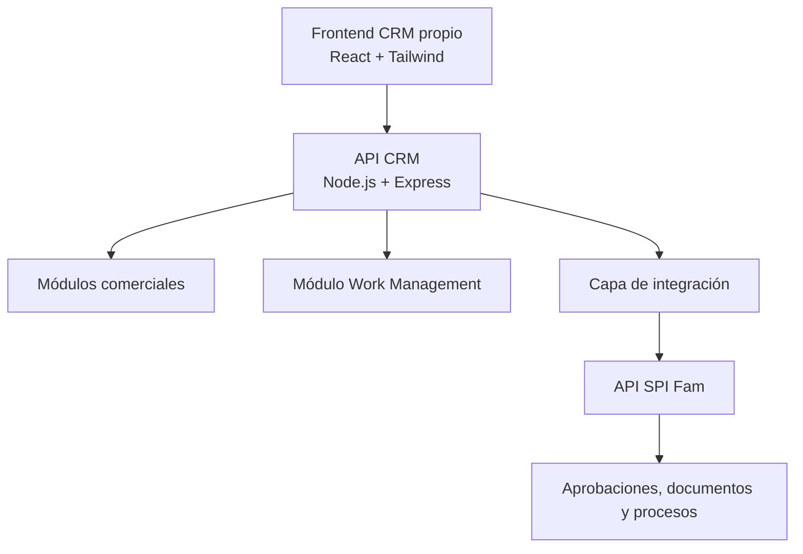
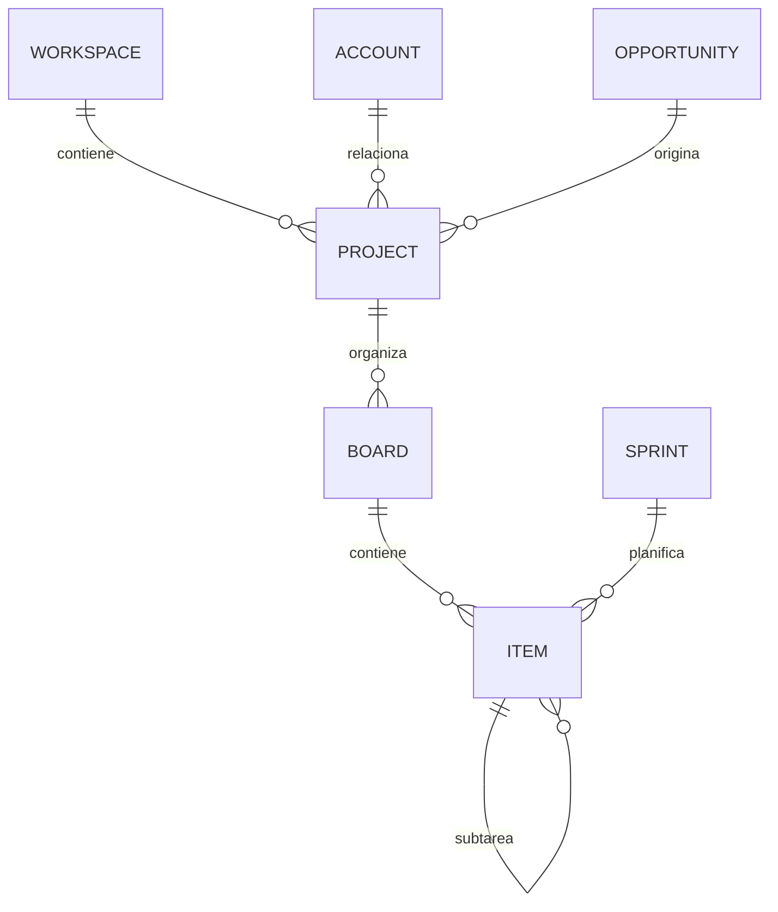

# ESPECIFICACIÓN DE REQUERIMIENTOS
## Módulo Work Management integrado al CRM propio y conectado con SPI Fam

---

## Control documental

| Campo | Información |
|---|---|
| Documento | Especificación de requerimientos del módulo Work Management |
| Sistema | CRM FamProject / SPI Fam |
| Código documental | CRM-WM-URS-001 |
| Versión | 0.1 |
| Estado | Propuesta para revisión |
| Fecha | 13 de julio de 2026 |
| Propietario funcional | FamProject |
| Clasificación | Uso interno |

### Historial de versiones

| Versión | Fecha | Descripción |
|---|---|---|
| 0.1 | 2026-07-13 | Creación de requerimientos iniciales del módulo Work Management para el CRM propio e integración con SPI Fam. |

---

## 1. Propósito

El propósito de este documento es definir los requerimientos funcionales, técnicos, de integración, seguridad, auditoría y desempeño para desarrollar un módulo de **Work Management** dentro del CRM propio de FamProject.

El módulo deberá ofrecer una experiencia de gestión de trabajo ágil similar a herramientas como monday.com, adaptada a los procesos reales de la organización. Permitirá gestionar espacios de trabajo, proyectos, tableros, tareas, subtareas, sprints, automatizaciones, documentos, carga de trabajo e indicadores.

El CRM será responsable de la relación comercial y de la coordinación del trabajo. SPI Fam continuará siendo responsable de los procesos internos formalizados que requieran solicitudes, aprobaciones multinivel, documentos institucionales, firmas y trazabilidad regulada.

---

## 2. Alcance

### 2.1 Incluido en el alcance

- Gestión de espacios de trabajo.
- Gestión de proyectos y portafolios.
- Tableros de trabajo configurables.
- Vista de tabla, Kanban, calendario, cronograma y carga de trabajo.
- Tareas, subtareas, hitos, checklists y dependencias.
- Backlog, sprints, historias de usuario y métricas ágiles.
- Campos personalizados.
- Comentarios, menciones, seguidores y notificaciones.
- Plantillas de proyectos y tableros.
- Automatizaciones configurables.
- Integración con clientes, contactos, prospectos y oportunidades del CRM.
- Integración mediante API y eventos con SPI Fam.
- Integración documental con Google Drive mediante los servicios autorizados.
- Control de acceso por roles, equipos y propiedad del registro.
- Auditoría completa de cambios y operaciones críticas.
- Panel de trabajo personal y dashboard gerencial.

### 2.2 Fuera del alcance

- Contabilidad.
- Facturación.
- Inventario y movimientos de bodega.
- Nómina.
- Reemplazo del ERP.
- Conexión directa entre las bases de datos del CRM y SPI.
- Duplicación del maestro de clientes o contactos dentro de Work Management.
- Sustitución del motor formal de aprobaciones y firmas de SPI Fam.
- Copia exacta de todas las características, diseño o propiedad intelectual de monday.com.

---

## 3. Arquitectura objetivo



### 3.1 Componentes

| Componente | Responsabilidad |
|---|---|
| Frontend CRM | Interfaz de clientes, oportunidades, proyectos, tableros y tareas. |
| API CRM | Reglas comerciales, autenticación, autorización y exposición de servicios REST. |
| Módulo Work Management | Gestión de proyectos, tableros, trabajo ágil, automatizaciones e indicadores. |
| PostgreSQL CRM | Persistencia de información comercial y de Work Management. |
| Capa de integración | Comunicación segura, auditable e idempotente con SPI. |
| SPI Fam | Solicitudes, aprobaciones, documentos, firmas y procesos internos formales. |
| Google Drive/Docs | Repositorio documental autorizado. |

### 3.2 Organización lógica recomendada

```text
src/
├── modules/
│   ├── auth/
│   ├── users/
│   ├── accounts/
│   ├── contacts/
│   ├── leads/
│   ├── opportunities/
│   ├── blue-sheet/
│   ├── work-management/
│   │   ├── controllers/
│   │   ├── services/
│   │   ├── repositories/
│   │   ├── validators/
│   │   ├── policies/
│   │   ├── events/
│   │   ├── jobs/
│   │   └── routes/
│   ├── integrations/
│   │   └── spi/
│   ├── notifications/
│   ├── documents/
│   └── audit/
├── middlewares/
├── config/
└── app.js
```

### 3.3 Esquemas PostgreSQL recomendados

| Esquema | Contenido |
|---|---|
| `public` | Usuarios, áreas, equipos y configuraciones compartidas. |
| `crm` | Clientes, contactos, prospectos, oportunidades y Blue Sheets. |
| `work_management` | Proyectos, tableros, tareas, sprints, campos y automatizaciones. |
| `integrations` | Enlaces externos, eventos, webhooks, sincronizaciones y reintentos. |
| `auditoria` | Registros inmutables de auditoría y trazabilidad. |

---

## 4. Sistemas responsables y fuentes de verdad

| Información o proceso | Sistema responsable |
|---|---|
| Usuarios y estructura organizacional del CRM | CRM |
| Clientes y empresas | CRM |
| Contactos | CRM |
| Prospectos | CRM |
| Oportunidades | CRM |
| Blue Sheet | CRM |
| Proyectos, tableros, tareas y sprints | Work Management del CRM |
| Solicitudes internas | SPI Fam |
| Business Case formal | SPI Fam |
| Compras públicas y privadas formalizadas | SPI Fam |
| Procesos formalizados de servicio técnico | SPI Fam |
| Aprobaciones multinivel | SPI Fam |
| Documentos institucionales y firmas | SPI Fam |
| Auditoría comercial y de trabajo | CRM |
| Auditoría de procesos internos formalizados | SPI Fam |

---

## 5. Actores y roles

| Actor | Responsabilidad |
|---|---|
| Administrador | Configurar espacios, campos, permisos, plantillas y automatizaciones. |
| Gerente general | Consultar portafolio, carga de trabajo, riesgos e indicadores globales. |
| Líder de proyecto | Crear proyectos, administrar tableros, planificar trabajo y asignar responsables. |
| Responsable de área | Administrar proyectos y actividades de su equipo. |
| Colaborador | Ejecutar y actualizar tareas asignadas. |
| Observador | Consultar información sin modificarla. |
| Auditor | Consultar historial, evidencias y trazabilidad. |
| Cuenta de servicio | Ejecutar integraciones autorizadas entre CRM y SPI. |
| Trabajador programado | Ejecutar automatizaciones, recordatorios y reintentos. |

---

## 6. Reglas generales de negocio

- **RN-WM-001:** El CRM será la fuente de verdad para clientes, contactos, prospectos y oportunidades.
- **RN-WM-002:** Work Management no deberá duplicar registros maestros del CRM; deberá relacionarse mediante identificadores internos.
- **RN-WM-003:** SPI Fam será la fuente de verdad para solicitudes, aprobaciones, firmas y documentos institucionales generados dentro de sus procesos.
- **RN-WM-004:** El CRM y SPI no compartirán conexiones directas a sus bases de datos.
- **RN-WM-005:** Toda comunicación entre CRM y SPI se realizará mediante API, eventos o webhooks autorizados.
- **RN-WM-006:** Toda acción crítica deberá generar un registro de auditoría.
- **RN-WM-007:** Los permisos deberán validarse en el backend y no solamente en la interfaz.
- **RN-WM-008:** Una automatización no podrá omitir una aprobación obligatoria de SPI.
- **RN-WM-009:** Los procesos de integración deberán ser idempotentes para evitar registros duplicados.
- **RN-WM-010:** La eliminación de registros operativos será lógica, excepto cuando exista autorización administrativa y no se afecte la trazabilidad.
- **RN-WM-011:** Los estados visuales personalizados deberán relacionarse con una categoría interna normalizada.
- **RN-WM-012:** Los documentos aprobados o firmados no podrán reemplazarse sin control de versión.
- **RN-WM-013:** El cierre de un proyecto requerirá que se cumplan sus tareas, evidencias y dependencias obligatorias.
- **RN-WM-014:** Los usuarios solo podrán consultar tableros y tareas de acuerdo con sus roles, equipos y permisos explícitos.

---

## 7. Requerimientos funcionales

### 7.1 Espacios de trabajo

- **RF-WM-001:** El sistema deberá permitir crear, editar, archivar y restaurar espacios de trabajo.
- **RF-WM-002:** Cada espacio deberá incluir nombre, descripción, propietario, equipo, privacidad, estado y miembros.
- **RF-WM-003:** La privacidad deberá poder configurarse como privada, por equipo o institucional.
- **RF-WM-004:** El sistema deberá impedir que usuarios no autorizados accedan a espacios privados.
- **RF-WM-005:** Un espacio deberá contener uno o varios proyectos y tableros.

### 7.2 Proyectos

- **RF-WM-006:** El sistema deberá permitir crear proyectos manualmente o desde una plantilla.
- **RF-WM-007:** Un proyecto podrá relacionarse con un cliente, contacto, prospecto, oportunidad, Blue Sheet o solicitud SPI.
- **RF-WM-008:** Cada proyecto deberá tener código único, nombre, descripción, propietario, equipo, estado, prioridad y fechas.
- **RF-WM-009:** El sistema deberá calcular el avance del proyecto a partir de tareas, hitos o reglas configuradas.
- **RF-WM-010:** Un proyecto podrá contener varios tableros.
- **RF-WM-011:** Los estados mínimos serán: planificado, activo, pausado, finalizado y cancelado.
- **RF-WM-012:** El sistema deberá permitir archivar proyectos conservando su historial.
- **RF-WM-013:** El cierre deberá validar tareas, dependencias, evidencias y procesos SPI pendientes.
- **RF-WM-014:** El sistema deberá permitir definir hitos del proyecto.
- **RF-WM-015:** El proyecto deberá mostrar un resumen de riesgos, bloqueos, retrasos y próximas fechas.

### 7.3 Creación desde oportunidades

- **RF-WM-016:** El sistema deberá permitir crear un proyecto desde una oportunidad del CRM.
- **RF-WM-017:** Antes de crear el proyecto, deberá verificar si ya existe uno originado por la misma oportunidad y plantilla.
- **RF-WM-018:** El usuario deberá seleccionar una plantilla autorizada.
- **RF-WM-019:** El proyecto deberá conservar la relación con la oportunidad, cliente y contacto.
- **RF-WM-020:** La creación deberá asignar equipos y responsables definidos por la plantilla o reglas de negocio.
- **RF-WM-021:** El sistema deberá determinar si el nuevo proyecto requiere iniciar un proceso en SPI.
- **RF-WM-022:** La operación deberá registrar usuario, fecha, oportunidad, plantilla y resultado.

### 7.4 Tableros

- **RF-WM-023:** El sistema deberá permitir crear, editar, duplicar, archivar y restaurar tableros.
- **RF-WM-024:** Cada tablero deberá pertenecer a un espacio de trabajo y, opcionalmente, a un proyecto.
- **RF-WM-025:** El tablero deberá permitir configurar nombre, descripción, propietario, equipo y privacidad.
- **RF-WM-026:** El usuario autorizado deberá poder crear grupos o secciones dentro del tablero.
- **RF-WM-027:** Los grupos deberán poder ordenarse mediante arrastrar y soltar.
- **RF-WM-028:** El tablero deberá soportar estados, prioridades, responsables, fechas, etiquetas y campos personalizados.
- **RF-WM-029:** El tablero deberá permitir configurar filtros guardados y vistas personales o compartidas.
- **RF-WM-030:** El sistema deberá permitir duplicar un tablero como plantilla sin copiar información sensible o histórica no autorizada.

### 7.5 Tareas y elementos de trabajo

- **RF-WM-031:** El sistema deberá permitir crear tareas, subtareas, historias, errores, hitos y actividades.
- **RF-WM-032:** Cada elemento deberá tener código, título, descripción, tipo, estado, prioridad, responsable y fechas.
- **RF-WM-033:** Una tarea deberá admitir responsable principal y múltiples colaboradores.
- **RF-WM-034:** La tarea podrá relacionarse con cliente, contacto, oportunidad, proyecto y solicitud SPI.
- **RF-WM-035:** La tarea deberá permitir estimación, tiempo registrado, porcentaje de avance y puntos de historia.
- **RF-WM-036:** La tarea podrá incluir etiquetas, adjuntos, comentarios, seguidores, checklists y dependencias.
- **RF-WM-037:** El sistema deberá registrar fecha y usuario de creación, modificación, finalización y cancelación.
- **RF-WM-038:** El usuario autorizado deberá poder duplicar y mover tareas.
- **RF-WM-039:** El sistema deberá permitir actualizaciones masivas de estado, responsable, prioridad, sprint y fechas.
- **RF-WM-040:** Las tareas eliminadas deberán enviarse a papelera y podrán restaurarse según permisos.

### 7.6 Estados y movimiento de tarjetas

- **RF-WM-041:** Cada tablero podrá personalizar el nombre, color y orden de sus estados.
- **RF-WM-042:** Todo estado personalizado deberá mapearse a una categoría interna: `backlog`, `ready`, `in_progress`, `blocked`, `review`, `done` o `cancelled`.
- **RF-WM-043:** El usuario deberá poder mover tarjetas entre estados, grupos, responsables y sprints mediante arrastrar y soltar.
- **RF-WM-044:** Cada movimiento deberá guardar posición anterior, posición nueva, estado anterior, estado nuevo, usuario y fecha.
- **RF-WM-045:** El movimiento deberá ejecutar las automatizaciones correspondientes.
- **RF-WM-046:** El sistema deberá soportar límites de trabajo en progreso por columna.
- **RF-WM-047:** Cuando se supere un límite WIP, el sistema deberá alertar o bloquear el movimiento según configuración.

### 7.7 Subtareas y checklists

- **RF-WM-048:** Una tarea deberá admitir múltiples niveles de subtareas hasta el límite configurado.
- **RF-WM-049:** Cada subtarea tendrá responsable, estado, prioridad, fechas y tiempo.
- **RF-WM-050:** El avance de una tarea podrá calcularse con base en sus subtareas.
- **RF-WM-051:** El sistema deberá permitir crear checklists dentro de una tarea.
- **RF-WM-052:** Cada elemento del checklist deberá registrar estado, responsable opcional y fecha de cumplimiento.
- **RF-WM-053:** El sistema deberá registrar quién completó o reabrió cada elemento del checklist.
- **RF-WM-054:** Una tarea no podrá finalizar si tiene elementos obligatorios del checklist pendientes.

### 7.8 Dependencias y bloqueos

- **RF-WM-055:** El sistema deberá permitir indicar que una tarea depende de otra.
- **RF-WM-056:** El sistema deberá soportar relaciones de bloqueo, dependencia, relación y reemplazo.
- **RF-WM-057:** El sistema deberá evitar dependencias circulares.
- **RF-WM-058:** El sistema deberá alertar cuando se intente completar una tarea con dependencias obligatorias pendientes.
- **RF-WM-059:** La reprogramación de una tarea podrá recalcular fechas de tareas dependientes, previa confirmación.
- **RF-WM-060:** Las tareas bloqueadas deberán mostrar motivo, responsable de desbloqueo y antigüedad del bloqueo.

### 7.9 Campos personalizados

- **RF-WM-061:** El administrador del tablero deberá poder crear columnas sin modificar código.
- **RF-WM-062:** Se deberán soportar campos de texto, número, porcentaje, fecha, fecha/hora, estado, prioridad, usuario, equipo, selección, etiquetas, casilla, enlace, archivo, fórmula, tiempo y relación.
- **RF-WM-063:** La definición del campo deberá almacenarse separada de sus valores.
- **RF-WM-064:** Los campos podrán marcarse como obligatorios, únicos, privados, calculados o de solo lectura.
- **RF-WM-065:** Los permisos podrán restringir campos por rol o estado.
- **RF-WM-066:** La modificación de campos deberá conservar compatibilidad con registros existentes.

### 7.10 Vistas

- **RF-WM-067:** El sistema deberá ofrecer vista de tabla.
- **RF-WM-068:** La tabla deberá permitir edición rápida, ordenamiento, filtros, agrupación, columnas ocultas y selección masiva.
- **RF-WM-069:** El sistema deberá ofrecer vista Kanban configurable por estado, responsable, prioridad o sprint.
- **RF-WM-070:** El sistema deberá ofrecer vista calendario por fechas de inicio, vencimiento e hitos.
- **RF-WM-071:** El sistema deberá ofrecer cronograma Gantt con tareas, hitos y dependencias.
- **RF-WM-072:** El sistema deberá ofrecer vista de carga de trabajo por usuario y equipo.
- **RF-WM-073:** Las vistas guardadas deberán poder ser privadas o compartidas.
- **RF-WM-074:** La exportación deberá respetar los filtros y permisos del usuario.

### 7.11 Mi trabajo

- **RF-WM-075:** Cada usuario deberá disponer de una vista consolidada denominada “Mi trabajo”.
- **RF-WM-076:** La vista deberá mostrar tareas asignadas, vencidas, próximas, bloqueadas y mencionadas.
- **RF-WM-077:** El usuario deberá filtrar por proyecto, tablero, estado, prioridad y fecha.
- **RF-WM-078:** La vista deberá mostrar aprobaciones o procesos SPI relacionados que requieran su atención.
- **RF-WM-079:** El usuario deberá poder actualizar tareas autorizadas sin abrir cada tablero.

### 7.12 Gestión ágil

- **RF-WM-080:** El sistema deberá proporcionar un backlog ordenable.
- **RF-WM-081:** Los elementos del backlog deberán admitir prioridad, puntos, criterios de aceptación, epic y responsable propuesto.
- **RF-WM-082:** El sistema deberá permitir crear, iniciar, cerrar y cancelar sprints.
- **RF-WM-083:** Cada sprint deberá registrar objetivo, equipo, fechas, capacidad y puntos comprometidos.
- **RF-WM-084:** La configuración podrá limitar a un sprint activo por equipo y proyecto.
- **RF-WM-085:** El cierre del sprint deberá registrar trabajo completado, incompleto y trasladado.
- **RF-WM-086:** El sistema deberá permitir historias de usuario, epics, errores y tareas técnicas.
- **RF-WM-087:** Las historias deberán admitir criterios de aceptación.
- **RF-WM-088:** El sistema deberá calcular velocidad, burndown, WIP, tiempo de ciclo y tasa de finalización.

### 7.13 Colaboración

- **RF-WM-089:** Cada tarea deberá incluir un flujo de comentarios y actividad.
- **RF-WM-090:** Los usuarios deberán poder mencionar a otros mediante `@usuario`.
- **RF-WM-091:** Las menciones deberán generar notificaciones.
- **RF-WM-092:** El sistema deberá permitir seguir o dejar de seguir tareas y proyectos.
- **RF-WM-093:** Los comentarios deberán admitir respuestas y archivos adjuntos.
- **RF-WM-094:** La edición o eliminación de comentarios deberá respetar permisos y conservar trazabilidad.
- **RF-WM-095:** El flujo de actividad deberá diferenciar comentarios humanos, cambios del sistema y automatizaciones.

### 7.14 Documentos y evidencias

- **RF-WM-096:** Las tareas y proyectos deberán permitir adjuntar documentos o registrar enlaces autorizados de Drive.
- **RF-WM-097:** Se deberá almacenar nombre, tipo, tamaño, autor, fecha, versión, identificador externo y enlace.
- **RF-WM-098:** Los documentos formales generados por SPI se mostrarán como referencias de solo lectura en el CRM, según permisos.
- **RF-WM-099:** Los archivos aprobados o firmados deberán conservar su versión e integridad.
- **RF-WM-100:** El sistema deberá permitir indicar evidencias obligatorias para completar tareas.
- **RF-WM-101:** Los permisos de archivos deberán ser consistentes con los permisos del proyecto y del sistema documental.

### 7.15 Plantillas

- **RF-WM-102:** El sistema deberá permitir crear plantillas de proyecto, tablero, tarea y checklist.
- **RF-WM-103:** Las plantillas deberán versionarse.
- **RF-WM-104:** Una plantilla podrá definir grupos, tareas, responsables sugeridos, dependencias, campos y automatizaciones.
- **RF-WM-105:** Deberán existir plantillas iniciales para oportunidad ganada, Business Case, compra pública, compra privada, venta directa, alquiler, comodato, entrega, instalación, capacitación, mantenimiento, retiro y proyecto de TI.
- **RF-WM-106:** Los cambios en una plantilla no modificarán retroactivamente proyectos existentes, salvo migración controlada.

### 7.16 Automatizaciones

- **RF-WM-107:** El sistema deberá permitir definir automatizaciones con evento, condiciones y acciones.
- **RF-WM-108:** Los eventos incluirán creación, cambio de estado, asignación, vencimiento, comentario, documento, oportunidad ganada, sprint cerrado y respuesta de SPI.
- **RF-WM-109:** Las acciones incluirán asignar, cambiar estado, crear tarea, crear proyecto, notificar, enviar correo, mover, etiquetar, solicitar aprobación e invocar un endpoint autorizado.
- **RF-WM-110:** Cada automatización deberá poder activarse, desactivarse, probarse y versionarse.
- **RF-WM-111:** El motor deberá impedir ciclos infinitos.
- **RF-WM-112:** Cada ejecución deberá registrar regla, evento, condiciones, acciones, resultado, duración, error y reintentos.
- **RF-WM-113:** Las automatizaciones no podrán eludir permisos ni aprobaciones obligatorias.
- **RF-WM-114:** Las acciones externas deberán ejecutarse de manera idempotente.

### 7.17 Registro de tiempo

- **RF-WM-115:** Los usuarios autorizados deberán registrar tiempo por tarea.
- **RF-WM-116:** Cada registro deberá incluir usuario, fecha, duración, descripción y estado de validación.
- **RF-WM-117:** El sistema deberá comparar horas estimadas y registradas.
- **RF-WM-118:** Un líder podrá corregir o aprobar registros según permisos, conservando historial.
- **RF-WM-119:** Los reportes de tiempo serán operativos y no reemplazarán funciones de nómina o facturación.

### 7.18 Dashboard e indicadores

- **RF-WM-120:** El sistema deberá proporcionar un dashboard personal.
- **RF-WM-121:** Los líderes deberán consultar avance, vencimientos, bloqueos, carga y capacidad del equipo.
- **RF-WM-122:** `gerente_general` y `admin` deberán acceder al portafolio global.
- **RF-WM-123:** El portafolio deberá mostrar proyectos activos, atrasados, críticos, pausados y finalizados.
- **RF-WM-124:** Los indicadores deberán poder filtrarse por área, líder, cliente, proyecto, estado y periodo.
- **RF-WM-125:** Los indicadores incluirán cumplimiento, tiempo de ciclo, tareas vencidas, bloqueos, velocidad y carga de trabajo.
- **RF-WM-126:** Los datos mostrados deberán respetar los permisos del usuario.

---

## 8. Requerimientos de integración con SPI

- **INT-SPI-001:** El CRM deberá comunicarse con SPI exclusivamente mediante endpoints, eventos o webhooks autorizados.
- **INT-SPI-002:** Cada operación deberá incluir `correlation_id` y una clave de idempotencia.
- **INT-SPI-003:** El CRM deberá registrar `external_spi_id`, estado de sincronización y fecha de última sincronización.
- **INT-SPI-004:** El CRM deberá permitir crear en SPI una solicitud relacionada con oportunidad, proyecto o tarea.
- **INT-SPI-005:** SPI deberá devolver el identificador, estado y enlace de la solicitud creada.
- **INT-SPI-006:** El CRM deberá recibir cambios de estado, aprobación, rechazo, documento y cierre desde SPI.
- **INT-SPI-007:** Las notificaciones entrantes deberán validar firma, autenticidad, fecha e idempotencia.
- **INT-SPI-008:** La caída temporal de SPI no deberá provocar pérdida de la operación del CRM.
- **INT-SPI-009:** Las operaciones fallidas deberán almacenarse para reintento.
- **INT-SPI-010:** El sistema deberá soportar reintentos automáticos con espera progresiva.
- **INT-SPI-011:** Después del máximo de intentos, la operación pasará a revisión manual.
- **INT-SPI-012:** Un administrador podrá reintentar una integración sin duplicar registros.
- **INT-SPI-013:** Los errores deberán registrar endpoint, código, respuesta segura, intento y correlación.
- **INT-SPI-014:** No se almacenarán tokens, contraseñas ni secretos dentro del payload persistido.
- **INT-SPI-015:** Los contratos API deberán versionarse.
- **INT-SPI-016:** Los cambios incompatibles requerirán una nueva versión del endpoint.
- **INT-SPI-017:** El CRM mostrará un estado resumido del proceso SPI sin apropiarse de su lógica formal.
- **INT-SPI-018:** El enlace a SPI deberá dirigir al registro correcto y exigir autenticación.

### 8.1 Estados de sincronización

```text
not_required
pending
processing
synchronized
failed
manual_review
cancelled
```

### 8.2 Ejemplo de solicitud a SPI

```json
{
  "source": "crm",
  "eventId": "evt_015486",
  "correlationId": "crm-wm-2026-000125",
  "idempotencyKey": "opportunity-000134-business-case-v1",
  "requestType": "business_case",
  "crmOpportunityId": "opp_000134",
  "workProjectId": "prj_000078",
  "requestedBy": "usr_000025",
  "payload": {
    "accountId": "acc_000354",
    "contactId": "con_000172",
    "description": "Creación de Business Case"
  }
}
```

---

## 9. Modelo de datos propuesto

| Entidad | Función |
|---|---|
| `workspaces` | Espacios de trabajo. |
| `workspace_members` | Miembros y permisos del espacio. |
| `projects` | Proyectos. |
| `project_members` | Participantes del proyecto. |
| `boards` | Tableros. |
| `board_groups` | Grupos o secciones. |
| `board_fields` | Definición de columnas personalizadas. |
| `items` | Tareas, subtareas, historias, errores e hitos. |
| `item_assignees` | Responsables y colaboradores. |
| `item_field_values` | Valores de campos personalizados. |
| `item_dependencies` | Dependencias y bloqueos. |
| `checklists` | Listas de verificación. |
| `checklist_items` | Elementos de verificación. |
| `comments` | Comentarios y respuestas. |
| `followers` | Seguidores de tareas y proyectos. |
| `attachments` | Metadatos y enlaces de archivos. |
| `sprints` | Sprints ágiles. |
| `time_entries` | Registros de tiempo. |
| `automation_rules` | Reglas de automatización. |
| `automation_runs` | Ejecuciones de automatización. |
| `templates` | Plantillas versionadas. |
| `notifications` | Notificaciones del módulo. |
| `spi_links` | Relaciones entre CRM, Work Management y SPI. |
| `outbox_events` | Eventos pendientes de envío. |
| `inbox_events` | Eventos recibidos e idempotencia. |
| `work_activity_log` | Historial funcional. |

### 9.1 Relación conceptual



### 9.2 Campos de integración mínimos

```text
external_spi_id
integration_status
last_sync_at
last_sync_error
correlation_id
source_system
sync_version
```

---

## 10. API propuesta

### 10.1 Workspaces y proyectos

```http
GET    /api/v1/work-management/workspaces
POST   /api/v1/work-management/workspaces
GET    /api/v1/work-management/workspaces/:id
PATCH  /api/v1/work-management/workspaces/:id

GET    /api/v1/work-management/projects
POST   /api/v1/work-management/projects
GET    /api/v1/work-management/projects/:id
PATCH  /api/v1/work-management/projects/:id
POST   /api/v1/work-management/projects/:id/archive
POST   /api/v1/work-management/projects/:id/restore
POST   /api/v1/work-management/projects/from-opportunity/:opportunityId
```

### 10.2 Tableros y tareas

```http
GET    /api/v1/work-management/boards/:id
POST   /api/v1/work-management/boards
PATCH  /api/v1/work-management/boards/:id
POST   /api/v1/work-management/boards/:id/groups

POST   /api/v1/work-management/items
GET    /api/v1/work-management/items/:id
PATCH  /api/v1/work-management/items/:id
DELETE /api/v1/work-management/items/:id
PATCH  /api/v1/work-management/items/:id/move
POST   /api/v1/work-management/items/bulk-update
POST   /api/v1/work-management/items/:id/comments
POST   /api/v1/work-management/items/:id/attachments
POST   /api/v1/work-management/items/:id/checklists
POST   /api/v1/work-management/items/:id/time-entries
```

### 10.3 Sprints e informes

```http
GET    /api/v1/work-management/sprints
POST   /api/v1/work-management/sprints
POST   /api/v1/work-management/sprints/:id/start
POST   /api/v1/work-management/sprints/:id/close

GET    /api/v1/work-management/reports/workload
GET    /api/v1/work-management/reports/agile
GET    /api/v1/work-management/reports/portfolio
```

### 10.4 Integración con SPI

```http
POST /api/v1/integrations/spi/requests
GET  /api/v1/integrations/spi/requests/:externalId/status
POST /api/v1/integrations/spi/webhooks/status
POST /api/v1/integrations/spi/webhooks/approval
POST /api/v1/integrations/spi/webhooks/document
POST /api/v1/integrations/spi/events/:id/retry
```

---

## 11. Requerimientos no funcionales

### 11.1 Seguridad

- **RNF-SEG-001:** Todo acceso deberá requerir autenticación válida.
- **RNF-SEG-002:** Los tokens deberán contener emisor, audiencia, sujeto, expiración y roles verificables.
- **RNF-SEG-003:** Los permisos deberán comprobarse en cada endpoint.
- **RNF-SEG-004:** Las comunicaciones utilizarán HTTPS.
- **RNF-SEG-005:** React no deberá contener claves privadas ni secretos.
- **RNF-SEG-006:** Las integraciones sistema a sistema utilizarán cuentas técnicas con privilegio mínimo.
- **RNF-SEG-007:** Los secretos deberán almacenarse en un gestor de secretos o variables protegidas.
- **RNF-SEG-008:** El sistema deberá protegerse contra inyección SQL, XSS, CSRF, carga insegura y acceso horizontal no autorizado.
- **RNF-SEG-009:** Los archivos deberán validarse por tipo, tamaño y contenido permitido.
- **RNF-SEG-010:** La información sensible deberá ocultarse en logs y respuestas de error.
- **RNF-SEG-011:** Se deberá soportar cierre y revocación de sesiones.
- **RNF-SEG-012:** Las operaciones administrativas deberán aplicar segregación de funciones.

### 11.2 Auditoría y trazabilidad

- **RNF-AUD-001:** Toda acción crítica deberá registrar usuario, fecha, acción, entidad e identificador.
- **RNF-AUD-002:** Los cambios deberán conservar valores anteriores y nuevos.
- **RNF-AUD-003:** Los eventos deberán incluir `correlation_id`.
- **RNF-AUD-004:** Las automatizaciones deberán identificar la regla ejecutora.
- **RNF-AUD-005:** Las integraciones deberán registrar envío, respuesta, reintentos y estado final.
- **RNF-AUD-006:** Los usuarios normales no podrán modificar los registros de auditoría.
- **RNF-AUD-007:** La auditoría deberá permitir búsqueda por usuario, entidad, acción, fecha y correlación.
- **RNF-AUD-008:** La retención deberá cumplir las políticas institucionales de conservación y protección de datos.

### 11.3 Rendimiento

- **RNF-PER-001:** Un tablero con hasta 200 tarjetas visibles deberá cargar en un máximo objetivo de 2,5 segundos bajo condiciones normales.
- **RNF-PER-002:** Un cambio simple de estado deberá responder en un máximo objetivo de un segundo.
- **RNF-PER-003:** Los tableros grandes deberán utilizar paginación, virtualización o carga progresiva.
- **RNF-PER-004:** Los reportes complejos deberán ejecutarse en segundo plano o mediante datos agregados.
- **RNF-PER-005:** Se deberán crear índices para proyecto, tablero, estado, responsable, fecha, sprint y cliente.
- **RNF-PER-006:** La API deberá evitar consultas N+1 y limitar el tamaño de las respuestas.

### 11.4 Concurrencia e integridad

- **RNF-CON-001:** El sistema deberá evitar que dos usuarios sobrescriban silenciosamente el mismo registro.
- **RNF-CON-002:** Las entidades críticas deberán incluir control de versión o marca de actualización.
- **RNF-CON-003:** Ante conflicto, la API deberá devolver una respuesta identificable y la interfaz deberá solicitar actualización.
- **RNF-CON-004:** Los cambios de posición deberán ejecutarse en transacciones.
- **RNF-CON-005:** Las restricciones de unicidad deberán aplicarse también en la base de datos.

### 11.5 Disponibilidad y recuperación

- **RNF-DIS-001:** Las entidades del módulo deberán incluirse en los respaldos del CRM.
- **RNF-DIS-002:** Se deberá documentar el procedimiento de restauración.
- **RNF-DIS-003:** Las tareas automáticas deberán soportar reintentos.
- **RNF-DIS-004:** Los eventos pendientes deberán persistir aunque el servicio externo no esté disponible.
- **RNF-DIS-005:** Los trabajos interrumpidos deberán poder retomarse sin duplicar operaciones.
- **RNF-DIS-006:** Los objetivos de RPO y RTO deberán definirse antes de producción.

### 11.6 Usabilidad y accesibilidad

- **RNF-USA-001:** La interfaz deberá ser adaptable a computadora, tableta y móvil.
- **RNF-USA-002:** Los estados no deberán distinguirse únicamente por color.
- **RNF-USA-003:** Las acciones frecuentes deberán encontrarse en un máximo recomendado de tres interacciones.
- **RNF-USA-004:** El sistema deberá solicitar confirmación antes de eliminar, archivar o cerrar elementos críticos.
- **RNF-USA-005:** La interfaz deberá estar disponible en español.
- **RNF-USA-006:** Los tableros deberán soportar navegación por teclado en sus acciones principales.
- **RNF-USA-007:** Los errores deberán mostrar mensajes claros sin exponer información técnica sensible.

### 11.7 Mantenibilidad

- **RNF-MAN-001:** Work Management deberá implementarse como módulo desacoplado dentro del CRM.
- **RNF-MAN-002:** La lógica de negocio no deberá ubicarse directamente en controladores o componentes visuales.
- **RNF-MAN-003:** Los endpoints y eventos deberán versionarse.
- **RNF-MAN-004:** El código deberá incluir pruebas unitarias, de integración y de autorización.
- **RNF-MAN-005:** Las migraciones de base de datos deberán ser versionadas y reversibles cuando sea técnicamente posible.
- **RNF-MAN-006:** Las configuraciones por ambiente no deberán quedar codificadas en el repositorio.
- **RNF-MAN-007:** Los cambios deberán seguir control de versiones y revisión de código.

---

## 12. Manejo de errores e integración asíncrona

El CRM deberá utilizar un patrón de bandeja de salida para no perder operaciones destinadas a SPI.

```text
integrations.outbox_events
├── id
├── event_type
├── aggregate_type
├── aggregate_id
├── payload
├── idempotency_key
├── correlation_id
├── status
├── attempts
├── next_attempt_at
├── last_error
├── created_at
└── processed_at
```

- **ERR-WM-001:** Una falla de SPI no deberá revertir una operación válida del CRM cuando ambas acciones no formen una única transacción de negocio obligatoria.
- **ERR-WM-002:** El CRM deberá mostrar “Pendiente de sincronización” cuando la solicitud aún no llegue a SPI.
- **ERR-WM-003:** El trabajador programado deberá reintentar los eventos pendientes.
- **ERR-WM-004:** Los reintentos deberán usar espera progresiva y un límite configurable.
- **ERR-WM-005:** Al superar el límite, el evento pasará a `manual_review`.
- **ERR-WM-006:** El reintento manual deberá reutilizar la misma clave de idempotencia.
- **ERR-WM-007:** Los errores deberán ser visibles para administradores sin revelar secretos.

---

## 13. Alcance por fases

### 13.1 MVP

- Espacios de trabajo.
- Proyectos.
- Tableros y grupos.
- Tareas y subtareas.
- Estados configurables.
- Campos personalizados básicos.
- Vista tabla y Kanban.
- Arrastrar y soltar.
- Responsables, equipos, fechas, prioridades y etiquetas.
- Checklists.
- Comentarios, menciones y seguidores.
- Archivos y enlaces de Drive.
- Filtros y búsquedas.
- Panel “Mi trabajo”.
- Relación con clientes y oportunidades.
- Creación de proyecto desde oportunidad.
- Plantillas básicas.
- Notificaciones.
- Auditoría.
- API inicial con SPI.
- Estado de sincronización y reintentos.
- Dashboard gerencial básico.

### 13.2 Segunda fase

- Backlog y sprints.
- Historias de usuario, epics y puntos.
- Gantt y calendario.
- Dependencias avanzadas.
- Registro de tiempo.
- Límites WIP.
- Automatizaciones configurables.
- Métricas ágiles.
- Carga de trabajo.

### 13.3 Tercera fase

- Portafolio institucional avanzado.
- Capacidad y planificación de recursos.
- Formularios externos controlados.
- Portal de colaboradores.
- Informes ejecutivos avanzados.
- Experiencia móvil optimizada.
- Asistencia de IA para resúmenes, riesgos y priorización, sujeta a evaluación de seguridad.

---

## 14. Criterios de aceptación del MVP

- **CA-WM-001:** Un administrador puede crear un espacio, proyecto y tablero sin modificar código.
- **CA-WM-002:** Un líder puede crear grupos, estados, tareas y subtareas.
- **CA-WM-003:** Un usuario autorizado puede mover una tarjeta y el cambio persiste tras actualizar la página.
- **CA-WM-004:** El movimiento registra usuario, fecha, estado anterior y nuevo.
- **CA-WM-005:** Dos usuarios pueden trabajar sin sobrescribir silenciosamente sus cambios.
- **CA-WM-006:** Una tarea puede relacionarse con cliente, contacto y oportunidad.
- **CA-WM-007:** Una oportunidad puede generar un proyecto desde una plantilla.
- **CA-WM-008:** Repetir la operación anterior no crea un proyecto duplicado.
- **CA-WM-009:** Los usuarios solo visualizan tableros autorizados.
- **CA-WM-010:** Un acceso no autorizado es rechazado tanto por interfaz como por API.
- **CA-WM-011:** Los comentarios, menciones y adjuntos quedan relacionados con la tarea correcta.
- **CA-WM-012:** Una tarea no puede completarse si tiene checklist obligatorio pendiente.
- **CA-WM-013:** Las tareas vencidas generan notificación según configuración.
- **CA-WM-014:** El dashboard gerencial muestra avance, vencimientos, bloqueos y carga.
- **CA-WM-015:** La creación de una solicitud SPI devuelve y almacena su identificador externo.
- **CA-WM-016:** Si SPI no está disponible, la solicitud queda pendiente y se reintenta.
- **CA-WM-017:** El reintento no genera duplicados en SPI.
- **CA-WM-018:** Todas las acciones críticas generan auditoría.
- **CA-WM-019:** Los documentos de SPI se muestran como referencias sin alterar su fuente oficial.
- **CA-WM-020:** La incorporación del módulo no interrumpe las rutas y flujos existentes del CRM o de SPI.

---

## 15. Matriz inicial de trazabilidad

| Necesidad | Requerimientos relacionados | Criterios de aceptación |
|---|---|---|
| Gestionar trabajo dentro del CRM | RF-WM-001 a RF-WM-015, RF-WM-023 a RF-WM-079 | CA-WM-001 a CA-WM-006 |
| Crear proyectos desde ventas | RF-WM-016 a RF-WM-022 | CA-WM-007, CA-WM-008 |
| Trabajar de forma ágil | RF-WM-080 a RF-WM-088 | CA-WM-003, CA-WM-014 |
| Colaborar y adjuntar evidencia | RF-WM-089 a RF-WM-101 | CA-WM-011, CA-WM-012, CA-WM-019 |
| Automatizar procesos | RF-WM-107 a RF-WM-114 | CA-WM-013, CA-WM-018 |
| Integrar CRM con SPI | INT-SPI-001 a INT-SPI-018 | CA-WM-015 a CA-WM-017 |
| Controlar seguridad | RNF-SEG-001 a RNF-SEG-012 | CA-WM-009, CA-WM-010 |
| Mantener trazabilidad | RNF-AUD-001 a RNF-AUD-008 | CA-WM-004, CA-WM-018 |

---

## 16. Validación y control de cambios

Debido a que el módulo podrá soportar procesos relacionados con procedimientos institucionales, deberá incorporarse al esquema de validación progresiva de SPI Fam y del CRM.

Se deberá disponer, según criticidad y uso previsto, de:

- Requerimientos de usuario URS.
- Especificación funcional FRS.
- Diseño técnico DDS.
- Evaluación de riesgos.
- Matriz de trazabilidad.
- Casos y protocolos de prueba.
- Evidencias de ejecución.
- Gestión de desviaciones.
- Aprobación de usuarios responsables.
- Control de versiones.
- Evaluación de impacto por cambios.
- Pruebas DQ, IQ, OQ y PQ cuando correspondan.
- Informe final de validación.

Ninguna automatización, integración o cambio de permisos de impacto crítico deberá publicarse en producción sin revisión, pruebas y aprobación documentada.

---

## 17. Pendientes de definición

Los siguientes puntos deberán confirmarse antes del diseño definitivo:

1. Cantidad estimada de usuarios concurrentes.
2. Volumen esperado de proyectos, tableros y tareas.
3. Política institucional de retención.
4. Límites máximos para archivos.
5. Objetivos RPO y RTO.
6. Reglas exactas para crear procesos SPI desde cada tipo de oportunidad.
7. Catálogo definitivo de roles y equipos.
8. Plantillas requeridas para el MVP.
9. Indicadores obligatorios para Gerencia General.
10. Política de uso de Google Drive y permisos documentales.
11. Estrategia de notificaciones: correo, aplicación, Google Chat o combinación autorizada.
12. Alcance de la experiencia móvil.

---

## 18. Aprobaciones

| Rol | Nombre | Firma | Fecha |
|---|---|---|---|
| Propietario del proceso |  |  |  |
| Gerencia General |  |  |  |
| Responsable de TI |  |  |  |
| Responsable de Calidad |  |  |  |
| Responsable de Seguridad |  |  |  |

---

**Fin del documento**
