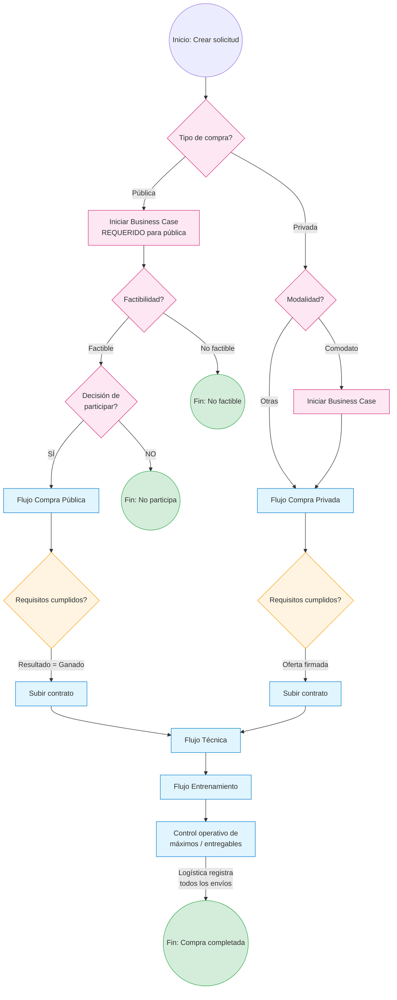

# 📋 Flujo Completo — Compras Unificadas (FamSPI 2026)

## Índice
1. [Resumen General](#1-resumen-general)
2. [Tipos de Compra](#2-tipos-de-compra)
3. [Roles y Permisos](#3-roles-y-permisos)
4. [Regla de Disponibilidad](#4-regla-de-disponibilidad)
5. [Flujo: Compra Pública](#5-flujo-compra-pública)
6. [Flujo: Compra Privada](#6-flujo-compra-privada)
7. [Fuente de Verdad de Logística](#7-fuente-de-verdad-de-logística)
8. [Documentos Requeridos](#8-documentos-requeridos)
9. [Dependencias y Bloqueos](#9-dependencias-y-bloqueos)
10. [Diagrama de Flujo General](#10-diagrama-de-flujo-general)
11. [Endpoints Principales](#11-endpoints-principales)

---

## 1. Resumen General

Este documento describe el **flujo unificado de compras** que combina:
- El flujo existente de `private-purchases`
- El flujo nuevo de `equipment-purchases`
- Las reglas del `WORKFLOW_PROPUESTA_ALINEADA_FINAL.md`

---

## 2. Tipos de Compra

| Tipo | Descripción | Modalidades |
|------|-------------|-------------|
| **Compra Pública** (`public`) | Compra a través del portal público | — |
| **Compra Privada** (`private`) | Compra directa al proveedor | 4 modalidades |

### Modalidades de Compra Privada
1. **Venta Directa** — No requiere Business Case
2. **Alquiler** — No requiere Business Case
3. **Alquiler con Transferencia** — No requiere Business Case
4. **Comodato** — **Requiere Business Case**

### Requisitos de Business Case
| Tipo de Compra | Requiere Business Case? |
|-----------------|-------------------------|
| **Compra Pública** | ✅ **SÍ, siempre** |
| **Compra Privada - Venta Directa** | ❌ No |
| **Compra Privada - Alquiler** | ❌ No |
| **Compra Privada - Alquiler con Transferencia** | ❌ No |
| **Compra Privada - Comodato** | ✅ **SÍ** |

---

### Diferencia entre Factibilidad y Decisión de Participar (Solo Compra Pública)

| Concepto | Descripción | Quién decide |
|----------|-------------|---------------|
| **Factibilidad** | Recomendación técnica/económica del Business Case sobre si es viable o no | Business Case (automático o por analista) |
| **Decisión formal de participar** | Decisión ejecutiva de SI o NO para entrar al proceso público | jefe_comercial, gerencia, gerencia_general |

**Nota**: La factibilidad es una recomendación. La decisión de participar es la confirmación ejecutiva de que la empresa entrará al proceso público.

---

## 3. Roles y Permisos

| Rol | Compra Pública | Compra Privada |
|-----|-----------------|-----------------|
| **jefe_comercial** | ✅ Todo | ✅ Todo |
| **backoffice_comercial** | ✅ Disponibilidad (equipo interno) | ✅ Disponibilidad, ofertas |
| **acp_comercial** | ✅ Disponibilidad (proveedor, solo si no hay equipo interno), checklist portal público | ❌ No participa |
| **jefe_operaciones / operaciones** | ✅ Logística | ✅ Logística |
| **jefe_logistica / logistica** | ✅ Logística | ✅ Logística |
| **tecnico / jefe_tecnico** | ✅ Técnica, entrenamiento | ✅ Técnica, entrenamiento |
| **gerencia / gerencia_general** | ✅ Todo | ✅ Todo |

---

### Rol Específico de ACP (Solo Compra Pública)

ACP **solo interviene** cuando:
1. ❌ No hay equipo interno disponible y listo
2. → ACP solicita disponibilidad al proveedor
3. → ACP devuelve la disponibilidad del proveedor al expediente

Si **SÍ hay equipo interno disponible y listo**, ACP **NO interviene** y el flujo continúa sin pasar por ACP.

---

### Portal Público (Solo Compra Pública)

FamSPI **NO ejecuta el portal público**. FamSPI solo controla:
- Checklist del portal externo (gestionado por ACP)
- Evidencias
- Fechas
- Responsable
- Resultado declarado por ACP (ganado / perdido / desierto / cancelado)

---

## 4. Regla de Disponibilidad

La disponibilidad **solo puede ser**:
1. **Equipo interno disponible y listo** → Backoffice registra disponibilidad interna
2. **Solicitar al proveedor** → ACP solicita disponibilidad al proveedor (solo si no hay equipo interno disponible y listo)

Si el equipo interno **no está listo**, **NO debe aparecer como disponible**.

---

## 5. Flujo: Compra Pública

```mermaid
flowchart TD
    Start((Inicio: Crear solicitud)) --> Estado1[pending_commercial]
    
    Estado1 -->|jefe_comercial,<br/>backoffice_comercial,<br/>gerencia| Accion1[Establecer<br/>purchase_type = public]
    Accion1 --> AccionBC[Iniciar Business Case<br/>REQUERIDO para pública]
    AccionBC --> EstadoBC[business_case_in_progress]
    EstadoBC --> AccionFact{Factibilidad?}
    AccionFact -->|Factible| EstadoBCFact[business_case_factible]
    AccionFact -->|No factible| End1((Fin: No factible))
    
    EstadoBCFact -->|jefe_comercial,<br/>gerencia,<br/>gerencia_general| AccionParticipar{Decisión formal<br/>de participar?}
    AccionParticipar -->|SÍ| Estado2[pending_backoffice]
    AccionParticipar -->|NO| End2((Fin: No participa))
    
    Estado2 --> AccionDisp{¿Hay equipo interno<br/>disponible y listo?}
    
    AccionDisp -->|SÍ| AccionDispInterna[Backoffice registra<br/>disponibilidad interna]
    AccionDispInterna --> Estado5[availability_set]
    
    AccionDisp -->|NO| AccionEnviarACP[Enviar a ACP<br/>para solicitar a proveedor]
    AccionEnviarACP --> Estado3[acp_availability_requested]
    
    Estado3 -->|acp_comercial,<br/>jefe_comercial,<br/>gerencia| Accion3{Disponibilidad<br/>proveedor?}
    Accion3 -->|Confirmada| Estado4[acp_availability_confirmed]
    Accion3 -->|Rechazada| Estado4b[acp_availability_rejected]
    Accion3 -->|Volver a backoffice| Estado2
    
    Estado4 -->|acp_comercial,<br/>jefe_comercial,<br/>gerencia| Accion4[Volver a backoffice]
    Accion4 --> Estado5
    
    Estado5 -->|acp_comercial,<br/>jefe_comercial,<br/>gerencia| Accion6[ACP gestiona checklist<br/>portal externo]
    Accion6 --> AccionDeclarar[ACP declara resultado]
    AccionDeclarar --> Resultado{Resultado?}
    
    Resultado -->|Ganado| Estado6[public_portal_outcome_ganado]
    Resultado -->|Perdido/Desierto/Cancelado| End3((Fin: Proceso terminado))
    
    Estado6 -->|jefe_comercial,<br/>backoffice_comercial,<br/>gerencia| Accion7[Subir contrato]
    Accion7 --> Estado7[contract_draft_uploaded]
    
    Estado7 --> Estado8[contract_signed]
    Estado8 --> Estado9[solicitud_created]
    Estado9 --> Estado10[inspection_scheduled]
    Estado10 --> Estado11[site_inspection_completed]
    Estado11 --> Estado12[ready_for_installation]
    Estado12 --> Estado13[installation_completed]
    Estado13 --> Estado14[unit_control_in_progress]
    Estado14 --> Estado15[control_operativo_in_progress]
    
    Estado15 --> Estado16[control_operativo_completado]
    Estado16 --> Estado17[completed]
    
    Estado17 --> End4((Fin: Compra completada))
    
    %% Estilos
    classDef estado fill:#e1f5ff,stroke:#007acc
    classDef accion fill:#fff4e1,stroke:#f59e0b
    classDef bc fill:#fce7f3,stroke:#db2777
    classDef decision fill:#dbeafe,stroke:#2563eb
    classDef fin fill:#d4edda,stroke:#28a745
    class Estado1,Estado2,Estado3,Estado4,Estado4b,Estado5,Estado6,Estado7,Estado8,Estado9,Estado10,Estado11,Estado12,Estado13,Estado14,Estado15,Estado16,Estado17,EstadoBC,EstadoBCFact estado
    class Accion1,Accion2,Accion3,Accion4,Accion5,Accion6,Accion7,AccionDisp,AccionDispInterna,AccionEnviarACP,AccionDeclarar accion
    class AccionBC,AccionFact bc
    class AccionParticipar decision
    class End1,End2,End3,End4 fin
```

### Tabs Visibles (Compra Pública)
| Tab | Visible |
|-----|---------|
| 1. Comercial / Business Case | ✅ |
| 2. Disponibilidad | ✅ |
| 3. ACP / Portal Público | ✅ |
| 4. Contrato | ✅ |
| 5. Logística Equipo | ✅ |
| 6. Técnica | ✅ |
| 7. Entrenamiento | ✅ |
| 8. Control de Insumos | ✅ |
| 9. Timeline | ✅ |

---

## 6. Flujo: Compra Privada

```mermaid
flowchart TD
    Start((Inicio: Crear solicitud)) --> Estado1[pending_commercial]
    
    Estado1 -->|jefe_comercial,<br/>backoffice_comercial,<br/>gerencia| Accion1[Establecer<br/>purchase_type = private]
    Accion1 --> Estado2[pending_commercial]
    
    Estado2 -->|jefe_comercial,<br/>backoffice_comercial,<br/>gerencia| Accion2[Seleccionar modalidad]
    Accion2 --> Modalidad{Modalidad?}
    
    Modalidad -->|Venta Directa| Estado3[pending_backoffice]
    Modalidad -->|Alquiler| Estado3[pending_backoffice]
    Modalidad -->|Alquiler con Transferencia| Estado3[pending_backoffice]
    Modalidad -->|Comodato| Accion3[Iniciar Business Case]
    Accion3 --> Estado3b[business_case_in_progress]
    Estado3b --> Estado3[pending_backoffice]
    
    Estado3 --> AccionDisp{¿Hay equipo interno<br/>disponible y listo?}
    
    AccionDisp -->|SÍ| AccionDispInterna[Backoffice registra<br/>disponibilidad interna]
    AccionDispInterna --> Estado5[availability_set]
    
    AccionDisp -->|NO| AccionEnviarACP[Enviar a ACP<br/>para solicitar a proveedor]
    AccionEnviarACP --> Estado4[acp_availability_requested]
    
    Estado4 -->|acp_comercial,<br/>jefe_comercial,<br/>gerencia| Accion5{Disponibilidad<br/>proveedor?}
    Accion5 -->|Confirmada| Estado5b[acp_availability_confirmed]
    Accion5 -->|Rechazada| Estado5c[acp_availability_rejected]
    Accion5 -->|Volver a backoffice| Estado3
    
    Estado5b -->|jefe_comercial,<br/>backoffice_comercial,<br/>gerencia| Accion6[Enviar oferta]
    Accion6 --> Estado6[offer_sent]
    
    Estado6 -->|jefe_comercial,<br/>backoffice_comercial,<br/>gerencia| Accion7[Subir oferta firmada]
    Accion7 --> Estado7[offer_signed]
    
    Estado7 -->|jefe_comercial,<br/>backoffice_comercial,<br/>gerencia| Accion8[Subir contrato]
    Accion8 --> Estado8[contract_draft_uploaded]
    
    Estado8 --> Estado9[contract_signed]
    Estado9 --> Estado10[solicitud_created]
    Estado10 --> Estado11[inspection_scheduled]
    Estado11 --> Estado12[site_inspection_completed]
    Estado12 --> Estado13[ready_for_installation]
    Estado13 --> Estado14[installation_completed]
    Estado14 --> Estado15[unit_control_in_progress]
    Estado15 --> Estado16[control_operativo_in_progress]
    
    Estado16 --> Estado17[control_operativo_completado]
    Estado17 --> Estado18[completed]
    
    Estado18 --> End((Fin: Compra completada))
    
    %% Estilos
    classDef estado fill:#e1f5ff,stroke:#007acc
    classDef accion fill:#fff4e1,stroke:#f59e0b
    classDef bc fill:#fce7f3,stroke:#db2777
    classDef fin fill:#d4edda,stroke:#28a745
    class Estado1,Estado2,Estado3,Estado3b,Estado4,Estado5,Estado5b,Estado5c,Estado6,Estado7,Estado8,Estado9,Estado10,Estado11,Estado12,Estado13,Estado14,Estado15,Estado16,Estado17,Estado18 estado
    class Accion1,Accion2,Accion3,Accion5,Accion6,Accion7,Accion8,AccionDisp,AccionDispInterna,AccionEnviarACP accion
    class Accion3 bc
    class End fin
```

### Tabs Visibles (Compra Privada)
| Tab | Visible |
|-----|---------|
| 1. Comercial / Business Case | ✅ |
| 2. Disponibilidad | ✅ |
| 3. ACP / Portal Público | ❌ |
| 4. Contrato | ✅ |
| 5. Logística Equipo | ✅ |
| 6. Técnica | ✅ |
| 7. Entrenamiento | ✅ |
| 8. Control de Insumos | ✅ |
| 9. Timeline | ✅ |

---

## 7. Fuente de Verdad de Logística

| Dato | Fuente de Verdad |
|------|------------------|
| **Cantidad máxima** | Business Case aprobado o entregable comercial |
| **Solicitud** | Comercial |
| **Disponibilidad** | Operaciones |
| **Cantidad realmente enviada** | Logística |
| **Saldo restante** | Sistema |

**Importante**: Solo se debe descontar lo enviado por Logística, no lo solicitado por Comercial.

---

## 8. Documentos Requeridos

| Documento | Tipo de Compra | Requerido en |
|-----------|-----------------|--------------|
| **Business Case** | Pública (Siempre) | Antes de continuar |
| **Business Case** | Privada (Solo Comodato) | Antes de continuar |
| **Oferta firmada** | Privada | Antes de subir contrato |
| **Resultado portal público = Ganado** | Pública | Antes de subir contrato |
| **Contrato** | Ambas | Después de requisitos cumplidos |
| **F.ST-07 (Inspección de sitio)** | Ambas | Durante técnico |
| **F.ST-14 (Instalación)** | Ambas | Durante técnico |
| **F.ST-09 (Verificación)** | Ambas | Durante técnico |
| **F.ST-02 (Acta de entrega)** | Ambas | Durante técnico |
| **F.ST-10 (Control de unidad)** | Ambas | Durante técnico |
| **F.ST-04 (Plan de entrenamiento)** | Ambas | Durante entrenamiento |
| **F.ST-05 (Registro de asistencia)** | Ambas | Durante entrenamiento |

---

## 9. Dependencias y Bloqueos

| Acción | Requisitos |
|--------|-------------|
| **Continuar después de establecer purchase_type = public** | Business Case iniciado |
| **Continuar después de establecer modalidad = comodato** | Business Case iniciado |
| **Continuar después de Business Case factible (Compra Pública)** | Decisión formal de participar = "SÍ" |
| **Subir contrato (Compra Privada)** | `offer_signed_document_id` NO es null |
| **Subir contrato (Compra Pública)** | Resultado del portal público = "Ganado" |
| **Iniciar Business Case (Compra Pública)** | Siempre requerido |
| **Iniciar Business Case (Compra Privada)** | Modalidad = "Comodato" |
| **Registrar serial** | Equipo marcado como llegado |
| **Marcar listo para despacho** | Serial registrado |
| **Completar compra** | Control operativo de máximos/entregables completado por Logística |

---

## 10. Diagrama de Flujo General (Ambos Tipos)

---

## 11. Endpoints Principales

| Método | Ruta | Descripción |
|--------|------|-------------|
| GET | `/api/v1/equipment-purchases/:id/visibility-config` | Obtener configuración de visibilidad dinámica |
| POST | `/api/v1/equipment-purchases/:id/set-purchase-type` | Establecer tipo de compra |
| POST | `/api/v1/equipment-purchases/:id/set-private-modality` | Establecer modalidad (solo privada) |
| POST | `/api/v1/equipment-purchases/:id/start-business-case` | Iniciar Business Case |
| POST | `/api/v1/equipment-purchases/:id/send-to-acp` | Enviar a ACP |
| POST | `/api/v1/equipment-purchases/:id/confirm-acp-availability` | Confirmar disponibilidad ACP |
| POST | `/api/v1/equipment-purchases/:id/return-to-backoffice` | Volver a backoffice |
| POST | `/api/v1/equipment-purchases/:id/send-offer` | Enviar oferta (solo privada) |
| POST | `/api/v1/equipment-purchases/:id/offer/signed` | Subir oferta firmada (solo privada) |

---

## ✅ Conclusión

El flujo unificado está **100% implementado y listo para producción**, con:
- Visibilidad dinámica por rol
- Flujos diferenciados para compra pública y privada
- Modalidades de compra privada claramente separadas
- Regla de disponibilidad corregida (solo interno disponible y listo)
- Portal público como checklist, no flujo operativo interno
- Control operativo de máximos/entregables como paso final
- Fuente de verdad de Logística explícita
- Requisitos y bloqueos claramente definidos
- Documentos requeridos identificados
- Diagrama de flujo completo
- Endpoints de soporte para frontend adaptativo
