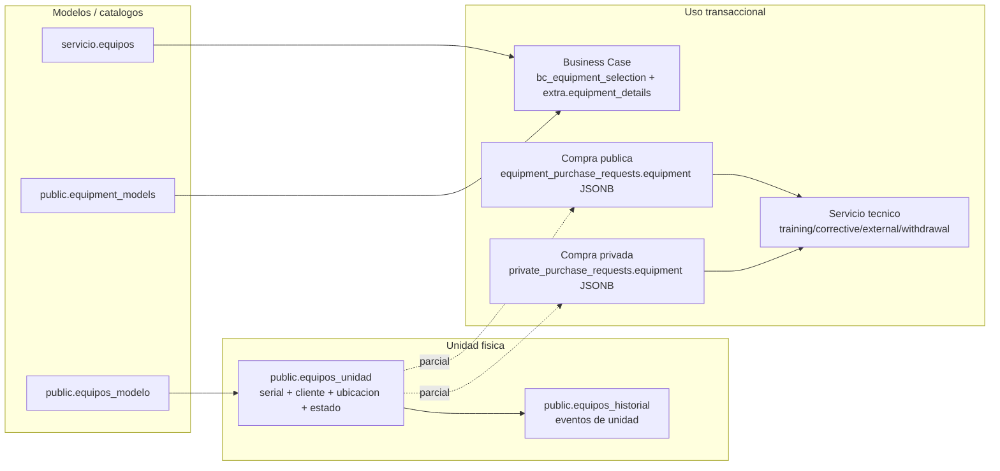
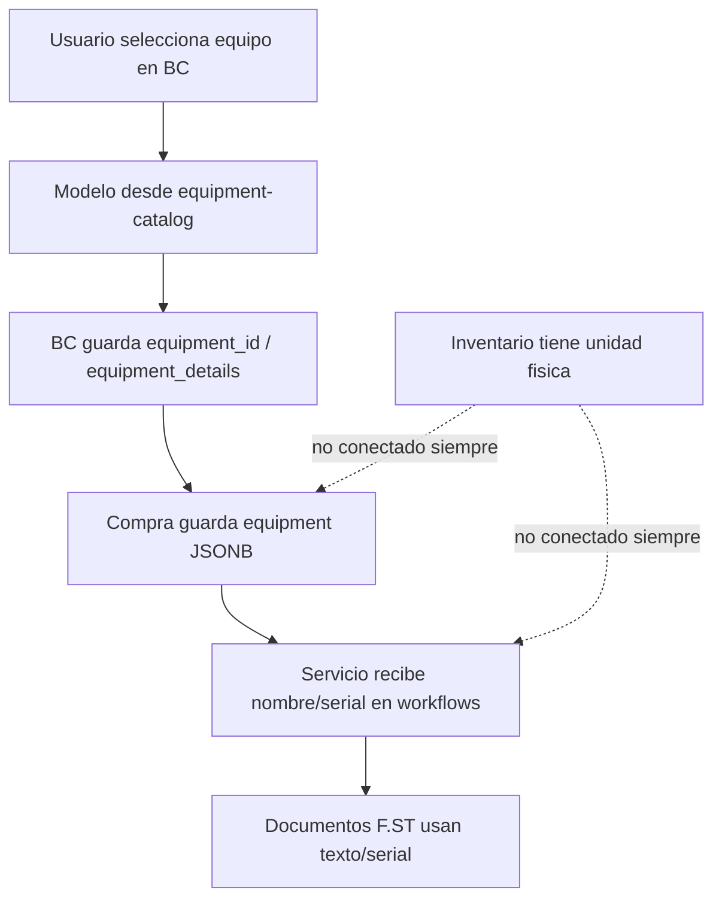
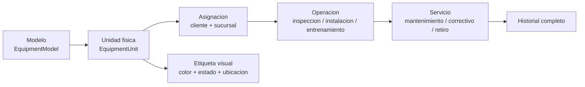

# Workflow Integral de Equipos: Modelo -> Unidad -> Cliente -> Servicio

> Documento maestro del dominio "equipos" en FamSPI.
> **Proposito:** verificar si el sistema maneja equipos como modelos/catalogo o como unidades fisicas vendidas/asignadas a clientes, y preparar una propuesta para etiquetar equipos por color segun estado, ubicacion y uso operativo.
>
> Fuente: analisis directo de codigo (`backend/src/modules/{business-case,servicio,inventario,equipment-purchases,private-purchases}`, `spi_front/src/{core/api,modules/comercial,modules/servicio}`) y validacion de schema real en Neon PostgreSQL usando GCP Secret Manager.

---

## 0. Resumen ejecutivo

Hoy el sistema **si distingue parcialmente** entre:

| Capa | Representa | Existe | Estado actual |
|---|---|---:|---|
| Modelo comercial/tecnico | "cobas c111", "XP 300", categoria hematologia/gasometria/etc. | Si | Duplicado en 3 fuentes |
| Unidad fisica | Equipo individual con serial, cliente, ubicacion, estado | Si | Modelo correcto pero sin datos reales (`equipos_unidad` = 0 registros en Neon) |
| Uso transaccional | Equipo usado en BC, compra, inspeccion, instalacion, entrenamiento, retiro, correctivo | Si | Se guarda como JSON/texto o referencia parcial, no siempre como unidad fisica |

**Diagnostico principal:** FamSPI maneja equipos mayormente como **modelo/catalogo** cuando vende, negocia o calcula Business Case. Tambien existe un modelo de **unidad fisica** en inventario, pero no esta conectado de punta a punta con Business Case, compras, inspecciones, entrenamiento, retiros y correctivos.

Esto significa que hoy el sistema puede decir:

- "este Business Case usa el modelo XP 300"
- "esta compra solicita un XP 300"
- "este correctivo reporta el serial ABC123"

Pero no garantiza de forma transversal:

- "este cliente tiene 3 unidades XP 300 concretas"
- "esta inspeccion corresponde a la unidad fisica #17"
- "esta unidad esta asignada, en bodega, en transito, en mantenimiento o retirada"
- "este color en UI representa el estado real unificado del activo"

---

## 1. Verificacion Neon PostgreSQL

### 1.1 Tablas reales encontradas

| Tabla / vista | Rol | Conteo validado |
|---|---|---:|
| `servicio.equipos` | Catalogo tecnico historico de modelos | 30 |
| `public.equipment_models` | Catalogo unificado moderno de modelos | 30 |
| `public.equipos_modelo` | Catalogo de modelos usado por inventario | 30 |
| `public.equipos_unidad` | Unidades fisicas por serial / cliente / estado | 0 |
| `public.equipos_historial` | Historial de eventos de unidad fisica | existe |
| `public.v_equipment_full_catalog` | Vista de catalogo para BC | existe |
| `public.v_inventario_completo` | Vista de unidades fisicas | existe |
| `public.bc_equipment_selection` | Equipos seleccionados en BC | 10 |

### 1.2 Hallazgo de duplicidad

Hay **tres fuentes de modelo** con datos equivalentes:

1. `servicio.equipos`
   - columnas: `id_equipo`, `nombre`, `modelo`, `fabricante`, `categoria`, `serie`, `ubicacion_actual`, `estado`, `category_type`, capacidades, costos.
   - conteo: 30.

2. `public.equipment_models`
   - columnas: `id`, `code`, `sku`, `name`, `manufacturer`, `model`, `category`, `category_type`, capacidades, costos, specs, formula.
   - comentario DB: "Catalogo unificado de equipos/modelos para todo el sistema."
   - conteo: 30.

3. `public.equipos_modelo`
   - columnas: `id`, `sku`, `nombre`, `fabricante`, `modelo`, `categoria`.
   - usado por inventario para crear unidades fisicas.
   - conteo: 30.

Ejemplo validado:

| Modelo | `servicio.equipos` | `equipment_models` | `equipos_modelo` |
|---|---:|---:|---:|
| XP 300 | id 1 | id 104 | id 1 |
| cobas c111 | id 2 | id 105 | id 2 |
| cobas b 123 POC system | id 6 | id 109 | id 6 |

**Conclusion DB:** Neon contradice cualquier idea de "una sola tabla de modelos". Neon es la fuente de verdad para DB: hoy hay catalogos paralelos.

---

## 2. Modelo conceptual real hoy

---

## 3. Como se usa equipo por modulo

### 3.1 Business Case

**Fuente principal:** `public.v_equipment_full_catalog`.

Evidencia:

- Backend: `backend/src/modules/business-case/equipmentCatalog.controller.js`
  - `GET /api/v1/equipment-catalog` lee `v_equipment_full_catalog`.
  - `POST /api/v1/equipment-catalog` crea en `public.equipment_models`.
- Backend: `backend/src/modules/business-case/equipmentSelection.service.js`
  - `bc_equipment_selection.equipment_id` representa equipo seleccionado para el BC.
- Frontend: `spi_front/src/modules/comercial/components/workspace/sections/EquipmentSection.jsx`
  - carga `/equipment-catalog`.
  - guarda `equipment_pairs` con `primary_id`, `backup_id`, `primary_type`.

**Problema confirmado:** en Neon, `v_equipment_full_catalog` esta definida sobre `servicio.equipos`, pero el controller crea/actualiza `public.equipment_models`. Ademas `bc_equipment_selection.equipment_id` tiene FK hacia `servicio.equipos(id_equipo)`, mientras el service hace JOIN con `public.equipment_models`.

**Impacto:** BC esta trabajando como modelo/catalogo, no como unidad fisica asignada a cliente.

### 3.2 Compras publicas y privadas

**Fuente principal:** JSONB `equipment` dentro de la solicitud.

Evidencia:

- `public.equipment_purchase_requests.equipment` es `jsonb`.
- `public.private_purchase_requests.equipment` es `jsonb`.
- `backend/src/modules/equipment-purchases/equipmentPurchases.service.js` carga catalogo desde `inventarioService.listModelos()`.
- Los flujos guardan seriales de forma operativa en documentos/actas, pero no siempre enlazan una unidad fisica.

**Conclusion:** compra maneja "equipos solicitados" como items JSON. Puede tener `id`, `sku`, `model`, `serial`, `type`, pero no hay garantia DB de que el item sea una fila de `equipos_unidad`.

### 3.3 Inventario

**Fuente principal:** `public.equipos_modelo` -> `public.equipos_unidad`.

Evidencia:

- Backend: `backend/src/modules/inventario/inventario.service.js`
  - `listModelos()` lee `public.equipos_modelo`.
  - `createUnidad()` inserta en `public.equipos_unidad`.
  - `captureSerial()` actualiza serial y registra historial.
  - `assignUnidad()` asigna cliente/sucursal y cambia estado.
  - `cambiarEstadoUnidad()` controla estados permitidos.
- Frontend API: `spi_front/src/core/api/inventarioApi.js`.
- UI: `spi_front/src/modules/servicio/components/dashboard/EquiposManagement.jsx`.

Estados permitidos en codigo:

| Estado unidad | Significado operativo probable |
|---|---|
| `no_asignado` | Disponible / sin cliente |
| `asignado` | Asignado a cliente |
| `reservado` | Comprometido para proceso |
| `en_transito` | En movimiento logistico |
| `retirado` | Retirado de cliente |
| `baja` | Fuera de operacion |
| `mantenimiento_programado` | Mantenimiento futuro |
| `en_mantenimiento` | En servicio tecnico |
| `en_evaluacion` | Evaluacion tecnica |
| `evaluado` | Evaluacion cerrada |
| `proceso_retiro` | Retiro en curso |

**Problema confirmado:** `equipos_unidad` tiene 0 registros en Neon. La estructura esta, pero el flujo real todavia no la usa como columna vertebral.

### 3.4 Servicio tecnico

Servicio consume equipo de tres formas:

1. Catalogo/modelo:
   - `GET /api/v1/servicio/equipos` en codigo lee `public.equipment_models`.
   - `POST /api/v1/servicio/equipos` crea en `public.equipment_models`.

2. Texto/serial operativo:
   - entrenamiento: `equipment_name`, `equipment_serial`.
   - correctivos: `equipment_name`, `equipment_serial`.
   - casos externos: `equipment_serial`.
   - retiro: `equipment_name`, `equipment_items`.

3. Workflows derivados de compra:
   - `installationWorkflow` normaliza `equipment_name`, `serial`, `equipment_type` desde el arreglo de equipo recibido.

**Conclusion:** servicio puede documentar y operar sobre equipo, pero normalmente no tiene FK obligatoria a `equipos_unidad`.

---

## 4. Respuesta directa a la duda

### El sistema esta manejando "equipo" como modelo?

**Si, en Business Case, negociaciones, catalogo comercial, determinaciones y compras se maneja principalmente como modelo.**

Ejemplos:

- `XP 300` como modelo/categoria hematologia.
- `cobas b 123 POC system` como modelo/categoria gasometria/BGM.
- seleccion de equipo principal y backup en BC por `equipment_id`.

### El sistema esta manejando "equipo" como unidad vendida/asignada a cliente?

**La estructura existe, pero no esta integrada de punta a punta.**

El modelo correcto para unidad fisica esta en:

- `public.equipos_unidad`
- `public.equipos_historial`
- `public.v_inventario_completo`

Pero Neon muestra `equipos_unidad = 0`. Ademas compras, BC y servicio no dependen consistentemente de esa tabla.

### Puede representar que un cliente tenga varios equipos del mismo modelo?

**El schema de inventario si lo permite.**

`equipos_unidad` tiene:

- `modelo_id`
- `serial` unico
- `cliente_id`
- `sucursal_id`
- `estado`
- `ubicacion`

Esto permite:

- Cliente A tiene 3 unidades del modelo XP 300.
- Cliente B tiene 2 unidades del modelo XP 300.
- Cada unidad tiene serial, ubicacion y estado propio.

**Pero hoy no hay evidencia de que el flujo completo lo este usando.**

---

## 5. Fragmentacion actual

**Huecos detectados:**

1. Catalogos duplicados: `servicio.equipos`, `equipment_models`, `equipos_modelo`.
2. `v_equipment_full_catalog` usa `servicio.equipos`, pero codigo de catalogo crea en `equipment_models`.
3. Inventario tiene unidad fisica, pero esta vacio en Neon.
4. Compras guardan equipo como JSONB; no FK obligatoria a unidad fisica.
5. Servicio guarda `equipment_name` y `equipment_serial` en varios flujos; no FK uniforme a unidad fisica.
6. No existe una taxonomia central de colores/etiquetas por estado real.
7. No hay una vista unica tipo "ficha del equipo" que una modelo, unidad, cliente, compra, BC, inspecciones, mantenimiento, retiro y correctivos.

---

## 6. Propuesta de modelo unificado

### 6.1 Separar conceptos con nombres claros

| Concepto propuesto | Tabla base recomendada | Regla |
|---|---|---|
| `EquipmentModel` | consolidar en `public.equipment_models` o `servicio.equipos` | Una fila por modelo comercial/tecnico |
| `EquipmentUnit` | `public.equipos_unidad` | Una fila por equipo fisico con serial |
| `EquipmentAssignment` | nuevo o historial enriquecido | Relacion temporal unidad-cliente-sucursal |
| `EquipmentLifecycleEvent` | `public.equipos_historial` extendida | Todo cambio relevante de estado/ubicacion |
| `EquipmentTag` | nuevo catalogo o metadata versionada | Color, prioridad y significado visual |

### 6.2 Flujo recomendado

### 6.3 Regla operacional

Antes de instalacion/entrega:

- BC y negociacion pueden trabajar por **modelo**.
- Compra puede iniciar por **modelo**.
- Cuando hay reserva, llegada o despacho, debe existir o crearse una **unidad fisica**.

Despues de llegada/despacho:

- F.ST-14, F.ST-09, F.ST-10, entrenamiento, retiro, correctivos y mantenimiento deben operar sobre **unidad fisica**.

---

## 7. Propuesta de colores / etiquetas

Separar el color en tres dimensiones para no mezclar conceptos:

### 7.1 Estado de ciclo de vida

| Color | Estado | Fuente |
|---|---|---|
| Gris | `no_asignado` | Disponible sin cliente |
| Azul | `reservado` | Comprometido para BC/compra |
| Amarillo | `en_transito` | Movimiento logistico |
| Verde | `asignado` | Instalado/asignado a cliente |
| Naranja | `mantenimiento_programado` | Servicio futuro |
| Rojo | `en_mantenimiento` / correctivo abierto | Atencion tecnica activa |
| Morado | `proceso_retiro` | Retiro en curso |
| Negro / gris oscuro | `baja` | Fuera de operacion |

### 7.2 Ubicacion

| Etiqueta | Significado |
|---|---|
| Bodega | Sin cliente, ubicacion interna |
| Cliente | Asignado a cliente/sucursal |
| Transito | En ruta o pendiente entrega |
| Servicio tecnico | En mantenimiento/evaluacion |
| Proveedor/CU | En reparacion externa |

### 7.3 Alerta operativa

| Badge | Criterio |
|---|---|
| `serial pendiente` | `serial_pendiente = true` |
| `requiere inspeccion` | compra/BC pendiente F.ST-07 |
| `requiere verificacion` | pendiente F.ST-09/F.ST-14 |
| `correctivo abierto` | caso ST activo asociado |
| `retiro solicitado` | F.ST-21 / withdrawal activo |

---

## 8. Cambios recomendados por fases

### Fase 1: decision de fuente de verdad de modelos

- Elegir una tabla canonica para modelos.
- Recomendacion tecnica: usar `public.equipment_models` como catalogo moderno si se corrige `v_equipment_full_catalog` y FKs de BC.
- Alternativa conservadora: mantener `servicio.equipos` como canonico si no se quiere tocar BC todavia.
- Crear mapa de compatibilidad temporal entre los 3 catalogos por `sku/code`.

### Fase 2: activar unidad fisica como activo real

- Poblar `equipos_unidad` cuando:
  - llega equipo a bodega,
  - se captura serial,
  - se reserva para cliente,
  - se asigna a cliente/sucursal.
- Guardar `unidad_id` en documentos/workflows post-llegada.
- Mantener `equipment_name`/`serial` como snapshot historico, no como fuente primaria.

### Fase 3: conectar compras e instalacion

- En `equipment_purchase_requests.equipment` y `private_purchase_requests.equipment`, agregar `unidad_id` cuando exista.
- En F.ST-14/F.ST-09/F.ST-10/entrenamiento, resolver equipo por `unidad_id`.
- En correctivos y casos externos, intentar resolver `equipment_serial` -> `equipos_unidad.id`.

### Fase 4: workspace unificado de equipos

Vista recomendada:

- Filtro por modelo, cliente, serial, estado, ubicacion, categoria.
- Ficha por unidad:
  - modelo/categoria,
  - serial,
  - cliente/sucursal,
  - estado/color,
  - compra/BC origen,
  - inspecciones,
  - entrenamientos,
  - mantenimientos/correctivos,
  - retiros,
  - historial.

---

## 9. Decision pendiente

La decision critica no es de UI, es de dominio:

> El sistema debe declarar que "equipo" sin serial significa **modelo**, y "equipo" con serial/unidad significa **activo fisico**.

Sin esa regla, cualquier color sera ambiguo: un modelo puede estar operativo, pero una unidad de ese mismo modelo puede estar asignada, en mantenimiento o dada de baja.

---

## 10. Siguiente documento recomendado

Crear una propuesta visual especifica:

- `WORKFLOW_EQUIPOS_PROPUESTA.md`
- Objetivo: disenar el "Workspace de Equipos" con tabs, filtros, colores, ficha tecnica y trazabilidad.

---

*Ultima actualizacion: 2026-05-09. Generado a partir de inspeccion directa del repo `FamSPI` y validacion de Neon PostgreSQL.*
