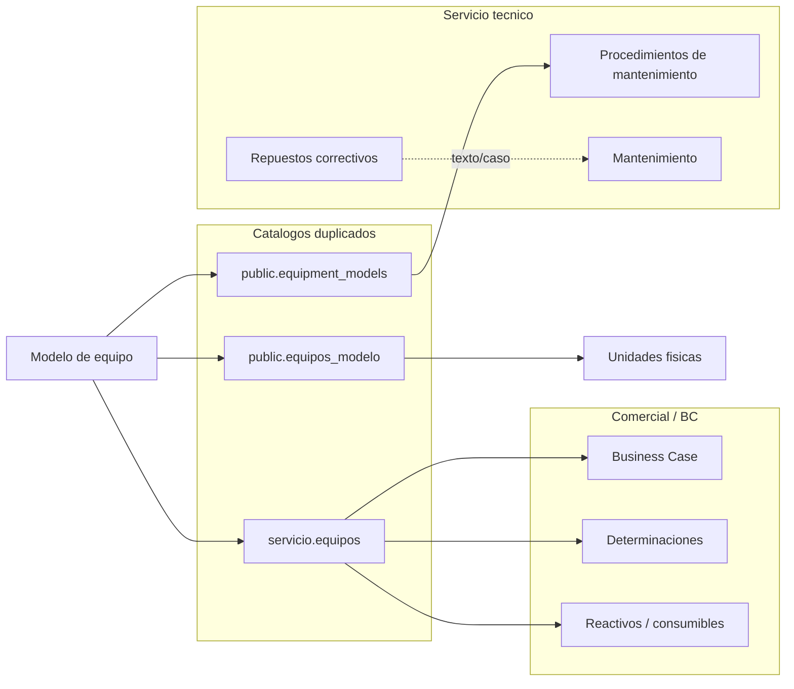
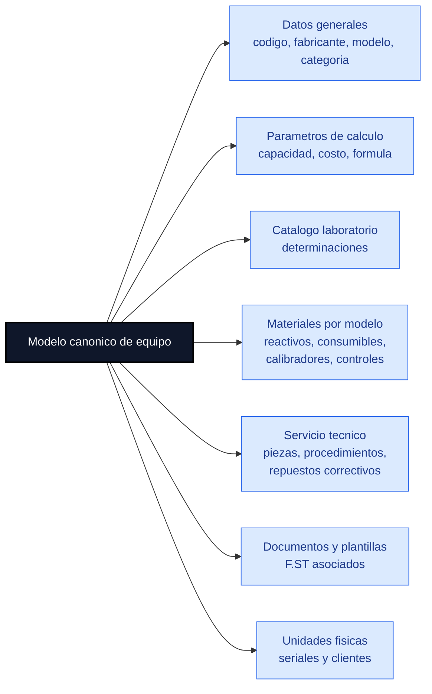
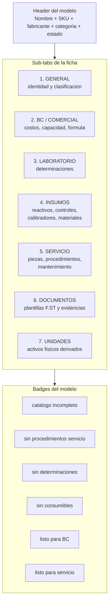
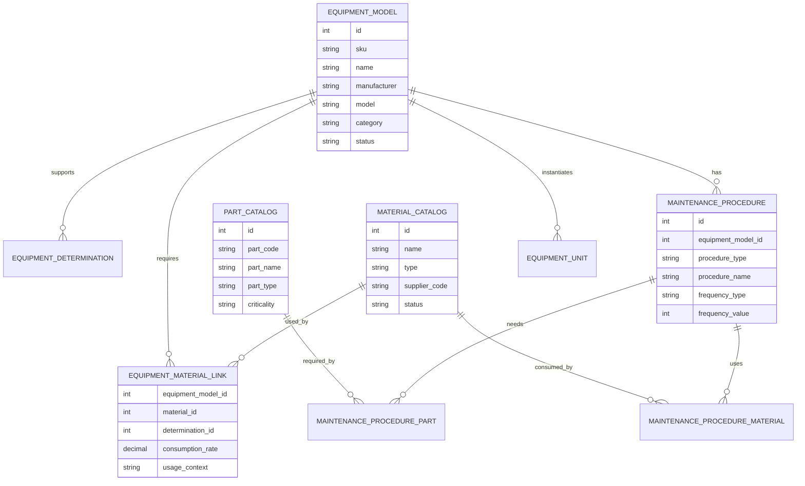
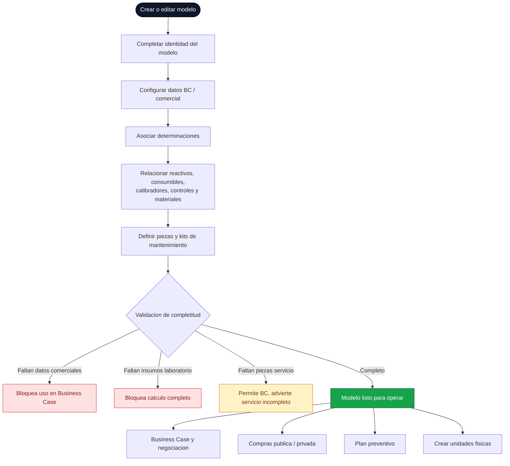
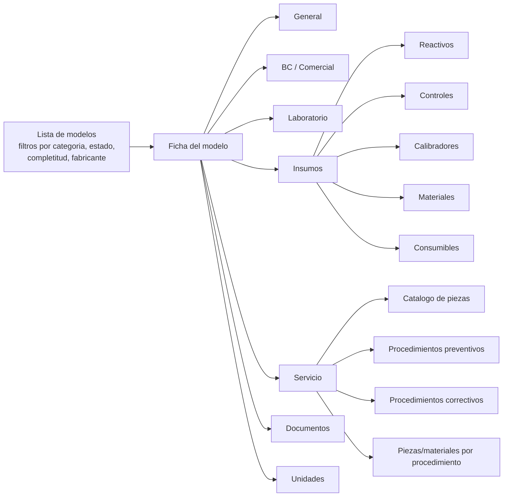

# Propuesta Visual - Workspace Maestro de Modelos de Equipo

> Diagramas de arquitectura propuesta para gestionar equipos como **modelos canonicos**, con sus reactivos, consumibles, calibradores, controles, materiales, repuestos y piezas de mantenimiento.
> Complementa [WORKFLOW_EQUIPOS.md](WORKFLOW_EQUIPOS.md).

---

## 1. Decision de dominio

La palabra "equipo" debe separarse en dos conceptos:

| Concepto | Significado | Ejemplo | Uso principal |
|---|---|---|---|
| **Modelo de equipo** | Referencia tecnica/comercial reutilizable | `cobas c111`, `XP 300`, `cobas b 123` | Business Case, negociacion, catalogos, materiales, mantenimiento |
| **Unidad fisica** | Activo individual con serial y cliente | `XP 300 serie ABC123` | Inventario, asignacion, retiro, correctivo, trazabilidad fisica |

Esta propuesta trabaja sobre el **modelo de equipo**, no sobre el activo fisico.

---

## 2. Vista global - hoy vs propuesta

### HOY - fragmentado

### PROPUESTA - maestro unico de modelos

---

## 3. Evidencia validada en Neon

| Tabla | Rol actual | Conteo |
|---|---|---:|
| `servicio.equipos` | catalogo tecnico historico de modelos | 30 |
| `public.equipment_models` | catalogo moderno de modelos | 30 |
| `public.equipos_modelo` | catalogo de modelos para inventario | 30 |
| `public.catalog_determinations` | determinaciones por equipo | 53 |
| `public.catalog_consumables` | reactivos, controles, calibradores, consumibles, materiales | 685 |
| `public.catalog_equipment_consumables` | relacion modelo-equipo <-> insumo/determinacion | 1228 |
| `public.equipment_maintenance_parts` | piezas por modelo para mantenimiento preventivo | 0 |
| `public.equipos_unidad` | unidades fisicas por serial | 0 |

**Conclusion:** la base ya tiene una relacion madura para insumos comerciales/laboratorio, pero el lado de servicio preventivo esta creado y vacio. La propuesta debe unificar ambas caras alrededor del modelo.

---

## 4. Anatomia propuesta de la ficha de modelo

---

## 5. Modelo de relaciones propuesto

### 5.1 Diagrama entidad-relacion detallado

> Lectura del diagrama: `EquipmentModel` es la entidad central. Las piezas viven en un catalogo maestro (`PartCatalog`) y se atan a procedimientos de mantenimiento, no directamente al modelo como "preventivas". `EquipmentUnit` queda como instancia fisica derivada para seriales/clientes.

```mermaid
erDiagram
    EQUIPMENT_MODEL ||--o{ MODEL_ALIAS : has
    EQUIPMENT_MODEL ||--o{ MODEL_CATEGORY_TAG : classified_as
    EQUIPMENT_MODEL ||--o{ MODEL_COMMERCIAL_PROFILE : has
    EQUIPMENT_MODEL ||--o{ MODEL_TECHNICAL_SPEC : has
    EQUIPMENT_MODEL ||--o{ MODEL_DETERMINATION : supports
    DETERMINATION_CATALOG ||--o{ MODEL_DETERMINATION : linked_to
    EQUIPMENT_MODEL ||--o{ MODEL_MATERIAL : requires
    MATERIAL_CATALOG ||--o{ MODEL_MATERIAL : used_by
    DETERMINATION_CATALOG ||--o{ MODEL_MATERIAL : consumes_for
    EQUIPMENT_MODEL ||--o{ MAINTENANCE_PROCEDURE : has
    PART_CATALOG ||--o{ MAINTENANCE_PROCEDURE_PART : required_by
    MAINTENANCE_PROCEDURE ||--o{ MAINTENANCE_PROCEDURE_PART : needs
    MATERIAL_CATALOG ||--o{ MAINTENANCE_PROCEDURE_MATERIAL : consumed_by
    MAINTENANCE_PROCEDURE ||--o{ MAINTENANCE_PROCEDURE_MATERIAL : uses
    MAINTENANCE_PROCEDURE ||--o{ MAINTENANCE_EXECUTION : executed_as
    EQUIPMENT_UNIT ||--o{ MAINTENANCE_EXECUTION : receives
    MAINTENANCE_EXECUTION ||--o{ MAINTENANCE_EXECUTION_PART : replaced
    PART_CATALOG ||--o{ MAINTENANCE_EXECUTION_PART : part_used
    EQUIPMENT_MODEL ||--o{ MODEL_DOCUMENT_REQUIREMENT : requires_document
    EQUIPMENT_MODEL ||--o{ EQUIPMENT_UNIT : instantiates
    EQUIPMENT_UNIT ||--o{ UNIT_ASSIGNMENT : assigned_to
    EQUIPMENT_UNIT ||--o{ UNIT_LIFECYCLE_EVENT : records
    CLIENT ||--o{ UNIT_ASSIGNMENT : receives
    CLIENT_LOCATION ||--o{ UNIT_ASSIGNMENT : installed_at
    EQUIPMENT_MODEL ||--o{ MODEL_READINESS_CHECK : evaluated_by

    EQUIPMENT_MODEL {
      int id PK
      string sku UK
      string code
      string name
      string manufacturer
      string model
      string category
      string category_type
      string status
      jsonb technical_specs
      jsonb metadata
      timestamp created_at
      timestamp updated_at
    }

    MODEL_ALIAS {
      int id PK
      int equipment_model_id FK
      string source_system
      string source_table
      string source_id
      string source_code
      string source_name
      boolean is_primary
    }

    MODEL_CATEGORY_TAG {
      int id PK
      int equipment_model_id FK
      string tag_type
      string tag_value
      string display_label
    }

    MODEL_COMMERCIAL_PROFILE {
      int id PK
      int equipment_model_id FK
      numeric base_price
      numeric maintenance_cost
      int capacity_per_hour
      int max_daily_capacity
      jsonb default_calculation_formula
      string calculation_engine
      string bc_status
    }

    MODEL_TECHNICAL_SPEC {
      int id PK
      int equipment_model_id FK
      string spec_key
      string spec_value
      string unit
      string source
    }

    DETERMINATION_CATALOG {
      int id PK
      string name
      string roche_code
      string category
      string subcategory
      string status
      numeric cost_per_test
      jsonb calculation_formula
    }

    MODEL_DETERMINATION {
      int id PK
      int equipment_model_id FK
      int determination_id FK
      numeric volume_per_test
      numeric reagent_consumption
      int processing_time
      int wash_cycles
      int calibration_frequency
      boolean blank_required
      boolean is_default
    }

    MATERIAL_CATALOG {
      int id PK
      string name
      string type
      string supplier
      string supplier_code
      int units_per_kit
      numeric unit_price
      int yield_per_unit
      int reorder_point
      int lead_time_days
      string status
    }

    MODEL_MATERIAL {
      int id PK
      int equipment_model_id FK
      int material_id FK
      int determination_id FK
      string usage_context
      numeric consumption_rate
      numeric default_quantity
      boolean is_required
      string criticality
      string notes
    }

    PART_CATALOG {
      int id PK
      string part_code UK
      string part_name
      string part_type
      string manufacturer
      string supplier
      numeric reference_cost
      string criticality
      boolean requires_disinfection
      string status
      string notes
    }

    MAINTENANCE_PROCEDURE {
      int id PK
      int equipment_model_id FK
      string procedure_code
      string procedure_name
      string procedure_type
      string frequency_type
      int frequency_value
      int estimated_minutes
      string responsible_role
      string status
    }

    MAINTENANCE_PROCEDURE_PART {
      int id PK
      int maintenance_procedure_id FK
      int part_id FK
      numeric quantity
      string unit
      boolean is_required
      string criticality
      boolean replace_by_default
      string instructions
    }

    MAINTENANCE_PROCEDURE_MATERIAL {
      int id PK
      int maintenance_procedure_id FK
      int material_id FK
      numeric quantity
      string unit
      boolean is_required
      string usage_notes
    }

    MAINTENANCE_EXECUTION {
      int id PK
      int maintenance_procedure_id FK
      int equipment_unit_id FK
      int client_id FK
      string execution_status
      date scheduled_date
      date executed_date
      int executed_by
    }

    MAINTENANCE_EXECUTION_PART {
      int id PK
      int maintenance_execution_id FK
      int part_id FK
      numeric quantity_used
      string serial_removed
      string serial_installed
      boolean disinfection_required
      string evidence_file_id
    }

    MODEL_DOCUMENT_REQUIREMENT {
      int id PK
      int equipment_model_id FK
      string procedure_code
      string document_code
      string document_name
      boolean required_for_installation
      boolean required_for_preventive
      boolean required_for_withdrawal
    }

    EQUIPMENT_UNIT {
      int id PK
      int equipment_model_id FK
      string serial UK
      string status
      int client_id FK
      int client_location_id FK
      string current_location
      boolean serial_pending
    }

    UNIT_ASSIGNMENT {
      int id PK
      int equipment_unit_id FK
      int client_id FK
      int client_location_id FK
      date assigned_from
      date assigned_to
      string assignment_status
      string source_module
      string source_id
    }

    UNIT_LIFECYCLE_EVENT {
      int id PK
      int equipment_unit_id FK
      string event_type
      string event_detail
      string source_module
      string source_id
      int created_by
      timestamp created_at
    }

    MODEL_READINESS_CHECK {
      int id PK
      int equipment_model_id FK
      string check_key
      string check_status
      string severity
      string message
      timestamp checked_at
    }
```

### 5.2 Mapeo contra tablas actuales

| Entidad propuesta | Tabla actual mas cercana | Estado |
|---|---|---|
| `EQUIPMENT_MODEL` | `public.equipment_models` / `servicio.equipos` / `public.equipos_modelo` | duplicado, requiere canonico |
| `MODEL_ALIAS` | no existe formalmente | necesario para migracion |
| `MODEL_COMMERCIAL_PROFILE` | columnas dentro de `equipment_models` | ya existe embebido |
| `DETERMINATION_CATALOG` | `catalog_determinations` | existe |
| `MODEL_DETERMINATION` | `catalog_determinations.equipment_id` | existe parcial, relacion simple |
| `MATERIAL_CATALOG` | `catalog_consumables` | existe con datos reales |
| `MODEL_MATERIAL` | `catalog_equipment_consumables` | existe, falta contexto/criticidad |
| `PART_CATALOG` | no existe como catalogo maestro formal | recomendado |
| `MAINTENANCE_PROCEDURE` | existe disperso en servicio/mantenimientos | recomendado formalizar |
| `MAINTENANCE_PROCEDURE_PART` | `equipment_maintenance_parts` cubre solo una parte | recomendado reemplazar/ampliar |
| `MAINTENANCE_PROCEDURE_MATERIAL` | preventivos usan `consumables` JSONB | recomendado normalizar |
| `MODEL_DOCUMENT_REQUIREMENT` | `servicio.document_template_catalog` / registry | existe parcial |
| `EQUIPMENT_UNIT` | `equipos_unidad` | existe, vacia |
| `UNIT_ASSIGNMENT` | `equipos_unidad` + `equipos_historial` | existe parcial |
| `UNIT_LIFECYCLE_EVENT` | `equipos_historial` | existe |
| `MODEL_READINESS_CHECK` | no existe formalmente | recomendado para badges |

---

## 6. Tabs funcionales

### 6.1 General

Objetivo: una sola identidad del modelo.

Campos:

- codigo/SKU
- nombre comercial
- fabricante
- modelo
- categoria: hematologia, gasometria, quimica, coagulacion, POC, etc.
- estado del modelo: activo, inactivo, discontinuado
- alias o equivalencias entre catalogos actuales

### 6.2 BC / Comercial

Objetivo: alimentar Business Case y negociaciones.

Campos:

- capacidad por hora
- capacidad diaria
- costo base
- costo de mantenimiento estimado
- formula de calculo
- parametros de ROI
- tipos permitidos: nuevo, CU, instalado en cliente, backup

### 6.3 Laboratorio

Objetivo: administrar determinaciones compatibles con el modelo.

Fuente actual:

- `catalog_determinations.equipment_id`

Datos clave:

- determinacion
- categoria/subcategoria
- volumen por prueba
- consumo de reactivo
- tiempo de procesamiento
- ciclos de lavado
- frecuencia de calibracion
- costo por prueba

### 6.4 Insumos

Objetivo: relacionar el modelo con reactivos, consumibles, calibradores, controles y materiales.

Fuente actual:

- `catalog_consumables`
- `catalog_equipment_consumables`

Tipos esperados:

| Tipo | Uso |
|---|---|
| `reactivo` | consumo asociado a determinaciones |
| `control` | control de calidad |
| `calibrador` | calibracion del equipo/metodo |
| `consumible` | insumo operativo recurrente |
| `material` | material complementario |

Campos por relacion:

- insumo
- tipo
- codigo proveedor
- determinacion asociada, si aplica
- tasa de consumo
- rendimiento por kit
- punto de reorden
- tiempo de reposicion
- vigencia/version

### 6.5 Servicio tecnico

Objetivo: que el modelo sepa que tipos de mantenimiento existen y que piezas/materiales requiere cada procedimiento. Las piezas no deben vivir como "piezas preventivas del modelo" de forma directa, porque un mismo modelo puede tener varios mantenimientos preventivos y correctivos con requerimientos distintos.

Fuente actual:

- `equipment_maintenance_parts` existe, pero esta vacia.
- `servicio.corrective_case_spare_parts` se crea por runtime para correctivos, no como catalogo maestro.
- `mantenimientos.preventivePlanning.service.js` maneja `consumables` como JSONB en ejecuciones preventivas.

Propuesta:

- Crear un **catalogo maestro de piezas** independiente.
- Crear un catalogo de **procedimientos de mantenimiento por modelo**:
  - preventivo mensual/trimestral/semestral/anual
  - preventivo por horas/ciclos
  - correctivo tipo A/B/C o por sintoma
  - instalacion/verificacion si requiere piezas o materiales
- Asociar piezas y materiales al procedimiento, no solo al modelo.
- Mantener correctivos reales como eventos/casos, pero permitir seleccionar piezas desde el catalogo maestro.

Modelo recomendado:

| Nivel | Entidad | Ejemplo |
|---|---|---|
| Catalogo | `PART_CATALOG` | bomba, tubing, filtro, sensor, lampara |
| Procedimiento | `MAINTENANCE_PROCEDURE` | preventivo semestral XP 300 |
| Relacion | `MAINTENANCE_PROCEDURE_PART` | filtro x1, tubing x2 |
| Relacion | `MAINTENANCE_PROCEDURE_MATERIAL` | control, calibrador, reactivo de limpieza |
| Ejecucion | `MAINTENANCE_EXECUTION` | mantenimiento real en unidad/cliente |
| Consumo real | `MAINTENANCE_EXECUTION_PART` | pieza efectivamente cambiada |

### 6.6 Documentos

Objetivo: asociar el modelo con plantillas o requisitos documentales.

Ejemplos:

- F.ST-07 inspeccion de ambiente
- F.ST-09 verificacion tecnica
- F.ST-14 recepcion visual
- F.ST-02 desinfeccion si aplica
- F.ST-10 entrega
- checklists especificos por categoria

### 6.7 Unidades

Objetivo: vista derivada, no fuente principal del modelo.

Muestra:

- unidades fisicas de ese modelo
- serial
- cliente
- sucursal
- estado
- ubicacion
- historial

---

## 7. Flujo operativo recomendado

---

## 8. Reglas de completitud

| Regla | Nivel | Resultado |
|---|---|---|
| Modelo sin SKU/nombre/fabricante | Critico | no se puede publicar |
| Modelo sin categoria | Alto | no se puede clasificar ni filtrar |
| Modelo sin capacidad/costo | Alto | BC incompleto |
| Modelo sin determinaciones | Alto | no permite calculo tecnico completo |
| Modelo sin reactivos/consumibles | Alto | ROI y consumo incompletos |
| Modelo sin controles/calibradores | Medio | advertencia tecnica |
| Modelo sin procedimientos de mantenimiento | Medio | servicio incompleto |
| Procedimiento sin piezas/materiales requeridos | Medio | mantenimiento incompleto |
| Modelo sin unidades fisicas | Informativo | puede venderse/proponerse, pero no instalarse todavia |

---

## 9. Colores propuestos para modelos

Estos colores no representan estado de una unidad fisica. Representan **completitud del modelo maestro**.

| Color | Etiqueta | Criterio |
|---|---|---|
| Verde | `listo` | comercial + laboratorio + insumos + servicio completos |
| Azul | `listo para BC` | datos comerciales, determinaciones e insumos minimos completos |
| Amarillo | `servicio pendiente` | BC completo, pero procedimientos de mantenimiento incompletos |
| Naranja | `catalogo incompleto` | faltan datos tecnicos o insumos relevantes |
| Rojo | `bloqueado` | falta identidad minima o inconsistencia de catalogo |
| Gris | `inactivo/discontinuado` | modelo no disponible para nuevas propuestas |

---

## 10. Cambios recomendados

### CHG-01 - Elegir catalogo canonico de modelos

- Decidir si el modelo canonico sera `public.equipment_models` o `servicio.equipos`.
- Recomendacion: `public.equipment_models`, porque ya contiene datos comerciales, formulas y FK desde `equipment_maintenance_parts`.
- Ajustar `v_equipment_full_catalog` y FKs que hoy apuntan a `servicio.equipos`.

### CHG-02 - Normalizar tipos de insumo

- Unificar tipos permitidos: `reactivo`, `control`, `calibrador`, `consumible`, `material`.
- Validar que `catalog_consumables.type` use esa taxonomia.
- Evitar nombres libres que mezclen categoria con tipo.

### CHG-03 - Crear matriz modelo-insumo

- Fortalecer `catalog_equipment_consumables` como matriz principal.
- Agregar, si aplica:
  - `usage_context`: BC, laboratorio, preventivo, instalacion
  - `is_required`
  - `default_quantity`
  - `criticality`
  - `notes`

### CHG-04 - Crear catalogo maestro de piezas

- Crear o formalizar `part_catalog`.
- Campos minimos:
  - codigo
  - nombre
  - fabricante/proveedor
  - tipo: repuesto, pieza desgaste, accesorio, herramienta, kit
  - criticidad
  - requiere desinfeccion al retirar
  - costo referencial
  - vigencia/estado

### CHG-05 - Crear procedimientos de mantenimiento por modelo

- Reemplazar la idea de "piezas preventivas por modelo" por:
  - `maintenance_procedure`
  - `maintenance_procedure_part`
  - `maintenance_procedure_material`
- Cada procedimiento define:
  - tipo: preventivo, correctivo, instalacion, verificacion
  - frecuencia: meses, horas, ciclos o evento
  - piezas requeridas
  - materiales requeridos
  - documentos F.ST requeridos
  - tiempo estimado
  - responsable/rol

### CHG-06 - Diferenciar repuesto correctivo vs parte maestra

- `corrective_case_spare_parts` debe seguir como evento/caso.
- El catalogo maestro debe vivir por modelo.
- En correctivos, el tecnico deberia seleccionar una parte del catalogo o registrar una parte no catalogada con aprobacion.

### CHG-07 - Crear Workspace Maestro de Modelos

Ruta sugerida:

- `/dashboard/servicio-tecnico/modelos-equipo`
- o `/dashboard/catalogos/equipos`

Permisos sugeridos:

| Area | Puede ver | Puede editar |
|---|---:|---:|
| Comercial / ACP | si | datos BC, costos, insumos comerciales |
| Tecnico / Jefe tecnico | si | piezas, preventivo, documentos tecnicos |
| Backoffice | si | reactivos en proceso privado |
| Gerencia | si | aprobar/publicar modelo |
| TI/Admin | si | correcciones de catalogo |

---

## 11. Arquitectura UI propuesta

---

## 12. Resultado esperado

Con esta propuesta, FamSPI podria responder desde una sola ficha:

- Que modelo es.
- Que categoria tiene.
- Que determinaciones soporta.
- Que reactivos consume.
- Que controles y calibradores requiere.
- Que consumibles/materiales necesita.
- Que piezas existen en el catalogo maestro.
- Que piezas/materiales requiere cada tipo de mantenimiento preventivo o correctivo.
- Si esta listo para Business Case.
- Si esta listo para servicio tecnico.
- Que unidades fisicas existen derivadas de ese modelo.

---

*Ultima actualizacion: 2026-05-09. Generado a partir de [WORKFLOW_EQUIPOS.md](WORKFLOW_EQUIPOS.md), inspeccion directa del repo `FamSPI` y validacion de Neon PostgreSQL.*
