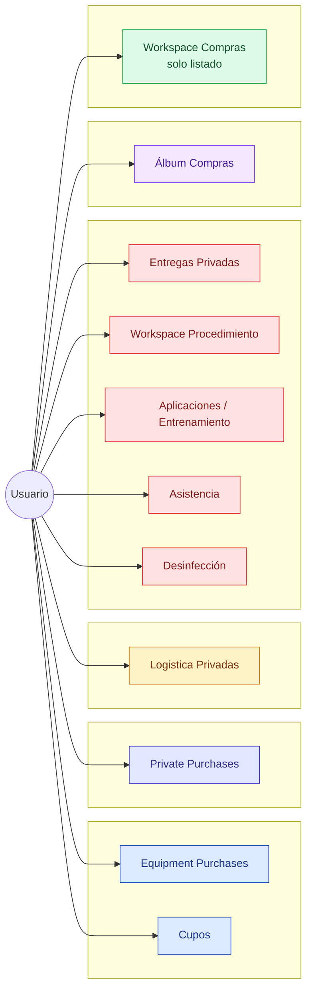
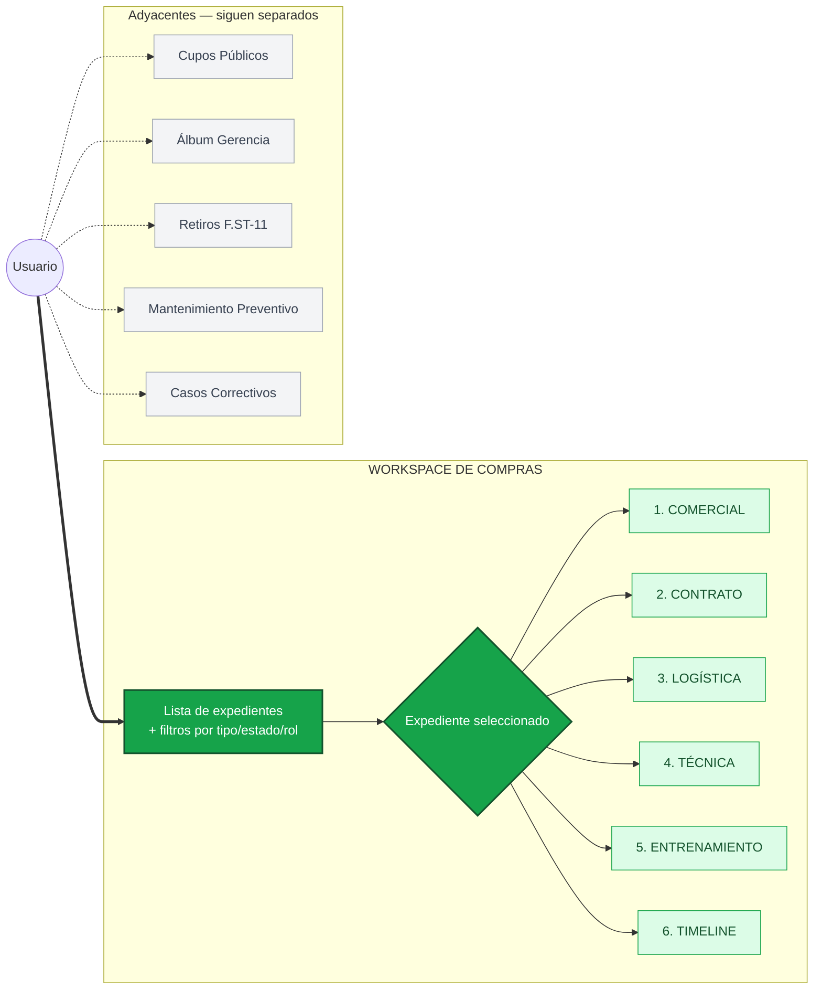
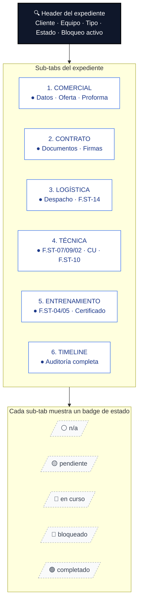
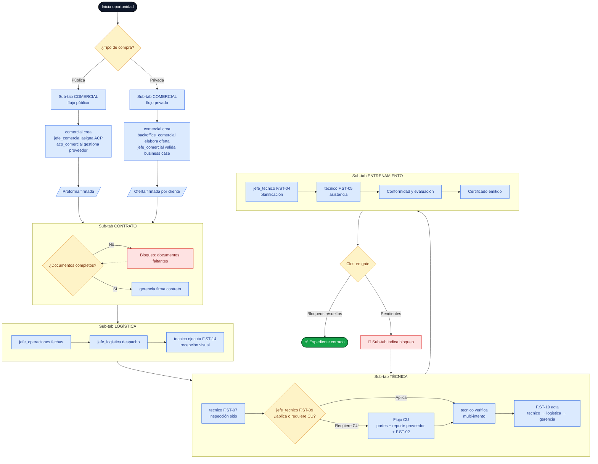
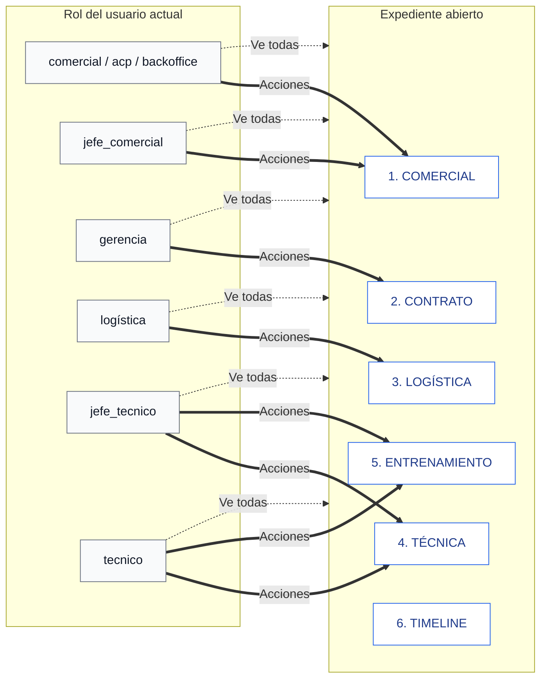
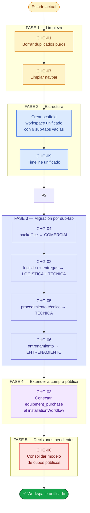

# Propuesta Visual — Workspace Unificado de Compras

> Diagramas de flujo de la arquitectura propuesta.
> Complementa [WORKFLOW_COMPRAS.md](WORKFLOW_COMPRAS.md).

---

## 1. Vista global — antes vs después

### ❌ HOY (fragmentado)



### ✅ PROPUESTA (unificado)



---

## 2. Anatomía del expediente unificado



---

## 3. Flujo end-to-end con todos los roles



---

## 4. Visibilidad por rol — todos ven todo, las acciones se gatean



> **Línea punteada** = visibilidad (todos los roles leen todo el expediente).
> **Línea sólida** = acciones disponibles (gateadas por rol).

---

## 5. Plan de migración — orden de ejecución



---

## 6. Comparación de superficie de UI

```mermaid
flowchart LR
    subgraph Antes["❌ HOY"]
        direction TB
        H1["11 rutas distintas"]
        H2["Hasta 4 entradas duplicadas<br/>en navbar por rol"]
        H3["Backoffice: 3000 líneas<br/>en un solo archivo"]
        H4["Compra pública sin<br/>UI post-arrival"]
        H5["Técnico salta entre<br/>4 pantallas para cerrar"]
    end

    subgraph Despues["✅ PROPUESTA"]
        direction TB
        D1["1 workspace<br/>+ 5 rutas adyacentes"]
        D2["1 entrada principal<br/>en navbar"]
        D3["UI distribuida en<br/>6 sub-tabs reutilizables"]
        D4["Pública y privada<br/>mismo flujo post-arrival"]
        D5["Técnico cierra desde<br/>1 sola pantalla"]
    end

    Antes ==>|migración| Despues

    classDef bad fill:#FEE2E2,stroke:#DC2626,color:#7F1D1D
    classDef good fill:#DCFCE7,stroke:#16A34A,color:#14532D

    class H1,H2,H3,H4,H5 bad
    class D1,D2,D3,D4,D5 good
```



---

## 7. Estructura del archivo (lo que se va a tocar)

```
spi_front/src/modules/
├── shared/
│   └── purchases-workspace/
│       ├── PurchasesWorkspace.jsx          ← orquesta lista + detalle
│       ├── PurchaseList.jsx                ← lista lateral con filtros
│       ├── PurchaseDetail.jsx              ← contenedor de sub-tabs
│       ├── tabs/
│       │   ├── CommercialTab.jsx           ⟵ ex backoffice/PrivatePurchases + EquipmentPurchases
│       │   ├── ContractTab.jsx             ⟵ gate de gerencia + firmas
│       │   ├── LogisticsTab.jsx            ⟵ ex LogisticaPrivatePurchases + F.ST-14
│       │   ├── TechnicalTab.jsx            ⟵ ex PrivatePurchaseDeliveries + ProcedureWorkspace
│       │   ├── TrainingTab.jsx             ⟵ ex TrainingWorkflowWorkspace
│       │   └── TimelineTab.jsx             ⟵ NUEVO
│       └── components/
│           ├── PurchaseHeader.jsx          ← cliente + equipo + estado + bloqueo
│           ├── TabBadge.jsx                ← n/a/pendiente/en curso/bloqueado/completado
│           └── RoleGatedAction.jsx         ← wrapper que oculta/deshabilita por rol
│
├── comercial/                              ← se reduce a páginas auxiliares
│   └── pages/DeliveryCeilings.jsx          ← se mantiene (cupos públicos)
│
├── backoffice/                             ← se vacía (su UI vive en CommercialTab)
│
├── logistica/                              ← se vacía (su UI vive en LogisticsTab)
│
└── servicio/
    ├── pages/
    │   ├── RetiroEquipos.jsx               ← se mantiene
    │   ├── PreventiveAnnualPlanBoard.jsx   ← se mantiene
    │   └── CorrectiveCaseWorkspace.jsx     ← se mantiene
    └── components/                         ← steppers se reusan en TechnicalTab/TrainingTab
        ├── InstallationReceptionStepper.jsx
        ├── VerificacionStepper.jsx
        ├── DeliveryActPanel.jsx
        ├── EntrenamientoStepper.jsx
        └── ...
```

---

## 8. Resumen de la propuesta en una frase

> **Una ruta. Seis sub-tabs. Todos los roles ven todo. Las acciones se gatean por rol. Compra pública y privada usan el mismo flujo post-arrival.**

---

*Generado a partir de [WORKFLOW_COMPRAS.md](WORKFLOW_COMPRAS.md). Última actualización: 2026-05-08.*
