# Propuesta Visual — Workspace Unificado de Compras y Control Operativo

> Versión corregida y alineada del flujo de compras internas en FamSPI.  
> Complementa `WORKFLOW_COMPRAS.md` y reemplaza la lógica anterior donde se mezclaban compra pública, compra privada, BC, disponibilidad y cierre operativo.

---

## 0. Principios corregidos del flujo

Esta propuesta se basa en las siguientes reglas de negocio:

1. El expediente inicia como una **solicitud de compra**.
2. La primera clasificación es:
   - **Compra pública**
   - **Compra privada**
3. La **compra privada** tiene 4 modalidades:
   - Venta directa
   - Alquiler
   - Alquiler con transferencia de dominio
   - Comodato
4. Solo requieren **Business Case**:
   - Compra pública
   - Compra privada modalidad comodato
5. No requieren **Business Case**:
   - Venta directa
   - Alquiler
   - Alquiler con transferencia de dominio
6. La **decisión de participar** solo aplica a compra pública.
7. Todas las modalidades deben revisar **disponibilidad del equipo** antes de avanzar.
8. En disponibilidad solo existen dos caminos:
   - equipo interno disponible y listo;
   - solicitar disponibilidad al proveedor.
9. No existe estado de equipo interno condicionado dentro de este flujo. Si un equipo no está listo, no aparece como disponible.
10. El número de serie no se registra al inicio ni en el BC. Se registra solo cuando el equipo llega físicamente.
11. El expediente no debe cerrarse apenas termina instalación o entrenamiento. Debe quedar en **control operativo** hasta que Logística haya registrado el envío completo de todas las cantidades máximas aprobadas en el BC, cuando aplique.
12. Para compra pública y comodato, las cantidades máximas salen del BC.
13. Para venta directa, alquiler y alquiler con transferencia de dominio, si existen insumos comprometidos, se controlan como **entregables comerciales**, no como máximos de BC.
14. Logística es la fuente de verdad de las cantidades realmente enviadas.

---

## 1. Vista global — antes vs después

### ❌ HOY — fragmentado

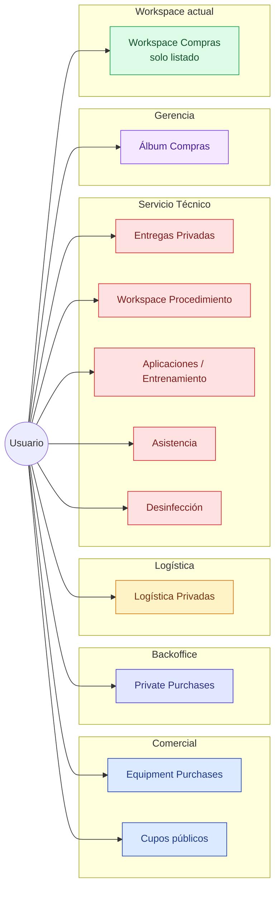

### ✅ PROPUESTA — workspace unificado con flujo operativo completo

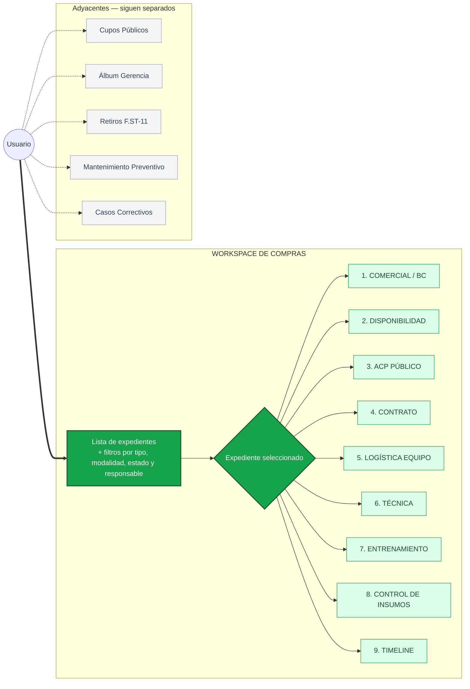

---

## 2. Clasificación correcta de solicitudes

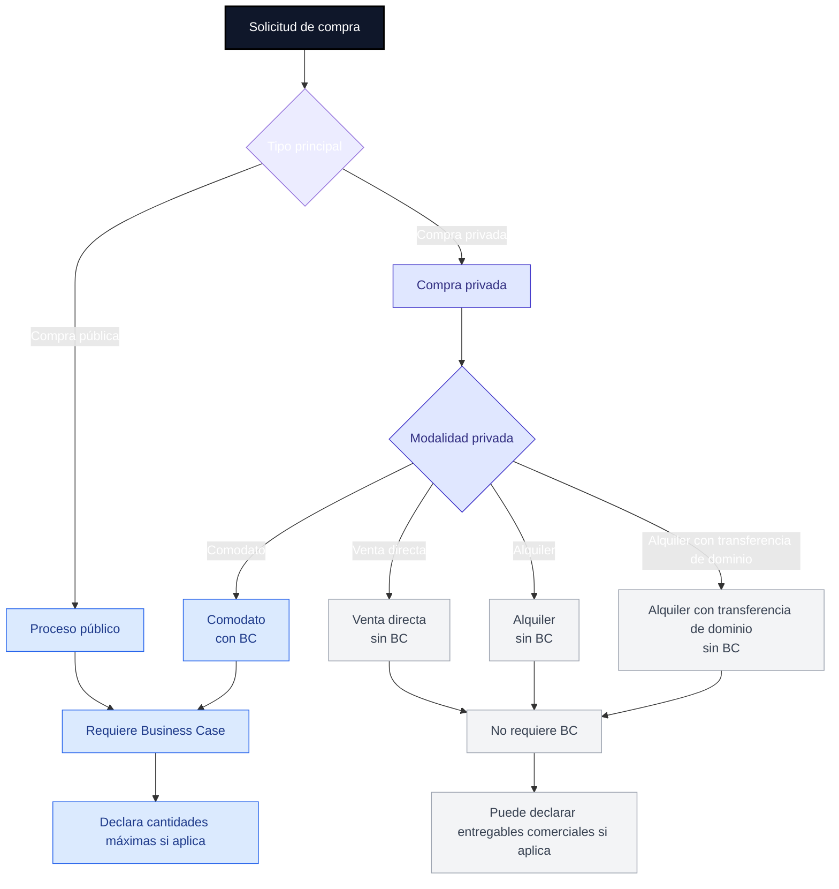

---

## 3. Anatomía del expediente unificado

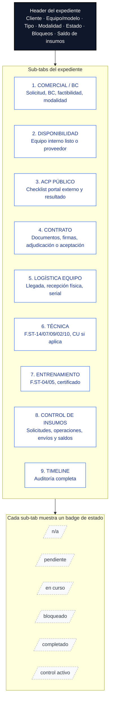

---

## 4. Flujo end-to-end corregido

```mermaid
flowchart TD
    Start([Inicio: solicitud de compra]) --> Tipo{Tipo principal}

    Tipo -->|Compra pública| Pub[Compra pública]
    Tipo -->|Compra privada| Priv[Compra privada]

    Priv --> Modalidad{Modalidad privada}
    Modalidad -->|Venta directa| VD[Venta directa]
    Modalidad -->|Alquiler| ALQ[Alquiler]
    Modalidad -->|Alquiler con transferencia de dominio| ATD[Alquiler con transferencia de dominio]
    Modalidad -->|Comodato| COM[Comodato]

    Pub --> BCPub[Business Case público]
    COM --> BCCom[Business Case comodato]

    VD --> SinBC[Omitir BC]
    ALQ --> SinBC
    ATD --> SinBC

    BCPub --> DatosBC[Completar datos del BC]
    BCCom --> DatosBC

    DatosBC --> CantMax[Declarar cantidades máximas<br/>reactivos, controles, calibradores y materiales]
    CantMax --> Factibilidad[Evaluar factibilidad]

    Factibilidad --> Factible{¿Factible?}
    Factible -->|No| NoFactible[Devolver, ajustar o cancelar solicitud]
    Factible -->|Sí| TipoPostFact{Tipo de expediente}

    TipoPostFact -->|Compra pública| DecisionParticipar[Decisión formal de participar]
    TipoPostFact -->|Comodato| DispComodato[Revisar disponibilidad del equipo]

    DecisionParticipar -->|No participar| NoParticipa[Expediente no participado]
    DecisionParticipar -->|Participar| AsignarACP[Jefe comercial asigna ACP Comercial]

    AsignarACP --> DispPublica[ACP revisa disponibilidad del equipo]
    SinBC --> DispPrivada[Revisar disponibilidad del equipo]

    DispPublica --> Disponibilidad[Disponibilidad común]
    DispComodato --> Disponibilidad
    DispPrivada --> Disponibilidad

    Disponibilidad --> EquipoDisponible{¿Equipo interno disponible y listo?}

    EquipoDisponible -->|Sí| DisponibilidadInterna[Registrar disponibilidad interna]
    EquipoDisponible -->|No| SolicitarProveedor[Solicitar disponibilidad a proveedor]

    SolicitarProveedor --> ProveedorConfirma{¿Proveedor confirma disponibilidad?}
    ProveedorConfirma -->|No| Alternativa[Buscar alternativa o devolver expediente]
    ProveedorConfirma -->|Sí| DisponibilidadProveedor[Registrar disponibilidad proveedor]

    DisponibilidadInterna --> Continuidad{Continuidad según tipo}
    DisponibilidadProveedor --> Continuidad

    Continuidad -->|Compra pública| ChecklistPortal[ACP gestiona checklist del portal externo]
    Continuidad -->|Compra privada| OfertaPrivada[Oferta, proforma, aprobación o contrato]

    ChecklistPortal --> ResultadoACP{ACP declara resultado}
    ResultadoACP -->|Perdido| NoAdjudicado[Expediente no adjudicado]
    ResultadoACP -->|Desierto / cancelado| SinAdjudicacion[Expediente sin adjudicación]
    ResultadoACP -->|Ganado| Contrato[Contrato / documentación]

    OfertaPrivada --> Aceptacion{¿Cliente acepta o se aprueba?}
    Aceptacion -->|No| NoAceptado[Expediente no aceptado]
    Aceptacion -->|Sí| Contrato

    Contrato --> LogEquipo[Logística del equipo]
    LogEquipo --> Recepcion[Recepción física del equipo]
    Recepcion --> Serial[Registrar número de serie]
    Serial --> Unidad[Crear o activar unidad física]

    Unidad --> Tecnica[Técnica]
    Tecnica --> Entrenamiento[Entrenamiento]

    Entrenamiento --> ControlOrigen{¿Existe control de cantidades?}

    ControlOrigen -->|Pública o comodato| ControlBC[Activar control de máximos del BC]
    ControlOrigen -->|Venta directa / alquiler / alquiler TD con entregables| ControlEntregables[Controlar entregables comerciales]
    ControlOrigen -->|No aplica| FinOperativo[Fin operativo principal]

    ControlBC --> ControlActivo[Expediente queda en control operativo]
    ControlEntregables --> ControlActivo

    classDef start fill:#0F172A,color:#FFFFFF,stroke:#000
    classDef finish fill:#16A34A,color:#FFFFFF,stroke:#14532D,stroke-width:2px
    classDef branch fill:#FEF3C7,stroke:#D97706,color:#78350F
    classDef block fill:#FEE2E2,stroke:#DC2626,color:#7F1D1D
    classDef phase fill:#DBEAFE,stroke:#2563EB,color:#1E3A8A
    classDef control fill:#DCFCE7,stroke:#16A34A,color:#14532D

    class Start start
    class Tipo,Modalidad,Factible,TipoPostFact,DecisionParticipar,EquipoDisponible,ProveedorConfirma,Continuidad,ResultadoACP,Aceptacion,ControlOrigen branch
    class NoFactible,NoParticipa,Alternativa,NoAdjudicado,SinAdjudicacion,NoAceptado block
    class Pub,Priv,VD,ALQ,ATD,COM,BCPub,BCCom,DatosBC,CantMax,Factibilidad,AsignarACP,DispPublica,DispPrivada,Disponibilidad,DisponibilidadInterna,SolicitarProveedor,DisponibilidadProveedor,ChecklistPortal,OfertaPrivada,Contrato,LogEquipo,Recepcion,Serial,Unidad,Tecnica,Entrenamiento phase
    class ControlBC,ControlEntregables,ControlActivo,FinOperativo finish
```

---

## 5. Flujo específico de compra pública

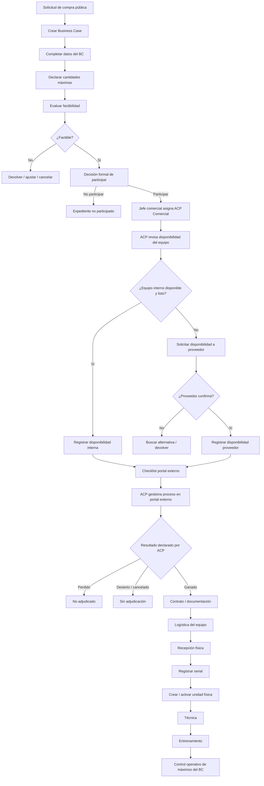

### Regla para ACP Comercial

ACP Comercial trabaja el proceso en el portal externo, pero FamSPI solo registra:

- checklist de seguimiento;
- fechas clave;
- evidencias;
- disponibilidad interna o proveedor;
- resultado declarado por ACP:
  - ganado;
  - perdido;
  - desierto;
  - cancelado.

FamSPI no debe intentar replicar la operación completa del portal de compras públicas.

---

## 6. Flujo específico de compra privada

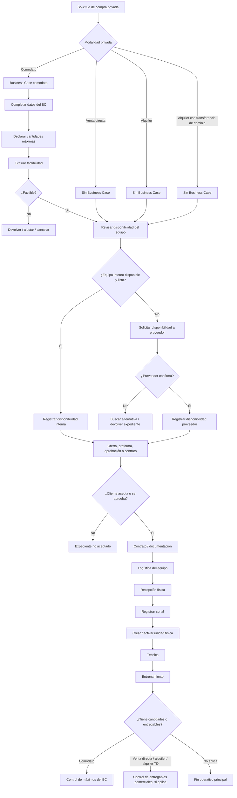

---

## 7. Revisión de disponibilidad del equipo

La disponibilidad se revisa en todos los tipos de expediente.

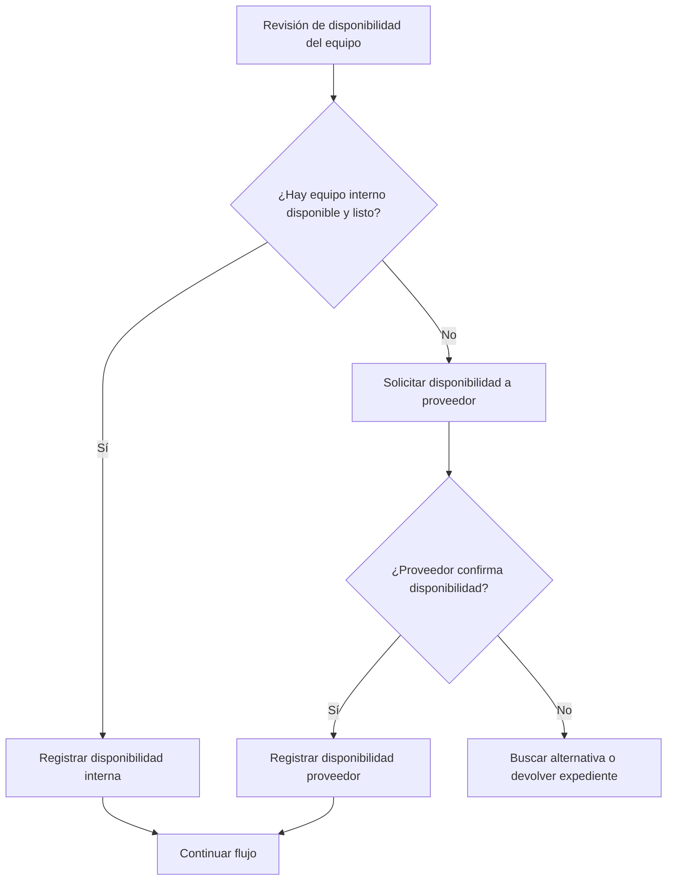

### Reglas

- Solo deben listarse como disponibles los equipos internos que estén listos.
- No existe estado de disponibilidad interna condicionada.
- Si un equipo no está listo, no aparece como disponible.
- Si no hay disponibilidad interna lista, se solicita disponibilidad al proveedor.
- Aunque exista disponibilidad confirmada, el serial no se registra todavía.
- El serial solo se registra en recepción física.

### Filtro recomendado para disponibilidad interna

```text
status = available
ready_for_assignment = true
reserved = false
```

---

## 8. Registro de serial y unidad física

El número de serie pertenece a la **unidad física**, no al modelo ni al BC.

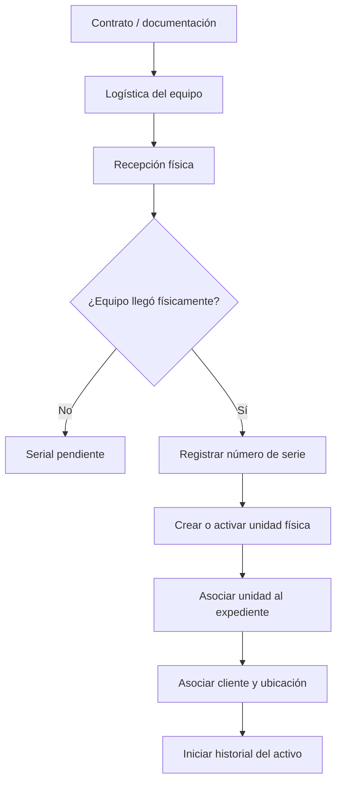

### Reglas

- No se registra serial al crear solicitud.
- No se registra serial en el Business Case.
- No se registra serial en disponibilidad.
- El serial se captura solo en recepción física.
- La unidad física se crea o activa cuando existe equipo real recibido.
- Si el equipo ya existía internamente, se asocia la unidad existente al expediente.

---

## 9. Control de máximos del BC y entregables comerciales

### 9.1 Origen de cantidades

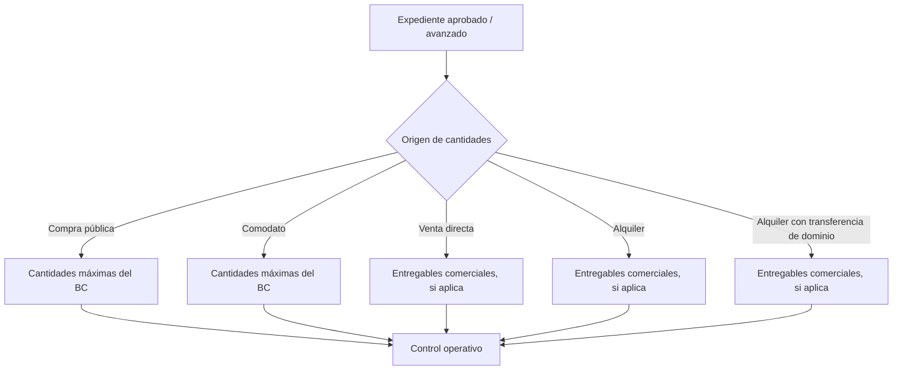

### 9.2 Flujo de control operativo

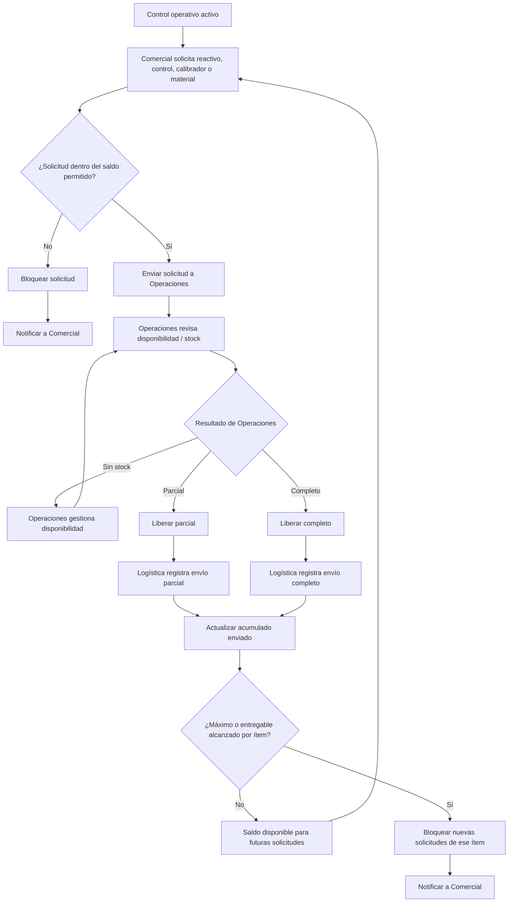

### 9.3 Fórmulas de control

```text
Saldo real pendiente = Cantidad máxima aprobada - Total enviado por Logística
```

```text
Saldo solicitables = Cantidad máxima aprobada - Total enviado por Logística - Solicitudes abiertas pendientes
```

Para venta directa, alquiler y alquiler con transferencia de dominio:

```text
Saldo real pendiente = Cantidad comprometida en entregable comercial - Total enviado por Logística
```

### 9.4 Fuente de verdad

| Dato | Fuente de verdad |
|---|---|
| Cantidad máxima de compra pública | BC aprobado |
| Cantidad máxima de comodato | BC aprobado |
| Cantidad comprometida en venta directa, alquiler o alquiler TD | Entregable comercial / oferta / contrato |
| Solicitud de entrega | Comercial |
| Revisión de disponibilidad / stock | Operaciones |
| Cantidad realmente enviada | Logística |
| Saldo restante | Cálculo FamSPI |
| Bloqueo por máximo alcanzado | Sistema |
| Notificación por máximo alcanzado | Sistema |

---

## 10. Estados recomendados del expediente

| Estado | Aplica a | Descripción |
|---|---|---|
| `request_created` | Todos | Solicitud creada |
| `bc_in_progress` | Pública / comodato | BC en elaboración |
| `bc_completed` | Pública / comodato | BC lleno con cantidades máximas |
| `feasibility_review` | Pública / comodato | Factibilidad en revisión |
| `not_feasible` | Pública / comodato | No factible |
| `feasible` | Pública / comodato | Factible |
| `public_participation_decision` | Pública | Esperando decisión de participar |
| `public_not_participated` | Pública | Se decidió no participar |
| `public_acp_assigned` | Pública | ACP asignado |
| `availability_review` | Todos | Revisión de disponibilidad del equipo |
| `supplier_availability_requested` | Todos | Se solicitó disponibilidad al proveedor |
| `availability_confirmed` | Todos | Disponibilidad confirmada |
| `public_process_tracking` | Pública | Checklist del portal externo |
| `public_won` | Pública | ACP declaró proceso ganado |
| `public_lost` | Pública | ACP declaró proceso perdido |
| `public_deserted_cancelled` | Pública | Proceso desierto o cancelado |
| `private_offer_process` | Privada | Oferta, proforma o aprobación |
| `private_not_accepted` | Privada | Cliente no acepta o no se aprueba |
| `contract_process` | Todos los que avanzan | Contrato / documentación |
| `equipment_logistics` | Todos los que avanzan | Logística del equipo |
| `equipment_received` | Todos los que avanzan | Equipo recibido |
| `unit_created` | Todos los que avanzan | Unidad física asociada con serial |
| `technical_process` | Todos los que avanzan | Técnica en proceso |
| `training_process` | Todos los que avanzan | Entrenamiento en proceso |
| `supply_control_active` | Con cantidades | Control de máximos o entregables activo |
| `supply_control_completed` | Con cantidades | Todas las cantidades fueron enviadas |
| `archived` | Todos | Archivado histórico |

---

## 11. Estados recomendados por ítem de insumo

| Estado | Descripción |
|---|---|
| `available_to_request` | Comercial puede solicitar |
| `requested_by_commercial` | Comercial generó solicitud |
| `operations_review` | Operaciones revisa disponibilidad |
| `pending_stock` | Falta disponibilidad |
| `ready_for_dispatch` | Listo para envío |
| `partial_dispatched` | Logística envió una parte |
| `full_dispatched` | Logística envió la solicitud completa |
| `max_partially_consumed` | Aún queda saldo disponible |
| `max_reached` | Máximo o entregable alcanzado |
| `blocked_by_max` | Ya no se permite solicitar más de ese ítem |
| `cancelled` | Ítem cancelado o no aplica |

---

## 12. Visibilidad por rol — todos ven todo, las acciones se gatean

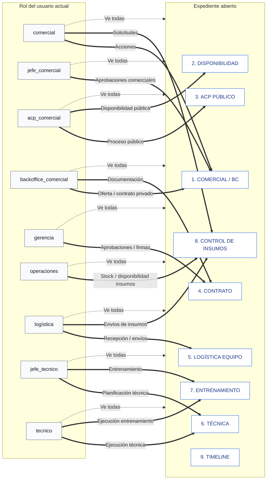

> Línea punteada = visibilidad.  
> Línea sólida = acciones permitidas.

---

## 13. Reglas por sub-tab

| Sub-tab | Regla principal |
|---|---|
| Comercial / BC | Muestra BC solo si es compra pública o comodato. Venta directa, alquiler y alquiler TD no muestran BC. |
| Disponibilidad | Aplica a todos los tipos. Solo lista equipos internos disponibles y listos. Si no hay, se solicita proveedor. |
| ACP Público | Solo visible/accionable para compra pública. Registra checklist externo y resultado ACP. |
| Contrato | Se habilita si pública = ganado, o privada = aceptada/aprobada. |
| Logística Equipo | Registra llegada del equipo, recepción física, serial y unidad física. |
| Técnica | Gestiona F.ST-14, F.ST-07, F.ST-09, CU si aplica, F.ST-02 y F.ST-10. |
| Entrenamiento | Gestiona F.ST-04, F.ST-05, conformidad y certificado. |
| Control de Insumos | Controla máximos del BC o entregables comerciales. Logística es fuente de verdad del enviado. |
| Timeline | Registra auditoría de estados, documentos, solicitudes, envíos, serial y cambios. |

---

## 14. Plan de migración — orden de ejecución actualizado

```mermaid
flowchart TB
    Start([Estado actual])

    Start --> P1

    subgraph Fase1["FASE 1 — Limpieza"]
        P1[CHG-01<br/>Borrar duplicados puros]
        P1 --> P2[CHG-02<br/>Limpiar navbar]
    end

    P2 --> P3

    subgraph Fase2["FASE 2 — Estructura del workspace"]
        P3[Crear scaffold<br/>workspace unificado]
        P3 --> P4[Crear sub-tabs corregidas]
        P4 --> P5[Crear Timeline unificado]
    end

    P5 --> P6

    subgraph Fase3["FASE 3 — Clasificación y reglas"]
        P6[Agregar purchase_type<br/>public / private]
        P6 --> P7[Agregar private_modality<br/>direct_sale / rental / rental_with_domain_transfer / comodato]
        P7 --> P8[Reglas requires_business_case<br/>y requires_participation_decision]
    end

    P8 --> P9

    subgraph Fase4["FASE 4 — Flujos principales"]
        P9[Migrar compra pública<br/>BC + decisión + ACP]
        P9 --> P10[Migrar compra privada<br/>modalidades internas]
        P10 --> P11[Crear disponibilidad común]
    end

    P11 --> P12

    subgraph Fase5["FASE 5 — Post-adjudicación / post-aceptación"]
        P12[Conectar contrato]
        P12 --> P13[Conectar logística equipo]
        P13 --> P14[Recepción física + serial + unidad]
        P14 --> P15[Técnica + entrenamiento]
    end

    P15 --> P16

    subgraph Fase6["FASE 6 — Control operativo"]
        P16[Crear control de máximos del BC]
        P16 --> P17[Crear control de entregables comerciales]
        P17 --> P18[Solicitudes comercial → operaciones → logística]
        P18 --> P19[Bloqueos por máximo alcanzado]
    end

    P19 --> End([Workspace alineado y operativo])

    classDef phase1 fill:#FEF3C7,stroke:#D97706,color:#78350F
    classDef phase2 fill:#DBEAFE,stroke:#2563EB,color:#1E3A8A
    classDef phase3 fill:#E0E7FF,stroke:#4338CA,color:#312E81
    classDef phase4 fill:#F3E8FF,stroke:#7C3AED,color:#4C1D95
    classDef phase5 fill:#FEE2E2,stroke:#DC2626,color:#7F1D1D
    classDef phase6 fill:#DCFCE7,stroke:#16A34A,color:#14532D
    classDef finish fill:#16A34A,color:#FFFFFF,stroke:#14532D,stroke-width:2px

    class P1,P2 phase1
    class P3,P4,P5 phase2
    class P6,P7,P8 phase3
    class P9,P10,P11 phase4
    class P12,P13,P14,P15 phase5
    class P16,P17,P18,P19 phase6
    class End finish
```

---

## 15. Estructura sugerida de archivos frontend

```text
spi_front/src/modules/
├── shared/
│   └── purchases-workspace/
│       ├── pages/
│       │   └── PurchasesWorkspacePage.jsx
│       ├── components/
│       │   ├── PurchaseHeader.jsx
│       │   ├── TabBadge.jsx
│       │   ├── RoleGatedAction.jsx
│       │   ├── BlockerAlert.jsx
│       │   └── PurchaseStatusSummary.jsx
│       ├── tabs/
│       │   ├── commercial/
│       │   │   ├── CommercialTab.jsx
│       │   │   ├── BusinessCaseSection.jsx
│       │   │   ├── FeasibilitySection.jsx
│       │   │   ├── PrivateModalitySection.jsx
│       │   │   └── CommercialDeliverablesSection.jsx
│       │   ├── availability/
│       │   │   ├── AvailabilityTab.jsx
│       │   │   ├── InternalAvailableUnits.jsx
│       │   │   └── SupplierAvailabilityRequest.jsx
│       │   ├── public-acp/
│       │   │   ├── PublicAcpTab.jsx
│       │   │   ├── ExternalPortalChecklist.jsx
│       │   │   └── PublicResultDeclaration.jsx
│       │   ├── contract/
│       │   │   ├── ContractTab.jsx
│       │   │   └── DocumentGateChecklist.jsx
│       │   ├── equipment-logistics/
│       │   │   ├── EquipmentLogisticsTab.jsx
│       │   │   ├── EquipmentReceptionSection.jsx
│       │   │   └── SerialAndUnitSection.jsx
│       │   ├── technical/
│       │   │   ├── TechnicalTab.jsx
│       │   │   ├── SiteInspectionSection.jsx
│       │   │   ├── VerificationSection.jsx
│       │   │   ├── CUFlowSection.jsx
│       │   │   └── DeliveryActSection.jsx
│       │   ├── training/
│       │   │   ├── TrainingTab.jsx
│       │   │   ├── TrainingPlanSection.jsx
│       │   │   ├── AttendanceSection.jsx
│       │   │   └── CertificateSection.jsx
│       │   ├── supply-control/
│       │   │   ├── SupplyControlTab.jsx
│       │   │   ├── SupplyMatrix.jsx
│       │   │   ├── CommercialSupplyRequest.jsx
│       │   │   ├── OperationsStockReview.jsx
│       │   │   └── LogisticsDispatchRegister.jsx
│       │   └── timeline/
│       │       ├── TimelineTab.jsx
│       │       ├── AuditTimeline.jsx
│       │       └── BlockersPanel.jsx
│       ├── hooks/
│       │   ├── usePurchaseList.js
│       │   ├── usePurchaseDetail.js
│       │   ├── usePurchaseActions.js
│       │   └── useSupplyControl.js
│       └── api/
│           └── purchasesWorkspaceApi.js
```

---

## 16. Campos mínimos recomendados para backend

```text
purchase_type:
  public
  private

private_modality:
  direct_sale
  rental
  rental_with_domain_transfer
  comodato
  null si purchase_type = public

requires_business_case:
  true si purchase_type = public
  true si private_modality = comodato
  false en los demás casos

requires_participation_decision:
  true solo si purchase_type = public

requires_availability_review:
  true para todos los expedientes

availability_source:
  internal
  supplier
  null

availability_status:
  not_checked
  internal_available_ready
  supplier_requested
  supplier_confirmed
  supplier_rejected
  alternative_required
  availability_confirmed

serial_status:
  not_applicable_yet
  pending_reception
  received_pending_serial
  serial_registered

supply_control_type:
  bc_maximums
  commercial_deliverables
  none
```

---

## 17. Comparación final de superficie de UI

```mermaid
flowchart LR
    subgraph Antes["HOY"]
        direction TB
        H1["11 rutas distintas"]
        H2["Compra pública y privada separadas"]
        H3["Compra privada sin modalidades claras"]
        H4["BC mezclado con flujos que no lo requieren"]
        H5["Disponibilidad ambigua"]
        H6["Serial no claramente ligado a recepción física"]
        H7["Cierre antes de controlar máximos"]
    end

    subgraph Despues["PROPUESTA ALINEADA"]
        direction TB
        D1["1 workspace principal"]
        D2["Compra pública vs compra privada"]
        D3["4 modalidades privadas"]
        D4["BC solo para pública y comodato"]
        D5["Disponibilidad simple: interno listo o proveedor"]
        D6["Serial solo en recepción física"]
        D7["Control operativo hasta cumplir máximos o entregables"]
    end

    Antes ==>|migración| Despues

    classDef bad fill:#FEE2E2,stroke:#DC2626,color:#7F1D1D
    classDef good fill:#DCFCE7,stroke:#16A34A,color:#14532D

    class H1,H2,H3,H4,H5,H6,H7 bad
    class D1,D2,D3,D4,D5,D6,D7 good
```

---

## 18. Resumen ejecutivo

> **Una ruta principal. Compra pública y compra privada claramente separadas. Compra privada con cuatro modalidades. BC solo para compra pública y comodato. Decisión de participar solo para compra pública. Disponibilidad obligatoria para todos los tipos, sin estados condicionados. Serial solo en recepción física. Control operativo activo hasta que Logística registre el envío de todos los máximos del BC o entregables comerciales comprometidos.**

---

*Última actualización: 2026-05-12.*
