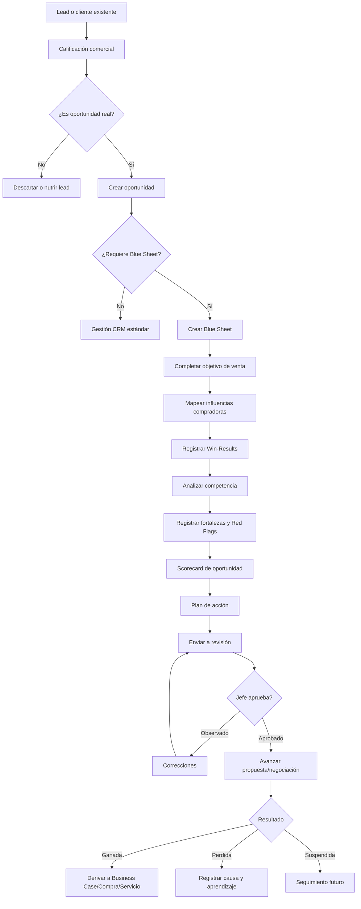
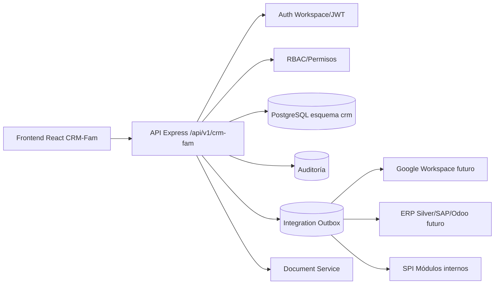
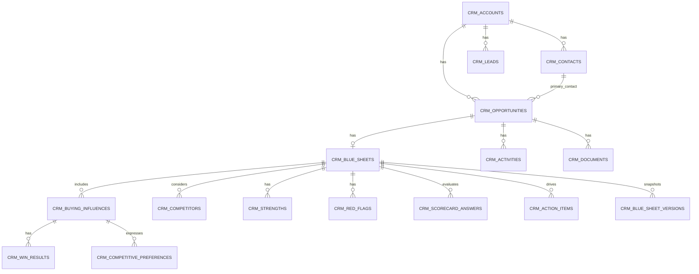

# CRM-Fam — Documento de diseño y levantamiento de requerimientos

**Módulo:** CRM-Fam  
**Enfoque:** CRM interno con integración completa de análisis estratégico tipo Blue Sheet Miller Heiman  
**Proyecto:** SPI Fam / Sistema de Procesos Internos de FAM  
**Stack objetivo:** React + Node.js/Express + PostgreSQL + Google Workspace OAuth/JWT  
**Versión del documento:** 1.0  
**Fecha:** 2026-06-27  
**Autor del levantamiento:** Rafael Ortiz / Área TICs  

---

## 0.1 Nota de alineación con código real (revisión 2026-06-27)

Este documento fue auditado contra el código fuente actual de SPI Fam. Se documentan aquí todas las correcciones aplicadas para eliminar alucinaciones o asunciones incorrectas. Los cambios están aplicados en las secciones correspondientes.

### Roles que NO existen en el sistema y su mapeo real

| Rol en versión original | Estado | Mapeo correcto en código real |
|---|---|---|
| `super_admin` | **No existe** | `jefe_ti` es el administrador real; `admin`/`administrador` bypasean todo a nivel middleware |
| `admin_crm` | **No existe** | `jefe_ti` / `jefe_de_ti` como administrador operativo del CRM-Fam |
| `gerente_comercial` | **No existe** | Grupo `gerencia`: `gerencia`, `gerencia_general`, `gerente_general`, `director`, `gerente` |
| `tecnico_preventa` | **No existe** | `tecnico` / `ing_servicio` / `esp_app` para soporte técnico |
| `visualizador` | **No existe** | Sin equivalente. Acceso por visibilidad de registro |
| `auditor` | **No existe** | `jefe_ti` o `gerencia` para acceso a auditoría |

> **Nota crítica sobre administración:** El rol `administrador`/`admin` **no está asignado a usuarios reales** en producción — es un rol de sistema/emergencia. El administrador real del CRM-Fam es el usuario con rol `jefe_ti` (alias: `jefe_de_ti`). Todas las funciones de configuración (catálogos, etapas, criterios de scorecard, reglas) deben estar disponibles para `jefe_ti`, no solo para `administrador`.

**Roles que SÍ existen y son relevantes para CRM-Fam** (de `backend/src/middlewares/roles.js`):
- **Admin operativo:** `jefe_ti`, `jefe_de_ti`
- **Comercial:** `comercial`, `jefe_comercial` (alias: `jefe_de_comercial`), `asesor_comercial`, `analista_comercial`, `acp_comercial`, `backoffice_comercial`, `backoffice`
- **Gerencia:** `gerencia`, `gerencia_general`, `gerente_general`, `director`, `gerente`
- **Técnico:** `servicio_tecnico`, `tecnico`, `ing_servicio`, `esp_app`
- **Finanzas:** `finanzas`, `financiero`, `jefe_finanzas`, `contador`
- **Calidad:** `calidad`
- **Sistema (bypass):** `admin`, `administrador`

### IDs de usuario: integer, no uuid

La tabla `users` del sistema usa `SERIAL PRIMARY KEY` (integer), **no UUID**. Todos los campos de FK a usuarios en el DDL de este documento (`owner_user_id`, `created_by`, `updated_by`, `deleted_by`, `submitted_by`, `reviewed_by`, `approved_by`, `accepted_by`, etc.) deben ser `integer null`, no `uuid null`. Las FK deben referenciar `public.users(id)`.

### Módulo `opportunities` existente

Ya existe `backend/src/modules/opportunities/` con un servicio que gestiona cuentas, y sincroniza con un CRM externo (EspoCRM) vía `backend/src/modules/integrations/crm.service.js` y el outbox. Este módulo es lightweight y sirve como puente entre Business Cases, compras privadas, compras de equipos y el CRM externo. **CRM-Fam no reemplaza este módulo directamente** — es un sistema paralelo más rico en el esquema `crm`. Durante la implementación, definir si el módulo `opportunities` existente se migra, se depreca o coexiste.

### Integración CRM existente (EspoCRM)

El sistema ya tiene:
- `backend/src/modules/integrations/crmWebhook.routes.js` → `/api/v1/integrations/crm/webhook`
- `backend/src/modules/integrations/integrationOutboxWorker.service.js`
- `backend/migrations/201_crm_sync_tracking.sql` → columnas `crm_contact_id`, `crm_synced_at` en tabla `clients`

CRM-Fam es un módulo **interno nuevo** en esquema `crm`. No interfiere con la sincronización EspoCRM existente, pero en Fase 5 (Integraciones) se debe evaluar si mantener el doble track o migrar.

### Arquitectura backend real

El sistema NO usa capas `repositories`, `validators`, `policies`, `auditors`, `calculators`. El patrón real es: `routes → controller → service` (SQL raw con `pg` pool). La auditoría global es `auditMiddleware` que escribe a `auditoria.logs`. Para CRM-Fam: seguir el mismo patrón, sin agregar capas extras.

### Rutas frontend reales

Todas las rutas privadas del frontend están bajo `/dashboard/`. Las rutas CRM-Fam deben ser `/dashboard/crm-fam/*`, no `/crm-fam/*`.

### Nombres de módulos SPI reales

| Nombre en documento original | Nombre/ruta real |
|---|---|
| "Servicio técnico" | Módulo `servicio`, ruta `/api/v1/servicio` |
| "Private Purchases" | Módulo `private-purchases`, ruta `/api/v1/private-purchases` |
| "Equipment Purchases" | Módulo `equipment-purchases`, ruta `/api/v1/equipment-purchases` |
| "Business Case" | Módulo `business-case`, ruta `/api/v1/business-case` |
| "Collab Deliveries" | Módulo `collab-deliveries`, ruta `/api/v1/collab-deliveries` |

### Estructura frontend real

El patrón del proyecto es:
- Páginas: `spi_front/src/modules/<nombre>/pages/`
- Componentes: `spi_front/src/modules/<nombre>/components/`
- API: `spi_front/src/core/api/<nombre>Api.js`
- Hooks: `spi_front/src/modules/<nombre>/hooks/`
- No existe capa `stores/` (estado via TanStack Query + React context)

---

## 0. Nota de uso y alcance legal/metodológico

Este documento diseña un módulo propio llamado **CRM-Fam**, inspirado en conceptos públicos de la metodología **Miller Heiman Strategic Selling / Blue Sheet**, tales como planificación estratégica de oportunidades, múltiples influencias compradoras, Win-Results, Competitive Preference, Red Flags, fortalezas, scorecard de oportunidad y plan de acción.

El objetivo **no es copiar una plantilla oficial propietaria** ni reproducir material licenciado de Korn Ferry/Miller Heiman. El objetivo es construir un CRM interno con un modelo de datos y flujos funcionales que permitan aplicar esos principios de análisis comercial de forma estructurada dentro de SPI Fam.

El módulo CRM-Fam debe funcionar como CRM operativo y, al mismo tiempo, como herramienta de venta estratégica. Por eso no debe limitarse a registrar clientes, contactos y oportunidades; debe obligar al usuario comercial a analizar la oportunidad antes de pasar a propuesta, negociación o cierre.

---

## 1. Objetivo general

Diseñar e implementar el módulo **CRM-Fam**, integrado al ecosistema SPI Fam, para gestionar clientes, contactos, leads, oportunidades, actividades comerciales, documentos, tareas y seguimiento de ventas, incorporando un flujo completo de análisis Blue Sheet para ventas complejas.

El módulo debe permitir:

1. Registrar y administrar clientes actuales y potenciales sin la necesidad de seguir la solicitud de creacion de clientes ya que son de tipo prospectos en alguna etapa deben pasar a realizar el proceso de solicitud de clientes.
2. Registrar contactos asociados a cada cliente o prospecto.
3. Gestionar leads y convertirlos en oportunidades.
4. Gestionar oportunidades comerciales con embudo, etapas, valores, responsables y probabilidad.
5. Crear un **Blue Sheet** por oportunidad cuando corresponda.
6. Identificar influencias compradoras: comprador económico, usuario comprador, comprador técnico y coach.
7. Registrar Win-Results por actor de decisión.
8. Registrar preferencias competitivas por actor y competidor.
9. Registrar fortalezas, Red Flags, riesgos, acciones correctivas y estrategia comercial.
10. Calcular salud de oportunidad mediante scorecard y completitud del Blue Sheet.
11. Bloquear o advertir avances comerciales cuando falte información crítica.
12. Facilitar revisión por jefe comercial o gerencia.
13. Mantener trazabilidad, auditoría y control por roles.
14. Integrarse con Google Workspace, módulos Business Case, compras privadas/públicas, servicio técnico y documentos internos.

---

## 2. Objetivos específicos

### 2.1 Objetivos comerciales

- Evitar que las oportunidades se manejen solo por intuición del vendedor.
- Estandarizar la forma en que los comerciales analizan oportunidades complejas.
- Aumentar la visibilidad de gerencia sobre el estado real del pipeline.
- Identificar temprano oportunidades débiles, riesgosas o sin decisor económico.
- Reducir pérdidas por falta de seguimiento, falta de información o desconocimiento del proceso de compra del cliente.
- Priorizar oportunidades con mejor probabilidad, rentabilidad y viabilidad operativa.

### 2.2 Objetivos técnicos

- Crear un módulo desacoplado, mantenible y escalable.
- Mantener consistencia con arquitectura existente: React, Express, PostgreSQL y `/api/v1`.
- Aplicar autenticación con Google Workspace OAuth y autorización por roles.
- Mantener auditoría completa de cambios sensibles.
- Usar PostgreSQL con esquema propio `crm`.
- Evitar acoplamiento fuerte con ERP externo.
- Permitir integraciones futuras mediante tablas outbox, APIs y sincronización controlada.

### 2.3 Objetivos de control y auditoría

- Registrar quién creó, modificó, revisó, aprobó, observó o cerró cada oportunidad.
- Registrar histórico de cambios del Blue Sheet.
- Guardar versiones cuando se envía a revisión o se aprueba.
- Registrar comentarios, observaciones y decisiones de jefatura.
- Mantener trazabilidad sobre avance de etapa, cambios de valor, pérdida, cierre y descuentos.

---

## 3. Alcance funcional del módulo CRM-Fam

### 3.1 Incluido en el alcance

El módulo CRM-Fam incluye:

- Dashboard CRM.
- Gestión de cuentas/clientes/prospectos.
- Gestión de contactos.
- Gestión de leads.
- Conversión de lead a cliente/contacto/oportunidad.
- Gestión de oportunidades.
- Embudos y etapas comerciales configurables.
- Actividades comerciales: llamadas, reuniones, correos, visitas, tareas, demostraciones y seguimientos.
- Gestión documental asociada a cliente y oportunidad.
- Gestión de productos/servicios referenciales.
- Blue Sheet integrado a oportunidad.
- Scorecard de oportunidad.
- Influencias compradoras.
- Win-Results.
- Preferencia competitiva.
- Competidores.
- Fortalezas y Red Flags.
- Plan de acción.
- Revisión y aprobación interna.
- Cierre ganado/perdido/suspendido.
- Reportes y KPIs.
- Auditoría y bitácora.
- Integración con Google Workspace y módulos SPI.
- Marketing creacion de campañas y gestion de prospectos obtenidos y asignar a colaborador comercial por area.
- Chatbot comercial.

### 3.2 Fuera del alcance inicial

No se incluye en la primera versión:

- Facturación electrónica.
- Inventario completo.
- Contabilidad.
- Cobranza avanzada.
- Reemplazo de sistemas de calidad, servicio técnico o inventario.
- IA predictiva obligatoria en primera fase.

### 3.3 Integraciones previstas obligatorias en fase 2

- Google Calendar para reuniones.
- Gmail para trazabilidad de correos comerciales.
- Google Drive para carpetas de oportunidad.
- Integracion con el Módulo Business Case de SPI Fam.
- Integracion con el Módulo compras privadas.
- Integracion con el Módulo compras públicas/equipment-purchases.
- Integracion con el Módulo servicio técnico.

---

## 4. Principios de diseño

1. **CRM con metodología, no solo registros:** cada oportunidad debe permitir análisis estratégico.
2. **La oportunidad es el centro:** Blue Sheet, actividades, documentos, competidores y acciones giran alrededor de la oportunidad.
3. **La metodología debe guiar al usuario:** el sistema debe mostrar alertas, faltantes y recomendaciones operativas.
4. **El dato debe ser auditable:** cambios críticos deben quedar registrados.
5. **No bloquear todo innecesariamente:** algunas validaciones deben ser advertencias y otras bloqueos reales.
6. **Configurabilidad:** umbrales, etapas, criterios de scorecard, motivos de pérdida y reglas deben ser configurables.
7. **Integración progresiva:** el CRM debe funcionar solo, pero preparado para integrarse con SPI/ERP/Workspace.
8. **Seguridad por rol:** no todos los usuarios pueden ver valores, márgenes, comentarios gerenciales o información sensible.
9. **Trazabilidad comercial:** cada actividad debe quedar asociada a cliente, contacto y oportunidad.
10. **Uso simple:** aunque el análisis sea avanzado, la interfaz debe ser clara y por pasos.

---

## 5. Glosario funcional

| Término | Definición dentro de CRM-Fam |
|---|---|
| CRM-Fam | Módulo CRM propio de SPI Fam, con Blue Sheet integrado. |
| Cuenta / Cliente | Empresa, institución, laboratorio, clínica, distribuidor o entidad con relación comercial. |
| Contacto | Persona natural asociada a una cuenta o lead. |
| Lead | Prospecto inicial no calificado. |
| Oportunidad | Posible negocio con valor, responsable, etapa, fecha estimada y cliente. |
| Pipeline | Embudo de ventas con etapas comerciales. |
| Blue Sheet | Análisis estratégico de una oportunidad compleja. |
| Single Sales Objective | Objetivo único y específico de venta para una oportunidad. |
| Buying Influence | Persona que influye en la decisión de compra. |
| Economic Buyer | Persona o comité que aprueba presupuesto o decisión económica. |
| User Buyer | Persona o grupo que usará la solución. |
| Technical Buyer | Persona o área que valida requisitos técnicos, legales, administrativos o de calidad. |
| Coach | Aliado interno que aporta información real y ayuda a avanzar la oportunidad. |
| Win-Result | Resultado que el cliente/actor espera ganar si la compra se realiza. |
| Competitive Preference | Preferencia del cliente o actor frente a nuestra empresa y competidores. |
| Red Flag | Alerta o riesgo que puede afectar la oportunidad. |
| Strength | Fortaleza aprovechable de la oportunidad. |
| Opportunity Scorecard | Evaluación ponderada de salud y viabilidad de la oportunidad. |
| Action Plan | Plan de acciones concretas para avanzar la oportunidad. |
| Deal Health | Salud de la oportunidad calculada por completitud, riesgos, scorecard y etapa. |
| Forecast | Proyección de cierre comercial por fecha, valor y probabilidad. |

---

## 6. Usuarios, roles y permisos

### 6.1 Roles funcionales

> **Corrección aplicada:** Roles alineados con los definidos en `backend/src/middlewares/roles.js`. Los roles `super_admin`, `admin_crm`, `gerente_comercial`, `tecnico_preventa`, `visualizador` y `auditor` no existen en el sistema y fueron eliminados. Ver Sección 0.1 para el mapeo completo.

| Rol (valor real en BD) | Descripción |
|---|---|
| `jefe_ti` / `jefe_de_ti` | **Administrador real del sistema CRM-Fam.** Rol asignado a usuarios reales de TI en producción. Gestiona configuración, catálogos, etapas, reglas y permisos del módulo. |
| `administrador` / `admin` | Bypasean todos los controles de rol a nivel middleware. No están asignados a usuarios reales en producción — son roles de sistema/emergencia. La administración operativa del CRM-Fam recae en `jefe_ti`. |
| `gerencia` / `gerencia_general` | Visualiza pipeline global, KPIs, oportunidades críticas, aprobaciones y reportes ejecutivos. Incluye aliases: `gerente_general`, `director`, `gerente`. |
| `jefe_comercial` | Revisa, observa y aprueba Blue Sheets; asigna oportunidades y da seguimiento. Alias en sistema: `jefe_de_comercial`. |
| `comercial` | Gestiona sus leads, clientes, contactos, oportunidades, actividades y Blue Sheets. |
| `asesor_comercial` / `analista_comercial` / `acp_comercial` | Roles comerciales con acceso equivalente al `comercial`. |
| `backoffice_comercial` / `backoffice` | Apoya documentación, cotizaciones, validación administrativa y actualización de datos. |
| `tecnico` / `ing_servicio` / `esp_app` / `servicio_tecnico` | Personal técnico. Consulta oportunidades ganadas que deriven en instalación, entrega o soporte. |
| `finanzas` | Consulta valores, condiciones, rentabilidad, formas de pago y validaciones financieras. Aliases: `financiero`, `jefe_finanzas`, `contador`. |
| `calidad` | Consulta oportunidades que requieran documentación regulatoria o validación de calidad. |

### 6.2 Matriz resumida de permisos

> **Corrección aplicada:** Columnas actualizadas con roles reales del sistema. `Gerente comercial`, `Técnico preventa` y `Admin CRM` no existen — reemplazados por `Gerencia` y `jefe_ti`. El rol `admin`/`administrador` no está asignado a usuarios reales; `jefe_ti` es el administrador operativo.

| Funcionalidad | `comercial` / `acp_comercial` | `jefe_comercial` | `gerencia` / `gerencia_general` | `backoffice_comercial` | `tecnico` / `servicio_tecnico` | `finanzas` | `jefe_ti` / `jefe_de_ti` |
|---|---:|---:|---:|---:|---:|---:|---:|
| Crear lead | Sí | Sí | No | Sí | No | No | Sí |
| Convertir lead | Sí | Sí | No | Sí | No | No | Sí |
| Crear cuenta | Sí | Sí | No | Sí | No | No | Sí |
| Editar cuenta propia | Sí | Sí | No | Sí | No | No | Sí |
| Ver todas las cuentas | No* | Sí | Sí | Sí | Parcial | Parcial | Sí |
| Crear oportunidad | Sí | Sí | No | Sí | No | No | Sí |
| Editar oportunidad propia | Sí | Sí | No | Sí | Parcial | Parcial | Sí |
| Reasignar oportunidad | No | Sí | Sí | No | No | No | Sí |
| Crear Blue Sheet | Sí | Sí | No | No | No | No | Sí |
| Editar Blue Sheet en borrador | Sí | Sí | No | Parcial | Parcial | Parcial | Sí |
| Enviar Blue Sheet a revisión | Sí | Sí | No | No | No | No | Sí |
| Aprobar/observar Blue Sheet | No | Sí | Sí | No | No | No | Sí |
| Cerrar oportunidad como ganada/perdida | Sí** | Sí | Sí | No | No | No | Sí |
| Ver margen/rentabilidad | No por defecto | Sí | Sí | No | No | Sí | Sí |
| Configurar catálogos | No | No | No | No | No | No | Sí |
| Ver auditoría | No | Parcial | Sí | No | No | No | Sí |

Notas:

- `No*`: el comercial puede ver cuentas propias, asignadas, compartidas o de su equipo si se configura.
- `Sí**`: el cierre por comercial puede requerir validación del jefe según monto, etapa o regla.

---

## 7. Reglas de visibilidad

### 7.1 Propiedad de registros

Todo registro comercial debe tener:

- `owner_user_id`: dueño principal.
- `created_by`: usuario creador.
- `updated_by`: último usuario editor.
- `assigned_team_id`: equipo comercial responsable, opcional.
- `visibility`: `private`, `team`, `department`, `company`.

### 7.2 Acceso por jerarquía

- Comercial ve registros propios y compartidos.
- Jefe comercial ve registros de su equipo.
- Gerente comercial ve todos los registros comerciales.
- Gerencia general ve reportes, oportunidades relevantes y detalle cuando corresponda.
- Auditor ve histórico y evidencia sin modificar.

### 7.3 Campos sensibles

Los siguientes campos deben tener control adicional:

- Margen estimado.
- Costo estimado.
- Descuento máximo autorizado.
- Rentabilidad proyectada.
- Comentarios gerenciales.
- Motivos internos de pérdida.
- Estrategia frente a competencia.
- Observaciones legales o de calidad.

---

## 8. Flujo general del CRM-Fam



---

## 9. Flujo específico de Blue Sheet

### 9.1 Condiciones para crear Blue Sheet

El sistema debe permitir crear Blue Sheet manualmente, pero también debe sugerirlo o exigirlo cuando se cumpla una o más reglas configurables:

| Regla | Tipo | Valor sugerido inicial |
|---|---|---|
| Valor de oportunidad mayor a umbral | Obligatorio | Configurable, ejemplo: USD 5.000 |
| Venta con más de un decisor | Obligatorio | Sí |
| Cliente institucional o corporativo | Recomendado/Obligatorio | Configurable |
| Compra pública | Obligatorio | Sí |
| Venta con competencia identificada | Recomendado | Sí |
| Venta con ciclo mayor a X días | Recomendado | 30 días |
| Requiere aprobación de gerencia | Obligatorio | Sí |
| Requiere Business Case | Obligatorio | Sí |
| Requiere preventa técnica | Recomendado | Sí |

### 9.2 Estados del Blue Sheet

| Estado | Descripción | Quién puede moverlo |
|---|---|---|
| `draft` | Borrador inicial, editable por comercial. | Comercial, jefe, admin |
| `in_progress` | En desarrollo, con secciones parcialmente completas. | Comercial, jefe, admin |
| `ready_for_review` | Enviado a revisión. Debe bloquear edición directa del comercial. | Comercial, jefe, admin |
| `observed` | Devuelto con observaciones. | Jefe, gerente, admin |
| `approved` | Aprobado para avanzar. | Jefe, gerente, gerencia, admin |
| `active` | Aprobado y en uso durante negociación. | Sistema/jefe/admin |
| `needs_update` | Requiere actualización por cambio importante. | Sistema/jefe/admin |
| `closed_won` | Cerrado por oportunidad ganada. | Sistema/admin |
| `closed_lost` | Cerrado por oportunidad perdida. | Sistema/admin |
| `cancelled` | Cancelado porque la oportunidad no continúa. | Jefe/admin |
| `archived` | Histórico no editable. | Admin |

### 9.3 Secciones del Blue Sheet

El Blue Sheet debe organizarse por secciones:

1. Datos generales de la oportunidad.
2. Objetivo único de venta.
3. Situación actual del cliente.
4. Proceso de compra del cliente.
5. Influencias compradoras.
6. Win-Results.
7. Competidores y preferencia competitiva.
8. Fortalezas.
9. Red Flags.
10. Opportunity Scorecard.
11. Estrategia comercial.
12. Plan de acción.
13. Revisión interna.
14. Historial y versiones.

---

## 10. Requerimientos funcionales

### 10.1 Módulo Dashboard CRM

#### RF-CRM-001 — Dashboard principal

El sistema debe mostrar un dashboard principal del CRM-Fam con:

- Total de leads abiertos.
- Total de oportunidades abiertas.
- Valor total de pipeline.
- Valor ponderado por probabilidad.
- Oportunidades con Blue Sheet pendiente.
- Oportunidades con Red Flags críticas.
- Oportunidades sin comprador económico identificado.
- Oportunidades próximas a fecha estimada de cierre.
- Actividades vencidas.
- Actividades del día.
- Top oportunidades por valor.
- Top oportunidades por riesgo.
- Forecast mensual/trimestral.
- Conversión lead → oportunidad.
- Conversión oportunidad → ganada.
- Motivos de pérdida.

#### RF-CRM-002 — Filtros del dashboard

El dashboard debe permitir filtrar por:

- Rango de fechas.
- Responsable comercial.
- Equipo.
- Sucursal o ciudad, si aplica.
- Tipo de cliente.
- Línea de negocio.
- Etapa de pipeline.
- Estado de Blue Sheet.
- Riesgo.
- Probabilidad.
- Valor.

#### RF-CRM-003 — Indicador de salud de oportunidades

Cada oportunidad debe mostrar un indicador visual de salud:

| Salud | Condición general |
|---|---|
| Verde | Buena completitud, riesgos controlados, próximos pasos definidos. |
| Amarillo | Información incompleta o riesgos medios. |
| Rojo | Riesgos críticos, falta comprador económico, acciones vencidas o score bajo. |
| Gris | Información insuficiente para calcular. |

---

### 10.2 Gestión de cuentas/clientes

#### RF-ACC-001 — Crear cuenta

El sistema debe permitir registrar cuentas con:

- Tipo de cuenta: prospecto, cliente, proveedor relacionado, institución, distribuidor, laboratorio, clínica, hospital, universidad, otro.
- Razón social.
- Nombre comercial.
- RUC/identificación tributaria.
- País.
- Provincia.
- Ciudad.
- Dirección.
- Teléfono.
- Correo general.
- Sitio web.
- Sector/industria.
- Tamaño de empresa.
- Estado comercial.
- Responsable comercial.
- Fuente de origen.
- Observaciones.

#### RF-ACC-002 — Validar duplicados

Al crear o editar una cuenta, el sistema debe validar posibles duplicados por:

- RUC.
- Razón social similar.
- Nombre comercial similar.
- Dominio de correo.
- Teléfono.

Si encuentra duplicados, debe advertir al usuario antes de guardar.

#### RF-ACC-003 — Perfil 360 de cuenta

La vista de cuenta debe mostrar:

- Datos generales.
- Contactos asociados.
- Leads asociados.
- Oportunidades abiertas.
- Oportunidades ganadas/perdidas.
- Actividades recientes.
- Documentos.
- Historial de cambios.
- Valor histórico vendido.
- Riesgos comerciales.
- Relación con otros módulos SPI.

#### RF-ACC-004 — Estado de cuenta

Estados permitidos:

- `prospect` — Prospecto.
- `active_customer` — Cliente activo.
- `inactive_customer` — Cliente inactivo.
- `strategic_account` — Cuenta estratégica.
- `blocked` — Cuenta bloqueada.
- `archived` — Archivada.

---

### 10.3 Gestión de contactos

#### RF-CON-001 — Crear contacto

El sistema debe permitir registrar contactos con:

- Nombres.
- Apellidos.
- Cargo.
- Área/departamento.
- Teléfono.
- Celular.
- Correo.
- Cuenta asociada.
- Ciudad.
- Canal preferido.
- Nivel de influencia.
- Estado.
- Observaciones.

#### RF-CON-002 — Contacto como influencia compradora

Un contacto puede ser marcado como influencia compradora dentro de una oportunidad/Blue Sheet.

Un mismo contacto puede tener roles distintos en oportunidades distintas.

Ejemplo:

- En oportunidad A puede ser usuario comprador.
- En oportunidad B puede ser coach.

#### RF-CON-003 — Historial de contacto

La vista de contacto debe mostrar:

- Cuenta asociada.
- Oportunidades relacionadas.
- Actividades realizadas.
- Participación como influencia compradora.
- Preferencias de comunicación.
- Notas comerciales.

---

### 10.4 Gestión de leads

#### RF-LEAD-001 — Crear lead

Campos mínimos:

- Nombre del lead.
- Empresa o institución.
- Persona de contacto.
- Correo.
- Teléfono.
- Fuente.
- Producto/servicio de interés.
- Descripción de necesidad.
- Responsable.
- Estado.
- Prioridad.

#### RF-LEAD-002 — Estados de lead

Estados:

- `new` — Nuevo.
- `contacted` — Contactado.
- `qualified` — Calificado.
- `unqualified` — No calificado.
- `converted` — Convertido.
- `nurturing` — En seguimiento futuro.
- `discarded` — Descartado.

#### RF-LEAD-003 — Conversión de lead

El sistema debe permitir convertir un lead en:

- Cuenta.
- Contacto.
- Oportunidad.

La conversión debe evitar duplicados y conservar trazabilidad del lead original.

---

### 10.5 Gestión de oportunidades

#### RF-OPP-001 — Crear oportunidad

Campos mínimos:

- Código de oportunidad.
- Nombre de oportunidad.
- Cuenta.
- Contacto principal.
- Responsable comercial.
- Equipo.
- Tipo de oportunidad.
- Línea de negocio.
- Producto/servicio principal.
- Valor estimado.
- Moneda.
- Fecha estimada de cierre.
- Probabilidad.
- Etapa.
- Fuente.
- Descripción de necesidad.
- Requiere Blue Sheet.
- Requiere Business Case.
- Requiere preventa técnica.
- Estado.

#### RF-OPP-002 — Código de oportunidad

El sistema debe generar código único:

Formato sugerido:

```text
CRM-OPP-YYYY-000001
```

Ejemplo:

```text
CRM-OPP-2026-000127
```

#### RF-OPP-003 — Etapas del pipeline

Etapas iniciales sugeridas:

| Orden | Código | Nombre | Probabilidad base |
|---:|---|---|---:|
| 1 | `prospecting` | Prospección | 5% |
| 2 | `qualification` | Calificación | 10% |
| 3 | `discovery` | Descubrimiento | 20% |
| 4 | `blue_sheet_analysis` | Análisis Blue Sheet | 30% |
| 5 | `technical_validation` | Validación técnica | 40% |
| 6 | `proposal` | Propuesta enviada | 50% |
| 7 | `negotiation` | Negociación | 65% |
| 8 | `approval` | Aprobación cliente | 80% |
| 9 | `won` | Ganada | 100% |
| 10 | `lost` | Perdida | 0% |
| 11 | `suspended` | Suspendida | 0% |
| 12 | `cancelled` | Cancelada | 0% |

Las etapas deben ser configurables por `admin` / `administrador`.

#### RF-OPP-004 — Cambio de etapa

Al cambiar etapa, el sistema debe:

- Registrar historial.
- Validar reglas de etapa.
- Pedir motivo si pasa a perdida, suspendida o cancelada.
- Verificar Blue Sheet si la etapa lo requiere.
- Verificar actividades abiertas.
- Verificar documentos obligatorios si aplica.

#### RF-OPP-005 — Reglas para avanzar a propuesta

Si `requires_blue_sheet = true`, no se debe permitir avanzar a `proposal` salvo que:

- Exista Blue Sheet.
- Blue Sheet esté `approved` o `active`.
- Exista objetivo único de venta.
- Exista al menos un comprador económico o una justificación formal de desconocimiento con acción asignada.
- Exista plan de acción con al menos una acción abierta o completada recientemente.
- Red Flags críticas tengan acción de mitigación.

El administrador puede configurar si la regla es bloqueo o advertencia.

#### RF-OPP-006 — Cierre ganado

Al cerrar como ganada, el sistema debe solicitar:

- Valor final ganado.
- Fecha real de cierre.
- Condiciones comerciales.
- Productos/servicios incluidos.
- Responsable de ejecución posterior.
- Requiere derivación a Business Case, compras, servicio técnico o documento contractual.
- Comentarios de cierre.

#### RF-OPP-007 — Cierre perdido

Al cerrar como perdida, el sistema debe solicitar:

- Motivo principal de pérdida.
- Competidor ganador, si se conoce.
- Valor perdido estimado.
- Comentarios.
- Lección aprendida.
- Si puede retomarse en el futuro.
- Fecha tentativa de recontacto, si aplica.

Motivos sugeridos:

- Precio.
- Competencia.
- Sin presupuesto.
- Sin decisión.
- Requisito técnico no cumplido.
- Tiempo de entrega.
- Relación con proveedor actual.
- Proceso cancelado por cliente.
- Documentación incompleta.
- Falta de seguimiento.
- Otro.

---

### 10.6 Blue Sheet — Datos generales

#### RF-BS-001 — Crear Blue Sheet desde oportunidad

El sistema debe permitir crear un Blue Sheet únicamente asociado a una oportunidad.

Relación:

```text
1 oportunidad → 0..1 Blue Sheet activo
1 Blue Sheet → muchas versiones históricas
```

No debe existir Blue Sheet sin oportunidad.

#### RF-BS-002 — Datos generales automáticos

Al crear Blue Sheet, debe copiar o referenciar:

- Oportunidad.
- Cuenta.
- Contacto principal.
- Responsable comercial.
- Valor estimado.
- Fecha estimada de cierre.
- Etapa actual.
- Línea de negocio.

Estos datos deben mantenerse sincronizados por referencia, no duplicarse sin necesidad. Si se guarda una versión, sí se debe congelar snapshot.

#### RF-BS-003 — Completitud del Blue Sheet

El sistema debe calcular porcentaje de completitud con base en secciones obligatorias:

| Sección | Peso sugerido |
|---|---:|
| Objetivo de venta | 10% |
| Situación del cliente | 10% |
| Proceso de compra | 10% |
| Influencias compradoras | 20% |
| Win-Results | 10% |
| Competencia | 10% |
| Fortalezas | 5% |
| Red Flags | 10% |
| Scorecard | 10% |
| Plan de acción | 5% |

Pesos configurables por administrador.

---

### 10.7 Blue Sheet — Objetivo único de venta

#### RF-BS-010 — Registrar objetivo único de venta

El sistema debe solicitar un objetivo específico, no genérico.

Campos:

- `sales_objective_summary` — Resumen del objetivo.
- `sales_objective_scope` — Alcance de la venta.
- `target_amount` — Valor objetivo.
- `target_close_date` — Fecha objetivo.
- `success_definition` — Cómo se define éxito.
- `customer_need_summary` — Necesidad principal del cliente.
- `business_impact` — Impacto esperado para el cliente.

#### RF-BS-011 — Validaciones del objetivo

El objetivo debe tener:

- Mínimo 30 caracteres.
- Producto/servicio asociado.
- Valor objetivo.
- Fecha tentativa.
- Resultado esperado.

El sistema debe advertir si el texto contiene frases demasiado genéricas como:

- “Vender al cliente”.
- “Cerrar la venta”.
- “Enviar cotización”.

Estas advertencias no deben depender únicamente de IA; pueden basarse en reglas simples de longitud y palabras genéricas.

---

### 10.8 Blue Sheet — Situación del cliente

#### RF-BS-020 — Registrar situación del cliente

Campos:

- Problema actual.
- Necesidad declarada.
- Necesidad inferida.
- Urgencia.
- Consecuencia de no comprar.
- Presupuesto conocido.
- Fuente del presupuesto.
- Fecha límite del cliente.
- Proceso interno conocido.
- Antecedentes con FAM.
- Antecedentes con competidores.
- Observaciones.

#### RF-BS-021 — Nivel de urgencia

Valores:

- `low` — Baja.
- `medium` — Media.
- `high` — Alta.
- `critical` — Crítica.
- `unknown` — Desconocida.

Si urgencia es desconocida y la oportunidad está en etapa propuesta o superior, debe mostrar alerta.

---

### 10.9 Blue Sheet — Proceso de compra del cliente

#### RF-BS-030 — Registrar proceso de compra

Campos:

- Tipo de proceso: compra directa, cotización privada, licitación privada, compra pública, renovación, contrato marco, otro.
- Pasos conocidos del proceso.
- Comité de decisión.
- Área que solicita.
- Área que aprueba.
- Área que compra.
- Área que valida técnicamente.
- Área legal/calidad, si aplica.
- Fecha de evaluación.
- Fecha de adjudicación.
- Fecha de orden de compra.
- Documentación requerida.
- Criterios de evaluación.
- Peso estimado de precio.
- Peso estimado de técnica.
- Peso estimado de servicio/soporte.

#### RF-BS-031 — Madurez del proceso de compra

El sistema debe permitir clasificar el conocimiento del proceso:

- `unknown` — No se conoce.
- `partially_known` — Parcialmente conocido.
- `documented` — Documentado.
- `validated_by_coach` — Validado por coach.
- `validated_by_decision_maker` — Validado por decisor.

Si el proceso es `unknown` y la oportunidad tiene valor alto, se debe generar Red Flag automática.

---

### 10.10 Blue Sheet — Influencias compradoras

#### RF-BS-040 — Registrar influencias compradoras

El sistema debe permitir registrar múltiples personas que influyen en la oportunidad.

Campos por influencia:

- Contacto existente o persona manual temporal.
- Nombre.
- Cargo.
- Área.
- Correo.
- Teléfono.
- Rol de influencia.
- Nivel de influencia.
- Actitud frente a FAM.
- Preferencia competitiva general.
- Acceso/contacto actual.
- Modo de respuesta/compra.
- ¿Es contacto confirmado?
- ¿Es decisor final?
- ¿Es bloqueador potencial?
- Notas.

#### RF-BS-041 — Roles de influencia

Valores obligatorios:

- `economic_buyer` — Comprador económico.
- `user_buyer` — Usuario comprador.
- `technical_buyer` — Comprador técnico.
- `coach` — Coach/aliado interno.
- `additional_influencer` — Influenciador adicional.
- `unknown` — Rol aún desconocido.

#### RF-BS-042 — Nivel de influencia

Valores:

- `very_high` — Muy alta.
- `high` — Alta.
- `medium` — Media.
- `low` — Baja.
- `unknown` — Desconocida.

#### RF-BS-043 — Actitud frente a FAM

Valores:

- `strongly_supportive` — Muy favorable.
- `supportive` — Favorable.
- `neutral` — Neutral.
- `skeptical` — Dudoso.
- `opposed` — En contra.
- `unknown` — Desconocida.

#### RF-BS-044 — Modo de respuesta/compra

Valores configurables sugeridos:

- `growth` — Busca crecimiento/mejora.
- `trouble` — Tiene problema o presión urgente.
- `even_keel` — Está estable, sin urgencia fuerte.
- `overconfident` — Cree que no necesita cambiar.
- `unknown` — Desconocido.

Estos valores deben guardarse como catálogo configurable, no como texto fijo sin administración.

#### RF-BS-045 — Reglas de comprador económico

Si una oportunidad requiere Blue Sheet, el sistema debe exigir una de estas dos opciones antes de aprobación:

1. Al menos una influencia con rol `economic_buyer` y estado confirmado.
2. Una Red Flag automática: “Comprador económico no identificado”, con acción correctiva, responsable y fecha.

#### RF-BS-046 — Reglas para Coach

El sistema debe permitir marcar un contacto como Coach solo si cumple al menos una condición documentada:

- Entregó información del proceso de compra.
- Ayudó a identificar decisores.
- Validó criterios de evaluación.
- Confirmó competencia.
- Facilitó reunión o acceso.
- Recomendó una estrategia de avance.

Si no cumple ninguna, el sistema debe advertir: “Contacto amable no equivale a Coach”.

---

### 10.11 Blue Sheet — Win-Results

#### RF-BS-050 — Registrar Win-Results por influencia

El sistema debe permitir registrar uno o más Win-Results por cada influencia compradora.

Campos:

- Influencia compradora.
- Resultado de negocio esperado.
- Resultado personal/profesional esperado.
- Métrica o evidencia esperada.
- Importancia.
- Estado de validación.
- Fuente de información.
- Notas.

#### RF-BS-051 — Tipos de Win-Result

Valores:

- `business` — Resultado de negocio.
- `technical` — Resultado técnico.
- `financial` — Resultado financiero.
- `operational` — Resultado operativo.
- `personal_professional` — Resultado personal/profesional.
- `compliance` — Cumplimiento/regulatorio.
- `risk_reduction` — Reducción de riesgo.
- `unknown` — Desconocido.

#### RF-BS-052 — Validación de Win-Result

Estados:

- `assumed` — Supuesto por comercial.
- `inferred` — Inferido por conversación.
- `confirmed_by_contact` — Confirmado por contacto.
- `confirmed_by_coach` — Confirmado por coach.
- `confirmed_by_decision_maker` — Confirmado por decisor.

Los Win-Results supuestos deben generar advertencia si la oportunidad avanza a propuesta.

---

### 10.12 Blue Sheet — Competidores y preferencia competitiva

#### RF-BS-060 — Registrar competidores

Campos:

- Nombre del competidor.
- Tipo: proveedor actual, competidor directo, sustituto, solución interna, no hacer nada.
- Fortaleza principal.
- Debilidad principal.
- Precio estimado.
- Relación con cliente.
- Probabilidad percibida.
- Notas.

#### RF-BS-061 — Preferencia competitiva por influencia

El sistema debe permitir registrar preferencia competitiva por cada influencia compradora.

Campos:

- Influencia compradora.
- Competidor o FAM.
- Preferencia.
- Motivo.
- Evidencia.
- Última fecha de validación.

Valores de preferencia:

- `prefers_fam` — Prefiere FAM.
- `leans_fam` — Inclinado a FAM.
- `neutral` — Neutral.
- `leans_competitor` — Inclinado a competidor.
- `prefers_competitor` — Prefiere competidor.
- `prefers_no_decision` — Prefiere no comprar/no cambiar.
- `unknown` — Desconocido.

#### RF-BS-062 — Red Flag automática por preferencia competitiva

Si un comprador económico o técnico tiene `prefers_competitor`, el sistema debe sugerir crear Red Flag crítica.

---

### 10.13 Blue Sheet — Fortalezas

#### RF-BS-070 — Registrar fortalezas

Campos:

- Título.
- Descripción.
- Categoría.
- Evidencia.
- Actor relacionado.
- Impacto esperado.
- Acción para aprovecharla.
- Responsable.
- Fecha.
- Estado.

Categorías sugeridas:

- Relación con cliente.
- Soporte técnico local.
- Experiencia previa.
- Diferenciador técnico.
- Precio/condición comercial.
- Disponibilidad/tiempo de entrega.
- Documentación/cumplimiento.
- Marca/representación.
- Garantía.
- Servicio postventa.
- Otra.

#### RF-BS-071 — Fortaleza debe tener acción

Toda fortaleza marcada como `high_impact` debe tener una acción para aprovecharla.

Ejemplo:

- Fortaleza: “Soporte técnico local”.
- Acción: “Enviar SLA y carta de soporte al comprador técnico”.

---

### 10.14 Blue Sheet — Red Flags

#### RF-BS-080 — Registrar Red Flags

Campos:

- Título.
- Descripción.
- Categoría.
- Severidad.
- Probabilidad.
- Impacto.
- Causa.
- Consecuencia si no se atiende.
- Acción de mitigación.
- Responsable.
- Fecha compromiso.
- Estado.
- Relación con influencia compradora, competidor o scorecard.

Categorías sugeridas:

- Decisor no identificado.
- Sin acceso al comprador económico.
- Presupuesto no confirmado.
- Competencia fuerte.
- Preferencia por competidor.
- Requisito técnico no cumplido.
- Falta documentación.
- Proceso de compra desconocido.
- Fecha de cierre incierta.
- Falta de urgencia.
- Precio alto.
- Riesgo de rentabilidad.
- Riesgo operativo.
- Riesgo legal/calidad.
- Falta de seguimiento.
- Otro.

#### RF-BS-081 — Severidad de Red Flag

Valores:

- `low` — Baja.
- `medium` — Media.
- `high` — Alta.
- `critical` — Crítica.

#### RF-BS-082 — Estado de Red Flag

Valores:

- `open` — Abierta.
- `mitigation_planned` — Mitigación planificada.
- `in_progress` — En proceso.
- `mitigated` — Mitigada.
- `accepted` — Aceptada por gerencia.
- `closed` — Cerrada.

#### RF-BS-083 — Bloqueo por Red Flags críticas

No se debe aprobar Blue Sheet con Red Flags críticas abiertas, salvo que:

- Tengan acción de mitigación.
- Tengan responsable.
- Tengan fecha.
- Estén aceptadas por jefe/gerencia.

---

### 10.15 Blue Sheet — Opportunity Scorecard

#### RF-BS-090 — Scorecard configurable

El sistema debe permitir configurar criterios de scorecard.

Criterios iniciales sugeridos:

| Criterio | Peso sugerido |
|---|---:|
| Necesidad clara del cliente | 10 |
| Presupuesto identificado | 10 |
| Acceso al comprador económico | 15 |
| Proceso de compra conocido | 10 |
| Usuario comprador favorable | 10 |
| Comprador técnico favorable | 10 |
| Preferencia competitiva favorable | 10 |
| Solución encaja con necesidad | 10 |
| Rentabilidad/viabilidad interna | 10 |
| Próximo paso definido | 5 |

#### RF-BS-091 — Escala de calificación

Cada criterio se califica de 0 a 5:

| Puntaje | Significado |
|---:|---|
| 0 | Desconocido o inexistente. |
| 1 | Muy débil. |
| 2 | Débil. |
| 3 | Aceptable. |
| 4 | Fuerte. |
| 5 | Muy fuerte/validado. |

#### RF-BS-092 — Cálculo de score

Fórmula:

```text
score_total = sum(score_criterio * peso_criterio) / sum(5 * peso_criterio) * 100
```

Clasificación:

| Score | Clasificación |
|---:|---|
| 0–39 | Crítica |
| 40–59 | Débil |
| 60–74 | Media |
| 75–89 | Fuerte |
| 90–100 | Muy fuerte |

#### RF-BS-093 — Observaciones por criterio

Cada criterio debe permitir registrar:

- Puntaje.
- Justificación.
- Evidencia.
- Acción asociada si puntaje <= 2.

---

### 10.16 Blue Sheet — Estrategia comercial

#### RF-BS-100 — Registrar estrategia

Campos:

- Estrategia principal.
- Mensaje de valor.
- Diferenciador clave.
- Estrategia para comprador económico.
- Estrategia para usuario comprador.
- Estrategia para comprador técnico.
- Estrategia frente a competencia.
- Estrategia para Red Flags.
- Condiciones para avanzar.
- Condiciones para retirarse/perder rápido.

#### RF-BS-101 — Estrategia obligatoria para aprobación

No se debe aprobar un Blue Sheet si `strategy_summary` está vacío o tiene menos de 50 caracteres.

---

### 10.17 Blue Sheet — Plan de acción

#### RF-BS-110 — Crear plan de acción

El sistema debe permitir registrar acciones asociadas al Blue Sheet.

Campos:

- Título.
- Descripción.
- Tipo de acción.
- Responsable.
- Fecha compromiso.
- Prioridad.
- Estado.
- Relación con Red Flag, fortaleza, influencia o scorecard.
- Resultado esperado.
- Resultado real.

Tipos de acción:

- Reunión con comprador económico.
- Reunión técnica.
- Demo.
- Envío de ficha técnica.
- Envío de propuesta.
- Validación de presupuesto.
- Confirmación de proceso de compra.
- Gestión con coach.
- Preparación de caso de negocio.
- Revisión de precio/descuento.
- Validación de disponibilidad.
- Revisión legal/calidad.
- Seguimiento.
- Otro.

#### RF-BS-111 — Estados de acción

- `pending` — Pendiente.
- `in_progress` — En proceso.
- `completed` — Completada.
- `cancelled` — Cancelada.
- `overdue` — Vencida.

#### RF-BS-112 — Acción obligatoria

Todo Blue Sheet enviado a revisión debe tener al menos una acción pendiente o completada en los últimos 15 días.

---

### 10.18 Revisión y aprobación del Blue Sheet

#### RF-BS-120 — Enviar a revisión

El comercial puede enviar el Blue Sheet a revisión si cumple validaciones mínimas:

- Objetivo de venta completo.
- Situación del cliente registrada.
- Al menos una influencia compradora.
- Scorecard iniciado.
- Plan de acción creado.

#### RF-BS-121 — Observación por jefe comercial

El jefe puede devolver el Blue Sheet con observaciones.

Cada observación debe incluir:

- Sección observada.
- Comentario.
- Severidad.
- Requiere corrección: sí/no.
- Fecha.
- Usuario que observa.

#### RF-BS-122 — Aprobación

Al aprobar, el sistema debe:

- Cambiar estado a `approved`.
- Crear versión snapshot.
- Registrar usuario aprobador.
- Registrar fecha/hora.
- Desbloquear avance de oportunidad si dependía de aprobación.
- Crear evento de auditoría.

#### RF-BS-123 — Reapertura por cambio importante

Debe cambiar a `needs_update` si ocurre alguno de estos eventos:

- Cambio de valor mayor al porcentaje configurado.
- Cambio de fecha estimada de cierre mayor a X días.
- Cambio de etapa hacia negociación/aprobación.
- Nuevo competidor crítico.
- Comprador económico cambia.
- Red Flag crítica nueva.
- Cierre suspendido y reactivado.

---

### 10.19 Actividades comerciales

#### RF-ACT-001 — Registrar actividad

Tipos:

- Llamada.
- Correo.
- Reunión.
- Visita.
- Demo.
- Tarea.
- Seguimiento.
- WhatsApp/Chat.
- Envío de documento.
- Validación interna.

Campos:

- Tipo.
- Asunto.
- Descripción.
- Fecha/hora inicio.
- Fecha/hora fin.
- Estado.
- Cuenta.
- Contacto.
- Oportunidad.
- Blue Sheet, opcional.
- Responsable.
- Participantes.
- Resultado.
- Próxima acción.

#### RF-ACT-002 — Actividades vencidas

El sistema debe marcar como vencidas las actividades pendientes cuya fecha sea menor a la fecha actual.

#### RF-ACT-003 — Relación con plan de acción

Una acción del Blue Sheet puede generar una actividad CRM.

Ejemplo:

- Acción Blue Sheet: “Reunión con gerente financiero”.
- Actividad CRM: evento/reunión programada.

---

### 10.20 Documentos

#### RF-DOC-001 — Adjuntar documentos

Se deben adjuntar documentos a:

- Cuenta.
- Contacto.
- Lead.
- Oportunidad.
- Blue Sheet.
- Actividad.

Tipos:

- RUC/documento legal.
- Ficha técnica.
- Cotización.
- Propuesta.
- Acta.
- Certificado.
- Carta de soporte.
- Contrato.
- Evidencia de reunión.
- Otro.

#### RF-DOC-002 — Integración Google Drive futura

El diseño debe permitir guardar:

- `drive_file_id`.
- `drive_folder_id`.
- `drive_url`.
- `mime_type`.
- `size_bytes`.
- `checksum`.

Si no existe integración Drive al inicio, se puede guardar archivo local/cloud storage con referencia.

---

### 10.21 Comentarios y notas

#### RF-NOTE-001 — Notas internas

El sistema debe permitir notas internas por:

- Cuenta.
- Contacto.
- Lead.
- Oportunidad.
- Blue Sheet.

#### RF-NOTE-002 — Visibilidad de notas

Visibilidad:

- Privada.
- Equipo.
- Comercial/Jefatura.
- Gerencia.
- Auditoría.

---

### 10.22 Notificaciones

#### RF-NOT-001 — Notificaciones internas

El sistema debe notificar:

- Asignación de lead.
- Asignación de oportunidad.
- Blue Sheet enviado a revisión.
- Blue Sheet observado.
- Blue Sheet aprobado.
- Red Flag crítica creada.
- Acción vencida.
- Oportunidad próxima a cierre.
- Cambio de etapa.
- Cierre ganado/perdido.

Canales iniciales:

- Notificación dentro del sistema.
- Correo interno futuro.
- Google Chat futuro.

---

### 10.23 Reportes y KPIs

#### RF-KPI-001 — KPIs comerciales

KPIs mínimos:

- Leads creados.
- Leads calificados.
- Leads convertidos.
- Oportunidades creadas.
- Oportunidades ganadas.
- Oportunidades perdidas.
- Tasa de conversión.
- Valor de pipeline.
- Valor ponderado.
- Ciclo promedio de venta.
- Actividades por comercial.
- Oportunidades sin actividad reciente.
- Forecast por mes.
- Motivos de pérdida.

#### RF-KPI-002 — KPIs Blue Sheet

KPIs específicos:

- Oportunidades con Blue Sheet.
- Blue Sheets en borrador.
- Blue Sheets aprobados.
- Blue Sheets observados.
- Tiempo promedio de aprobación.
- Oportunidades con Economic Buyer identificado.
- Oportunidades sin Coach.
- Red Flags por categoría.
- Red Flags críticas abiertas.
- Score promedio por comercial.
- Score promedio de oportunidades ganadas vs perdidas.
- Win-Results confirmados vs supuestos.
- Competidores más frecuentes.
- Preferencia competitiva por competidor.

---

## 11. Requerimientos no funcionales

### 11.1 Seguridad

| Código | Requerimiento |
|---|---|
| RNF-SEC-001 | Autenticación mediante Google Workspace OAuth. |
| RNF-SEC-002 | JWT con expiración controlada y refresh seguro si aplica. |
| RNF-SEC-003 | Autorización por roles y permisos granulares. |
| RNF-SEC-004 | Validación de acceso por propiedad del registro. |
| RNF-SEC-005 | Protección contra SQL injection mediante consultas parametrizadas/ORM seguro. |
| RNF-SEC-006 | Sanitización de entradas de usuario. |
| RNF-SEC-007 | Control de campos sensibles por rol. |
| RNF-SEC-008 | Auditoría obligatoria para cambios críticos. |
| RNF-SEC-009 | Registro de IP, user-agent y usuario en operaciones críticas. |
| RNF-SEC-010 | No exponer IDs internos sensibles innecesariamente en frontend. |

### 11.2 Privacidad y cumplimiento

| Código | Requerimiento |
|---|---|
| RNF-PRI-001 | Cumplir principios de protección de datos aplicables a Ecuador/LOPDP. |
| RNF-PRI-002 | Guardar solo datos necesarios para finalidad comercial. |
| RNF-PRI-003 | Permitir trazabilidad de tratamiento de datos de contactos. |
| RNF-PRI-004 | Permitir anonimización o baja lógica cuando aplique. |
| RNF-PRI-005 | Restringir exportaciones masivas a roles autorizados. |

### 11.3 Rendimiento

| Código | Requerimiento |
|---|---|
| RNF-PER-001 | Listados principales deben responder en menos de 2 segundos con hasta 50.000 registros indexados. |
| RNF-PER-002 | Dashboard debe cargar KPIs principales en menos de 3 segundos usando agregaciones optimizadas. |
| RNF-PER-003 | Paginación obligatoria en listados. |
| RNF-PER-004 | Búsqueda por texto con índices adecuados. |
| RNF-PER-005 | Cálculos pesados de KPI pueden usar snapshots o materialized views. |

### 11.4 Disponibilidad y recuperación

| Código | Requerimiento |
|---|---|
| RNF-DIS-001 | El módulo debe tolerar caída de integraciones externas sin impedir uso básico. |
| RNF-DIS-002 | Backups de base de datos según política SPI. |
| RNF-DIS-003 | Migraciones reversibles cuando sea posible. |
| RNF-DIS-004 | Operaciones críticas deben ser transaccionales. |

### 11.5 Usabilidad

| Código | Requerimiento |
|---|---|
| RNF-USA-001 | Interfaz por pestañas o wizard para Blue Sheet. |
| RNF-USA-002 | Mostrar barra de progreso de completitud. |
| RNF-USA-003 | Mostrar alertas claras y accionables. |
| RNF-USA-004 | No saturar al comercial con todos los campos en una sola pantalla. |
| RNF-USA-005 | Guardado automático opcional en Blue Sheet. |
| RNF-USA-006 | Formularios responsivos. |
| RNF-USA-007 | Historial visible sin abrir auditoría técnica. |

### 11.6 Mantenibilidad

| Código | Requerimiento |
|---|---|
| RNF-MAN-001 | Separar lógica CRM y Blue Sheet en servicios claros. |
| RNF-MAN-002 | Usar DTOs/validadores para entradas. |
| RNF-MAN-003 | Centralizar catálogos configurables. |
| RNF-MAN-004 | Documentar endpoints. |
| RNF-MAN-005 | Tests unitarios para reglas de aprobación, score y permisos. |

### 11.7 Escalabilidad

| Código | Requerimiento |
|---|---|
| RNF-ESC-001 | Soportar crecimiento de clientes, contactos y oportunidades sin rediseño mayor. |
| RNF-ESC-002 | Preparar multi-equipo comercial. |
| RNF-ESC-003 | Preparar integraciones por outbox/API. |
| RNF-ESC-004 | Catálogos configurables por empresa/unidad si se requiere. |

---

## 12. Arquitectura funcional propuesta



### 12.1 Capas backend

> **Corrección aplicada:** El proyecto SPI Fam usa SOLO el patrón `routes → controller → service`. No existen capas `repositories`, `validators`, `policies`, `auditors` en ningún módulo del sistema. Agregar esas capas rompe la consistencia del proyecto. La auditoría global es `auditMiddleware` → `auditoria.logs`.

- `crm.routes.js`: endpoints + `requireRole()` middleware.
- `crm.controller.js`: recibe HTTP, delega al service, responde `{ok:true, data}` o error con `err.status||500`.
- `crm.service.js`: lógica de negocio + queries SQL raw con `pg` pool.
- `crm.calculators.js`: funciones puras para scorecard, health score y completitud — importado por el service, sin ruta propia.
- Auditoría: `auditMiddleware` global cubre POST/PUT/PATCH/DELETE en `auditoria.logs`. Eventos CRM específicos (snapshots, cambios de etapa con motivo) → insertar directamente en `crm.crm_audit_log` desde el service.
- Notificaciones: usar `createNotification()` de `backend/src/modules/notifications/notifications.service.js`.

### 12.2 Capas frontend

> **Corrección aplicada:** El patrón real del proyecto es `modules/<nombre>/pages/` y `modules/<nombre>/components/`. No existe capa `stores/`. Estado vía TanStack Query + hooks. API en `core/api/`.

- `modules/crm-fam/pages/`: páginas principales.
- `modules/crm-fam/components/`: componentes específicos CRM y Blue Sheet.
- `modules/crm-fam/hooks/`: hooks de datos (TanStack Query / useState/useEffect).
- `core/api/crmFamApi.js`: cliente HTTP — mismo patrón que `core/api/schedulesApi.js`.
- Sin `stores/crm` (no existe ese patrón en el proyecto).
- `utils/crm`: formateo, validaciones locales.

---

## 13. Diseño de datos completo

### 13.1 Convenciones generales

- Base de datos: PostgreSQL.
- Esquema: `crm`.
- IDs: UUID por defecto con `gen_random_uuid()`.
- Campos de auditoría estándar:
  - `created_at timestamptz not null default now()`
  - `updated_at timestamptz not null default now()`
  - `created_by integer null references public.users(id)`
  - `updated_by integer null references public.users(id)`
  - `deleted_at timestamptz null`
  - `deleted_by integer null references public.users(id)`
- **CORRECCIÓN CRÍTICA:** La tabla `public.users` del sistema usa `SERIAL PRIMARY KEY` (integer), **no UUID**. Todos los campos que referencian usuarios (`owner_user_id`, `created_by`, `updated_by`, `deleted_by`, `submitted_by`, `reviewed_by`, `approved_by`, `accepted_by`, etc.) son `integer null`, no `uuid null`. Esta corrección aplica a TODAS las tablas del esquema `crm` en este documento.
- Borrado lógico para entidades comerciales.
- Tablas de catálogo con `is_active`.
- Índices por llaves foráneas, estado, propietario y búsqueda.

---

## 14. Modelo entidad-relación resumido



---

## 15. Diccionario de datos y DDL base

> **CORRECCIÓN CRÍTICA DE TIPOS — leer antes de implementar:**
> La tabla de usuarios real del sistema es `public.users` con `id SERIAL PRIMARY KEY` (tipo `integer`). Los bloques DDL a continuación usan `uuid` para los campos de FK a usuarios — eso está **INCORRECTO**. Al implementar, reemplazar:
> - `owner_user_id uuid` → `owner_user_id integer references public.users(id)`
> - `created_by uuid` → `created_by integer references public.users(id)`
> - `updated_by uuid` → `updated_by integer references public.users(id)`
> - `deleted_by uuid` → `deleted_by integer references public.users(id)`
> - `submitted_by uuid` → `submitted_by integer references public.users(id)`
> - `reviewed_by uuid` → `reviewed_by integer references public.users(id)`
> - `approved_by uuid` → `approved_by integer references public.users(id)`
> - `accepted_by uuid` → `accepted_by integer references public.users(id)`
> - `assigned_team_id uuid` → definir si aplica; actualmente no existe tabla de equipos en el sistema.
> Los IDs de entidades CRM propias (accounts, opportunities, blue_sheets, etc.) sí pueden usar UUID con `gen_random_uuid()` — solo los FK a `users` deben ser `integer`.

### 15.1 Schema y extensiones

```sql
create schema if not exists crm;
create extension if not exists pgcrypto;
```

---

### 15.2 Tabla `crm.crm_accounts`

Propósito: almacena empresas, instituciones o clientes.

```sql
create table crm.crm_accounts (
    id uuid primary key default gen_random_uuid(),
    account_code varchar(40) not null unique,
    account_type varchar(40) not null default 'prospect',
    legal_name varchar(250) not null,
    trade_name varchar(250),
    tax_id varchar(30),
    email varchar(180),
    phone varchar(50),
    website varchar(200),
    industry varchar(120),
    segment varchar(120),
    company_size varchar(60),
    country varchar(100) default 'Ecuador',
    province varchar(120),
    city varchar(120),
    address text,
    status varchar(40) not null default 'prospect',
    source varchar(80),
    owner_user_id uuid,
    assigned_team_id uuid,
    visibility varchar(30) not null default 'team',
    notes text,
    external_erp_id varchar(100),
    external_crm_id varchar(100),
    created_at timestamptz not null default now(),
    updated_at timestamptz not null default now(),
    created_by uuid,
    updated_by uuid,
    deleted_at timestamptz,
    deleted_by uuid,
    constraint chk_account_status check (status in ('prospect','active_customer','inactive_customer','strategic_account','blocked','archived')),
    constraint chk_account_visibility check (visibility in ('private','team','department','company'))
);

create index idx_crm_accounts_owner on crm.crm_accounts(owner_user_id);
create index idx_crm_accounts_status on crm.crm_accounts(status);
create index idx_crm_accounts_tax_id on crm.crm_accounts(tax_id);
create index idx_crm_accounts_legal_name on crm.crm_accounts using gin (to_tsvector('spanish', coalesce(legal_name,'') || ' ' || coalesce(trade_name,'')));
```

---

### 15.3 Tabla `crm.crm_contacts`

Propósito: almacena personas asociadas a cuentas o leads.

```sql
create table crm.crm_contacts (
    id uuid primary key default gen_random_uuid(),
    account_id uuid references crm.crm_accounts(id),
    first_name varchar(120) not null,
    last_name varchar(120),
    full_name varchar(250) generated always as (trim(coalesce(first_name,'') || ' ' || coalesce(last_name,''))) stored,
    job_title varchar(150),
    department varchar(150),
    email varchar(180),
    phone varchar(50),
    mobile varchar(50),
    preferred_channel varchar(40),
    city varchar(120),
    influence_level varchar(40) default 'unknown',
    status varchar(40) not null default 'active',
    is_primary boolean not null default false,
    owner_user_id uuid,
    notes text,
    created_at timestamptz not null default now(),
    updated_at timestamptz not null default now(),
    created_by uuid,
    updated_by uuid,
    deleted_at timestamptz,
    deleted_by uuid,
    constraint chk_contact_status check (status in ('active','inactive','do_not_contact','archived')),
    constraint chk_contact_influence check (influence_level in ('very_high','high','medium','low','unknown'))
);

create index idx_crm_contacts_account on crm.crm_contacts(account_id);
create index idx_crm_contacts_email on crm.crm_contacts(email);
create index idx_crm_contacts_full_name on crm.crm_contacts using gin (to_tsvector('spanish', coalesce(full_name,'')));
```

---

### 15.4 Tabla `crm.crm_leads`

Propósito: prospectos no convertidos o en calificación.

```sql
create table crm.crm_leads (
    id uuid primary key default gen_random_uuid(),
    lead_code varchar(40) not null unique,
    company_name varchar(250),
    contact_name varchar(250),
    email varchar(180),
    phone varchar(50),
    source varchar(80),
    interest_product_service text,
    need_description text,
    priority varchar(30) not null default 'medium',
    status varchar(40) not null default 'new',
    owner_user_id uuid,
    converted_account_id uuid references crm.crm_accounts(id),
    converted_contact_id uuid references crm.crm_contacts(id),
    converted_opportunity_id uuid,
    converted_at timestamptz,
    disqualification_reason text,
    notes text,
    created_at timestamptz not null default now(),
    updated_at timestamptz not null default now(),
    created_by uuid,
    updated_by uuid,
    deleted_at timestamptz,
    deleted_by uuid,
    constraint chk_lead_status check (status in ('new','contacted','qualified','unqualified','converted','nurturing','discarded')),
    constraint chk_lead_priority check (priority in ('low','medium','high','critical'))
);

create index idx_crm_leads_status on crm.crm_leads(status);
create index idx_crm_leads_owner on crm.crm_leads(owner_user_id);
create index idx_crm_leads_search on crm.crm_leads using gin (to_tsvector('spanish', coalesce(company_name,'') || ' ' || coalesce(contact_name,'') || ' ' || coalesce(need_description,'')));
```

---

### 15.5 Tabla `crm.crm_pipeline_stages`

Propósito: catálogo configurable de etapas de pipeline.

```sql
create table crm.crm_pipeline_stages (
    id uuid primary key default gen_random_uuid(),
    stage_code varchar(60) not null unique,
    stage_name varchar(120) not null,
    stage_order integer not null,
    base_probability numeric(5,2) not null default 0,
    requires_blue_sheet boolean not null default false,
    requires_blue_sheet_approval boolean not null default false,
    requires_manager_approval boolean not null default false,
    is_won_stage boolean not null default false,
    is_lost_stage boolean not null default false,
    is_active boolean not null default true,
    created_at timestamptz not null default now(),
    updated_at timestamptz not null default now(),
    created_by uuid,
    updated_by uuid
);

create unique index idx_crm_pipeline_stages_order on crm.crm_pipeline_stages(stage_order);
```

---

### 15.6 Tabla `crm.crm_opportunities`

Propósito: posible venta o negocio.

```sql
create table crm.crm_opportunities (
    id uuid primary key default gen_random_uuid(),
    opportunity_code varchar(50) not null unique,
    account_id uuid not null references crm.crm_accounts(id),
    primary_contact_id uuid references crm.crm_contacts(id),
    lead_id uuid references crm.crm_leads(id),
    name varchar(250) not null,
    description text,
    opportunity_type varchar(60) not null default 'new_business',
    business_line varchar(120),
    product_service_summary text,
    estimated_amount numeric(14,2) not null default 0,
    currency varchar(10) not null default 'USD',
    estimated_close_date date,
    actual_close_date date,
    probability numeric(5,2) not null default 0,
    stage_id uuid references crm.crm_pipeline_stages(id),
    status varchar(40) not null default 'open',
    source varchar(80),
    requires_blue_sheet boolean not null default false,
    requires_business_case boolean not null default false,
    requires_technical_presales boolean not null default false,
    requires_manager_approval boolean not null default false,
    blue_sheet_required_reason text,
    forecast_category varchar(40) default 'pipeline',
    owner_user_id uuid,
    assigned_team_id uuid,
    visibility varchar(30) not null default 'team',
    won_amount numeric(14,2),
    lost_reason_id uuid,
    lost_reason_detail text,
    lost_to_competitor_id uuid,
    next_step text,
    next_step_due_date date,
    health_status varchar(20) default 'gray',
    health_score numeric(5,2),
    external_erp_id varchar(100),
    external_crm_id varchar(100),
    created_at timestamptz not null default now(),
    updated_at timestamptz not null default now(),
    created_by uuid,
    updated_by uuid,
    deleted_at timestamptz,
    deleted_by uuid,
    constraint chk_opportunity_status check (status in ('open','won','lost','suspended','cancelled','archived')),
    constraint chk_opportunity_visibility check (visibility in ('private','team','department','company')),
    constraint chk_forecast_category check (forecast_category in ('pipeline','best_case','commit','closed','omitted')),
    constraint chk_health_status check (health_status in ('green','yellow','red','gray'))
);

create index idx_crm_opportunities_account on crm.crm_opportunities(account_id);
create index idx_crm_opportunities_owner on crm.crm_opportunities(owner_user_id);
create index idx_crm_opportunities_stage on crm.crm_opportunities(stage_id);
create index idx_crm_opportunities_status on crm.crm_opportunities(status);
create index idx_crm_opportunities_close_date on crm.crm_opportunities(estimated_close_date);
create index idx_crm_opportunities_search on crm.crm_opportunities using gin (to_tsvector('spanish', coalesce(name,'') || ' ' || coalesce(description,'') || ' ' || coalesce(product_service_summary,'')));
```

---

### 15.7 Tabla `crm.crm_opportunity_products`

Propósito: productos/servicios estimados dentro de una oportunidad.

```sql
create table crm.crm_opportunity_products (
    id uuid primary key default gen_random_uuid(),
    opportunity_id uuid not null references crm.crm_opportunities(id) on delete cascade,
    product_code varchar(80),
    product_name varchar(250) not null,
    description text,
    quantity numeric(12,2) not null default 1,
    unit_price numeric(14,2) not null default 0,
    estimated_cost numeric(14,2),
    discount_percent numeric(5,2) default 0,
    total_price numeric(14,2) generated always as ((quantity * unit_price) * (1 - coalesce(discount_percent,0)/100)) stored,
    line_type varchar(40) default 'product',
    created_at timestamptz not null default now(),
    updated_at timestamptz not null default now(),
    created_by uuid,
    updated_by uuid,
    constraint chk_line_type check (line_type in ('product','service','maintenance','training','installation','other'))
);

create index idx_crm_opportunity_products_opp on crm.crm_opportunity_products(opportunity_id);
```

---

### 15.8 Tabla `crm.crm_blue_sheets`

Propósito: análisis estratégico activo de una oportunidad.

```sql
create table crm.crm_blue_sheets (
    id uuid primary key default gen_random_uuid(),
    opportunity_id uuid not null unique references crm.crm_opportunities(id) on delete cascade,
    status varchar(40) not null default 'draft',
    version_number integer not null default 1,

    sales_objective_summary text,
    sales_objective_scope text,
    target_amount numeric(14,2),
    target_close_date date,
    success_definition text,
    customer_need_summary text,
    business_impact text,

    customer_current_problem text,
    stated_need text,
    inferred_need text,
    urgency_level varchar(30) default 'unknown',
    consequence_of_no_decision text,
    budget_known boolean,
    budget_amount numeric(14,2),
    budget_source varchar(120),
    customer_deadline date,
    previous_relationship_summary text,

    buying_process_type varchar(60),
    buying_process_steps text,
    buying_process_maturity varchar(40) default 'unknown',
    decision_committee text,
    requesting_area varchar(150),
    approving_area varchar(150),
    purchasing_area varchar(150),
    technical_validation_area varchar(150),
    legal_quality_area varchar(150),
    expected_evaluation_date date,
    expected_award_date date,
    required_documentation text,
    evaluation_criteria text,
    price_weight numeric(5,2),
    technical_weight numeric(5,2),
    service_support_weight numeric(5,2),

    strategy_summary text,
    value_message text,
    key_differentiator text,
    economic_buyer_strategy text,
    user_buyer_strategy text,
    technical_buyer_strategy text,
    competitive_strategy text,
    red_flag_strategy text,
    advance_conditions text,
    walkaway_conditions text,

    completeness_score numeric(5,2) default 0,
    scorecard_score numeric(5,2) default 0,
    health_score numeric(5,2) default 0,
    health_status varchar(20) default 'gray',

    submitted_at timestamptz,
    submitted_by uuid,
    reviewed_at timestamptz,
    reviewed_by uuid,
    approved_at timestamptz,
    approved_by uuid,
    approval_notes text,

    created_at timestamptz not null default now(),
    updated_at timestamptz not null default now(),
    created_by uuid,
    updated_by uuid,
    deleted_at timestamptz,
    deleted_by uuid,

    constraint chk_bs_status check (status in ('draft','in_progress','ready_for_review','observed','approved','active','needs_update','closed_won','closed_lost','cancelled','archived')),
    constraint chk_bs_urgency check (urgency_level in ('low','medium','high','critical','unknown')),
    constraint chk_bs_process_maturity check (buying_process_maturity in ('unknown','partially_known','documented','validated_by_coach','validated_by_decision_maker')),
    constraint chk_bs_health check (health_status in ('green','yellow','red','gray'))
);

create index idx_crm_blue_sheets_status on crm.crm_blue_sheets(status);
create index idx_crm_blue_sheets_health on crm.crm_blue_sheets(health_status);
```

---

### 15.9 Tabla `crm.crm_blue_sheet_versions`

Propósito: snapshots históricos al enviar, aprobar o cerrar.

```sql
create table crm.crm_blue_sheet_versions (
    id uuid primary key default gen_random_uuid(),
    blue_sheet_id uuid not null references crm.crm_blue_sheets(id) on delete cascade,
    opportunity_id uuid not null references crm.crm_opportunities(id) on delete cascade,
    version_number integer not null,
    snapshot_reason varchar(80) not null,
    snapshot_data jsonb not null,
    created_at timestamptz not null default now(),
    created_by uuid
);

create unique index idx_bs_versions_unique on crm.crm_blue_sheet_versions(blue_sheet_id, version_number);
create index idx_bs_versions_data on crm.crm_blue_sheet_versions using gin(snapshot_data);
```

---

### 15.10 Tabla `crm.crm_buying_influences`

Propósito: actores de decisión dentro del Blue Sheet.

```sql
create table crm.crm_buying_influences (
    id uuid primary key default gen_random_uuid(),
    blue_sheet_id uuid not null references crm.crm_blue_sheets(id) on delete cascade,
    contact_id uuid references crm.crm_contacts(id),
    manual_name varchar(250),
    manual_job_title varchar(150),
    manual_department varchar(150),
    manual_email varchar(180),
    manual_phone varchar(50),
    influence_role varchar(50) not null,
    influence_level varchar(40) not null default 'unknown',
    attitude varchar(50) not null default 'unknown',
    response_mode varchar(40) not null default 'unknown',
    access_status varchar(40) not null default 'unknown',
    is_confirmed boolean not null default false,
    is_final_decision_maker boolean not null default false,
    is_potential_blocker boolean not null default false,
    coach_qualification_notes text,
    notes text,
    created_at timestamptz not null default now(),
    updated_at timestamptz not null default now(),
    created_by uuid,
    updated_by uuid,
    deleted_at timestamptz,
    deleted_by uuid,
    constraint chk_bi_role check (influence_role in ('economic_buyer','user_buyer','technical_buyer','coach','additional_influencer','unknown')),
    constraint chk_bi_level check (influence_level in ('very_high','high','medium','low','unknown')),
    constraint chk_bi_attitude check (attitude in ('strongly_supportive','supportive','neutral','skeptical','opposed','unknown')),
    constraint chk_bi_response check (response_mode in ('growth','trouble','even_keel','overconfident','unknown')),
    constraint chk_bi_access check (access_status in ('not_contacted','contacted','meeting_scheduled','relationship_active','blocked','unknown')),
    constraint chk_bi_person check (contact_id is not null or manual_name is not null)
);

create index idx_buying_influences_bs on crm.crm_buying_influences(blue_sheet_id);
create index idx_buying_influences_contact on crm.crm_buying_influences(contact_id);
create index idx_buying_influences_role on crm.crm_buying_influences(influence_role);
```

---

### 15.11 Tabla `crm.crm_win_results`

Propósito: resultados esperados por influencia compradora.

```sql
create table crm.crm_win_results (
    id uuid primary key default gen_random_uuid(),
    blue_sheet_id uuid not null references crm.crm_blue_sheets(id) on delete cascade,
    buying_influence_id uuid not null references crm.crm_buying_influences(id) on delete cascade,
    result_type varchar(60) not null,
    business_result text,
    personal_professional_result text,
    expected_metric text,
    importance varchar(30) not null default 'medium',
    validation_status varchar(60) not null default 'assumed',
    information_source varchar(150),
    notes text,
    created_at timestamptz not null default now(),
    updated_at timestamptz not null default now(),
    created_by uuid,
    updated_by uuid,
    deleted_at timestamptz,
    deleted_by uuid,
    constraint chk_wr_type check (result_type in ('business','technical','financial','operational','personal_professional','compliance','risk_reduction','unknown')),
    constraint chk_wr_importance check (importance in ('low','medium','high','critical')),
    constraint chk_wr_validation check (validation_status in ('assumed','inferred','confirmed_by_contact','confirmed_by_coach','confirmed_by_decision_maker'))
);

create index idx_win_results_bs on crm.crm_win_results(blue_sheet_id);
create index idx_win_results_influence on crm.crm_win_results(buying_influence_id);
```

---

### 15.12 Tabla `crm.crm_competitors`

Propósito: competidores o alternativas dentro del Blue Sheet.

```sql
create table crm.crm_competitors (
    id uuid primary key default gen_random_uuid(),
    blue_sheet_id uuid not null references crm.crm_blue_sheets(id) on delete cascade,
    name varchar(250) not null,
    competitor_type varchar(60) not null default 'direct_competitor',
    main_strength text,
    main_weakness text,
    estimated_price numeric(14,2),
    relationship_with_customer varchar(120),
    perceived_probability numeric(5,2),
    notes text,
    created_at timestamptz not null default now(),
    updated_at timestamptz not null default now(),
    created_by uuid,
    updated_by uuid,
    deleted_at timestamptz,
    deleted_by uuid,
    constraint chk_competitor_type check (competitor_type in ('current_supplier','direct_competitor','substitute','internal_solution','no_decision','unknown','other'))
);

create index idx_competitors_bs on crm.crm_competitors(blue_sheet_id);
```

---

### 15.13 Tabla `crm.crm_competitive_preferences`

Propósito: preferencia competitiva por influencia compradora.

```sql
create table crm.crm_competitive_preferences (
    id uuid primary key default gen_random_uuid(),
    blue_sheet_id uuid not null references crm.crm_blue_sheets(id) on delete cascade,
    buying_influence_id uuid not null references crm.crm_buying_influences(id) on delete cascade,
    competitor_id uuid references crm.crm_competitors(id) on delete cascade,
    preference varchar(60) not null default 'unknown',
    reason text,
    evidence text,
    validated_at date,
    created_at timestamptz not null default now(),
    updated_at timestamptz not null default now(),
    created_by uuid,
    updated_by uuid,
    constraint chk_comp_pref check (preference in ('prefers_fam','leans_fam','neutral','leans_competitor','prefers_competitor','prefers_no_decision','unknown'))
);

create index idx_comp_prefs_bs on crm.crm_competitive_preferences(blue_sheet_id);
create index idx_comp_prefs_influence on crm.crm_competitive_preferences(buying_influence_id);
create index idx_comp_prefs_competitor on crm.crm_competitive_preferences(competitor_id);
```

---

### 15.14 Tabla `crm.crm_strengths`

Propósito: fortalezas aprovechables de la oportunidad.

```sql
create table crm.crm_strengths (
    id uuid primary key default gen_random_uuid(),
    blue_sheet_id uuid not null references crm.crm_blue_sheets(id) on delete cascade,
    title varchar(200) not null,
    description text not null,
    category varchar(80),
    evidence text,
    related_buying_influence_id uuid references crm.crm_buying_influences(id),
    impact_level varchar(30) not null default 'medium',
    leverage_action text,
    owner_user_id uuid,
    due_date date,
    status varchar(40) not null default 'open',
    created_at timestamptz not null default now(),
    updated_at timestamptz not null default now(),
    created_by uuid,
    updated_by uuid,
    deleted_at timestamptz,
    deleted_by uuid,
    constraint chk_strength_impact check (impact_level in ('low','medium','high','critical')),
    constraint chk_strength_status check (status in ('open','planned','in_progress','leveraged','closed','cancelled'))
);

create index idx_strengths_bs on crm.crm_strengths(blue_sheet_id);
```

---

### 15.15 Tabla `crm.crm_red_flags`

Propósito: riesgos/alertas de oportunidad.

```sql
create table crm.crm_red_flags (
    id uuid primary key default gen_random_uuid(),
    blue_sheet_id uuid not null references crm.crm_blue_sheets(id) on delete cascade,
    title varchar(200) not null,
    description text not null,
    category varchar(80) not null,
    severity varchar(30) not null default 'medium',
    probability varchar(30) not null default 'medium',
    impact varchar(30) not null default 'medium',
    root_cause text,
    consequence text,
    mitigation_action text,
    owner_user_id uuid,
    due_date date,
    status varchar(40) not null default 'open',
    related_buying_influence_id uuid references crm.crm_buying_influences(id),
    related_competitor_id uuid references crm.crm_competitors(id),
    related_scorecard_criterion_id uuid,
    is_system_generated boolean not null default false,
    accepted_by uuid,
    accepted_at timestamptz,
    acceptance_reason text,
    created_at timestamptz not null default now(),
    updated_at timestamptz not null default now(),
    created_by uuid,
    updated_by uuid,
    deleted_at timestamptz,
    deleted_by uuid,
    constraint chk_rf_severity check (severity in ('low','medium','high','critical')),
    constraint chk_rf_probability check (probability in ('low','medium','high','critical')),
    constraint chk_rf_impact check (impact in ('low','medium','high','critical')),
    constraint chk_rf_status check (status in ('open','mitigation_planned','in_progress','mitigated','accepted','closed'))
);

create index idx_red_flags_bs on crm.crm_red_flags(blue_sheet_id);
create index idx_red_flags_status on crm.crm_red_flags(status);
create index idx_red_flags_severity on crm.crm_red_flags(severity);
```

---

### 15.16 Tabla `crm.crm_scorecard_criteria`

Propósito: criterios configurables del scorecard.

```sql
create table crm.crm_scorecard_criteria (
    id uuid primary key default gen_random_uuid(),
    criterion_code varchar(80) not null unique,
    name varchar(180) not null,
    description text,
    weight numeric(8,2) not null default 1,
    display_order integer not null default 1,
    is_required boolean not null default true,
    is_active boolean not null default true,
    created_at timestamptz not null default now(),
    updated_at timestamptz not null default now(),
    created_by uuid,
    updated_by uuid
);

create index idx_scorecard_criteria_active on crm.crm_scorecard_criteria(is_active, display_order);
```

---

### 15.17 Tabla `crm.crm_scorecard_answers`

Propósito: puntuaciones del scorecard por Blue Sheet.

```sql
create table crm.crm_scorecard_answers (
    id uuid primary key default gen_random_uuid(),
    blue_sheet_id uuid not null references crm.crm_blue_sheets(id) on delete cascade,
    criterion_id uuid not null references crm.crm_scorecard_criteria(id),
    score integer not null default 0,
    justification text,
    evidence text,
    action_required boolean not null default false,
    related_action_item_id uuid,
    created_at timestamptz not null default now(),
    updated_at timestamptz not null default now(),
    created_by uuid,
    updated_by uuid,
    constraint chk_score_range check (score between 0 and 5),
    unique (blue_sheet_id, criterion_id)
);

create index idx_scorecard_answers_bs on crm.crm_scorecard_answers(blue_sheet_id);
```

---

### 15.18 Tabla `crm.crm_action_items`

Propósito: acciones tácticas del Blue Sheet u oportunidad.

```sql
create table crm.crm_action_items (
    id uuid primary key default gen_random_uuid(),
    opportunity_id uuid references crm.crm_opportunities(id) on delete cascade,
    blue_sheet_id uuid references crm.crm_blue_sheets(id) on delete cascade,
    title varchar(200) not null,
    description text,
    action_type varchar(80) not null default 'follow_up',
    owner_user_id uuid,
    priority varchar(30) not null default 'medium',
    due_date date,
    completed_at timestamptz,
    status varchar(40) not null default 'pending',
    expected_result text,
    actual_result text,
    related_red_flag_id uuid references crm.crm_red_flags(id),
    related_strength_id uuid references crm.crm_strengths(id),
    related_buying_influence_id uuid references crm.crm_buying_influences(id),
    created_at timestamptz not null default now(),
    updated_at timestamptz not null default now(),
    created_by uuid,
    updated_by uuid,
    deleted_at timestamptz,
    deleted_by uuid,
    constraint chk_action_priority check (priority in ('low','medium','high','critical')),
    constraint chk_action_status check (status in ('pending','in_progress','completed','cancelled','overdue'))
);

create index idx_action_items_opp on crm.crm_action_items(opportunity_id);
create index idx_action_items_bs on crm.crm_action_items(blue_sheet_id);
create index idx_action_items_owner on crm.crm_action_items(owner_user_id);
create index idx_action_items_due on crm.crm_action_items(due_date);
```

---

### 15.19 Tabla `crm.crm_activities`

Propósito: actividades CRM generales.

```sql
create table crm.crm_activities (
    id uuid primary key default gen_random_uuid(),
    account_id uuid references crm.crm_accounts(id),
    contact_id uuid references crm.crm_contacts(id),
    lead_id uuid references crm.crm_leads(id),
    opportunity_id uuid references crm.crm_opportunities(id),
    blue_sheet_id uuid references crm.crm_blue_sheets(id),
    action_item_id uuid references crm.crm_action_items(id),
    activity_type varchar(60) not null,
    subject varchar(250) not null,
    description text,
    start_at timestamptz,
    end_at timestamptz,
    due_at timestamptz,
    status varchar(40) not null default 'pending',
    outcome text,
    next_step text,
    owner_user_id uuid,
    created_at timestamptz not null default now(),
    updated_at timestamptz not null default now(),
    created_by uuid,
    updated_by uuid,
    deleted_at timestamptz,
    deleted_by uuid,
    constraint chk_activity_type check (activity_type in ('call','email','meeting','visit','demo','task','follow_up','chat','document_sent','internal_validation','other')),
    constraint chk_activity_status check (status in ('pending','in_progress','completed','cancelled','overdue'))
);

create index idx_activities_account on crm.crm_activities(account_id);
create index idx_activities_contact on crm.crm_activities(contact_id);
create index idx_activities_opportunity on crm.crm_activities(opportunity_id);
create index idx_activities_owner_due on crm.crm_activities(owner_user_id, due_at);
```

---

### 15.20 Tabla `crm.crm_documents`

Propósito: documentos relacionados con CRM.

```sql
create table crm.crm_documents (
    id uuid primary key default gen_random_uuid(),
    account_id uuid references crm.crm_accounts(id),
    contact_id uuid references crm.crm_contacts(id),
    lead_id uuid references crm.crm_leads(id),
    opportunity_id uuid references crm.crm_opportunities(id),
    blue_sheet_id uuid references crm.crm_blue_sheets(id),
    activity_id uuid references crm.crm_activities(id),
    document_type varchar(80) not null,
    title varchar(250) not null,
    description text,
    file_name varchar(250),
    mime_type varchar(120),
    size_bytes bigint,
    storage_provider varchar(40) default 'local',
    storage_path text,
    drive_file_id varchar(200),
    drive_folder_id varchar(200),
    drive_url text,
    checksum varchar(128),
    visibility varchar(30) not null default 'team',
    uploaded_by uuid,
    created_at timestamptz not null default now(),
    updated_at timestamptz not null default now(),
    created_by uuid,
    updated_by uuid,
    deleted_at timestamptz,
    deleted_by uuid,
    constraint chk_doc_visibility check (visibility in ('private','team','department','company','restricted'))
);

create index idx_documents_account on crm.crm_documents(account_id);
create index idx_documents_opp on crm.crm_documents(opportunity_id);
create index idx_documents_bs on crm.crm_documents(blue_sheet_id);
```

---

### 15.21 Tabla `crm.crm_notes`

Propósito: notas y comentarios internos.

```sql
create table crm.crm_notes (
    id uuid primary key default gen_random_uuid(),
    account_id uuid references crm.crm_accounts(id),
    contact_id uuid references crm.crm_contacts(id),
    lead_id uuid references crm.crm_leads(id),
    opportunity_id uuid references crm.crm_opportunities(id),
    blue_sheet_id uuid references crm.crm_blue_sheets(id),
    note_type varchar(50) not null default 'general',
    content text not null,
    visibility varchar(30) not null default 'team',
    created_at timestamptz not null default now(),
    updated_at timestamptz not null default now(),
    created_by uuid,
    updated_by uuid,
    deleted_at timestamptz,
    deleted_by uuid,
    constraint chk_note_visibility check (visibility in ('private','team','commercial_management','executive','audit'))
);

create index idx_notes_opp on crm.crm_notes(opportunity_id);
create index idx_notes_bs on crm.crm_notes(blue_sheet_id);
```

---

### 15.22 Tabla `crm.crm_review_comments`

Propósito: observaciones formales de revisión.

```sql
create table crm.crm_review_comments (
    id uuid primary key default gen_random_uuid(),
    blue_sheet_id uuid not null references crm.crm_blue_sheets(id) on delete cascade,
    section_code varchar(80) not null,
    comment text not null,
    severity varchar(30) not null default 'medium',
    requires_correction boolean not null default true,
    resolved_at timestamptz,
    resolved_by uuid,
    resolution_comment text,
    created_at timestamptz not null default now(),
    created_by uuid,
    constraint chk_review_severity check (severity in ('low','medium','high','critical'))
);

create index idx_review_comments_bs on crm.crm_review_comments(blue_sheet_id);
```

---

### 15.23 Tabla `crm.crm_lost_reasons`

Propósito: catálogo de motivos de pérdida.

```sql
create table crm.crm_lost_reasons (
    id uuid primary key default gen_random_uuid(),
    reason_code varchar(80) not null unique,
    name varchar(150) not null,
    description text,
    is_active boolean not null default true,
    created_at timestamptz not null default now(),
    updated_at timestamptz not null default now()
);
```

---

### 15.24 Tabla `crm.crm_audit_log`

Propósito: auditoría funcional del módulo.

```sql
create table crm.crm_audit_log (
    id uuid primary key default gen_random_uuid(),
    entity_name varchar(120) not null,
    entity_id uuid not null,
    action varchar(80) not null,
    old_data jsonb,
    new_data jsonb,
    changed_fields text[],
    reason text,
    ip_address inet,
    user_agent text,
    created_at timestamptz not null default now(),
    created_by uuid
);

create index idx_audit_entity on crm.crm_audit_log(entity_name, entity_id);
create index idx_audit_created_at on crm.crm_audit_log(created_at);
create index idx_audit_created_by on crm.crm_audit_log(created_by);
```

---

### 15.25 Tabla `crm.crm_integration_outbox`

Propósito: preparar integraciones futuras sin acoplar el CRM.

```sql
create table crm.crm_integration_outbox (
    id uuid primary key default gen_random_uuid(),
    event_type varchar(120) not null,
    entity_name varchar(120) not null,
    entity_id uuid not null,
    payload jsonb not null,
    target_system varchar(80),
    status varchar(40) not null default 'pending',
    attempts integer not null default 0,
    last_error text,
    processed_at timestamptz,
    created_at timestamptz not null default now(),
    created_by uuid,
    constraint chk_outbox_status check (status in ('pending','processing','processed','failed','cancelled'))
);

create index idx_outbox_status on crm.crm_integration_outbox(status, created_at);
```

---

## 16. Reglas de cálculo

### 16.1 Completitud del Blue Sheet

Cada sección tiene peso configurable.

Ejemplo lógico:

```text
completeness_score = suma(peso_seccion_completa) / suma(pesos_totales) * 100
```

Una sección se considera completa cuando cumple sus campos mínimos.

### 16.2 Health Score

Fórmula sugerida:

```text
health_score =
  (scorecard_score * 0.45) +
  (completeness_score * 0.25) +
  (action_plan_score * 0.15) +
  (risk_control_score * 0.15)
```

Donde:

- `scorecard_score`: score ponderado del scorecard.
- `completeness_score`: completitud del Blue Sheet.
- `action_plan_score`: 100 si hay acciones vigentes, 50 si hay acciones vencidas no críticas, 0 si no hay acciones.
- `risk_control_score`: 100 si no hay Red Flags críticas abiertas, 50 si hay Red Flags con mitigación, 0 si hay Red Flags críticas sin mitigación.

### 16.3 Health Status

| Health score | Estado |
|---:|---|
| 0–49 | Rojo |
| 50–74 | Amarillo |
| 75–100 | Verde |
| Sin datos | Gris |

### 16.4 Valor ponderado de pipeline

```text
weighted_amount = estimated_amount * probability / 100
```

La probabilidad puede venir de:

1. Etapa del pipeline.
2. Ajuste manual permitido por rol.
3. Health score como referencia.

---

## 17. Reglas automáticas de Red Flags

El sistema debe crear o sugerir Red Flags automáticas cuando detecte:

| Condición | Red Flag sugerida | Severidad |
|---|---|---|
| Sin comprador económico | Comprador económico no identificado | Crítica |
| Sin proceso de compra conocido | Proceso de compra desconocido | Alta |
| Sin actividad en X días | Oportunidad sin seguimiento | Media/Alta |
| Fecha de cierre vencida | Fecha estimada vencida | Alta |
| Comprador económico prefiere competidor | Decisor económico inclinado a competencia | Crítica |
| Técnico prefiere competidor | Comprador técnico inclinado a competencia | Alta |
| Scorecard menor a 40 | Score crítico de oportunidad | Crítica |
| Sin acciones abiertas | Sin plan de acción vigente | Alta |
| Presupuesto desconocido en etapa propuesta | Presupuesto no confirmado | Alta |

El administrador debe poder configurar si estas Red Flags se crean automáticamente o solo se sugieren.

---

## 18. Reglas de negocio críticas

| Código | Regla |
|---|---|
| RGN-001 | No puede existir Blue Sheet sin oportunidad. |
| RGN-002 | Una oportunidad solo puede tener un Blue Sheet activo. |
| RGN-003 | Puede existir múltiples versiones históricas de un Blue Sheet. |
| RGN-004 | Si una oportunidad requiere Blue Sheet, no debe avanzar a propuesta sin aprobación o excepción autorizada. |
| RGN-005 | Todo cierre perdido debe tener motivo de pérdida. |
| RGN-006 | Toda Red Flag crítica debe tener mitigación o aceptación formal. |
| RGN-007 | Toda oportunidad ganada debe registrar valor final y fecha real. |
| RGN-008 | Los campos de margen/costo solo son visibles para roles autorizados. |
| RGN-009 | Todo cambio de etapa debe auditarse. |
| RGN-010 | Todo Blue Sheet aprobado debe generar snapshot. |
| RGN-011 | Si cambia el comprador económico después de aprobación, el Blue Sheet pasa a `needs_update`. |
| RGN-012 | Si cambia el valor estimado en más del umbral configurado, el Blue Sheet pasa a `needs_update`. |
| RGN-013 | Si una acción vence, debe reflejarse en dashboard y salud de oportunidad. |
| RGN-014 | Un contacto marcado como Coach debe tener evidencia o nota de calificación. |
| RGN-015 | Win-Results supuestos deben mostrarse como riesgo de información no validada. |

---

## 19. API REST propuesta

Base path:

```text
/api/v1/crm-fam
```

### 19.1 Cuentas

| Método | Endpoint | Descripción |
|---|---|---|
| GET | `/accounts` | Listar cuentas con filtros. |
| POST | `/accounts` | Crear cuenta. |
| GET | `/accounts/:id` | Obtener detalle. |
| PUT | `/accounts/:id` | Actualizar cuenta. |
| DELETE | `/accounts/:id` | Borrado lógico. |
| GET | `/accounts/:id/timeline` | Historial comercial 360. |
| GET | `/accounts/:id/opportunities` | Oportunidades de cuenta. |
| GET | `/accounts/:id/contacts` | Contactos de cuenta. |

### 19.2 Contactos

| Método | Endpoint | Descripción |
|---|---|---|
| GET | `/contacts` | Listar contactos. |
| POST | `/contacts` | Crear contacto. |
| GET | `/contacts/:id` | Detalle de contacto. |
| PUT | `/contacts/:id` | Actualizar contacto. |
| DELETE | `/contacts/:id` | Borrado lógico. |

### 19.3 Leads

| Método | Endpoint | Descripción |
|---|---|---|
| GET | `/leads` | Listar leads. |
| POST | `/leads` | Crear lead. |
| GET | `/leads/:id` | Detalle. |
| PUT | `/leads/:id` | Actualizar. |
| POST | `/leads/:id/convert` | Convertir lead. |
| POST | `/leads/:id/disqualify` | Marcar no calificado. |

### 19.4 Oportunidades

| Método | Endpoint | Descripción |
|---|---|---|
| GET | `/opportunities` | Listar oportunidades. |
| POST | `/opportunities` | Crear oportunidad. |
| GET | `/opportunities/:id` | Detalle. |
| PUT | `/opportunities/:id` | Actualizar. |
| POST | `/opportunities/:id/change-stage` | Cambiar etapa. |
| POST | `/opportunities/:id/close-won` | Cerrar ganada. |
| POST | `/opportunities/:id/close-lost` | Cerrar perdida. |
| POST | `/opportunities/:id/suspend` | Suspender. |
| GET | `/opportunities/:id/health` | Calcular/ver salud. |

### 19.5 Blue Sheet

| Método | Endpoint | Descripción |
|---|---|---|
| POST | `/opportunities/:id/blue-sheet` | Crear Blue Sheet. |
| GET | `/opportunities/:id/blue-sheet` | Obtener Blue Sheet de oportunidad. |
| GET | `/blue-sheets/:id` | Obtener Blue Sheet. |
| PUT | `/blue-sheets/:id/general` | Actualizar datos generales/objetivo/situación. |
| PUT | `/blue-sheets/:id/buying-process` | Actualizar proceso de compra. |
| PUT | `/blue-sheets/:id/strategy` | Actualizar estrategia. |
| POST | `/blue-sheets/:id/submit-review` | Enviar a revisión. |
| POST | `/blue-sheets/:id/approve` | Aprobar. |
| POST | `/blue-sheets/:id/observe` | Observar/devolver. |
| POST | `/blue-sheets/:id/reopen` | Marcar requiere actualización. |
| GET | `/blue-sheets/:id/versions` | Ver versiones. |
| GET | `/blue-sheets/:id/completeness` | Ver completitud. |

### 19.6 Influencias compradoras

| Método | Endpoint | Descripción |
|---|---|---|
| GET | `/blue-sheets/:id/buying-influences` | Listar influencias. |
| POST | `/blue-sheets/:id/buying-influences` | Crear influencia. |
| PUT | `/buying-influences/:id` | Actualizar influencia. |
| DELETE | `/buying-influences/:id` | Eliminar/baja lógica. |

### 19.7 Win-Results

| Método | Endpoint | Descripción |
|---|---|---|
| GET | `/blue-sheets/:id/win-results` | Listar Win-Results. |
| POST | `/buying-influences/:id/win-results` | Crear Win-Result. |
| PUT | `/win-results/:id` | Actualizar. |
| DELETE | `/win-results/:id` | Eliminar. |

### 19.8 Competidores y preferencias

| Método | Endpoint | Descripción |
|---|---|---|
| GET | `/blue-sheets/:id/competitors` | Listar competidores. |
| POST | `/blue-sheets/:id/competitors` | Crear competidor. |
| PUT | `/competitors/:id` | Actualizar competidor. |
| DELETE | `/competitors/:id` | Eliminar. |
| GET | `/blue-sheets/:id/competitive-preferences` | Listar preferencias. |
| POST | `/competitive-preferences` | Crear preferencia. |
| PUT | `/competitive-preferences/:id` | Actualizar preferencia. |

### 19.9 Fortalezas, Red Flags y acciones

| Método | Endpoint | Descripción |
|---|---|---|
| GET | `/blue-sheets/:id/strengths` | Listar fortalezas. |
| POST | `/blue-sheets/:id/strengths` | Crear fortaleza. |
| PUT | `/strengths/:id` | Actualizar fortaleza. |
| GET | `/blue-sheets/:id/red-flags` | Listar Red Flags. |
| POST | `/blue-sheets/:id/red-flags` | Crear Red Flag. |
| PUT | `/red-flags/:id` | Actualizar Red Flag. |
| POST | `/red-flags/:id/accept` | Aceptar riesgo. |
| GET | `/blue-sheets/:id/action-items` | Listar acciones. |
| POST | `/blue-sheets/:id/action-items` | Crear acción. |
| PUT | `/action-items/:id` | Actualizar acción. |
| POST | `/action-items/:id/complete` | Completar acción. |

### 19.10 Scorecard

| Método | Endpoint | Descripción |
|---|---|---|
| GET | `/scorecard/criteria` | Listar criterios. |
| POST | `/scorecard/criteria` | Crear criterio. |
| PUT | `/scorecard/criteria/:id` | Actualizar criterio. |
| GET | `/blue-sheets/:id/scorecard` | Ver respuestas. |
| PUT | `/blue-sheets/:id/scorecard` | Guardar respuestas. |

### 19.11 Actividades, documentos y notas

| Método | Endpoint | Descripción |
|---|---|---|
| GET | `/activities` | Listar actividades. |
| POST | `/activities` | Crear actividad. |
| PUT | `/activities/:id` | Actualizar. |
| POST | `/activities/:id/complete` | Completar. |
| GET | `/documents` | Listar documentos. |
| POST | `/documents` | Adjuntar documento. |
| DELETE | `/documents/:id` | Eliminar/baja lógica. |
| GET | `/notes` | Listar notas. |
| POST | `/notes` | Crear nota. |
| PUT | `/notes/:id` | Actualizar nota. |

### 19.12 KPIs

| Método | Endpoint | Descripción |
|---|---|---|
| GET | `/dashboard/summary` | KPIs principales. |
| GET | `/dashboard/pipeline` | Pipeline por etapa. |
| GET | `/dashboard/forecast` | Forecast mensual. |
| GET | `/dashboard/blue-sheet` | KPIs Blue Sheet. |
| GET | `/reports/lost-reasons` | Reporte motivos pérdida. |
| GET | `/reports/red-flags` | Reporte Red Flags. |

---

## 20. Ejemplos de payload

### 20.1 Crear oportunidad

```json
{
  "account_id": "uuid",
  "primary_contact_id": "uuid",
  "name": "Venta de equipo de laboratorio a Cliente ABC",
  "description": "Cliente requiere renovar equipo para reducir tiempos de análisis.",
  "opportunity_type": "new_business",
  "business_line": "Equipos de laboratorio",
  "product_service_summary": "Equipo + instalación + capacitación + mantenimiento preventivo",
  "estimated_amount": 25000,
  "currency": "USD",
  "estimated_close_date": "2026-07-30",
  "stage_code": "qualification",
  "source": "visita_comercial",
  "requires_blue_sheet": true,
  "requires_business_case": true,
  "requires_technical_presales": true
}
```

### 20.2 Crear Blue Sheet

```json
{
  "sales_objective_summary": "Vender un equipo de laboratorio modelo X al Cliente ABC, incluyendo instalación, capacitación y mantenimiento preventivo por un valor aproximado de USD 25.000.",
  "sales_objective_scope": "Equipo principal, instalación en sitio, capacitación inicial y soporte técnico durante garantía.",
  "target_amount": 25000,
  "target_close_date": "2026-07-30",
  "success_definition": "Orden de compra emitida y aceptación de condiciones técnicas y comerciales.",
  "customer_need_summary": "Renovar equipo actual para mejorar tiempos de procesamiento y reducir errores.",
  "business_impact": "Mejorar productividad del laboratorio y reducir tiempos de respuesta al cliente final."
}
```

### 20.3 Crear influencia compradora

```json
{
  "contact_id": "uuid",
  "influence_role": "economic_buyer",
  "influence_level": "very_high",
  "attitude": "neutral",
  "response_mode": "growth",
  "access_status": "not_contacted",
  "is_confirmed": true,
  "is_final_decision_maker": true,
  "is_potential_blocker": false,
  "notes": "Aprueba presupuesto final; todavía no se ha realizado reunión ejecutiva."
}
```

### 20.4 Crear Red Flag

```json
{
  "title": "No existe acceso directo al comprador económico",
  "description": "El comercial solo ha conversado con el usuario final y compras, pero no con quien aprueba presupuesto.",
  "category": "decisor_no_identificado",
  "severity": "critical",
  "probability": "high",
  "impact": "critical",
  "root_cause": "No se ha solicitado reunión ejecutiva.",
  "consequence": "La oportunidad puede estancarse al llegar a aprobación económica.",
  "mitigation_action": "Pedir al coach que facilite una reunión con gerencia.",
  "owner_user_id": 42,
  "due_date": "2026-07-02"
}
```

---

## 21. Diseño frontend

### 21.1 Rutas propuestas

| Ruta | Pantalla |
|---|---|
> **Corrección aplicada:** Todas las rutas privadas del sistema viven bajo `/dashboard/`. Registrar en `spi_front/src/routes/AppRoutes.jsx` bajo ese prefijo.

| Ruta | Pantalla |
|---|---|
| `/dashboard/crm-fam` | Dashboard CRM. |
| `/dashboard/crm-fam/accounts` | Listado de cuentas. |
| `/dashboard/crm-fam/accounts/:id` | Perfil 360 de cuenta. |
| `/dashboard/crm-fam/contacts` | Listado de contactos. |
| `/dashboard/crm-fam/leads` | Listado de leads. |
| `/dashboard/crm-fam/opportunities` | Pipeline/listado de oportunidades. |
| `/dashboard/crm-fam/opportunities/:id` | Detalle de oportunidad. |
| `/dashboard/crm-fam/opportunities/:id/blue-sheet` | Blue Sheet de oportunidad. |
| `/dashboard/crm-fam/activities` | Agenda/actividades. |
| `/dashboard/crm-fam/reports` | Reportes y KPIs. |
| `/dashboard/crm-fam/settings` | Configuración CRM (solo `jefe_ti` / `jefe_de_ti`). |

### 21.2 Vista Blue Sheet

Debe presentarse como wizard o pestañas:

1. Resumen.
2. Objetivo.
3. Cliente y proceso de compra.
4. Influencias compradoras.
5. Win-Results.
6. Competencia.
7. Fortalezas y Red Flags.
8. Scorecard.
9. Estrategia.
10. Plan de acción.
11. Revisión.
12. Historial.

### 21.3 Componentes clave

- `CrmDashboardPage`
- `AccountsListPage`
- `AccountDetailPage`
- `ContactsListPage`
- `LeadsListPage`
- `OpportunitiesPipelinePage`
- `OpportunityDetailPage`
- `BlueSheetPage`
- `BlueSheetProgressBar`
- `BlueSheetHealthBadge`
- `BuyingInfluenceMatrix`
- `WinResultsTable`
- `CompetitivePreferenceGrid`
- `RedFlagsPanel`
- `StrengthsPanel`
- `ScorecardForm`
- `ActionPlanBoard`
- `ReviewCommentsPanel`
- `OpportunityTimeline`
- `CrmActivityModal`
- `CrmDocumentUploader`

### 21.4 Diseño visual de salud

Cada oportunidad debe mostrar:

- Estado de etapa.
- Estado Blue Sheet.
- Score.
- Riesgo.
- Próxima acción.
- Fecha de cierre.

Ejemplo:

```text
Oportunidad: Equipo Laboratorio ABC
Etapa: Validación técnica
Blue Sheet: Aprobado
Health: Amarillo 68%
Red Flags críticas: 1
Próxima acción: Reunión con gerente financiero - 2026-07-02
```

---

## 22. Configuración administrativa

El módulo debe permitir administrar:

- Etapas de pipeline.
- Probabilidad base por etapa.
- Reglas de obligatoriedad de Blue Sheet.
- Umbral de monto para Blue Sheet obligatorio.
- Criterios del scorecard.
- Pesos de completitud.
- Motivos de pérdida.
- Tipos de actividad.
- Tipos de documento.
- Categorías de Red Flags.
- Categorías de fortalezas.
- Permisos por rol.
- Reglas de aprobación.
- Campos obligatorios por etapa.

---

## 23. Auditoría obligatoria

Debe auditarse:

- Creación, edición y eliminación lógica de cuentas.
- Conversión de leads.
- Creación y cierre de oportunidades.
- Cambio de etapa.
- Cambio de valor estimado.
- Cambio de fecha estimada.
- Cambio de responsable.
- Creación/edición de Blue Sheet.
- Envío a revisión.
- Observación.
- Aprobación.
- Creación/cierre de Red Flags críticas.
- Aceptación formal de riesgos.
- Cambios de scorecard.
- Cambios de estrategia.
- Cierre ganado/perdido.
- Exportaciones.

---

## 24. Integraciones futuras

### 24.1 Google Workspace

Integraciones previstas:

- Crear carpeta Drive por oportunidad.
- Guardar documentos en Drive.
- Crear reuniones en Google Calendar.
- Relacionar correos Gmail con oportunidad.
- Notificar por Google Chat.

### 24.2 SPI Fam

Integraciones internas:

> **Corrección aplicada:** Nombres y rutas de módulos alineados con el código real. Ver Sección 0.1.

| Módulo SPI | Ruta API real | Integración esperada |
|---|---|---|
| `business-case` | `/api/v1/business-case` | Crear Business Case desde oportunidad aprobada. Servicio real: `businessCase.service.js`, funciones `createBusinessCase`, `updateBusinessCase`. |
| `private-purchases` | `/api/v1/private-purchases` | Crear flujo de compra privada desde oportunidad ganada. |
| `equipment-purchases` | `/api/v1/equipment-purchases` | Crear flujo de compra pública/equipos desde oportunidad ganada. |
| `servicio` | `/api/v1/servicio` | Derivar instalación, capacitación, entrega o mantenimiento. **Nota:** el módulo se llama `servicio`, no "servicio-tecnico". |
| `calidad` | `/api/v1/calidad/*` | Solicitar documentos regulatorios o validaciones. |
| `documents` + Drive | `/api/v1/documents` + `backend/src/utils/drive.js` | Generar propuestas, actas y soportes en Google Drive. |
| `notifications` | Interno | Notificaciones vía `createNotification()` de `notifications.service.js`. |

> **Nota adicional — integración CRM existente:** Ya existe `backend/src/modules/integrations/crm.service.js` que sincroniza clientes/oportunidades con un CRM externo (EspoCRM) vía webhook en `/api/v1/integrations/crm/webhook` y outbox. CRM-Fam es independiente de esta integración en Fase 1. En Fase 5, evaluar si mantener el doble track o consolidar.

### 24.3 ERP

El CRM-Fam no debe depender del ERP para funcionar. Debe guardar IDs externos para sincronización futura:

- `external_erp_id`.
- `external_crm_id`.
- `sync_status` futuro.
- `last_sync_at` futuro.

Eventos que pueden enviarse por outbox:

- Cliente creado.
- Cliente actualizado.
- Oportunidad ganada.
- Productos de oportunidad confirmados.
- Solicitud de facturación futura.

---

## 25. Migración de datos

### 25.1 Fuentes posibles

- EspoCRM.
- Bitrix24.
- Hojas Excel/CSV.
- Google Forms.
- Registros manuales.
- Silver si exporta clientes.

### 25.2 Entidades migrables

- Cuentas.
- Contactos.
- Leads.
- Oportunidades.
- Actividades.
- Notas.
- Documentos referenciales.

### 25.3 Reglas de migración

- Validar duplicados por RUC, correo, nombre y teléfono.
- No sobrescribir información más reciente sin confirmación.
- Guardar `migration_source` y `migration_batch_id` si se agrega tabla de migración.
- Mantener IDs externos.
- Migrar oportunidades históricas como cerradas si no están activas.
- No crear Blue Sheets históricos automáticamente, salvo oportunidades activas y relevantes.

---

## 26. Criterios de aceptación

### 26.1 CRM base

- El usuario comercial puede crear cuenta, contacto, lead y oportunidad.
- El usuario puede convertir lead en cuenta/contacto/oportunidad.
- El pipeline muestra oportunidades por etapa.
- El cambio de etapa queda auditado.
- Los listados tienen filtros y paginación.
- Los permisos impiden ver registros no autorizados.

### 26.2 Blue Sheet

- Se puede crear Blue Sheet desde una oportunidad.
- No se puede crear Blue Sheet sin oportunidad.
- Se puede registrar objetivo único de venta.
- Se pueden registrar influencias compradoras con roles definidos.
- Se pueden registrar Win-Results por influencia.
- Se pueden registrar competidores y preferencias competitivas.
- Se pueden registrar fortalezas y Red Flags.
- El scorecard calcula puntaje ponderado.
- La completitud se calcula automáticamente.
- La salud de oportunidad se muestra en el listado y detalle.
- Se puede enviar a revisión.
- Jefatura puede observar o aprobar.
- Al aprobar se genera snapshot.
- Red Flags críticas sin mitigación bloquean aprobación o requieren aceptación formal.

### 26.3 Reportes

- Dashboard muestra pipeline, forecast y KPIs Blue Sheet.
- Reporte muestra oportunidades sin comprador económico.
- Reporte muestra Red Flags críticas abiertas.
- Reporte muestra score promedio por comercial.
- Reporte muestra motivos de pérdida.

### 26.4 Seguridad

- Usuario sin permiso no accede a oportunidades ajenas.
- Campos sensibles no aparecen para roles no autorizados.
- Operaciones críticas quedan en auditoría.
- Eliminación es lógica, no física, salvo mantenimiento técnico autorizado.

---

## 27. Casos de prueba mínimos

### CP-001 Crear oportunidad simple

Dado un comercial autenticado, cuando crea una oportunidad con datos válidos, entonces el sistema guarda la oportunidad con código único y estado abierto.

### CP-002 Requerir Blue Sheet por monto

Dada una oportunidad con valor superior al umbral configurado, cuando se guarda, entonces el sistema marca `requires_blue_sheet = true` o sugiere Blue Sheet según regla.

### CP-003 Bloquear avance sin Blue Sheet

Dada una oportunidad que requiere Blue Sheet, cuando el comercial intenta pasar a propuesta sin Blue Sheet aprobado, entonces el sistema bloquea o advierte según configuración.

### CP-004 Identificar comprador económico

Dado un Blue Sheet en revisión, cuando no existe comprador económico, entonces el sistema exige crear Red Flag con acción o no permite aprobación.

### CP-005 Aprobar Blue Sheet

Dado un Blue Sheet completo, cuando jefe comercial aprueba, entonces cambia estado, registra auditoría y crea versión snapshot.

### CP-006 Red Flag crítica

Dada una Red Flag crítica sin mitigación, cuando se intenta aprobar Blue Sheet, entonces el sistema bloquea la aprobación.

### CP-007 Preferencia por competidor

Dado un comprador económico con preferencia por competidor, cuando se guarda la preferencia, entonces el sistema sugiere Red Flag crítica.

### CP-008 Cierre perdido

Dada una oportunidad abierta, cuando se cierra como perdida, entonces el sistema exige motivo de pérdida y registra auditoría.

### CP-009 Permisos

Dado un comercial A, cuando intenta acceder a oportunidad privada del comercial B, entonces el sistema deniega acceso salvo que tenga rol superior o registro compartido.

### CP-010 Scorecard

Dado un Blue Sheet con criterios calificados, cuando se guarda scorecard, entonces calcula score ponderado y actualiza health score.

---

## 28. Backlog por fases

### Fase 1 — CRM base

- Cuentas.
- Contactos.
- Leads.
- Oportunidades.
- Pipeline.
- Actividades.
- Notas.
- Permisos base.
- Auditoría básica.

### Fase 2 — Blue Sheet esencial

- Crear Blue Sheet.
- Objetivo de venta.
- Situación del cliente.
- Influencias compradoras.
- Win-Results.
- Competidores.
- Fortalezas.
- Red Flags.
- Plan de acción.
- Scorecard básico.

### Fase 3 — Revisión y control

- Envío a revisión.
- Observaciones.
- Aprobación.
- Versiones.
- Bloqueos por etapa.
- Reglas automáticas de Red Flags.
- Health score.

### Fase 4 — Reportes y gerencia

- Dashboard avanzado.
- Forecast.
- KPIs Blue Sheet.
- Reportes por comercial.
- Reportes de Red Flags.
- Motivos de pérdida.

### Fase 5 — Integraciones

- Google Drive.
- Google Calendar.
- Gmail/Chat.
- Business Case.
- Compras privadas/públicas.
- Servicio técnico.
- ERP mediante outbox.

---

## 29. Estructura de carpetas alineada con el proyecto

> **Corrección aplicada:** Estructura ajustada al patrón real del proyecto. Backend: solo `routes + controller + service` (sin repository, validators, policies, audit separados). Frontend: `modules/<nombre>/pages/` y `modules/<nombre>/components/`, API en `core/api/`. Ver Secciones 0.1 y 12.

### Backend

```text
backend/src/modules/crm-fam/
  crm.routes.js           ← todos los endpoints del CRM-Fam
  crm.controller.js       ← thin controllers, delegan al service
  crm.service.js          ← lógica de negocio + SQL raw (archivo grande, como permisos.service.js)
  crm.calculators.js      ← funciones puras: scorecard, health score, completitud
  CONTEXT.md              ← documentación del módulo (endpoints, flujo, riesgos)
```

Opcionalmente, si el service supera ~1000 líneas, separar por dominio:

```text
backend/src/modules/crm-fam/
  crm.routes.js
  crm.controller.js
  services/
    accounts.service.js
    opportunities.service.js
    blueSheet.service.js
    activities.service.js
  crm.calculators.js
  CONTEXT.md
```

### Frontend

```text
spi_front/src/
  modules/
    crm-fam/
      pages/
        CrmDashboardPage.jsx
        AccountsPage.jsx
        AccountDetailPage.jsx
        ContactsPage.jsx
        LeadsPage.jsx
        OpportunitiesPage.jsx
        OpportunityDetailPage.jsx
        BlueSheetPage.jsx
        CrmReportsPage.jsx
        CrmSettingsPage.jsx
      components/
        accounts/
        contacts/
        leads/
        opportunities/
        blue-sheet/
          BlueSheetWizard.jsx
          BlueSheetSummary.jsx
          SalesObjectiveForm.jsx
          CustomerSituationForm.jsx
          BuyingInfluenceMatrix.jsx
          WinResultsSection.jsx
          CompetitorSection.jsx
          StrengthsSection.jsx
          RedFlagsSection.jsx
          ScorecardSection.jsx
          StrategySection.jsx
          ActionPlanSection.jsx
          ReviewSection.jsx
        dashboard/
        activities/
        documents/
      hooks/
        useCrmAccounts.js
        useCrmOpportunities.js
        useCrmBlueSheet.js
  core/
    api/
      crmFamApi.js        ← cliente HTTP, mismo patrón que schedulesApi.js
```

---

## 30. Prompt base para implementación posterior

Usar este documento como fuente de verdad para generar código. El prompt de implementación debe indicar:

```text
Implementa el módulo CRM-Fam dentro del sistema SPI Fam usando React, Node.js/Express y PostgreSQL.
No crees un CRM genérico. Debes implementar el diseño adjunto, incluyendo CRM base y Blue Sheet estratégico.
Respeta el esquema crm, entidades, endpoints, roles, reglas de negocio, validaciones, auditoría, cálculo de completitud, scorecard, Red Flags, fortalezas, influencias compradoras, Win-Results, preferencia competitiva y plan de acción.
No inventes campos ni elimines secciones. Si una parte no puede implementarse completa, deja TODO técnico claro y no rompas compatibilidad.
Prioriza primero migraciones SQL, servicios backend, endpoints protegidos, validaciones y luego pantallas React.
```

---

## 31. Conclusión técnica

CRM-Fam debe ser un CRM estratégico, no un repositorio simple de contactos. La diferencia principal es que cada oportunidad compleja debe tener análisis estructurado de decisión, actores, riesgos, fortalezas, competencia y acciones. El Blue Sheet integrado permite que el equipo comercial, jefatura y gerencia conozcan no solo cuánto vale una oportunidad, sino qué tan real, defendible y ganable es.

Este diseño deja definidos los requerimientos funcionales, no funcionales, modelo de datos, API, reglas de negocio, pantallas, permisos, auditoría, integraciones y criterios de aceptación necesarios para que la implementación pueda iniciar sin depender de interpretaciones vagas.


---

## 32. Fuentes conceptuales consultadas

Este diseño se apoya en información pública y vigente sobre Blue Sheet / Strategic Selling, especialmente en fuentes de Korn Ferry, actual responsable de la metodología Miller Heiman dentro de su oferta de Sales Effectiveness y Korn Ferry Sell.

- Korn Ferry — “The Blue Sheet in 2025: From Industry Icon to Revenue Driver”. Confirma que Blue Sheet es un marco de gestión de oportunidades complejas, originalmente en papel, actualmente integrado a soluciones digitales, e incluye conceptos como Opportunity Scorecard, Competitive Preference, Win-Results, riesgos, coaching y analítica.
- Korn Ferry — “Strategic Selling® with Perspective”. Confirma el enfoque de análisis estratégico de cuentas con múltiples decisores, necesidades de negocio, motivos personales, Red Flags, fortalezas, coaches, alternativas competitivas y acciones para avanzar la venta.
- Korn Ferry — “Korn Ferry Sell”. Confirma el enfoque de combinar metodología Miller Heiman con CRM, planes estratégicos dentro del registro de oportunidad, visibilidad de pipeline, acciones recomendadas, Blue Sheet embebido y coaching gerencial.

