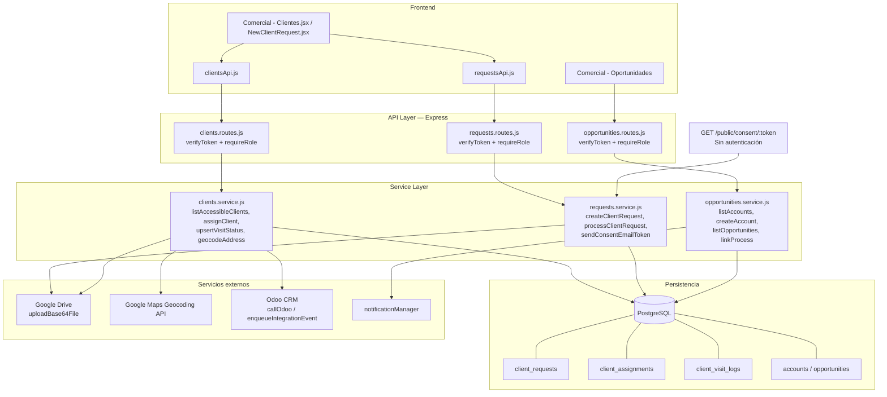

# DS — MÓDULO COMERCIAL Y CLIENTES

**Sistema:** FamSPI
**Versión:** 2.0
**Fecha:** 2026-06-18
**Estado:** En revisión
**Alineación:** WHO TRS 1019, Annex 3, Appendix 5

---

## 1. Introducción

El presente documento describe el diseño técnico del módulo Comercial y Clientes, incluyendo la arquitectura por capas, los componentes reales del sistema (rutas de archivo verificadas), el modelo de datos inferido del código fuente, las interfaces API y los controles de seguridad implementados.

La fuente de verdad son los archivos `clients.routes.js`, `clients.service.js`, `clients.controller.js`, `requests.routes.js` y `opportunities.routes.js` / `opportunities.service.js`. Las rutas de tablas se infieren de los DDL embebidos en `ensureTables()` de `clients.service.js` y de las queries SQL directas del servicio.

---

## 2. Arquitectura del módulo

| Capa | Tecnología / patrón | Descripción |
|---|---|---|
| Presentación | React 19 + Tailwind + Bootstrap | Componentes de página y API clients en el frontend |
| Transporte | HTTP REST — Express.js | Rutas declaradas en `*.routes.js`; middleware `verifyToken` y `requireRole` en la capa de ruta |
| Controlador | Express handlers — `*.controller.js` | Delega al service, extrae params de `req.params`, `req.query`, `req.body` y `req.files`; no contiene lógica de negocio |
| Servicio | Node.js — `*.service.js` | Toda la lógica de negocio: roles, validaciones, geocodificación, upserts, normalización, integración Odoo |
| Persistencia | PostgreSQL — SQL directo via `db.query()` | Sin ORM; queries parametrizadas; DDL de tablas auxiliares en `ensureTables()` |
| Archivos | Google Drive vía `uploadBase64File()` | Los archivos se procesan en memoria (`multer.memoryStorage()`) y se suben a Drive; solo el `fileId` se persiste en la base de datos |
| Geocodificación | Google Maps Geocoding API | Llamada desde `geocodeAddress()` con timeout 15 s; fallo no bloqueante |
| Integración CRM | Odoo vía `callOdoo()` + `enqueueIntegrationEvent()` | Sincronización condicional (`isCrmSyncEnabled()`); eventos encolados asincrónicamente en el outbox |

---

## 3. Componentes del sistema

### Backend

| Tipo | Ruta de archivo |
|---|---|
| Rutas — Clientes | `backend/src/modules/clients/clients.routes.js` |
| Controlador — Clientes | `backend/src/modules/clients/clients.controller.js` |
| Servicio — Clientes | `backend/src/modules/clients/clients.service.js` |
| Rutas — Requests | `backend/src/modules/requests/requests.routes.js` |
| Controlador — Requests | `backend/src/modules/requests/requests.controller.js` |
| Servicio — Requests | `backend/src/modules/requests/requests.service.js` |
| Fachada — Compras | `backend/src/modules/requests/purchaseRequestsFacade.js` |
| Rutas — Oportunidades | `backend/src/modules/opportunities/opportunities.routes.js` |
| Controlador — Oportunidades | `backend/src/modules/opportunities/opportunities.controller.js` |
| Servicio — Oportunidades | `backend/src/modules/opportunities/opportunities.service.js` |
| Middleware de autenticación | `backend/src/middlewares/auth.js` — función `verifyToken` |
| Middleware de roles | `backend/src/middlewares/roles.js` — función `requireRole` |
| Utilidad Drive | `backend/src/utils/drive.js` — función `uploadBase64File` |
| Integración Odoo | `backend/src/modules/integrations/odooClient.js` — función `callOdoo` |
| Outbox de integración | `backend/src/modules/integrations/integrationOutbox.service.js` — función `enqueueIntegrationEvent` |
| Config CRM | `backend/src/config/crmDb.js` — función `isCrmSyncEnabled` |

### Frontend

| Tipo | Ruta de archivo |
|---|---|
| Página — Solicitudes | `spi_front/src/modules/comercial/pages/Requests.jsx` |
| Página — Clientes | `spi_front/src/modules/comercial/pages/Clientes.jsx` |
| Página — Nuevo cliente | `spi_front/src/modules/comercial/pages/NewClientRequest.jsx` |
| Página — Compras públicas | `spi_front/src/modules/comercial/pages/EquipmentPurchases.jsx` |
| Página — Planificación mensual | `spi_front/src/modules/comercial/pages/PlanificacionMensual.jsx` |
| Página — Aprobación cronogramas | `spi_front/src/modules/comercial/pages/AprobacionCronogramas.jsx` |
| Página — Compras privadas | `spi_front/src/modules/backoffice/pages/PrivatePurchases.jsx` |
| API client — Requests | `spi_front/src/core/api/requestsApi.js` |
| API client — Clientes | `spi_front/src/core/api/clientsApi.js` |
| API client — Oportunidades | (inferido, no verificado en este análisis) |

---

## 4. Modelo de datos

Las tablas se derivan del DDL embebido en `ensureTables()` de `clients.service.js`, de las queries SQL en el mismo servicio y en `opportunities.service.js`, y de la estructura de los objetos devueltos por los endpoints.

### Tabla: `client_requests`

| Columna | Tipo | Descripción |
|---|---|---|
| `id` | SERIAL PK | Identificador |
| `status` | TEXT | Estado de la solicitud (`pending`, `approved`, `rejected`) |
| `created_by` | TEXT | Email del usuario que creó la solicitud |
| `approved_at` | TIMESTAMPTZ | Fecha de aprobación |
| `created_at` | TIMESTAMPTZ | Fecha de creación |
| `id_file_id` | VARCHAR(255) | ID de archivo en Google Drive — documento de identificación |
| `ruc_file_id` | VARCHAR(255) | ID de archivo en Google Drive — RUC |
| `legal_rep_appointment_file_id` | VARCHAR(255) | ID de archivo en Google Drive — nombramiento de rep. legal |
| `operating_permit_file_id` | VARCHAR(255) | ID de archivo en Google Drive — permiso de funcionamiento |
| `consent_evidence_file_id` | VARCHAR(255) | ID de archivo en Google Drive — evidencia de consentimiento |
| `bpadt_certification_file_id` | VARCHAR(255) | ID de archivo en Google Drive — certificación BPADT |
| `approval_letter_file_id` | VARCHAR(255) | ID de archivo en Google Drive — oficio de aprobación |
| `consent_record_file_id` | VARCHAR(255) | ID de archivo en Google Drive — registro de consentimiento |
| `external_source` | TEXT | Origen externo (ej. `odoo`) para clientes migrados |
| `external_id` | TEXT | ID en el sistema origen |
| `external_updated_at` | TIMESTAMPTZ | Última actualización en sistema origen |
| `last_synced_at` | TIMESTAMPTZ | Última sincronización con sistema externo |

### Tabla: `client_assignments`

| Columna | Tipo | Descripción |
|---|---|---|
| `id` | SERIAL PK | Identificador |
| `client_request_id` | INTEGER FK → `client_requests(id)` | Cliente asignado |
| `assigned_to_email` | TEXT NOT NULL | Email del asesor asignado |
| `assigned_by_email` | TEXT | Email del usuario que realizó la asignación |
| `assignment_type` | VARCHAR(20) | `owner`, `manual` o `temporary` |
| `is_temporary` | BOOLEAN DEFAULT FALSE | Si es asignación temporal |
| `starts_at` | TIMESTAMPTZ DEFAULT NOW() | Inicio de vigencia |
| `ends_at` | TIMESTAMPTZ | Fin de vigencia (NULL = indefinida) |
| `is_active` | BOOLEAN DEFAULT TRUE | Si la asignación está activa |
| `reason` | TEXT | Justificación de la asignación |
| `created_at` | TIMESTAMPTZ DEFAULT NOW() | Fecha de registro |
| **UNIQUE** | `(client_request_id, assigned_to_email)` | Una asignación por asesor por cliente |
| **CHECK** | `assignment_type IN ('owner', 'manual', 'temporary')` | Tipos válidos |
| **INDEX** | `idx_client_assignments_client_active` | `(client_request_id, is_active, starts_at, ends_at)` |
| **INDEX** | `idx_client_assignments_assigned_email` | `(assigned_to_email)` |

### Tabla: `client_visit_logs`

| Columna | Tipo | Descripción |
|---|---|---|
| `id` | SERIAL PK | Identificador |
| `client_request_id` | INTEGER FK → `client_requests(id)` | Cliente visitado |
| `user_email` | TEXT NOT NULL | Email del asesor que realizó la visita |
| `visit_date` | DATE NOT NULL | Fecha de la visita |
| `status` | TEXT NOT NULL | `visited`, `pending`, `skipped` o `in_visit` |
| `hora_entrada` | TIMESTAMPTZ | Marca de tiempo de check-in |
| `hora_salida` | TIMESTAMPTZ | Marca de tiempo de check-out |
| `lat_entrada` | DOUBLE PRECISION | Latitud de check-in |
| `lng_entrada` | DOUBLE PRECISION | Longitud de check-in |
| `lat_salida` | DOUBLE PRECISION | Latitud de check-out |
| `lng_salida` | DOUBLE PRECISION | Longitud de check-out |
| `observaciones` | TEXT | Notas de la visita |
| `duracion_minutos` | INTEGER | Duración calculada entre entrada y salida |
| `is_planned` | BOOLEAN DEFAULT FALSE | Si la visita fue planificada en cronograma |
| `created_at` | TIMESTAMPTZ DEFAULT NOW() | Fecha de creación |
| `updated_at` | TIMESTAMPTZ DEFAULT NOW() | Fecha de última actualización |
| **UNIQUE** | `(client_request_id, user_email, visit_date)` | Un registro por asesor por cliente por día |
| **CHECK** | `status IN ('visited','pending','skipped','in_visit')` | Estados válidos |

### Tabla: `client_request_consent_tokens`

| Columna | Tipo inferida | Descripción |
|---|---|---|
| `id` | SERIAL PK | Identificador |
| `token` | TEXT | Token único generado con `crypto` |
| `email` | TEXT | Correo del destinatario |
| `expires_at` | TIMESTAMPTZ | Fecha de expiración del token |
| `used_at` | TIMESTAMPTZ | Fecha en que fue consumido |
| `created_at` | TIMESTAMPTZ | Fecha de creación |

### Tabla: `client_request_consents`

| Columna | Tipo inferida | Descripción |
|---|---|---|
| `id` | SERIAL PK | Identificador |
| `client_request_id` | INTEGER FK | Solicitud asociada (si existe) |
| `token` | TEXT | Token usado para otorgar |
| `consented_at` | TIMESTAMPTZ | Fecha y hora del otorgamiento |
| `ip_address` | TEXT | IP del cliente que otorgó consentimiento |

### Tabla: `client_request_quality_checks`

| Columna | Tipo inferida | Descripción |
|---|---|---|
| `id` | SERIAL PK | Identificador |
| `client_request_id` | INTEGER FK | Solicitud revisada |
| `items` | JSONB | Ítems del checklist con estado de revisión |
| `reviewed_by` | TEXT | Email del revisor de calidad |
| `updated_at` | TIMESTAMPTZ | Fecha de última actualización |

### Tabla: `accounts`

| Columna | Tipo | Descripción |
|---|---|---|
| `id` | SERIAL PK | Identificador |
| `name` | TEXT NOT NULL | Nombre de la cuenta (requerido) |
| `legal_name` | TEXT | Razón social |
| `tax_id` | TEXT | RUC o identificación tributaria |
| `industry` | TEXT | Sector o industria |
| `city` | TEXT | Ciudad |
| `province` | TEXT | Provincia |
| `country` | TEXT | País |
| `website` | TEXT | Sitio web |
| `notes` | TEXT | Notas adicionales |
| `client_id` | INTEGER | Referencia al cliente SPI si corresponde |
| `created_by` | INTEGER | ID del usuario que creó la cuenta |
| `updated_by` | INTEGER | ID del último usuario que actualizó |
| `created_at` | TIMESTAMPTZ | Fecha de creación |
| `updated_at` | TIMESTAMPTZ | Fecha de última actualización |

### Otras tablas referenciadas

| Tabla | Descripción |
|---|---|
| `requests` | Solicitudes comerciales generales |
| `request_attachments` | Adjuntos de solicitudes generales |
| `request_status_history` | Historial de estados de solicitudes |
| `prospect_visits` | Visitas a prospectos fuera de cartera |
| `client_interactions` | Interacciones CRM (tipo `call`/`visit`) por cliente |
| `client_locations` | Sedes del cliente con coordenadas y geocode_status |
| `opportunities` | Oportunidades del pipeline comercial |
| `opportunity_influences` | Influencias asociadas a oportunidades |
| `opportunity_flags` | Flags de riesgo/oportunidad |
| `opportunity_competitors` | Competidores registrados por oportunidad |
| `opportunity_actions` | Acciones de seguimiento |
| `opportunity_comments` | Comentarios en oportunidades |
| `opportunity_process_links` | Vínculos a procesos (`bc_master`, `private_purchase_requests`, `equipment_purchase_requests`) |
| `contacts` | Contactos comerciales asociados a cuentas |

---

## 5. Interfaces API

Ver FRS-COM-001 a FRS-COM-019 para la especificación completa de cada endpoint. La tabla consolidada de endpoints se encuentra en la sección 4 del FRS (sección "Tabla de endpoints API completos").

Las rutas están registradas en la aplicación Express bajo los prefijos:
- `/api/v1/clients` → `clients.routes.js`
- `/api/v1/requests` → `requests.routes.js`
- `/api/v1/opportunities` → `opportunities.routes.js`

---

## 6. Controles de seguridad

### Autenticación
El middleware `verifyToken` (declarado en `backend/src/middlewares/auth.js`) se aplica como `router.use(verifyToken)` en `clients.routes.js` (línea 38) y por ruta en `requests.routes.js` y `opportunities.routes.js`. Valida el JWT en cada request privado.

### Autorización por rol
El guard `requireRole(roles[])` (declarado en `backend/src/middlewares/roles.js`) se aplica en rutas sensibles. Las constantes de rol están definidas explícitamente en los archivos de rutas y en el servicio:

- `EDIT_CLIENT_ROLES` (10 roles) — edición de clientes y sedes
- `ASSIGN_CLIENT_ROLES` (6 roles) — asignación de cartera
- `CRM_INTERACTION_ROLES` (10 roles, idéntico a EDIT_CLIENT_ROLES) — CRM e historial
- `OPPORTUNITY_READ_ROLES` (13 roles) — lectura de oportunidades
- `OPPORTUNITY_WRITE_ROLES` (8 roles) — escritura en oportunidades
- `ODOO_SYNC_ALLOWED_ROLES` (7 roles, en el servicio) — sincronización Odoo

### Control de visibilidad en capa de servicio
Las rutas `GET /api/v1/clients` y `GET /api/v1/clients/:id` no tienen `requireRole` en la capa de ruta. La lógica de visibilidad se implementa en `clientsService` usando los sets de roles:
- `FULL_ACCESS_ROLES` → acceso completo a toda la cartera
- `FIELD_CLIENT_READ_ROLES` → lectura restringida a clientes asignados
- `ADVISOR_ROLES` → solo clientes con asignación activa vigente

### Endpoint público
`GET /api/v1/requests/public/consent/:token` no tiene autenticación. Es el único endpoint del módulo accesible sin JWT. No devuelve datos de otros usuarios; solo registra el consentimiento cuando el token es válido y no expirado.

### Carga de archivos
Los archivos se procesan exclusivamente en memoria mediante `multer({ storage: multer.memoryStorage() })`. Nunca se escriben al sistema de archivos del servidor. Se suben a Google Drive y solo el `fileId` se persiste en la base de datos. Los enlaces se construyen con el patrón `https://drive.google.com/file/d/{fileId}/view`.

### Restricción de asignación por estado laboral
El servicio verifica que el asesor asignado no tenga estado `pasivo`, `desvinculado` o `inactivo` (set `PASSIVE_EMPLOYMENT_STATUSES`). Esta validación ocurre en `clientsService.assignClient()` antes de insertar en `client_assignments`.

---

## 7. Riesgos técnicos detectados

| # | Riesgo | Severidad | Descripción |
|---|---|---|---|
| RT-01 | Control de acceso delegado al servicio | Media | Las rutas `GET /clients` y `GET /clients/:id` no tienen `requireRole` en la capa de ruta. Si hay un bug en la lógica de filtrado del servicio, puede exponer datos de otros usuarios. Requiere cobertura de test específica por cada path de rol. |
| RT-02 | Asignaciones temporales expiradas sin cleanup | Baja | La condición `ACTIVE_ASSIGNMENT_CONDITION` filtra las asignaciones expiradas en tiempo de consulta, pero no existe un job que actualice `is_active = false` en BD. Las asignaciones expiradas permanecen con `is_active = true`, generando inconsistencia entre el campo y la condición de consulta. |
| RT-03 | Dependencia de Google Drive sin rollback | Alta | Si `uploadBase64File()` falla después de que el registro fue insertado en la base de datos, el registro queda sin el `file_id` correspondiente. No se observa transacción que haga rollback del INSERT si falla la subida a Drive. |
| RT-04 | Integración Odoo como latencia sincrónica | Media | Cuando `isCrmSyncEnabled()` es verdadero, `callOdoo()` se invoca de forma sincrónica en las operaciones de escritura de clientes, agregando latencia de red a la respuesta del endpoint. El mecanismo de `enqueueIntegrationEvent()` mitiga parcialmente esto para algunos eventos. |
| RT-05 | `ensureTables()` ejecutado en startup con DDL | Baja | La función `ensureTables()` en `clients.service.js` ejecuta `ALTER TABLE`, `CREATE TABLE` y `CREATE INDEX` al primer request. En entornos con alta concurrencia de arranque, múltiples instancias pueden colisionar; el flag `_tablesEnsured` mitiga esto solo dentro de la misma instancia. |
| RT-06 | Usuarios Odoo sin asignación comercial | Baja | Los clientes migrados desde Odoo que tengan el email técnico `odoo_sync@spi.local` como asignado tienen su asignación desactivada automáticamente por `ensureTables()`. Si este seed se ejecuta parcialmente, algunos clientes migrados quedan sin asignación activa y no aparecen en ninguna cartera. |

---

## 8. Diagrama técnico

