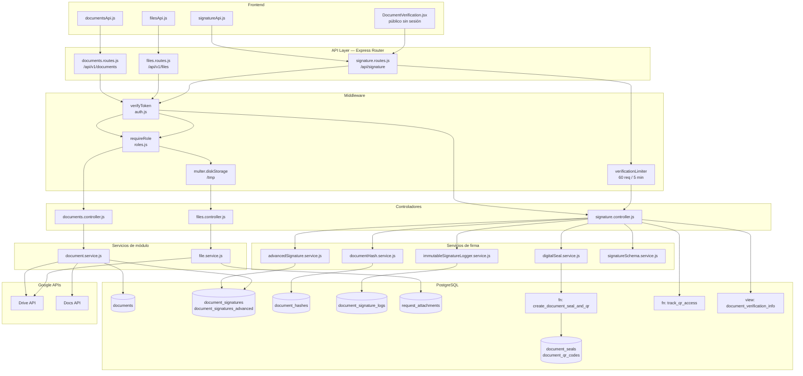

# DS — MÓDULO DE DOCUMENTOS Y FIRMA

**Sistema:** FamSPI
**Versión:** 2.0
**Fecha:** 2026-06-18
**Estado:** En revisión
**Alineación:** WHO TRS 1019, Annex 3, Appendix 5

---

## 1. Introducción

Este documento describe el diseño técnico de los submódulos `documents`, `files` y `signature` (FamSign) del sistema FamSPI. Cubre la arquitectura en capas, los componentes reales con rutas de archivo absolutas, el modelo de datos observado en el código, las interfaces API, los controles de seguridad implementados, los riesgos técnicos detectados y el diagrama de flujo del sistema.

El diseño se deriva del análisis directo de los siguientes archivos fuente:

- `backend/src/modules/documents/documents.routes.js`
- `backend/src/modules/documents/documents.controller.js`
- `backend/src/modules/documents/document.service.js`
- `backend/src/modules/files/files.routes.js`
- `backend/src/modules/files/files.controller.js`
- `backend/src/modules/files/file.service.js`
- `backend/src/modules/signature/signature.routes.js`
- `backend/src/modules/signature/signature.v1.routes.js`
- `backend/src/modules/signature/signature.controller.js`
- `backend/src/services/signatures/documentHash.service.js`
- `backend/src/services/signatures/advancedSignature.service.js`
- `backend/src/services/signatures/digitalSeal.service.js`
- `backend/src/services/signatures/signatureSchema.service.js`
- `backend/src/services/signatures/immutableSignatureLogger.service.js`
- `backend/src/services/signatures/verification.service.js`

## 2. Arquitectura

| Capa | Tecnología | Rol en el módulo |
|---|---|---|
| Presentación | React 19 + Tailwind (frontend SPI) | Consume APIs REST; renderiza formularios de firma, visor de adjuntos y página de verificación pública |
| Enrutamiento | Express.js (`Router`) | Define los endpoints, aplica `verifyToken`, `requireRole` y `multer` antes de delegar al controlador |
| Controlador | Node.js (`asyncHandler`) | Valida entradas, coordina el flujo, extrae datos del JWT (`req.user`) y construye la respuesta HTTP |
| Servicio de negocio | Node.js (módulos service) | Contiene la lógica de creación, firma, exportación y auditoría; usa transacciones PostgreSQL |
| Servicios de firma | Node.js (directorio `services/signatures/`) | Subcapa especializada: hash, firma avanzada, sello digital, logging inmutable y verificación |
| Persistencia | PostgreSQL (pool `db`) | Tablas, funciones almacenadas y vistas del dominio documental |
| Almacenamiento externo | Google Drive API + Google Docs API | Documentos, adjuntos y exportaciones PDF |
| Auditoría transversal | `utils/audit → logAction()` | Persiste eventos en la bitácora central del sistema |

## 3. Componentes

### 3.1 Rutas

| Archivo | Prefijo montado | Descripción |
|---|---|---|
| `backend/src/modules/documents/documents.routes.js` | `/api/v1/documents` | Creación desde plantilla, firma por tag, firma avanzada, exportación PDF y consultas |
| `backend/src/modules/files/files.routes.js` | `/api/v1/files` | Subida multipart, listado, metadatos, descarga y eliminación de adjuntos |
| `backend/src/modules/signature/signature.routes.js` | `/api/signature` | FamSign completo: firma avanzada, verificación pública, audit trail y dashboard |
| `backend/src/modules/signature/signature.v1.routes.js` | `/api/v1/signature` (o alias) | Versión simplificada sin aliases de compatibilidad; mismos handlers de `signature.controller.js` |

### 3.2 Controladores

| Archivo | Función exportada | Endpoint al que sirve |
|---|---|---|
| `backend/src/modules/documents/documents.controller.js` | `createFromTemplate` | `POST /from-template` |
| | `signAtTag` | `POST /:documentId/sign` |
| | `signAdvanced` | `POST /:documentId/sign-advanced` |
| | `exportPdf` | `POST /:documentId/export-pdf` |
| | `getDocument` | `GET /:documentId` |
| | `listByRequest` | `GET /by-request/:requestId` |
| `backend/src/modules/files/files.controller.js` | `uploadFiles` | `POST /upload/:requestId` |
| | `listByRequest` | `GET /by-request/:requestId` |
| | `getMetadata` | `GET /:fileId/metadata` |
| | `downloadFile` | `GET /:fileId/download` |
| | `deleteFile` | `DELETE /:fileId` |
| `backend/src/modules/signature/signature.controller.js` | `signDocument` | `POST /documents/:documentId/sign` |
| | `verifyDocument` | `GET /verificar/:token`, `GET /verify/:token` |
| | `getDocumentAuditTrail` | `GET /documents/:documentId/audit-trail` |
| | `getSignatureDashboard` | `GET /dashboard` |

### 3.3 Servicios de módulo

| Archivo | Función exportada | Descripción |
|---|---|---|
| `backend/src/modules/documents/document.service.js` | `createFromTemplate()` | Copia plantilla Drive, reemplaza tags, inserta en `documents` |
| | `signAtTag()` | Reemplaza tag por imagen en Drive, actualiza `document_signatures` |
| | `exportPdf()` | Exporta Docs a PDF en Drive, actualiza `pdf_drive_id` |
| | `applyAdvancedSignature()` | Orquesta exportación PDF + hash + firma + sello en transacción |
| | `getDocument()` | Consulta `documents` por ID local o `doc_drive_id` |
| | `listByRequest()` | Lista `documents` por `request_id` |
| `backend/src/modules/files/file.service.js` | `uploadFiles()` | Stream buffer → Drive + inserción en `request_attachments` |
| | `listByRequest()` | Consulta `request_attachments` por `request_id` |
| | `getMetadata()` | Metadatos de Drive (`id, name, mimeType, size, createdTime, webViewLink`) |
| | `downloadFile()` | Stream de descarga desde Drive |
| | `deleteFile()` | Elimina en Drive y en `request_attachments` |

### 3.4 Servicios de firma (subcapa especializada)

| Archivo | Clase / Función exportada | Responsabilidad |
|---|---|---|
| `backend/src/services/signatures/documentHash.service.js` | `createHash()` | Calcula SHA-256 del buffer del PDF, invalida hash previo en `document_hashes` |
| `backend/src/services/signatures/advancedSignature.service.js` | `signDocument()` | Inserta en `document_signatures_advanced` con todos los campos de identidad y trazabilidad |
| `backend/src/services/signatures/digitalSeal.service.js` | `applySeal()` | Llama la función SQL `create_document_seal_and_qr()` para generar sello y QR |
| `backend/src/services/signatures/signatureSchema.service.js` | `assertSignatureDependencies()` | Verifica runtime disponibilidad de `create_document_seal_and_qr()`, `track_qr_access()` y la vista `document_verification_info` con caché de 60 s |
| `backend/src/services/signatures/immutableSignatureLogger.service.js` | `ImmutableSignatureLogger.appendEvent()` | Registra eventos encadenados en `document_signature_logs` (hash previo → hash nuevo) |
| `backend/src/services/signatures/verification.service.js` | (verificación) | Soporte de consultas de verificación de documentos firmados |

### 3.5 Componentes de interfaz (frontend)

| Archivo | Descripción |
|---|---|
| `spi_front/src/core/api/documentsApi.js` | Cliente HTTP para endpoints del módulo `documents` |
| `spi_front/src/core/api/filesApi.js` | Cliente HTTP para endpoints del módulo `files` |
| `spi_front/src/core/api/signatureApi.js` | Cliente HTTP para FamSign |
| `spi_front/src/modules/signature/components/DocumentSigner.jsx` | Componente de UI para aplicar firma FamSign |
| `spi_front/src/modules/signature/pages/DocumentVerification.jsx` | Página de verificación pública (accesible sin sesión) |
| `spi_front/src/modules/signature/pages/SignatureDashboard.jsx` | Dashboard de métricas de firma |

## 4. Modelo de Datos

### 4.1 Tabla `documents`

| Columna | Tipo | Descripción |
|---|---|---|
| `id` | integer PK | Identificador local del documento |
| `request_id` | integer FK | Solicitud de origen (`requests.id`) |
| `request_type_id` | integer | Tipo de solicitud, heredado de `requests` |
| `doc_drive_id` | text | ID del documento en Google Docs/Drive |
| `folder_drive_id` | text | ID de la carpeta Drive del documento |
| `pdf_drive_id` | text | ID del PDF exportado en Drive (nullable) |
| `version_number` | integer | Versión heredada de la solicitud |
| `signed` | boolean | `true` si tiene al menos una firma posicionada |
| `is_locked` | boolean | `true` si fue firmado con FamSign (irreversible) |
| `locked_at` | timestamptz | Momento en que se bloqueó |
| `locked_by` | integer FK | Usuario que ejecutó el bloqueo |
| `signature_status` | text | `PENDING` durante la firma, `SIGNED` al completar |
| `current_hash_id` | integer FK | Referencia al hash SHA-256 vigente |
| `created_at` | timestamptz | Creación del registro |
| `updated_at` | timestamptz | Última modificación |

### 4.2 Tabla `document_signatures`

| Columna | Tipo | Descripción |
|---|---|---|
| `id` | integer PK | Identificador de la firma simple |
| `document_id` | integer FK | Documento firmado |
| `signer_user_id` | integer FK | Usuario que firmó |
| `role_at_sign` | text | Rol en el momento de la firma |
| `signed_at` | timestamptz | Timestamp de la firma |

### 4.3 Tabla `document_signatures_advanced`

| Columna | Tipo | Descripción |
|---|---|---|
| `id` | integer PK | Identificador de la firma avanzada |
| `document_id` | integer FK | Documento firmado |
| `signer_user_id` | integer FK | Usuario firmante |
| `signer_role` | text | Rol con el que firma |
| `signature_type` | text | Siempre `ADVANCED` |
| `signer_name` | text | Nombre completo del firmante |
| `signer_email` | text | Email del firmante (obligatorio) |
| `signer_department` | text | Departamento del firmante |
| `signed_at` | timestamptz | Timestamp de la firma |
| `ip_address` | text | IP del firmante (`x-forwarded-for` o `req.ip`) |
| `user_agent` | text | User-Agent del cliente HTTP |
| `session_id` | text | ID de sesión para trazabilidad (obligatorio) |
| `auth_method` | text | Siempre `OAUTH_CORPORATE` |
| `document_hash_id` | integer FK | Hash calculado sobre el PDF firmado |
| `signature_hash` | text | SHA-256 de `documentId:hashId:userId:sessionId` |
| `is_valid` | boolean | `true` al crear; puede invalidarse si se detecta alteración |

### 4.4 Tabla `document_hashes`

| Columna | Tipo | Descripción |
|---|---|---|
| `id` | integer PK | Identificador del hash |
| `document_id` | integer FK | Documento al que pertenece |
| `document_type` | text | Tipo de documento (nullable) |
| `hash_sha256` | text | Valor hexadecimal del hash SHA-256 del PDF |
| `hash_algorithm` | text | Siempre `SHA-256` |
| `calculated_by` | integer FK | Usuario que calculó el hash |
| `calculated_at` | timestamptz | Momento del cálculo |
| `is_current` | boolean | Solo un registro por documento puede ser `true` |

### 4.5 Tabla `document_seals`

| Columna | Tipo | Descripción |
|---|---|---|
| `id` | integer PK | Identificador del sello |
| `seal_code` | text | Código institucional del sello (ej. `SEAL-2026-001`) |
| `issued_by` | integer FK | Usuario que emitió el sello |
| `authorized_role` | text | Rol autorizado para el sello |
| `issued_at` | timestamptz | Fecha de emisión |
| `is_active` | boolean | Estado del sello |

### 4.6 Tabla `document_qr_codes`

| Columna | Tipo | Descripción |
|---|---|---|
| `id` | integer PK | Identificador del QR |
| `seal_id` | integer FK | Sello al que pertenece |
| `qr_url` | text | URL de verificación embebida en el QR |
| `verification_token` | text | Token único para verificación pública |
| `access_count` | integer | Veces que se ha accedido via `track_qr_access()` |
| `last_accessed_at` | timestamptz | Último acceso registrado |
| `is_active` | boolean | `false` invalida el QR sin eliminarlo |

### 4.7 Tabla `document_signature_logs`

| Columna | Tipo | Descripción |
|---|---|---|
| `id` | integer PK | Identificador del evento |
| `document_id` | integer FK | Documento al que pertenece el evento |
| `event_type` | text | Tipo de evento (`HASH_CALCULATED`, `DOCUMENT_LOCKED`, etc.) |
| `event_description` | text | Descripción legible del evento |
| `user_id` | integer FK | Usuario que generó el evento (nullable) |
| `user_name` | text | Nombre capturado en el momento del evento |
| `user_role` | text | Rol capturado en el momento del evento |
| `user_email` | text | Email capturado en el momento del evento |
| `ip_address` | text | IP del cliente en el momento del evento |
| `user_agent` | text | User-Agent del cliente |
| `session_id` | text | ID de sesión del evento |
| `event_hash` | text | SHA-256 del hash previo + payload (cadena inmutable) |
| `previous_event_hash` | text | Hash del evento anterior (null en primer evento) |
| `event_data` | jsonb | Payload completo del evento |
| `event_timestamp` | timestamptz | Momento del evento |
| `created_at` | timestamptz | Inserción en BD |

### 4.8 Tabla `request_attachments`

| Columna | Tipo | Descripción |
|---|---|---|
| `id` | integer PK | Identificador local del adjunto |
| `request_id` | integer FK | Solicitud a la que pertenece |
| `drive_file_id` | text | ID del archivo en Google Drive |
| `filename` | text | Nombre original del archivo |
| `title` | text | Título (igual a `filename` en la carga actual) |
| `mimetype` | text | MIME type del archivo (campo legacy) |
| `mime_type` | text | MIME type preferido (campo nuevo; consulta usa `COALESCE(mime_type, mimetype)`) |
| `uploaded_by` | integer FK | Usuario que subió el archivo |
| `drive_link` | text | URL de visualización en Drive |
| `size` | bigint | Tamaño en bytes |
| `created_at` | timestamptz | Fecha de carga |

### 4.9 Objetos SQL de infraestructura de firma

| Objeto | Tipo | Descripción |
|---|---|---|
| `create_document_seal_and_qr(documentId, authorizedRole, userId)` | Función almacenada | Genera sello y QR; retorna `seal_id` y `qr_id` |
| `track_qr_access(qrId)` | Función almacenada | Incrementa `access_count` y actualiza `last_accessed_at` |
| `document_verification_info` | Vista | Joins de `documents`, `document_hashes`, `document_signatures_advanced`, `document_seals` y `document_qr_codes` para verificación pública |

## 5. Interfaces API

### Submódulo `documents`

| Método | Ruta | Roles | Body / Params | Respuesta |
|---|---|---|---|---|
| POST | `/api/v1/documents/from-template` | tecnico, comercial, gerencia | `request_id`, `template_id`, `data`, `images` | `201 { ok, document }` |
| POST | `/api/v1/documents/:documentId/sign` | tecnico, gerencia | `base64`, `tag`, `role_at_sign` | `200 { ok, result }` |
| POST | `/api/v1/documents/:documentId/sign-advanced` | tecnico, gerencia | `consent`, `consent_text`, `session_id` | `201 { ok, hash, signature, seal, pdf }` |
| POST | `/api/v1/documents/:documentId/export-pdf` | tecnico, gerencia | — | `200 { ok, pdf }` |
| GET | `/api/v1/documents/by-request/:requestId` | autenticado | — | `200 { ok, rows }` |
| GET | `/api/v1/documents/:documentId` | autenticado | — | `200 { ok, document }` o `404` |

### Submódulo `files`

| Método | Ruta | Roles | Body / Params | Respuesta |
|---|---|---|---|---|
| POST | `/api/v1/files/upload/:requestId` | tecnico, comercial, gerencia | multipart `files[]` | `201 { ok, uploaded }` |
| GET | `/api/v1/files/by-request/:requestId` | tecnico, comercial, gerencia | — | `200 { ok, files }` |
| GET | `/api/v1/files/:fileId/metadata` | autenticado | — | `200 { ok, metadata }` |
| GET | `/api/v1/files/:fileId/download` | autenticado | — | Stream con `Content-Type` y `Content-Disposition` |
| DELETE | `/api/v1/files/:fileId` | gerencia, admin | — | `200 { ok, message }` |

### Submódulo `signature` (FamSign)

| Método | Ruta | Auth | Body / Params | Respuesta |
|---|---|---|---|---|
| POST | `/api/signature/documents/:documentId/sign` | JWT | `document_base64`, `consent`, `role_at_sign`, `authorized_role`, `session_id` | `201 { ok, data }` |
| GET | `/api/signature/verificar/:token` | Rate limit (sin JWT) | — | `200 { ok, verification }` o `404` |
| GET | `/api/signature/verify/:token` | Rate limit (sin JWT) | — | Alias del anterior |
| GET | `/api/signature/documents/:documentId/audit-trail` | JWT + lógica interna | — | `200 { ok, audit_trail }` o `403` |
| GET | `/api/signature/dashboard` | JWT | — | `200 { ok, dashboard }` |

## 6. Controles de Seguridad

### 6.1 Autenticación y autorización

| Control | Implementación | Alcance |
|---|---|---|
| Validación JWT | `verifyToken` en `backend/src/middlewares/auth.js` | Todos los endpoints privados |
| Control de rol | `requireRole([roles])` en `backend/src/middlewares/roles.js` | Creación, firma, exportación, subida y eliminación |
| Autorización en controlador | `collectRoles(req.user)` en `signature.controller.js` | Acceso al audit trail: solo firmante, bloqueador o admin |

### 6.2 Integridad criptográfica

| Control | Implementación |
|---|---|
| Hash SHA-256 del PDF | `crypto.createHash("sha256").update(documentBuffer).digest("hex")` en `signature.controller.js → calculateDocumentHash()` |
| Hash de firma | SHA-256 de `${documentId}:${hashId}:${userId}:${sessionId}` en `createAdvancedSignature()` |
| Log inmutable encadenado | SHA-256 del hash previo + payload en `ImmutableSignatureLogger.appendEvent()` |
| Invalidación de hash previo | `UPDATE document_hashes SET is_current = FALSE WHERE document_id = $1 AND is_current = TRUE` antes de insertar nuevo hash |

### 6.3 Rate limiting y disponibilidad

| Control | Configuración | Endpoint |
|---|---|---|
| `verificationLimiter` | 60 req / 5 min por IP, `standardHeaders: true` | `GET /verificar/:token`, `GET /verify/:token` |
| `assertSignatureDependencies()` | Caché 60 s; retorna `503` si faltan funciones SQL | `POST /signature/documents/:documentId/sign` |

### 6.4 Bloqueo irreversible

Cuando FamSign completa con éxito, ejecuta `lockDocument()`:
```sql
UPDATE documents
SET is_locked = TRUE, signed = TRUE, locked_at = NOW(), locked_by = $1, signature_status = 'SIGNED', updated_at = NOW()
WHERE id = $2
```
No existe endpoint para revertir `is_locked`. Cualquier operación de firma posterior sobre un documento bloqueado debe ser rechazada en la capa de negocio.

### 6.5 Transaccionalidad

Todas las operaciones de escritura críticas usan `db.getClient()` con `BEGIN / COMMIT / ROLLBACK` explícito:

- `createFromTemplate()`: inserta en `documents` dentro de transacción; fallo hace ROLLBACK y no deja registro.
- `applyAdvancedSignature()`: hash + firma + sello + bloqueo en una sola transacción.
- `signDocument()` (FamSign): hash + firma + sello + bloqueo en una sola transacción con ROLLBACK total en caso de error.

## 7. Riesgos Técnicos Detectados

| ID | Riesgo | Severidad | Evidencia en código | Mitigación recomendada |
|---|---|---|---|---|
| R-01 | Dos flujos de firma avanzada coexisten con lógica parcialmente diferente | Alta | `document.service.js → applyAdvancedSignature()` vs `signature.controller.js → signDocument()` | Consolidar en un único flujo canónico; deprecar el de `documents` |
| R-02 | Multer almacena en `/tmp` (disco) en lugar de memoria | Media | `files.routes.js: storage: multer.diskStorage({ destination: '/tmp' })` | Cambiar a `multer.memoryStorage()` para entornos contenerizados o limpiar `/tmp` periódicamente |
| R-03 | Endpoint de verificación pública sin autenticación expuesto a scraping masivo | Media | `signature.routes.js`: rutas sin `verifyToken` | Rate limit activo (60/5 min); considerar CAPTCHA para picos anómalos |
| R-04 | Eliminación de adjunto borra en Drive primero; un fallo de Drive deja el registro en `request_attachments` | Media | `file.service.js → deleteFile()`: Drive antes que BD | Invertir el orden: borrar en BD primero y en Drive después, o usar tabla de eliminaciones pendientes |
| R-05 | `assertSignatureDependencies()` usa caché de 60 s; un deploy sin funciones SQL puede servir `503` durante 60 s | Baja | `signatureSchema.service.js: CACHE_TTL_MS = 60 * 1000` | Reducir TTL a 10 s en producción o invalidar caché en startup |
| R-06 | Alias de rutas duplicados en `signature.routes.js` generan endpoints con doble prefijo (`/api/signature/signature/...`) | Baja | `signature.routes.js` líneas 13, 17, 27, 39 | Auditar si los alias duplicados se usan en producción y eliminar los redundantes |
| R-07 | `document_hashes.document_type` siempre se inserta como `null` | Baja | `signature.controller.js → calculateDocumentHash()`: `[documentId, null, hashValue, ...]` | Definir y poblar el tipo de documento para facilitar reportes y auditorías |

## 8. Diagrama de Arquitectura


