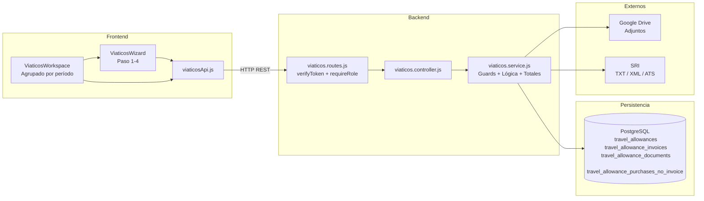

# DS — MÓDULO DE VIÁTICOS

**Sistema:** FamSPI  
**Versión:** 2.0  
**Fecha:** 2026-06-18  
**Estado:** En revisión  
**Alineación:** WHO TRS 1019, Annex 3, Appendix 5  
**Referencia URS:** URS_modulo_finanzas_viaticos.md v2.0  
**Referencia FRS:** FRS_modulo_finanzas_viaticos.md v2.0

---

## 1. Introducción

El presente documento describe el diseño técnico del módulo de Viáticos del sistema SPI. Define la arquitectura de capas, los componentes de backend y frontend, el modelo de datos, las interfaces API y los controles de seguridad implementados. Es la base para la calificación de instalación (IQ) y la calificación operacional (OQ) del módulo.

---

## 2. Arquitectura del módulo

El módulo sigue la arquitectura de capas del sistema SPI:

| Capa | Tecnología | Descripción |
|---|---|---|
| Presentación | React 19 + Tailwind CSS | Workspace agrupado y asistente de cuatro pasos |
| API | Express.js router | Rutas con middlewares de autenticación y autorización |
| Negocio | Servicios Node.js | Lógica transaccional, validaciones, cálculo de totales |
| Persistencia | PostgreSQL (SQL directo, sin ORM) | Tablas del dominio de viáticos |
| Transversal | JWT, `verifyToken`, `requireRole`, Google Drive | Autenticación, autorización, almacenamiento de adjuntos |

---

## 3. Componentes del sistema

### 3.1 Backend

| Componente | Ruta | Responsabilidad |
|---|---|---|
| Router | `backend/src/modules/viaticos/viaticos.routes.js` | Define las 30 rutas del módulo con sus middlewares |
| Controlador | `backend/src/modules/viaticos/viaticos.controller.js` | Adapta peticiones HTTP a llamadas de servicio; serializa respuestas |
| Servicio | `backend/src/modules/viaticos/viaticos.service.js` | Toda la lógica de negocio, validaciones, parseo de TXT, cálculo de totales, guards de acceso |

**Guards de servicio en `viaticos.service.js`:**
- `assertViaticosAccess(actorUser)` — verifica que el actor tenga rol habilitado para el módulo
- `assertFinanceApprover(actorUser)` — restringe operaciones de categorización financiera a `FINANCE_REVIEWER_ROLES`
- `assertOperationalApprover(actorUser)` — restringe el flujo de aprobación de jefes
- `assertAllowanceRequester(actorUser, allowance)` — verifica propiedad del viático

**Función clave de inicialización:**
- `ensureSchema()` — ejecutada al iniciar el servicio; crea con `CREATE TABLE IF NOT EXISTS` todas las tablas del dominio si no existen.

### 3.2 Frontend

| Componente | Ruta | Responsabilidad |
|---|---|---|
| Workspace | `spi_front/src/modules/finanzas/pages/ViaticosWorkspace.jsx` | Vista principal con viáticos agrupados por período, selección múltiple y apertura del asistente |
| Wizard | `spi_front/src/modules/finanzas/components/viaticos/ViaticosWizard.jsx` | Asistente de cuatro pasos; soporta múltiples viáticos en lote |
| Step 1 — TXT | Subcomponente de `ViaticosWizard` | Carga y previsualización del TXT SRI, eliminación de filas, categorización, adjuntos |
| Step 2 — Notas | Subcomponente de `ViaticosWizard` | Registro y listado de notas de venta manuales |
| Step 3 — Compras | Subcomponente de `ViaticosWizard` | Registro y listado de compras sin factura |
| Step 4 — Resumen | Subcomponente de `ViaticosWizard` | Resumen consolidado y botón de envío a revisión |
| API client | `spi_front/src/core/api/viaticosApi.js` | Todas las llamadas al backend del módulo |

**Patrones de implementación del Wizard:**
- Los pasos se renderizan con `style={{ display: step === N ? "block" : "none" }}` para preservar el estado del formulario sin desmontar componentes.
- El estado `allowanceIndex` avanza por el array de viáticos seleccionados; `resetStepState()` se llama mediante `useEffect` al cambiar de viático.
- La pantalla de finalización (`doneScreen`) muestra el estado de envío por viático procesado.

**Patrones de implementación del Workspace:**
- `groupAllowancesByPeriod(items, mode)` agrupa por clave ISO de semana o mes y retorna `[{key, label, items}]`.
- `getAllowanceProgressBadge(item)` calcula el badge de progreso según `workflow_status` y presencia de soportes documentales.
- La selección múltiple usa un `Set` de IDs con `toggleSelectOne` y `toggleSelectGroup`.

---

## 4. Modelo de datos

### 4.1 Tablas principales del dominio

**`travel_allowances`** — Registro principal del viático

| Columna | Tipo | Descripción |
|---|---|---|
| `id` | SERIAL PK | Identificador único |
| `source_type` | VARCHAR(20) | `client_visit`, `prospect_visit`, `manual_trip`, `operational_exit` |
| `source_id` | INTEGER | ID de la salida operacional de origen (nullable para manual) |
| `workflow_status` | VARCHAR(30) | Estado del flujo de aprobación |
| `start_date` | DATE | Fecha de inicio del viático |
| `end_date` | DATE | Fecha de fin del viático |
| `destination` | TEXT | Destino del desplazamiento |
| `total_amount` | NUMERIC | Total calculado de todos los soportes |
| `total_manual_notes` | NUMERIC | Total de notas de venta manuales |
| `total_purchases_no_invoice` | NUMERIC | Total de compras sin factura |
| `approved_amount` | NUMERIC | Monto aprobado por finanzas |
| `created_by` | INTEGER | FK a `users.id` |
| `reviewed_by` | INTEGER | Actor del último cambio de estado |
| `reviewed_at` | TIMESTAMP | Timestamp del último cambio de estado |
| `created_at` | TIMESTAMP | Fecha de creación |
| `updated_at` | TIMESTAMP | Última actualización |

**Estados válidos de `workflow_status`:**
`borrador` → `pendiente_revision` → `aprobado_jefe` | `rechazado_jefe` → `pendiente_financiero` → `aprobado_financiero` | `rechazado_financiero` → `listo_pago` → `pagado` → `cerrado`

---

**`travel_allowance_invoices`** — Facturas electrónicas y notas de venta manuales

| Columna | Tipo | Descripción |
|---|---|---|
| `id` | SERIAL PK | Identificador único |
| `allowance_id` | INTEGER | FK a `travel_allowances.id` |
| `document_type` | VARCHAR(30) | `factura_electronica`, `nota_venta_manual` |
| `supplier_ruc` | VARCHAR(15) | RUC del emisor |
| `supplier_name` | TEXT | Razón social del emisor |
| `receipt_type` | VARCHAR(30) | Tipo de comprobante según SRI |
| `establishment` | VARCHAR(3) | Número de establecimiento |
| `emission_point` | VARCHAR(3) | Punto de emisión |
| `sequential` | VARCHAR(9) | Número secuencial |
| `access_key` | VARCHAR(49) | Clave de acceso del comprobante (único por viático) |
| `authorization_number` | VARCHAR(49) | Número de autorización SRI |
| `authorization_date` | TIMESTAMP | Fecha de autorización |
| `issue_date` | DATE | Fecha de emisión del comprobante |
| `buyer_id` | VARCHAR(20) | RUC/cédula del receptor |
| `subtotal` | NUMERIC | Subtotal sin impuestos |
| `subtotal_12` | NUMERIC | Subtotal gravado al 12% |
| `subtotal_0` | NUMERIC | Subtotal gravado al 0% |
| `iva` | NUMERIC | Valor del IVA |
| `total` | NUMERIC | Importe total del comprobante |
| `category` | VARCHAR(30) | Categoría de gasto asignada |
| `allowed_category` | BOOLEAN | La categoría asignada es válida |
| `category_source` | VARCHAR(20) | `requester` o `finance` |
| `status` | VARCHAR(30) | `pendiente_clasificacion` o `clasificada` |
| `in_trip_date_range` | BOOLEAN | La fecha de emisión está dentro del rango del viático |
| `drive_file_id` | TEXT | ID del archivo en Google Drive |
| `drive_link` | TEXT | Enlace al archivo en Google Drive |
| `details_text` | TEXT | Descripción del gasto (notas manuales) |
| `created_by_user_id` | INTEGER | FK a `users.id` |
| `created_at` | TIMESTAMP | Fecha de creación |

---

**`travel_allowance_documents`** — Adjuntos del viático

| Columna | Tipo | Descripción |
|---|---|---|
| `id` | SERIAL PK | Identificador único |
| `allowance_id` | INTEGER | FK a `travel_allowances.id` |
| `doc_type` | VARCHAR(20) | `invoice`, `liquidation`, `support` |
| `drive_file_id` | TEXT | ID del archivo en Google Drive |
| `drive_link` | TEXT | Enlace al archivo |
| `notes` | TEXT | Descripción o referencia del documento |
| `created_by` | INTEGER | FK a `users.id` |
| `created_at` | TIMESTAMP | Fecha de carga |

---

**`travel_allowance_purchases_no_invoice`** — Compras sin factura

| Columna | Tipo | Descripción |
|---|---|---|
| `id` | SERIAL PK | Identificador único |
| `allowance_id` | INTEGER | FK a `travel_allowances.id` |
| `description` | TEXT | Descripción de la compra |
| `total` | NUMERIC | Monto total |
| `category` | VARCHAR(30) | Categoría de gasto |
| `justification` | TEXT | Justificación del gasto sin factura |
| `status` | VARCHAR(20) | `pending` o `approved` |
| `created_by_user_id` | INTEGER | FK a `users.id` |
| `created_at` | TIMESTAMP | Fecha de creación |

### 4.2 Tablas de configuración

| Tabla | Propósito |
|---|---|
| `travel_allowance_zones` | Zonas geográficas con tarifas de viático |
| `travel_allowance_fixed_profiles` | Perfiles de viático fijo por colaborador |
| `travel_allowance_policy` | Política general del módulo (singleton) |
| `travel_allowance_provider_catalog` | Catálogo de proveedores frecuentes |
| `travel_allowance_sri_credentials` | Credenciales para integración SRI |

---

## 5. Interfaces API

Ver tabla completa en FRS_modulo_finanzas_viaticos.md, sección 4.

**Prefijo base:** `/api/v1/viaticos`

**Roles habilitados en el router (middleware global):**
`finanzas`, `financiero`, `comercial`, `backoffice_comercial`, `servicio_tecnico`, `tecnico`, `jefe_comercial`, `jefe_tecnico`, `jefe_servicio_tecnico`, `jefe_operaciones`, `ti`, `jefe_ti`, `talento_humano`, `jefe_talento_humano`, `admin`, `administrador`, `gerencia_general`

**`FINANCE_REVIEWER_ROLES`:** `finanzas`, `financiero`, `jefe_financiero`, `jefe_finanzas`

---

## 6. Controles de seguridad y operación

**Autenticación:** JWT requerido para toda operación del módulo. `verifyToken` se aplica como middleware global en el router.

**Autorización por capa de ruta:** `requireRole` aplicado en rutas sensibles con conjuntos de roles definidos por operación.

**Autorización por capa de servicio:** Guards de función (`assertFinanceApprover`, `assertOperationalApprover`, `assertAllowanceRequester`) añaden una segunda capa de control no replicable solo por rol.

**Registro de trazabilidad:** Cada cambio de estado en `travel_allowances` registra `reviewed_by`, `reviewed_at` y notas cuando aplica.

**Validación de adjuntos:** Tipo MIME y tamaño máximo de 15 MB verificados antes de persistir documentos en Drive.

**Integridad de totales:** La función `recalculateAllowanceTotals(allowanceId)` se ejecuta automáticamente después de cualquier inserción o eliminación de facturas, notas manuales o compras sin factura.

---

## 7. Riesgos técnicos documentados

| Riesgo | Impacto | Estado |
|---|---|---|
| `ensureSchema` ejecuta DDL en runtime | Puede crear tablas con esquema incompleto si se modifica el código sin migración | Bajo en producción estabilizada; mitigar con migraciones controladas |
| `in_trip_date_range` calculado solo en carga | Si las fechas del viático cambian, el campo no se recalcula | Aceptado; las fechas del viático son inmutables después de aprobación |
| `travel_allowance_invoices` mezcla facturas TXT y notas manuales | Requiere consistencia en `document_type`; errores en el discriminador generan datos incorrectos | Mitigado con valores constantes en el servicio |
| Sin transacción distribuida con SRI | La sincronización puede quedar inconsistente si falla la red | Riesgo conocido; el reintento manual está disponible |

---

## 8. Diagrama técnico

