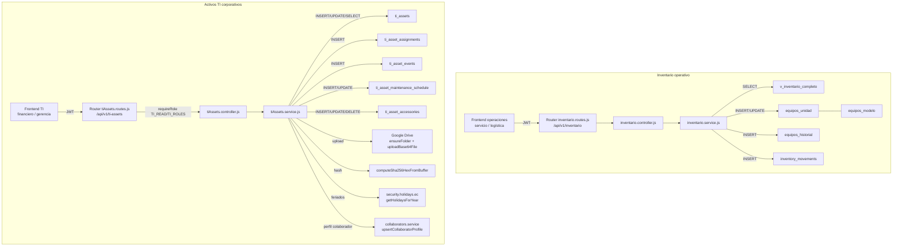

# DS — MÓDULO DE INVENTARIO Y EQUIPOS

**Sistema:** FamSPI
**Versión:** 2.0
**Fecha:** 2026-06-18
**Estado:** En revisión
**Alineación:** WHO TRS 1019, Annex 3, Appendix 5

---

## 1. Introducción

El presente documento describe el diseño técnico del módulo de Inventario y Equipos de FamSPI. Este módulo comprende dos submódulos con arquitecturas paralelas: el inventario operativo de equipos comerciales (`inventario`) y los activos TI corporativos (`ti-assets`). El documento cubre arquitectura de capas, componentes con rutas reales, modelos de datos, interfaces API, controles de seguridad implementados y riesgos técnicos identificados.

## 2. Arquitectura

| Capa | Submódulo inventario | Submódulo ti-assets |
|---|---|---|
| Presentación | `spi_front/src/modules/servicio/components/dashboard/EquiposManagement.jsx` | Componentes de gestión TI en frontend |
| API / Rutas | `backend/src/modules/inventario/inventario.routes.js` | `backend/src/modules/ti-assets/tiAssets.routes.js` |
| Controladores | `backend/src/modules/inventario/inventario.controller.js` | `backend/src/modules/ti-assets/tiAssets.controller.js` |
| Servicios / Lógica | `backend/src/modules/inventario/inventario.service.js` | `backend/src/modules/ti-assets/tiAssets.service.js` |
| Persistencia | SQL directo sobre tablas de inventario y `v_inventario_completo` | SQL directo sobre tablas `ti_assets*`; schema en `202_ti_assets_v2.sql` |
| Archivos | Sin almacenamiento de archivos | `multer.memoryStorage()` + Google Drive (`drive` utils) |
| Transversal | JWT auth, `requireRole`, notificaciones | JWT auth, `requireRole`, notificaciones, Drive, SHA-256 |

## 3. Componentes

### 3.1 Submódulo: Inventario operativo

#### Router

| Archivo | Prefijo de montaje | Descripción |
|---|---|---|
| `backend/src/modules/inventario/inventario.routes.js` | `/api/v1/inventario` | Define 11 endpoints con controles `verifyToken` y `requireRole` diferenciados por operación |

**Constantes de roles definidas en el router:**

| Constante | Roles incluidos |
|---|---|
| `INVENTORY_CREATE_ROLES` | `comercial`, `jefe_comercial`, `backoffice_comercial`, `acp_comercial`, `servicio_tecnico`, `tecnico`, `jefe_tecnico`, `jefe_servicio_tecnico`, `operaciones`, `jefe_operaciones`, `logistica`, `jefe_logistica`, `gerencia`, `ti`, `admin_ti`, `admin` |
| `INVENTORY_MUTATION_ROLES` | `servicio_tecnico`, `tecnico`, `jefe_tecnico`, `jefe_servicio_tecnico`, `operaciones`, `jefe_operaciones`, `logistica`, `jefe_logistica`, `finanzas`, `jefe_finanzas`, `gerencia`, `ti`, `admin_ti`, `admin` |

#### Controlador y servicio

| Archivo | Responsabilidades |
|---|---|
| `backend/src/modules/inventario/inventario.controller.js` | `getInventario`, `getEquiposDisponibles`, `getEquiposPorCliente`, `listModelos`, `updateModelo`, `createUnidad`, `captureSerial`, `assignUnidad`, `cambiarEstadoUnidad`, `getUnidadHistorial`, `addMovimiento` |
| `backend/src/modules/inventario/inventario.service.js` | Validaciones de estado (`ALLOWED_STATES`), unicidad de serial, transacciones SQL, lógica de historial |

#### Frontend

| Archivo | Rol |
|---|---|
| `spi_front/src/core/api/inventarioApi.js` | Cliente API del módulo |
| `spi_front/src/modules/servicio/components/dashboard/EquiposManagement.jsx` | Gestión de equipos en dashboard de servicio |
| `spi_front/src/modules/operaciones/pages/EquipmentCatalog.jsx` | Catálogo de equipos para operaciones |

---

### 3.2 Submódulo: Activos TI corporativos

#### Router

| Archivo | Prefijo de montaje | Descripción |
|---|---|---|
| `backend/src/modules/ti-assets/tiAssets.routes.js` | `/api/v1/ti-assets` | Define 40+ endpoints con `verifyToken` global y `requireRole` granular; usa `multer.memoryStorage()` para uploads |

#### Controlador

| Archivo | Funciones principales exportadas |
|---|---|
| `backend/src/modules/ti-assets/tiAssets.controller.js` | `listAssets`, `createAsset`, `updateAsset`, `assignAsset`, `assignMultipleAssets`, `updateStatus`, `createAccessory`, `updateAccessory`, `removeAccessory`, `listHistory`, `listAssignmentsHistory`, `listAccessories`, `listActas`, `getActa`, `downloadActaPdf`, `uploadSignedActa`, `listAllActas`, `getActaRecipientInfo`, `listFinancialDocs`, `uploadFinancialDoc`, `getLetrasDeChangioHistory`, `listMaintenance`, `diagnoseMaintenance`, `createMaintenance`, `generateAnnualMaintenance`, `generateFutureMaintenance`, `setMaintenanceCoordinationDate`, `completeMaintenance`, `requestMaintenanceDelivery`, `clearAllMaintenance`, `listReports`, `downloadReport`, `downloadAssetReport`, `downloadCollaboratorReport`, `generateReport`, `liberateAsset`, `getLiberationPhotos`, `listCorporateNumbers`, `getCorporateNumber`, `getCorporateNumberHistory`, `createCorporateNumber`, `assignCorporateNumber`, `changeCorporateNumber` |

#### Servicio

| Archivo | Responsabilidades |
|---|---|
| `backend/src/modules/ti-assets/tiAssets.service.js` | Lógica de negocio completa; exporta `TI_ROLES`, `TI_READ_ROLES`, `TI_ASSET_CREATE_ROLES`, `ALLOWED_STATUSES`; integración con Drive, SHA-256, feriados y collaborators |

**Constantes de dominio exportadas:**

| Constante | Valores |
|---|---|
| `ALLOWED_STATUSES` | `available`, `assigned`, `unassigned`, `damaged`, `in_maintenance`, `retired` |
| `TI_ROLES` | `ti`, `jefe_ti`, `admin_ti`, `gerencia` |
| `TI_READ_ROLES` | `ti`, `jefe_ti`, `admin_ti`, `gerencia`, `gerencia_general`, `financiero`, `jefe_financiero`, `finanzas`, `jefe_finanzas`, `contador` |
| `TI_ASSET_CREATE_ROLES` | `TI_ROLES` + roles financieros |
| `MS_PER_DAY` | `86400000` (cálculo de depreciación) |

## 4. Modelo de datos

### Submódulo inventario operativo

#### Tabla: `equipos_modelo`

| Columna | Tipo | Descripción |
|---|---|---|
| `id` | SERIAL | Identificador del modelo |
| `nombre` | TEXT | Nombre del modelo |
| `marca` | TEXT | Marca |
| `tipo` | TEXT | Tipo de equipo |
| `descripcion` | TEXT | Descripción adicional |
| `created_at` | TIMESTAMPTZ | Creación |
| `updated_at` | TIMESTAMPTZ | Actualización |

#### Tabla: `equipos_unidad`

| Columna | Tipo | Descripción |
|---|---|---|
| `id` | SERIAL | Identificador de unidad |
| `modelo_id` | INTEGER FK → `equipos_modelo` | Modelo base |
| `serial` | TEXT | Serial del equipo (único definitivo o temporal `SIN-SERIE-*`) |
| `serial_pendiente` | BOOLEAN | Indica serial provisional |
| `estado` | TEXT | Estado operativo actual |
| `cliente_id` | INTEGER FK → clientes | Cliente asignado |
| `sucursal_id` | INTEGER | Sucursal del cliente |
| `observaciones` | TEXT | Observaciones libres |
| `created_at` | TIMESTAMPTZ | Creación |
| `updated_at` | TIMESTAMPTZ | Actualización |

#### Tabla: `equipos_historial`

| Columna | Tipo | Descripción |
|---|---|---|
| `id` | SERIAL | Identificador del evento |
| `unidad_id` | INTEGER FK → `equipos_unidad` | Unidad afectada |
| `evento` | TEXT | Tipo de evento (creación, serial, asignación, cambio de estado) |
| `estado_anterior` | TEXT | Estado previo al cambio |
| `estado_nuevo` | TEXT | Estado posterior al cambio |
| `actor_id` | INTEGER FK → `users` | Usuario que ejecutó la acción |
| `request_id` | INTEGER | Referencia a solicitud (si aplica) |
| `created_at` | TIMESTAMPTZ | Timestamp del evento |

#### Tabla: `inventory_movements`

| Columna | Tipo | Descripción |
|---|---|---|
| `id` | SERIAL | Identificador del movimiento |
| `tipo` | TEXT | `entrada` o `salida` |
| `modelo_id` | INTEGER FK | Modelo de equipo |
| `cantidad` | INTEGER | Cantidad movida |
| `referencia` | TEXT | Referencia del movimiento |
| `observaciones` | TEXT | Notas adicionales |
| `actor_id` | INTEGER FK → `users` | Usuario que registra |
| `created_at` | TIMESTAMPTZ | Timestamp |

#### Vista: `v_inventario_completo`

Vista que consolida `equipos_unidad` + `equipos_modelo` + datos de cliente para consultas de inventario general. La modificación de las tablas base puede romper esta vista.

---

### Submódulo activos TI corporativos

#### Tabla: `ti_assets`

| Columna | Tipo | Restricción | Descripción |
|---|---|---|---|
| `id` | BIGSERIAL | PRIMARY KEY | Identificador interno |
| `asset_code` | TEXT | UNIQUE | Código corporativo del activo |
| `name` | TEXT | NOT NULL | Nombre del activo |
| `brand` | TEXT | — | Marca |
| `model` | TEXT | — | Modelo |
| `serial_number` | TEXT | — | Número de serie |
| `imei` | TEXT | — | IMEI (dispositivos móviles) |
| `purchase_date` | DATE | — | Fecha de compra |
| `characteristics` | JSONB | NOT NULL DEFAULT `{}` | Atributos técnicos variables |
| `status` | TEXT | NOT NULL DEFAULT `unassigned` | Estado del activo |
| `assigned_to_user_id` | INTEGER | FK → `users` ON DELETE SET NULL | Colaborador asignado |
| `assigned_at` | TIMESTAMPTZ | — | Momento de asignación actual |
| `last_maintenance_at` | DATE | — | Último mantenimiento ejecutado |
| `maintenance_frequency_months` | INTEGER | NOT NULL DEFAULT 12 | Frecuencia de mantenimiento |
| `active` | BOOLEAN | NOT NULL DEFAULT true | Activo/inactivo lógico |
| `created_by` | INTEGER | FK → `users` ON DELETE SET NULL | Creador del registro |
| `updated_by` | INTEGER | FK → `users` ON DELETE SET NULL | Último actualizador |
| `created_at` | TIMESTAMPTZ | NOT NULL DEFAULT now() | Creación |
| `updated_at` | TIMESTAMPTZ | NOT NULL DEFAULT now() | Actualización |

#### Tabla: `ti_asset_assignments`

| Columna | Tipo | Descripción |
|---|---|---|
| `id` | BIGSERIAL | Identificador |
| `asset_id` | BIGINT FK → `ti_assets` | Activo afectado |
| `assigned_to_user_id` | INTEGER FK → `users` | Nuevo asignatario |
| `previous_user_id` | INTEGER FK → `users` | Asignatario anterior |
| `action` | TEXT | Tipo de acción (`assign`, `unassign`, `transfer`) |
| `reason` | TEXT | Motivo de la acción |
| `created_by` | INTEGER FK → `users` | Actor de la operación |
| `created_at` | TIMESTAMPTZ | Timestamp |

#### Tabla: `ti_asset_events`

| Columna | Tipo | Descripción |
|---|---|---|
| `id` | BIGSERIAL | Identificador |
| `asset_id` | BIGINT FK → `ti_assets` | Activo afectado |
| `event_type` | TEXT | Tipo de evento |
| `payload` | JSONB | Datos del evento |
| `created_by` | INTEGER FK → `users` | Actor |
| `created_at` | TIMESTAMPTZ | Timestamp |

#### Tabla: `ti_asset_maintenance_schedule`

| Columna | Tipo | Descripción |
|---|---|---|
| `id` | BIGSERIAL | Identificador |
| `asset_id` | BIGINT FK → `ti_assets` | Activo programado |
| `year` | INTEGER | Año del plan |
| `planned_date` | DATE | Fecha planificada de mantenimiento |
| `max_due_date` | DATE | Fecha límite máxima |
| `coordinated_withdrawal_date` | DATE | Fecha coordinada de retiro físico |
| `status` | TEXT | `pending`, `completed`, `cancelled` |
| `completed_at` | TIMESTAMPTZ | Momento de completar |
| `notes` | TEXT | Notas del técnico |
| `created_by` | INTEGER FK | Creador del plan |
| `updated_by` | INTEGER FK | Último actualizador |
| `created_at` | TIMESTAMPTZ | Creación |
| `updated_at` | TIMESTAMPTZ | Actualización |
| UNIQUE | `(asset_id, planned_date)` | No duplicar fecha por activo |

#### Tabla: `ti_asset_accessories`

| Columna | Tipo | Descripción |
|---|---|---|
| `id` | BIGSERIAL | Identificador |
| `asset_id` | BIGINT FK → `ti_assets` | Activo padre |
| `name` | TEXT | Nombre del accesorio |
| `brand` | TEXT | Marca |
| `model` | TEXT | Modelo |
| `serial_number` | TEXT | Serial del accesorio |
| `imei` | TEXT | IMEI si aplica |
| `is_new` | BOOLEAN | Condición al registrar |
| `physical_condition` | INTEGER | Escala de condición física |
| `observations` | TEXT | Observaciones |
| `active` | BOOLEAN | Estado activo |
| `created_by` | INTEGER FK | Creador |
| `updated_by` | INTEGER FK | Actualizador |
| `created_at` | TIMESTAMPTZ | Creación |
| `updated_at` | TIMESTAMPTZ | Actualización |

El esquema completo de `ti_assets` y tablas relacionadas se gestiona mediante la migración `202_ti_assets_v2.sql`. La función `ensureTiAssetsSchema()` en el servicio actual es un no-op; el esquema no se crea en runtime.

## 5. Interfaces API

### Inventario operativo

| Método | Ruta | Middleware | Controlador |
|---|---|---|---|
| GET | `/api/v1/inventario` | `verifyToken` | `getInventario` |
| GET | `/api/v1/inventario/equipos-disponibles` | `verifyToken` | `getEquiposDisponibles` |
| GET | `/api/v1/inventario/equipos-cliente/:cliente_id` | `verifyToken` | `getEquiposPorCliente` |
| GET | `/api/v1/inventario/modelos` | `verifyToken` | `listModelos` |
| PUT | `/api/v1/inventario/modelos/:id` | `verifyToken` + `requireRole(MUTATION)` | `updateModelo` |
| POST | `/api/v1/inventario/equipos-unidad` | `verifyToken` + `requireRole(CREATE)` | `createUnidad` |
| POST | `/api/v1/inventario/equipos-unidad/:id/serial` | `verifyToken` + `requireRole(MUTATION)` | `captureSerial` |
| POST | `/api/v1/inventario/equipos-unidad/:id/asignar` | `verifyToken` + `requireRole(MUTATION)` | `assignUnidad` |
| POST | `/api/v1/inventario/equipos-unidad/:id/cambiar-estado` | `verifyToken` + `requireRole(MUTATION)` | `cambiarEstadoUnidad` |
| GET | `/api/v1/inventario/equipos-unidad/:id/historial` | `verifyToken` + `requireRole(MUTATION)` | `getUnidadHistorial` |
| POST | `/api/v1/inventario/movimiento` | `verifyToken` + `requireRole(MUTATION)` | `addMovimiento` |

### Activos TI — Selección de rutas clave

| Método | Ruta | Middleware | Controlador |
|---|---|---|---|
| GET | `/api/v1/ti-assets` | `verifyToken` + `requireRole(TI_READ)` | `listAssets` |
| POST | `/api/v1/ti-assets` | `verifyToken` + `requireRole(TI_CREATE)` | `createAsset` |
| PATCH | `/api/v1/ti-assets/:id` | `verifyToken` + `requireRole(TI_ROLES)` | `updateAsset` |
| POST | `/api/v1/ti-assets/:id/assign` | `verifyToken` + `requireRole(TI_ROLES)` | `assignAsset` |
| POST | `/api/v1/ti-assets/batch/assign` | `verifyToken` + `requireRole(TI_ROLES)` | `assignMultipleAssets` |
| POST | `/api/v1/ti-assets/:id/status` | `verifyToken` + `requireRole(TI_ROLES)` | `updateStatus` |
| POST | `/api/v1/ti-assets/:id/liberate` | `verifyToken` + `requireRole(TI_ROLES)` + `multer.array(10)` | `liberateAsset` |
| POST | `/api/v1/ti-assets/maintenance/annual/generate` | `verifyToken` + `requireRole(TI_ROLES)` | `generateAnnualMaintenance` |
| POST | `/api/v1/ti-assets/actas/:actaId/upload-signed` | `verifyToken` + `requireRole(TI_ROLES)` + `multer.single` | `uploadSignedActa` |
| POST | `/api/v1/ti-assets/:id/financial-docs` | `verifyToken` + `requireRole(TI_READ)` + `multer.single` | `uploadFinancialDoc` |

## 6. Controles de seguridad

| Control | Submódulo | Mecanismo | Detalle |
|---|---|---|---|
| Autenticación JWT | Ambos | `verifyToken` aplicado en `router.use()` | Cubre todos los endpoints de forma global |
| Control de roles en creación | Inventario | `requireRole(INVENTORY_CREATE_ROLES)` | 16 roles habilitados para crear unidades |
| Control de roles en mutación | Inventario | `requireRole(INVENTORY_MUTATION_ROLES)` | 13 roles para operaciones de cambio |
| Control de roles escritura TI | ti-assets | `requireRole(TI_ROLES)` | Restricto a 4 roles de equipo TI |
| Control de roles lectura TI | ti-assets | `requireRole(TI_READ_ROLES)` | 10 roles incluyendo financiero y gerencia |
| Control de roles creación TI | ti-assets | `requireRole(TI_ASSET_CREATE_ROLES)` | TI_ROLES + roles financieros |
| Validación de dominio de estados | Inventario | `ALLOWED_STATES` en servicio | Rechaza estados fuera del catálogo |
| Validación de dominio de estados TI | ti-assets | `ALLOWED_STATUSES` en servicio | Set inmutable de 6 estados |
| Unicidad de serial | Inventario | Validación SQL / servicio | Rechaza duplicados con 409 |
| Integridad documental | ti-assets | `computeSha256HexFromBuffer` | Hash SHA-256 de archivos cargados |
| Almacenamiento en Drive | ti-assets | `ensureFolder` + `uploadBase64File` | Archivos no persisten en disco del servidor |
| Límite de archivos en upload | ti-assets | `multer.array("photos", 10)` | Máximo 10 fotos por liberación |

## 7. Riesgos técnicos

| Riesgo | Nivel | Submódulo | Descripción |
|---|---|---|---|
| Vista `v_inventario_completo` como punto único de fallo | Alto | Inventario | Todo el listado de inventario depende de esta vista; un cambio en las tablas base sin actualizar la vista rompe las consultas sin error en código |
| Serial temporal `SIN-SERIE-*` sin regularización | Medio | Inventario | Unidades con `serial_pendiente = true` permanentes pueden distorsionar el inventario real; no hay proceso automático de recordatorio o bloqueo de asignación por serial pendiente |
| Consultas GET de inventario sin restricción de rol | Medio | Inventario | `GET /` y `GET /equipos-disponibles` son accesibles para cualquier usuario autenticado sin distinción de rol; si el inventario contiene información sensible, se recomienda agregar control de rol |
| Disponibilidad de Google Drive | Alto | ti-assets | La carga de actas, documentos financieros y fotos de liberación depende de la disponibilidad de la API de Drive; un fallo de red o de credenciales impide completar estas operaciones |
| Archivos en memoria durante upload | Medio | ti-assets | `multer.memoryStorage()` mantiene los archivos en RAM hasta completar el upload a Drive; archivos muy grandes pueden causar presión de memoria en el proceso Node.js |
| Migración SQL separada del código | Medio | ti-assets | El schema de `ti_assets` se gestiona mediante `202_ti_assets_v2.sql` ejecutado externamente; un deploy sin ejecutar la migración deja el módulo sin tablas |
| `DELETE /maintenance` sin confirmación de granularidad | Alto | ti-assets | El endpoint `DELETE /api/v1/ti-assets/maintenance` limpia todo el plan de mantenimiento (`clearAllMaintenance`); una ejecución accidental elimina el plan completo sin recuperación automática |

## 8. Diagrama técnico

