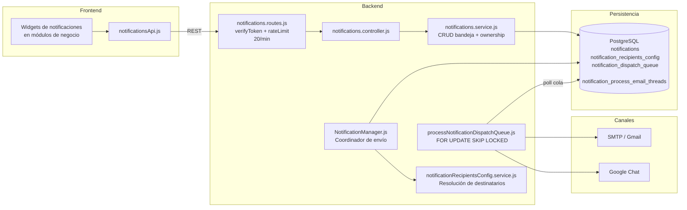

# DOCUMENTO DE DISENO DEL SISTEMA (DS)

## Nombre del modulo
Notificaciones y Comunicaciones

## Arquitectura del modulo
- Capa de presentacion: frontend React o consumidores internos del SPI.
- Capa API: rutas Express bajo prefijos del backend.
- Capa de negocio: controladores y servicios del modulo.
- Capa de persistencia: consultas SQL directas y tablas asociadas.
- Capa transversal: autenticacion, autorizacion, auditoria y notificaciones cuando aplica.

## Componentes del sistema
### Controladores
- `backend/src/modules/notifications/notifications.controller.js`

### Servicios
- `backend/src/modules/notifications/notifications.service.js`
- `backend/src/modules/notifications/notificationManager.js`
- `backend/src/modules/notifications/notificationRecipientsConfig.service.js`
- `backend/src/jobs/processNotificationDispatchQueue.js`

### Modelos
- Sin ORM; SQL directo y procesamiento batch de cola.

### Rutas
- `backend/src/modules/notifications/notifications.routes.js`
- `backend/src/routes/internalJobs.routes.js` (ruta de dispatch)

### Componentes de interfaz
- `spi_front/src/core/api/notificationsApi.js`
- Componentes de consumo transversal en dashboards/widgets de modulos de negocio.

## Modelo de datos asociado
- `notifications`
- `notification_recipients_config`
- `notification_dispatch_queue`
- `notification_process_email_threads`

## Interfaces API
### Notificaciones in-app
- `GET /api/v1/notifications`
- `POST /api/v1/notifications`
- `PATCH /api/v1/notifications/read-all`
- `PATCH /api/v1/notifications/:id/read`
- `DELETE /api/v1/notifications/clear`
- `DELETE /api/v1/notifications/:id`

### Jobs internos
- `POST /internal/jobs/notifications/dispatch`

## Dependencias tecnicas
- Autenticacion y Sesiones.
- Usuarios y Perfiles.
- Comercial, Talento Humano, Servicio Tecnico, TI Soporte (eventos de negocio).
- Integraciones Gmail/Chat para envio multicanal.

## Controles de seguridad y operacion
### Control de acceso
- JWT obligatorio en endpoints `/api/v1/notifications`.
- Endpoint de jobs protegido por `jobsAuth` y clave interna.

### Autenticacion
- Operaciones de usuario basadas en identidad JWT (`req.user.id`).

### Autorizacion
- Acceso acotado por ownership para lectura/modificacion de notificaciones.
- Seleccion de destinatarios por rol/usuario en configuracion de eventos.

### Registro de auditoria
- Trazabilidad de estado de cola (`pending`, `processing`, `sent`, `failed`).
- Metadatos por notificacion (`source`, `priority`, `process_key`, timestamp).

### Proteccion de datos
- Normalizacion de payload y metadatos.
- Reintentos con backoff y control de concurrencia (`FOR UPDATE SKIP LOCKED`).

## Riesgos tecnicos detectados
- Acumulacion de `failed` en cola puede degradar la comunicacion del sistema.
- Dependencia de servicios externos (SMTP/Gmail/Chat) para canales no in-app.
- Error de ausencia de tabla de threads en entornos sin migracion 113.
- Configuracion incorrecta de destinatarios puede producir alertas incompletas.

## Diagrama tecnico

