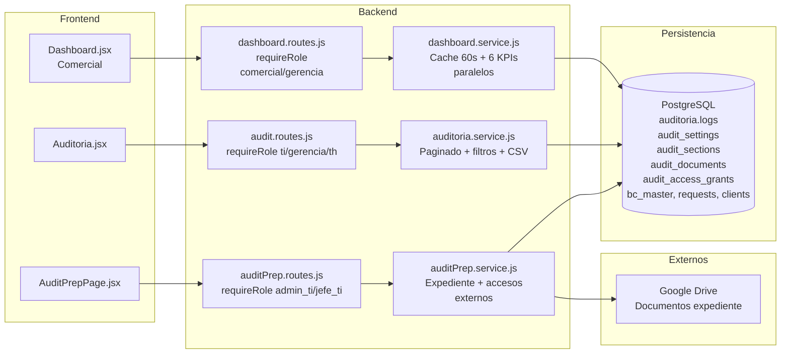

# DOCUMENTO DE DISENO DEL SISTEMA (DS)

## Nombre del modulo
Reportes y Auditoria

## Arquitectura del modulo
- Capa de presentacion: frontend React o consumidores internos del SPI.
- Capa API: rutas Express bajo prefijos del backend.
- Capa de negocio: controladores y servicios del modulo.
- Capa de persistencia: consultas SQL directas y tablas asociadas.
- Capa transversal: autenticacion, autorizacion, auditoria y notificaciones cuando aplica.

## Componentes del sistema
### Controladores
- `backend/src/modules/dashboard/dashboard.controller.js`
- `backend/src/modules/auditoria/audit.controller.js`
- `backend/src/modules/audit-prep/auditPrep.controller.js`

### Servicios
- `backend/src/modules/dashboard/dashboard.service.js`
- `backend/src/modules/auditoria/auditoria.service.js`
- `backend/src/modules/audit-prep/auditPrep.service.js`

### Modelos
- Sin ORM; SQL directo y utilidades de auditoria.

### Rutas
- `backend/src/modules/dashboard/dashboard.routes.js`
- `backend/src/modules/auditoria/audit.routes.js`
- `backend/src/modules/audit-prep/auditPrep.routes.js`

### Componentes de interfaz
- `spi_front/src/modules/comercial/pages/Dashboard.jsx`
- `spi_front/src/modules/gerencia/Auditoria.jsx`
- `spi_front/src/modules/audit-prep/AuditPrepPage.jsx`
- `spi_front/src/core/api/dashboardApi.js`
- `spi_front/src/core/api/auditoriaApi.js`
- `spi_front/src/core/api/auditPrepApi.js`

## Modelo de datos asociado
- `auditoria.logs`
- `audit_settings`
- `audit_sections`
- `audit_documents`
- `audit_access_grants`
- `bc_master`
- `requests`
- `clients`

## Interfaces API
### Dashboard
- `GET /api/v1/dashboard/comercial/summary`

### Auditoria
- `GET /api/v1/auditoria`
- `GET /api/v1/auditoria/:id`
- `GET /api/v1/auditoria/export/csv`

### Preparacion de auditoria
- `GET /api/v1/audit-prep/status`
- `PUT /api/v1/audit-prep/status`
- `GET /api/v1/audit-prep/sections`
- `POST /api/v1/audit-prep/sections`
- `GET /api/v1/audit-prep/documents`
- `POST /api/v1/audit-prep/documents/upload`
- `PATCH /api/v1/audit-prep/documents/:id/status`
- `GET /api/v1/audit-prep/documents/:id/download`
- `GET /api/v1/audit-prep/external-access`
- `POST /api/v1/audit-prep/external-access`
- `DELETE /api/v1/audit-prep/external-access/:id`

## Dependencias tecnicas
- Autenticacion y Usuarios (JWT, roles, identidad de actor).
- Pedidos/Solicitudes (fuente para metricas y eventos auditables).
- Clientes (fuente de KPI de altas y trazabilidad comercial).
- Documentos/Drive (repositorio de evidencias de auditoria).
- TI/Gobierno de datos (operacion del modo auditoria y accesos externos).

## Controles de seguridad y operacion
### Control de acceso
- Seguridad base por JWT global en backend.
- `requireRole` en rutas de auditoria y en operaciones administrativas de `audit-prep`.

### Autenticacion
- Acceso restringido a usuarios autenticados.

### Autorizacion
- Filtrado por rol para consulta de logs y exportaciones.
- Control por seccion (`allowed_roles`) en preparacion de auditoria.
- Restriccion de operaciones sensibles (activar auditoria, accesos externos) a TI/administradores.

### Registro de auditoria
- Persistencia central en `auditoria.logs`.
- `logAction` en cambios de configuracion, carga documental y grants externos.

### Proteccion de datos
- Ocultamiento de identificadores sensibles de Drive en respuestas.
- Restriccion de tipos MIME y tamano maximo de archivo en carga documental.

## Riesgos tecnicos detectados
- En `dashboard.controller` la validacion de rol se ejecuta dentro del controlador, no como middleware de ruta (riesgo de control inconsistente y ejecucion innecesaria en accesos denegados).
- Cache en memoria de dashboard (`60s`) no compartida entre instancias (riesgo de lectura no uniforme en despliegue horizontal).
- Exportacion CSV de auditoria con alto volumen puede afectar rendimiento.
- Dependencia de Google Drive para descarga/subida documental (riesgo de indisponibilidad externa).

## Diagrama tecnico

