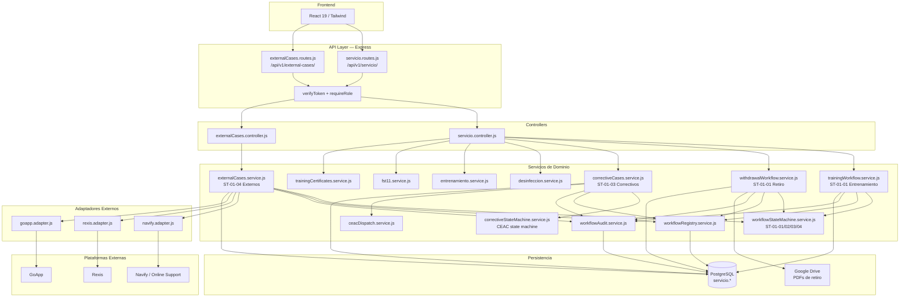

# DS — MÓDULO SERVICIO TÉCNICO Y MANTENIMIENTOS

**Sistema:** FamSPI
**Versión:** 2.0
**Fecha:** 2026-06-18
**Estado:** En revisión
**Alineación:** WHO TRS 1019, Annex 3, Appendix 5

---

## 1. Introducción

El presente documento describe el diseño técnico del módulo Servicio Técnico y Mantenimientos del sistema FamSPI. Define la arquitectura de capas, los componentes del sistema, el modelo de datos inferido del código fuente, las interfaces API y los controles de seguridad aplicados.

El módulo está implementado en `backend/src/modules/servicio/` y es el de mayor superficie de código del sistema: 37 archivos de servicio y controladores, 4 máquinas de estado, 3 workflows con estado persistido, 9 tipos de documentos PDF y 2 conjuntos de rutas. Ningún componente del módulo usa ORM; todas las consultas son SQL directo mediante el pool `../../config/db`.

## 2. Arquitectura del módulo

| Capa | Tecnología | Descripción |
|---|---|---|
| Presentación | React 19 + Tailwind + Bootstrap | Frontend consumidor de las APIs del módulo (no gestionado en este DS) |
| API / Rutas | Express Router | `servicio.routes.js` y `externalCases.routes.js` registrados bajo `/api/v1/servicio` y `/api/v1/external-cases` |
| Middlewares | `verifyToken`, `requireRole` | Aplicados por ruta con grupos de roles específicos según operación |
| Controladores | Express handlers | `servicio.controller.js`, `externalCases.controller.js` — orquestan la llamada a servicios |
| Servicios de dominio | Node.js modules | 30+ servicios especializados por área funcional (ver sección 3) |
| Máquinas de estado | Módulos inmutables (`Object.freeze`) | `workflowStateMachine.service.js`, `correctiveStateMachine.service.js` |
| Adaptadores externos | Patrón Adapter | `adapters/navify.adapter.js`, `adapters/rexis.adapter.js`, `adapters/goapp.adapter.js` |
| Persistencia | PostgreSQL (SQL directo) | Pool `../../config/db`; sin ORM; esquemas `servicio.*` y tablas transversales |
| Almacenamiento externo | Google Drive | `../../utils/drive` → `ensureFolder`, `uploadBase64File` para PDFs del workflow de retiro |
| Logging | `../../config/logger` | Logger centralizado usado en todos los servicios del módulo |

## 3. Componentes del sistema — Backend

### 3.1 Rutas

| Componente | Ruta en el repositorio | Responsabilidad |
|---|---|---|
| `servicio.routes.js` | `backend/src/modules/servicio/servicio.routes.js` | 45 rutas del módulo principal: capacitaciones, disponibilidad, actividades, equipos, mantenimientos, PDFs, workflows de entrenamiento y retiro, correctivos, infraestructura de workflow |
| `externalCases.routes.js` | `backend/src/modules/servicio/externalCases.routes.js` | 13 rutas para casos externos ST-01-04: workspace, KPIs, identidades de proveedor, cola de sincronización, hitos GoApp, decisión CEAC |

### 3.2 Controladores

| Componente | Ruta en el repositorio | Responsabilidad |
|---|---|---|
| `servicio.controller.js` | `backend/src/modules/servicio/servicio.controller.js` | Orquesta todos los servicios del módulo principal; exporta todos los handlers referenciados en `servicio.routes.js` |
| `externalCases.controller.js` | `backend/src/modules/servicio/externalCases.controller.js` | Orquesta `externalCases.service.js`; exporta handlers para workspace, KPIs, proveedores, sincronización, hitos y decisión CEAC |

### 3.3 Servicios de dominio

| Componente | Ruta en el repositorio | Responsabilidad |
|---|---|---|
| `trainingWorkflow.service.js` | `backend/src/modules/servicio/trainingWorkflow.service.js` | Lógica del workflow de entrenamiento ST-01-01: etapas, reglas de asistencia/evaluación/certificado, upsert de estado |
| `withdrawalWorkflow.service.js` | `backend/src/modules/servicio/withdrawalWorkflow.service.js` | Lógica del workflow de retiro ST-01-01: coordinación, desinfección, embalaje, ejecución, cierre; integración con Drive |
| `correctiveCases.service.js` | `backend/src/modules/servicio/correctiveCases.service.js` | Lógica de casos correctivos ST-01-03: creación, workspace, KPIs, detalle, timeline, comentarios, evidencias, acciones |
| `externalCases.service.js` | `backend/src/modules/servicio/externalCases.service.js` | Lógica de casos externos ST-01-04: creación, inbound, sincronización, reconciliación, hitos GoApp, decisión CEAC |
| `workflowStateMachine.service.js` | `backend/src/modules/servicio/workflowStateMachine.service.js` | Definición inmutable de ST-01-01, ST-01-02, ST-01-03, ST-01-04; validación de transiciones; mapa documento→etapa |
| `correctiveStateMachine.service.js` | `backend/src/modules/servicio/correctiveStateMachine.service.js` | Máquina de estado del workflow CEAC para mantenimientos correctivos: 17 estados, transiciones, estados terminales |
| `workflowRegistry.service.js` | `backend/src/modules/servicio/workflowRegistry.service.js` | Persistencia y consulta del estado activo de workflows; `upsertWorkflow`; tipos de fuente soportados |
| `workflowAudit.service.js` | `backend/src/modules/servicio/workflowAudit.service.js` | Registro y consulta de eventos de auditoría de workflow: `appendWorkflowAuditEvent`, timeline |
| `ceacDispatch.service.js` | `backend/src/modules/servicio/ceacDispatch.service.js` | Despacho de casos a roles CEAC/dispatcher; `getUsersByRoles`, `notifyUsers`, `DISPATCH_ROLES` |
| `desinfeccion.service.js` | `backend/src/modules/servicio/desinfeccion.service.js` | Generación de PDF de desinfección (F.ST-02) |
| `entrenamiento.service.js` | `backend/src/modules/servicio/entrenamiento.service.js` | Generación de PDF de coordinación de entrenamiento |
| `asistencia-entrenamiento.service.js` | `backend/src/modules/servicio/asistencia-entrenamiento.service.js` | Generación de PDF de lista de asistencia de entrenamiento |
| `verificacion-equipos.service.js` | `backend/src/modules/servicio/verificacion-equipos.service.js` | Generación de PDF de verificación de equipos nuevos |
| `trainingCertificates.service.js` | `backend/src/modules/servicio/trainingCertificates.service.js` | Emisión y registro de entrega de certificados de entrenamiento |
| `trainingDocumentUtils.service.js` | `backend/src/modules/servicio/trainingDocumentUtils.service.js` | Utilidades transversales para documentos de entrenamiento (evaluación, evaluación especialista, conformidad) |
| `fst06.service.js` | `backend/src/modules/servicio/fst06.service.js` | Documento F.ST-06 |
| `fst07.service.js` | `backend/src/modules/servicio/fst07.service.js` | Documento F.ST-07 (registro de visita técnica) |
| `fst07Pdf.service.js` | `backend/src/modules/servicio/fst07Pdf.service.js` | Generación de PDF del F.ST-07 |
| `fst08.service.js` | `backend/src/modules/servicio/fst08.service.js` | Documento F.ST-08 |
| `fst11.service.js` | `backend/src/modules/servicio/fst11.service.js` | Acta de retiro FST-11; `buildDriveLink` |
| `fst12.service.js` | `backend/src/modules/servicio/fst12.service.js` | Documento F.ST-12 |
| `fst14.service.js` | `backend/src/modules/servicio/fst14.service.js` | Tracking de documentos por código de formulario: `trackWorkflowDocumentByCode` |
| `fst14Pdf.service.js` | `backend/src/modules/servicio/fst14Pdf.service.js` | Generación de PDF del F.ST-14 |
| `installationWorkflow.service.js` | `backend/src/modules/servicio/installationWorkflow.service.js` | Lógica del workflow de instalación (subproceso de ST-01-01) |
| `siteInspectionRules.service.js` | `backend/src/modules/servicio/siteInspectionRules.service.js` | Reglas de inspección de sitio previas a instalación |
| `sparePartsQuotation.service.js` | `backend/src/modules/servicio/sparePartsQuotation.service.js` | Cotización de repuestos en el flujo correctivo |
| `packagingLabels.service.js` | `backend/src/modules/servicio/packagingLabels.service.js` | Etiquetas de embalaje en el workflow de retiro; `ensureWithdrawalPackagingLabelsTable`, `listWithdrawalPackages`, `upsertWithdrawalPackages` |
| `documentCompatibility.service.js` | `backend/src/modules/servicio/documentCompatibility.service.js` | Compatibilidad entre versiones de documentos del módulo |
| `documentTemplateRegistry.service.js` | `backend/src/modules/servicio/documentTemplateRegistry.service.js` | Registro de plantillas de documentos del módulo |
| `externalCaseSync.service.js` | `backend/src/modules/servicio/externalCaseSync.service.js` | Cola de sincronización y reintentos con backoff exponencial para casos externos |

### 3.4 Adaptadores externos

| Componente | Ruta en el repositorio | Proveedor |
|---|---|---|
| `navify.adapter.js` | `backend/src/modules/servicio/adapters/navify.adapter.js` | Navify y Online Support |
| `rexis.adapter.js` | `backend/src/modules/servicio/adapters/rexis.adapter.js` | Rexis |
| `goapp.adapter.js` | `backend/src/modules/servicio/adapters/goapp.adapter.js` | GoApp (con hitos de OT) |

## 4. Modelo de datos

Las siguientes tablas están inferidas de los nombres de columnas y consultas encontradas en los servicios del módulo. El módulo no usa ORM; todas las operaciones son SQL directo.

| Tabla | Descripción |
|---|---|
| `servicio.cronograma_capacitacion` | Cronograma de capacitaciones técnicas del equipo |
| `servicio.disponibilidad_tecnicos` | Estado de disponibilidad individual de técnicos |
| `servicio.cronograma_actividades_tecnicas` | Actividades técnicas registradas con asignación |
| `servicio.cronograma_mantenimientos` | Mantenimientos registrados |
| `servicio.cronograma_mantenimientos_anuales` | Mantenimientos anuales planificados por equipo |
| `servicio.equipos` | Catálogo de equipos bajo responsabilidad técnica |
| `servicio.workflow_registry` | Estado activo de workflows (source_type, source_id, procedure_code, current_state, updated_at) |
| `servicio.workflow_audit_events` | Eventos de auditoría de transiciones de estado (workflow_id, from_state, to_state, action, actor, timestamp) |
| `servicio.workflow_documents` | Documentos generados en el contexto de cada workflow (document_code, stage, drive_link, generated_at) |
| `servicio.corrective_cases` | Casos de mantenimiento correctivo (id, status, equipment_id, client_id, assigned_to, created_at) |
| `servicio.corrective_case_events` | Eventos de timeline de casos correctivos |
| `servicio.corrective_case_comments` | Comentarios de casos correctivos |
| `servicio.corrective_case_evidences` | Evidencias adjuntas a casos correctivos |
| `servicio.external_cases` | Casos externos sincronizados con proveedores (id, provider, external_ref, internal_status, sync_status, attempts) |
| `servicio.external_case_events` | Eventos de casos externos (incluyendo hitos GoApp) |
| `servicio.external_case_sync_queue` | Cola de sincronización pendiente con proveedores externos |
| `servicio.provider_identities` | Identidades de proveedor externo (provider, identity_data, updated_at) |
| `servicio.withdrawal_packaging_labels` | Etiquetas de embalaje del workflow de retiro (gestionadas por `packagingLabels.service.js`) |
| `servicio.training_certificates` | Certificados de entrenamiento emitidos y entregados |

**Nota:** Los nombres exactos de columnas y constraints deben validarse contra el esquema de migración de base de datos. Las tablas aquí listadas están inferidas de las consultas en los servicios y de los campos normalizados en las funciones de los servicios.

## 5. Interfaces API

El módulo expone 58 endpoints distribuidos en dos archivos de rutas. La descripción completa con método, ruta, roles y función está en la tabla de endpoints del FRS (sección 4 de `FRS_modulo_servicio_tecnico_mantenimientos.md`).

Prefijos de ruta:
- `/api/v1/servicio/` — 45 endpoints gestionados por `servicio.routes.js`
- `/api/v1/external-cases/` — 13 endpoints gestionados por `externalCases.routes.js`

## 6. Controles de seguridad

### 6.1 Autenticación

El middleware `verifyToken` está aplicado en cada ruta de `servicio.routes.js`. Para `externalCases.routes.js`, la autenticación debe estar garantizada por el router padre que monta el sub-router.

### 6.2 Autorización por rol

`requireRole` aplica con listas explícitas de roles por ruta. Se definen seis grupos de roles:

- `workflowReadRoles` — 11 roles para lectura de todos los workflows internos
- `withdrawalWriteRoles` — 10 roles para escritura en workflow de retiro
- `correctiveReadRoles` / `correctiveWriteRoles` — 11 roles para mantenimientos correctivos
- `READ_ROLES` / `WRITE_ROLES` (external-cases) — roles diferenciados para casos externos, incluyendo `dispatcher` y `ceac` que no tienen acceso al módulo principal

### 6.3 Integridad de máquinas de estado

Las transiciones de estado son validadas antes de cualquier persistencia:
- `workflowStateMachine.service.js` → `isValidTransition({ procedureCode, fromState, toState })` para ST-01-01, ST-01-02, ST-01-03, ST-01-04
- `correctiveStateMachine.service.js` → `assertTransition({ fromStatus, toStatus })` para casos correctivos; lanza error HTTP 400 con código `CORRECTIVE_CASE_INVALID_TRANSITION` si la transición no es válida

### 6.4 Trazabilidad de cambios

Cada transición de estado persiste un evento de auditoría mediante `appendWorkflowAuditEvent` en `workflowAudit.service.js`. La línea de tiempo de cualquier workflow es reconstruible desde los eventos persistidos.

### 6.5 Configuración de sincronización externa

Los límites de reintentos y backoff para sincronización con proveedores externos se configuran mediante variables de entorno:
- `EXTERNAL_CASE_SYNC_MAX_ATTEMPTS` (default: 5)
- `EXTERNAL_CASE_SYNC_BACKOFF_BASE_MS` (default: 60000 ms)
- `EXTERNAL_CASE_SYNC_BACKOFF_MAX_MS` (default: 21600000 ms / 6 horas)

## 7. Riesgos técnicos detectados

| Riesgo | Severidad | Descripción | Acción recomendada |
|---|---|---|---|
| `verifyToken` ausente en `externalCases.routes.js` | Alta | El archivo de rutas de casos externos no incluye `verifyToken` explícito — confía en el router padre | Verificar que el router padre aplique `verifyToken` antes del mount; considerar añadirlo defensivamente en el archivo de rutas |
| Acumulación de cola en `sync_error` | Media | Si un proveedor externo tiene downtime prolongado, la cola puede acumular entradas que excedan el máximo de reintentos y queden sin procesar | Implementar monitoreo de cola y alerta cuando el conteo de `sync_error` supere un umbral |
| Escrituras concurrentes en `workflow_registry` | Media | `upsertWorkflow` es invocado por múltiples servicios; sin bloqueo optimista puede haber condiciones de carrera | Añadir `updated_at` con CAS (compare-and-swap) o transacción en el upsert |
| PDFs en almacenamiento temporal | Baja | Algunos servicios PDF pueden escribir en `/tmp`; en reinicios o contenedores efímeros estos archivos se pierden | Normalizar todos los servicios PDF para retornar en base64 o subir directamente a Drive |
| Complejidad de `correctiveCases.service.js` | Media | El servicio correctivo concentra creación, workspace, KPIs, timeline, comentarios, evidencias y acciones | Documentar como deuda de refactorización; separar en servicios específicos en una iteración futura |
| Precondiciones de hitos GoApp no atómicas | Baja | Si la validación y la persistencia del hito no están en la misma transacción SQL, una falla entre ambas puede dejar el estado inconsistente | Envolver la validación y la inserción del hito en una transacción SQL |
| Número de roles por grupo | Baja | Los grupos `correctiveReadRoles`, `correctiveWriteRoles` y `READ_ROLES` tienen 11–14 roles cada uno; cambios organizacionales requieren actualizar múltiples listas | Centralizar las listas de roles en un archivo de configuración compartido |

## 8. Diagrama técnico

