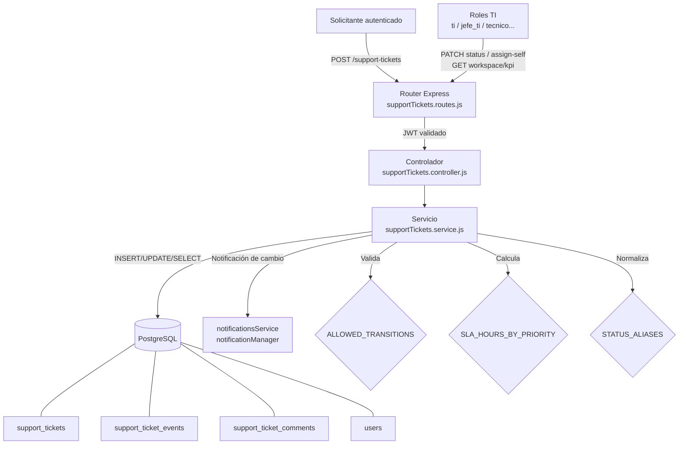

# DS — MÓDULO TI, SOPORTE Y TICKETS

**Sistema:** FamSPI
**Versión:** 2.0
**Fecha:** 2026-06-18
**Estado:** En revisión
**Alineación:** WHO TRS 1019, Annex 3, Appendix 5

---

## 1. Introducción

El presente documento describe el diseño técnico del módulo TI, Soporte y Tickets de FamSPI. Cubre la arquitectura de capas, los componentes con sus rutas reales, el modelo de datos con las tablas y columnas observadas en el código, las interfaces API implementadas, los controles de seguridad aplicados y los riesgos técnicos identificados.

## 2. Arquitectura

| Capa | Descripción | Implementación |
|---|---|---|
| Presentación | Frontend React consumidor de la API de soporte | `spi_front/src/modules/ti/pages/TicketsWorkspace.jsx` |
| API / Rutas | Router Express que define los 12 endpoints del módulo | `backend/src/modules/support-tickets/supportTickets.routes.js` |
| Controladores | Funciones que reciben `req/res` y delegan al servicio | `backend/src/modules/support-tickets/supportTickets.controller.js` |
| Servicios / Lógica | Validaciones de negocio, cálculo SLA, transiciones de estado, persistencia | `backend/src/modules/support-tickets/supportTickets.service.js` |
| Persistencia | PostgreSQL con SQL directo (sin ORM) | Tablas `support_tickets`, `support_ticket_events`, `support_ticket_comments` |
| Transversal | JWT auth, control de roles, notificaciones | `middlewares/auth`, `notificationsService`, `notificationManager` |

## 3. Componentes

### 3.1 Router

| Archivo | Prefijo de montaje | Descripción |
|---|---|---|
| `backend/src/modules/support-tickets/supportTickets.routes.js` | `/api/v1/support-tickets` | Define los 12 endpoints del módulo; aplica `requireRole(TI_ROLES)` en 4 rutas de gestión |

### 3.2 Controlador

| Archivo | Funciones exportadas |
|---|---|
| `backend/src/modules/support-tickets/supportTickets.controller.js` | `create`, `listMy`, `listEvents`, `listComments`, `addComment`, `reopen`, `closeByRequester`, `rateSatisfaction`, `listWorkspace`, `kpiWorkspace`, `assignSelf`, `updateStatus` |

### 3.3 Servicio

| Archivo | Responsabilidades |
|---|---|
| `backend/src/modules/support-tickets/supportTickets.service.js` | Inicialización de esquema (`ensureSupportSchema`), definición de constantes de dominio, validación de transiciones (`ALLOWED_TRANSITIONS`), cálculo SLA (`SLA_HOURS_BY_PRIORITY`), normalización de estados (`normalizeStatus`), exportación de `TI_ROLES` |

**Constantes de dominio exportadas por el servicio:**

| Constante | Tipo | Valores |
|---|---|---|
| `TICKET_TYPES` | Set | `fallo`, `implementacion`, `requerimiento`, `problema` |
| `TICKET_PRIORITIES` | Set | `baja`, `media`, `alta`, `critica` |
| `TICKET_STATUSES` | Set | `abierto`, `triage`, `en_progreso`, `en_espera`, `resuelto`, `cerrado`, `reabierto` |
| `TI_ROLES` | Array | `ti`, `jefe_ti`, `admin_ti`, `jefe_de_ti`, `tecnico`, `jefe_tecnico`, `servicio_tecnico`, `jefe_servicio_tecnico` |
| `ALLOWED_LVL` | Set | `bajo`, `medio`, `alto` |
| `COMMENT_VISIBILITY` | Set | `public`, `internal` |
| `STATUS_ALIASES` | Object | `terminado → resuelto` |
| `SLA_HOURS_BY_PRIORITY` | Object | Ver tabla SLA en sección 4 |
| `ALLOWED_TRANSITIONS` | Object de Sets | Ver tabla de transiciones en sección 4 |

### 3.4 Frontend

| Archivo | Rol |
|---|---|
| `spi_front/src/modules/ti/pages/TicketsWorkspace.jsx` | Workspace exclusivo para roles TI |
| `spi_front/src/core/api/supportTicketsApi.js` | Cliente API del módulo |

## 4. Modelo de datos

### Tabla: `support_tickets`

| Columna | Tipo | Restricción | Descripción |
|---|---|---|---|
| `id` | BIGSERIAL | PRIMARY KEY | Identificador interno |
| `code` | VARCHAR(24) | UNIQUE | Código legible del ticket |
| `requester_id` | INTEGER | FK → `users(id)` ON DELETE CASCADE | Usuario solicitante |
| `assigned_ti_user_id` | INTEGER | FK → `users(id)` ON DELETE SET NULL | Técnico TI asignado |
| `ticket_type` | VARCHAR(20) | CHECK IN (tipos válidos) | `fallo`, `implementacion`, `requerimiento`, `problema` |
| `title` | VARCHAR(180) | NOT NULL | Título del ticket |
| `description` | TEXT | NOT NULL | Descripción detallada |
| `priority` | VARCHAR(10) | DEFAULT `media`, CHECK | `baja`, `media`, `alta`, `critica` |
| `status` | VARCHAR(20) | NOT NULL DEFAULT `abierto` | Estado actual del ticket |
| `impact` | VARCHAR(10) | NOT NULL DEFAULT `medio` | Nivel de impacto |
| `urgency` | VARCHAR(10) | NOT NULL DEFAULT `medio` | Nivel de urgencia |
| `category` | VARCHAR(100) | Nullable | Categoría libre |
| `subcategory` | VARCHAR(100) | Nullable | Subcategoría libre |
| `first_response_at` | TIMESTAMPTZ | Nullable | Momento de primera respuesta real |
| `first_response_due_at` | TIMESTAMPTZ | Nullable | Vencimiento SLA de primera respuesta |
| `resolution_due_at` | TIMESTAMPTZ | Nullable | Vencimiento SLA de resolución |
| `sla_response_breached` | BOOLEAN | NOT NULL DEFAULT FALSE | Indicador de incumplimiento SLA respuesta |
| `sla_resolution_breached` | BOOLEAN | NOT NULL DEFAULT FALSE | Indicador de incumplimiento SLA resolución |
| `on_hold_reason` | TEXT | Nullable | Motivo de pausa (estado `en_espera`) |
| `reopened_count` | INTEGER | NOT NULL DEFAULT 0 | Número de reaperturas |
| `last_reopened_at` | TIMESTAMPTZ | Nullable | Última reapertura |
| `closed_by_requester` | BOOLEAN | NOT NULL DEFAULT FALSE | Indica cierre iniciado por solicitante |
| `satisfaction_score` | SMALLINT | Nullable | Puntuación CSAT (1–5) |
| `satisfaction_comment` | TEXT | Nullable | Comentario CSAT |
| `resolved_at` | TIMESTAMPTZ | Nullable | Momento de resolución |
| `created_at` | TIMESTAMPTZ | NOT NULL DEFAULT NOW() | Creación |
| `updated_at` | TIMESTAMPTZ | NOT NULL DEFAULT NOW() | Última actualización |

### Tabla: `support_ticket_events`

| Columna | Tipo | Descripción |
|---|---|---|
| `id` | BIGSERIAL | Identificador |
| `ticket_id` | BIGINT FK | Referencia al ticket |
| `event_type` | TEXT | `created`, `assigned`, `status_changed`, `commented`, `reopened`, `closed_by_requester`, `satisfaction_rated` |
| `payload` | JSONB | Datos del evento (estado anterior/nuevo, actor, etc.) |
| `created_by` | INTEGER FK → `users` | Usuario que generó el evento |
| `created_at` | TIMESTAMPTZ | Timestamp del evento |

### Tabla: `support_ticket_comments`

| Columna | Tipo | Descripción |
|---|---|---|
| `id` | BIGSERIAL | Identificador |
| `ticket_id` | BIGINT FK | Referencia al ticket |
| `author_id` | INTEGER FK → `users` | Autor del comentario |
| `body` | TEXT | Contenido del comentario |
| `visibility` | TEXT | `public` o `internal` |
| `created_at` | TIMESTAMPTZ | Timestamp del comentario |

### SLA por prioridad (`SLA_HOURS_BY_PRIORITY`)

| Prioridad | Respuesta (horas) | Resolución (horas) |
|---|---|---|
| `critica` | 1 | 8 |
| `alta` | 4 | 24 |
| `media` | 8 | 72 |
| `baja` | 24 | 120 |

### Matriz de transiciones permitidas (`ALLOWED_TRANSITIONS`)

| Estado actual | Transiciones válidas |
|---|---|
| `abierto` | `triage`, `en_progreso`, `en_espera`, `resuelto`, `cerrado` |
| `triage` | `en_progreso`, `en_espera`, `resuelto`, `cerrado` |
| `en_progreso` | `en_espera`, `resuelto`, `cerrado` |
| `en_espera` | `triage`, `en_progreso`, `resuelto`, `cerrado` |
| `resuelto` | `cerrado`, `reabierto` |
| `cerrado` | `reabierto` |
| `reabierto` | `triage`, `en_progreso`, `en_espera`, `resuelto`, `cerrado` |

## 5. Interfaces API

| Método | Ruta | Middleware de rol | Controlador |
|---|---|---|---|
| POST | `/api/v1/support-tickets` | JWT | `create` |
| GET | `/api/v1/support-tickets/my` | JWT | `listMy` |
| GET | `/api/v1/support-tickets/:id/events` | JWT | `listEvents` |
| GET | `/api/v1/support-tickets/:id/comments` | JWT | `listComments` |
| POST | `/api/v1/support-tickets/:id/comments` | JWT | `addComment` |
| POST | `/api/v1/support-tickets/:id/reopen` | JWT | `reopen` |
| POST | `/api/v1/support-tickets/:id/close` | JWT | `closeByRequester` |
| POST | `/api/v1/support-tickets/:id/satisfaction` | JWT | `rateSatisfaction` |
| GET | `/api/v1/support-tickets/workspace/list` | JWT + `requireRole(TI_ROLES)` | `listWorkspace` |
| GET | `/api/v1/support-tickets/workspace/kpi` | JWT + `requireRole(TI_ROLES)` | `kpiWorkspace` |
| PATCH | `/api/v1/support-tickets/:id/assign-self` | JWT + `requireRole(TI_ROLES)` | `assignSelf` |
| PATCH | `/api/v1/support-tickets/:id/status` | JWT + `requireRole(TI_ROLES)` | `updateStatus` |

## 6. Controles de seguridad

| Control | Implementación | Alcance |
|---|---|---|
| Autenticación JWT | Aplicado en todas las rutas del router | 12/12 endpoints |
| Control de rol `TI_ROLES` | `requireRole(TI_ROLES)` importado de `supportTickets.service.js` | 4 endpoints de workspace y gestión |
| Acceso a datos propios | Validación `requester_id = req.user.id` en el servicio | `close`, `reopen`, `satisfaction` |
| Visibilidad de comentarios | Filtro por `visibility = 'public'` para no-TI | `listComments`, `addComment` |
| Validación de dominio | Sets inmutables `TICKET_TYPES`, `TICKET_PRIORITIES`, `COMMENT_VISIBILITY`, `ALLOWED_LVL` | `create`, `addComment` |
| Validación de transiciones | `ALLOWED_TRANSITIONS[currentStatus].has(newStatus)` | `updateStatus`, `reopen`, `closeByRequester` |
| SLA calculado en servidor | `SLA_HOURS_BY_PRIORITY` aplicado en `create` | Previene manipulación desde cliente |

## 7. Riesgos técnicos

| Riesgo | Nivel | Descripción |
|---|---|---|
| Inicialización de esquema en runtime | Alto | Si `ensureSupportSchema()` falla al arrancar, el módulo completo queda inoperativo hasta el siguiente reinicio del servidor |
| Carga de tickets críticos | Medio | Con SLA de 1h/8h para tickets `critica`, la saturación del equipo TI genera `sla_response_breached = true` en masa; el KPI degrada la visibilidad operativa |
| Error en `ALLOWED_TRANSITIONS` | Alto | Un error de configuración en la matriz bloquea transiciones válidas o permite transiciones no autorizadas, comprometiendo la integridad del flujo |
| Comentarios internos desde API | Medio | Un solicitante puede intentar enviar `visibility = internal` directamente; la validación en servicio debe rechazarlo, pero depende de que el check de rol sea correcto |
| Alias de estado en `STATUS_ALIASES` | Bajo | El alias `terminado → resuelto` puede generar confusión si se amplía sin documentar; actualmente es el único alias existente |

## 8. Diagrama técnico

