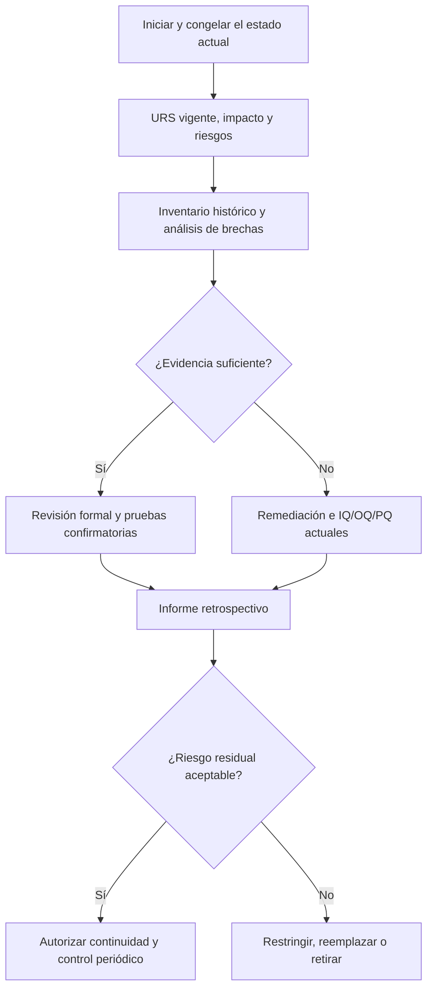

# Guía y paquete documental para la validación retrospectiva de software y sistemas heredados basado en lineamientos de la OMS (WHO)

**Aplicación principal:** sistemas computarizados heredados que ya se encuentran en uso en actividades GMP/GxP y que no disponen de un expediente de validación completo o conforme a expectativas actuales.  
**Versión de esta guía:** 2.0 — enfoque retrospectivo  
**Fecha:** 21 de julio de 2026  
**Estado:** modelo de trabajo adaptable para reconstrucción y evaluación retrospectiva; no sustituye la evaluación de la autoridad sanitaria ni los procedimientos del sistema de gestión de calidad de cada organización.

---

## 1. Objetivo

Esta guía explica cómo planificar, ejecutar, documentar, aprobar y mantener la **validación o cualificación retrospectiva de un sistema computarizado heredado** con base en los principios de la Organización Mundial de la Salud (OMS/WHO). El enfoque se utiliza cuando el sistema ya opera, pero su documentación original de desarrollo, instalación o validación es incompleta, antigua o no satisface las expectativas GxP actuales. Incluye:

- la estructura completa del expediente retrospectivo;
- criterios para determinar si el sistema es candidato a validación retrospectiva, requiere remediación o debe reemplazarse;
- inventario y evaluación de la evidencia histórica disponible;
- análisis de brechas contra requisitos actuales;
- reconstrucción controlada de URS, descripción y configuración **as-is**;
- los apartados mínimos de cada documento;
- formatos reutilizables;
- criterios de aceptación;
- ejemplos de requisitos y pruebas;
- evaluación de riesgos;
- trazabilidad desde el requisito hasta la evidencia;
- controles de integridad de datos ALCOA+;
- operación, mantenimiento, revisión periódica, migración y retiro;
- un ejemplo retrospectivo desarrollado para un sistema heredado de gestión de resultados de laboratorio.

La validación retrospectiva no consiste en declarar que “el sistema funciona porque nunca ha fallado”. Debe aportar evidencia objetiva y documentada de que el **sistema completo actual** —software, hardware, infraestructura, configuración, interfaces, datos, procedimientos y personas— permanece bajo control y satisface de forma consistente su uso previsto. La historia de desempeño es una fuente de evidencia, no un reemplazo automático de requisitos, evaluación de riesgos ni pruebas actuales.

---

## 2. Base normativa oficial de la OMS

### 2.1 Documento principal

**WHO Technical Report Series (TRS) No. 1019, 2019, Annex 3, Appendix 5: Validation of computerized systems.**

- Página oficial/PDF: [WHO TRS 1019, Annex 3 — GMP: guidelines on validation](https://www.who.int/docs/default-source/medicines/norms-and-standards/guidelines/production/trs1019-annex3-gmp-validation.pdf)
- El Apéndice 5 comienza en la página impresa 160 del documento, correspondiente aproximadamente a la página 42 del archivo PDF.

Este documento establece que el alcance de la validación debe ser proporcional al riesgo, complejidad y uso previsto; exige un protocolo aprobado, requisitos verificables, evaluación del proveedor, especificaciones, pruebas de cualificación, procedimientos, capacitación, informe final y mantenimiento del estado validado durante todo el ciclo de vida.

### 2.2 Integridad de datos

**WHO Technical Report Series No. 1033, 2021, Annex 4: WHO Guideline on data integrity.**

- Página oficial: [WHO TRS 1033, Annex 4 — Guideline on data integrity](https://www.who.int/publications/m/item/annex-4-trs-1033)
- Descarga directa: [PDF oficial de la guía de integridad de datos](https://cdn.who.int/media/docs/default-source/medicines/norms-and-standards/guidelines/inspections/trs1033-annex4-guideline-on-data-integrity.pdf?download=true)

Esta guía aplica los principios **ALCOA+** a datos electrónicos, en papel e híbridos. También desarrolla controles de acceso, trazabilidad, pistas de auditoría, administración de usuarios, transferencia de datos, revisión de metadatos y conservación durante el ciclo de vida.

### 2.3 Principio rector

La documentación debe demostrar, como mínimo, que:

1. el uso previsto está claramente definido;
2. los requisitos del usuario son completos, aprobados y verificables;
3. los riesgos para calidad del producto, seguridad del paciente e integridad de datos fueron identificados y controlados;
4. el diseño y la configuración satisfacen los requisitos;
5. el sistema fue instalado correctamente;
6. funciona correctamente dentro de los rangos previstos y ante entradas erróneas;
7. funciona en el proceso real con usuarios capacitados;
8. cada requisito crítico tiene una prueba y evidencia;
9. las desviaciones fueron investigadas y resueltas;
10. Calidad autorizó el uso rutinario;
11. existen controles para conservar el estado validado hasta el retiro del sistema.

### 2.4 Fundamento específico para sistemas heredados

El apartado 12.6–12.10 del Apéndice 5 del WHO TRS 1019 establece el enfoque aplicable a sistemas heredados. Traducido a una metodología documental, exige demostrar que:

1. la continuidad del sistema sigue siendo relevante y justificable para el proceso GMP/GxP;
2. la criticidad del sistema ha sido determinada mediante evaluación de riesgos;
3. se ha realizado un análisis de brechas sobre URS, IQ/OQ/PQ, SOP, operación y mantenimiento;
4. existe una URS vigente y documentada contra la cual evaluar el sistema actual;
5. se ha recopilado y revisado formalmente el historial de uso, mantenimiento, errores, incidentes y cambios;
6. el historial cubre el rango actual de operación y las prácticas vigentes;
7. cuando la evidencia histórica es incompleta o no representativa, se ejecutan pruebas actuales y acciones de remediación;
8. hardware, software, dispositivos, redes, procesos y controles se encuentran cualificados y aceptados;
9. el sistema permanece en estado de control y es apto para su uso previsto actual;
10. los requisitos GMP e integridad de datos se cumplen o existe un plan temporal de mitigación y reemplazo formalmente aprobado.

### 2.5 Uso correcto del término “retrospectiva”

En esta guía, **validación retrospectiva** significa una evaluación estructurada de un sistema ya operativo mediante la combinación de:

- requisitos y descripción actuales reconstruidos;
- evidencia histórica confiable;
- verificación del estado instalado actual;
- análisis de brechas y riesgos;
- pruebas actuales focalizadas;
- remediación y controles compensatorios;
- aprobación formal de continuidad.

No significa aprobar retroactivamente actividades pasadas sin evidencia. Tampoco permite “fabricar” documentos con fechas antiguas. Todo documento reconstruido debe llevar su fecha real de elaboración, identificar que es retrospectivo y citar las fuentes utilizadas.

---

## 3. Conceptos esenciales

| Concepto | Aplicación práctica |
|---|---|
| **Sistema computarizado** | Conjunto de software, hardware, red, infraestructura, interfaces, datos, procedimientos y personas que ejecuta una función regulada. |
| **Uso previsto** | Proceso y finalidad específica para los cuales la organización utilizará el sistema. Define qué debe validarse. |
| **Validación** | Evidencia documentada y objetiva de que los requisitos definidos pueden cumplirse de manera consistente y el sistema es apto para el uso previsto. |
| **Cualificación de diseño (DQ)** | Revisión documentada que demuestra que el diseño y la configuración propuestos satisfacen los requisitos aplicables. |
| **IQ** | Evidencia de que software, hardware y componentes están instalados y configurados conforme a especificaciones aprobadas. |
| **OQ** | Evidencia de que las funciones operan correctamente en los rangos previstos, incluidos límites, errores y controles. |
| **PQ** | Evidencia de que el sistema completo funciona en el proceso real o en un entorno equivalente, bajo condiciones de uso rutinario. |
| **UAT** | Pruebas ejecutadas por usuarios finales capacitados para aceptar que el sistema y sus procedimientos soportan el proceso real. Puede formar parte de PQ. |
| **Trazabilidad** | Relación documentada entre riesgo, requisito, diseño/configuración, caso de prueba, resultado, evidencia y desviación. |
| **Pista de auditoría** | Registro seguro, generado por el sistema y con fecha/hora, que permite reconstruir quién hizo qué, cuándo y, cuando corresponda, por qué. |
| **Estado validado** | Condición controlada en la que el sistema continúa cumpliendo sus requisitos y uso previsto después de su liberación. |
| **Dato crítico** | Dato cuya pérdida, alteración, indisponibilidad o uso incorrecto puede afectar una decisión GxP, calidad del producto o seguridad del paciente. |

---

## 4. Principios ALCOA+

| Principio | Pregunta de control | Ejemplo de evidencia |
|---|---|---|
| **Atribuible** | ¿Se conoce de forma inequívoca quién realizó la acción? | Usuario individual, firma electrónica, pista de auditoría. |
| **Legible** | ¿El dato y su contexto pueden leerse durante toda la retención? | Exportación legible, visor disponible, formato documentado. |
| **Contemporáneo** | ¿El registro se genera al momento de la actividad? | Sello de tiempo sincronizado y controles contra cambios de fecha. |
| **Original** | ¿Se conserva el dato fuente o una copia exacta verificada? | Registro electrónico nativo, metadatos, checksum o reconciliación. |
| **Exacto** | ¿El dato es correcto y está protegido contra alteraciones indebidas? | Validaciones de entrada, cálculos verificados, revisión y aprobación. |
| **Completo** | ¿Incluye repeticiones, errores, anulaciones y cambios? | Historial íntegro y pista de auditoría habilitada. |
| **Consistente** | ¿La secuencia, fecha, hora y relaciones son coherentes? | Reloj sincronizado, orden cronológico y claves referenciales. |
| **Duradero** | ¿Permanece protegido durante el periodo requerido? | Respaldo, archivo, controles de retención y recuperación. |
| **Disponible** | ¿Puede recuperarse oportunamente para revisión o inspección? | Prueba de restauración y prueba de recuperación de archivo. |

**Regla práctica:** una impresión en PDF no sustituye necesariamente el registro electrónico original. Si el significado del registro depende de metadatos, historial, firmas o pista de auditoría, esos elementos deben conservarse y poder revisarse.

---

## 5. Determinación de alcance y aplicabilidad

### 5.1 Preguntas iniciales

Antes de iniciar el proyecto, documentar:

1. ¿El sistema crea, modifica, calcula, aprueba, transmite, almacena, reporta o elimina datos GxP?
2. ¿Controla un proceso que puede afectar identidad, potencia, pureza, seguridad o calidad de un producto?
3. ¿Genera información usada para liberar o rechazar producto, tomar decisiones clínicas o emitir resultados de laboratorio?
4. ¿Sustituye un registro o firma en papel?
5. ¿Se conecta con equipos, instrumentos u otros sistemas?
6. ¿Se encuentra en nube, es SaaS, COTS/configurable o desarrollado a medida?
7. ¿Procesa datos críticos o datos personales sensibles?
8. ¿Una falla podría no ser detectada antes de afectar un producto, paciente o decisión regulada?

Si alguna respuesta es afirmativa, debe ejecutarse una evaluación formal de impacto y riesgo. El nivel de documentación y pruebas se ajusta al riesgo, pero la justificación de esa reducción también debe quedar documentada.

### 5.2 Clasificación de impacto sugerida

| Clase | Descripción | Ejemplo | Tratamiento sugerido |
|---|---|---|---|
| **GxP directo** | Ejecuta o controla una actividad regulada o genera un registro GxP. | LIMS, MES, sistema de liberación, cromatografía. | Validación completa basada en riesgo. |
| **GxP indirecto** | Soporta infraestructura o disponibilidad de un sistema GxP. | Directorio de usuarios, plataforma de respaldo, servidor. | Cualificación y controles proporcionados al riesgo. |
| **No GxP** | No influye en calidad, paciente ni datos regulados. | Portal de noticias internas. | Documentar evaluación de no aplicabilidad; pruebas corporativas normales. |

### 5.3 Categoría tecnológica sugerida

La OMS no obliga a usar una clasificación específica de categorías de software. Sin embargo, para dimensionar el esfuerzo puede documentarse:

| Tipo | Riesgo típico | Evidencia esperada |
|---|---|---|
| Infraestructura estándar | Bajo a medio | Especificación, instalación, configuración, seguridad, respaldo y monitoreo. |
| Producto COTS no configurado | Bajo a medio | Evaluación del proveedor, uso previsto, IQ y verificación funcional focalizada. |
| Sistema configurable/SaaS | Medio a alto | Configuración aprobada, roles, flujos, interfaces, auditoría, pruebas de configuración y acuerdo con proveedor. |
| Software a medida | Alto | Ciclo de desarrollo documentado, diseño, revisión de código, pruebas unitarias, integración, seguridad e IQ/OQ/PQ. |
| Sistema heredado | Variable | URS actual, análisis de brechas, historial, incidentes, cambios, evaluación de riesgos y cualificación retrospectiva justificada. |

### 5.4 Evaluación de elegibilidad para validación retrospectiva

Antes de aprobar esta estrategia, responder y documentar:

| Criterio | Aceptable para continuar | Señal de no elegibilidad o escalamiento |
|---|---|---|
| Uso previsto actual | Está definido y sigue siendo necesario. | El uso real es desconocido, variable o no autorizado. |
| Identidad del sistema | Versión, componentes y configuración pueden determinarse. | No se puede identificar qué software/configuración está en producción. |
| Historial | Existen registros confiables de uso, incidentes, cambios y mantenimiento. | Registros inexistentes, manipulables o con periodos extensos sin cobertura. |
| Integridad de datos | Los datos y metadatos esenciales son atribuibles, íntegros y recuperables. | Alteraciones no trazables, pérdida sistemática de originales o cuentas compartidas sin control. |
| Estado técnico | Sistema estable, soportado o con riesgo de obsolescencia controlado. | Producto sin soporte, vulnerabilidades críticas o fallas recurrentes no resueltas. |
| Capacidad de prueba | Funciones críticas pueden probarse sin riesgo inaceptable para producción. | No existe ambiente seguro ni puede controlarse el impacto de la prueba. |
| Remediación | Las brechas pueden cerrarse o mitigarse dentro de plazos definidos. | La arquitectura impide controles básicos y no existe solución temporal fiable. |
| Proceso | El uso histórico representa el proceso actual. | Hubo cambios significativos no evaluados o el historial no cubre el rango vigente. |

### 5.5 Decisión de estrategia

| Resultado | Estrategia |
|---|---|
| Evidencia suficiente y brechas controlables | Validación retrospectiva completa con pruebas focalizadas. |
| Evidencia parcial, pero sistema controlable | Remediación prioritaria + cualificación retrospectiva + pruebas ampliadas. |
| Evidencia histórica no representativa | Tratar como validación actual: URS vigente e IQ/OQ/PQ prospectivas sobre el estado actual. |
| Riesgo inaceptable o controles esenciales imposibles | Restringir/suspender, implementar controles temporales y planificar reemplazo. |
| Sistema en retiro inmediato | Plan de retiro y validación de archivo/migración, no validación retrospectiva completa. |

La decisión debe ser aprobada por el propietario del proceso, IT y Calidad. Si se decide continuar con controles compensatorios, estos deben tener responsable, frecuencia, evidencia, fecha límite y criterio de salida.

---

## 6. Ciclo de validación retrospectiva



**Puntos de decisión:** no debe aceptarse evidencia cuya autenticidad, versión, fecha, alcance o relación con el estado actual no pueda demostrarse. Una desviación crítica abierta impide concluir que el sistema se encuentra validado. Toda nueva prueba debe usar protocolos vigentes y previamente aprobados.

### 6.1 Fase 1 — inicio y control del estado actual

Antes de evaluar retrospectivamente el sistema:

- abrir un proyecto o control de cambio formal;
- identificar propietario del proceso, propietario técnico y QA;
- registrar versión, componentes, configuración, interfaces y ambientes actuales;
- proteger la línea base para evitar cambios no evaluados durante el estudio;
- definir cómo se manejarán cambios urgentes mientras la validación está abierta;
- documentar restricciones de prueba en producción;
- establecer medidas inmediatas si se identifica riesgo para datos, producto o paciente.

La “fotografía” del estado actual debe llevar fecha, fuente, responsable y evidencia. No debe asumirse que la configuración que aparece en un manual antiguo coincide con producción.

### 6.2 Fase 2 — reconstrucción de requisitos y estado **as-is**

La URS retrospectiva debe describir el uso **actual**, no el que originalmente se planeó. Para construirla se pueden revisar:

- SOP y formularios vigentes;
- entrevistas estructuradas con usuarios y propietarios;
- pantallas, reportes y flujos actuales;
- contratos, manuales y documentación del proveedor;
- configuración extraída del sistema;
- datos, metadatos e interfaces reales;
- requisitos regulatorios y de integridad de datos vigentes;
- incidentes, cambios y necesidades operativas conocidas.

Cada requisito reconstruido debe marcarse como:

- `R`: requisito regulatorio;
- `B`: requisito del proceso/negocio;
- `D`: requisito de integridad de datos;
- `T`: requisito técnico/operativo;
- `H`: requisito inferido y sustentado por evidencia histórica.

La fecha de aprobación es la fecha actual. No deben crearse documentos retrofechados.

### 6.3 Fase 3 — inventario de evidencia histórica

Crear un índice maestro de todas las evidencias disponibles:

| ID evidencia | Documento/registro | Periodo | Versión/configuración | Fuente/custodio | Integridad verificada | Requisito/riesgo cubierto | Aceptada/Parcial/Rechazada |
|---|---|---|---|---|---|---|---|
| HE-001 | Registro de cambios | 2022–2026 | Varias | IT | Sí | Gestión de configuración | Parcial |
| HE-002 | Resultados de restauración | 2025 | v4.6 | Infraestructura | Sí | URS-BCK-001 | Aceptada |

Fuentes posibles:

- protocolos o pruebas anteriores;
- actas de instalación y puesta en marcha;
- manuales y especificaciones del proveedor;
- contratos, licencias y notas de versión;
- tickets de soporte;
- registros de incidentes, problemas y CAPA;
- controles de cambio y despliegues;
- registros de mantenimiento y parches;
- respaldos y restauraciones;
- monitoreo, capacidad y disponibilidad;
- administración y revisión de usuarios;
- capacitación;
- revisión de pistas de auditoría;
- auditorías internas/externas;
- lotes, muestras o transacciones procesadas;
- desviaciones, OOS/OOT u otros eventos relacionados;
- reportes firmados o aprobados;
- pruebas de continuidad y recuperación.

### 6.4 Reglas para aceptar evidencia histórica

Una evidencia histórica solo debe utilizarse si:

1. es atribuible a una persona, sistema o fuente controlada;
2. tiene fecha o periodo identificable;
3. puede relacionarse con la versión/configuración evaluada;
4. conserva contenido y contexto suficientes;
5. no presenta alteraciones no explicadas;
6. cubre el requisito o riesgo declarado;
7. representa el rango operativo actual;
8. fue generada bajo un proceso razonablemente controlado;
9. es legible, recuperable y revisable;
10. su limitación se declara explícitamente.

No son suficientes por sí solos:

- testimonios sin registro;
- ausencia de quejas;
- una captura sin origen ni fecha;
- manuales que describen una versión distinta;
- estadísticas agregadas que ocultan fallas;
- resultados seleccionados sin criterio de muestreo;
- “siempre se ha hecho así”;
- documentos creados después y presentados como históricos.

### 6.5 Fase 4 — análisis de brechas retrospectivo

Comparar el estado actual y la evidencia contra cada requisito vigente:

| ID brecha | Requisito/control esperado | Evidencia existente | Estado actual | Brecha | Riesgo | Acción | Prueba requerida | Responsable/fecha |
|---|---|---|---|---|---|---|---|---|
| GAP-001 | Cuenta individual | Listado de usuarios y logs | Existen 2 cuentas compartidas | No cumple | Alto | Eliminar cuentas, crear usuarios y revisar impacto | OQ-ACC-001 + revisión histórica | IT / fecha |

Clasificación de cobertura:

- **Completa:** evidencia suficiente, vigente y representativa.
- **Parcial:** demuestra una parte; requiere prueba o documento complementario.
- **Ausente:** no existe evidencia aceptable.
- **No cumple:** existe evidencia de que el requisito no se satisface.
- **No aplicable:** justificación aprobada.

La evaluación debe cubrir al menos URS, descripción, configuración, proveedor, IQ/OQ/PQ, SOP, capacitación, accesos, auditoría, respaldo, archivo, continuidad, cambios, incidentes, mantenimiento y revisión periódica.

### 6.6 Fase 5 — revisión del historial de desempeño

Definir previamente el periodo de revisión. Debe ser suficientemente largo para representar:

- operación normal;
- cargas máximas y mínimas;
- cierres mensuales/anuales, campañas o actividades infrecuentes;
- incidentes y recuperaciones;
- versiones y cambios significativos;
- todos los tipos de usuarios y procesos críticos.

#### Muestreo

El muestreo debe justificarse por riesgo y no elegirse solo por conveniencia. Puede incluir:

- 100 % de incidentes críticos y mayores;
- 100 % de cambios que afectaron funciones/datos críticos;
- 100 % de fallas de respaldo o restauración;
- 100 % de accesos privilegiados seleccionados como críticos;
- muestra estadística o dirigida de transacciones normales;
- casos de límites, excepciones, anulaciones y correcciones;
- periodos antes y después de cambios relevantes.

Para cada población registrar tamaño, periodo, fuente, criterios de inclusión/exclusión, método de selección y conclusión.

#### Análisis de tendencias

Evaluar, como mínimo:

- frecuencia y severidad de incidentes;
- defectos repetitivos;
- cambios no documentados o emergencias;
- fallas de interfaz;
- datos duplicados, perdidos o corregidos;
- intentos de acceso indebido;
- modificaciones y eliminaciones críticas;
- tiempos de indisponibilidad;
- resultados de respaldo/restauración;
- desviaciones relacionadas con el sistema;
- acciones correctivas vencidas;
- capacidad y rendimiento.

La ausencia de incidentes registrados no prueba ausencia de fallas si el proceso de detección o registro era deficiente.

### 6.7 Fase 6 — pruebas actuales de remediación y confirmación

Las pruebas retrospectivas deben cerrar brechas y confirmar que el sistema **actual** es apto. Aplicar:

- verificación **as-built/as-configured** equivalente a IQ;
- OQ focalizada en funciones y controles críticos;
- pruebas negativas, de límites y entradas inválidas;
- prueba de roles, segregación y administración privilegiada;
- pista de auditoría y revisión de metadatos;
- cálculos críticos con verificación independiente;
- interfaces, duplicados, reintentos y reconciliación;
- respaldo/restauración y archivo/recuperación;
- pruebas end-to-end o PQ/UAT con usuarios entrenados;
- rendimiento/volumen cuando el historial no demuestre el rango vigente;
- regresión sobre funciones afectadas por remediaciones.

No es necesario repetir una prueba si existe evidencia histórica aceptada que cubra totalmente el requisito y el riesgo. La decisión de no probar debe constar en la matriz de trazabilidad con justificación aprobada.

### 6.8 Fase 7 — controles compensatorios y plan de reemplazo

Cuando un sistema heredado no puede implementar temporalmente un control técnico, documentar:

| Campo | Contenido obligatorio |
|---|---|
| Brecha | Control técnico ausente o insuficiente. |
| Riesgo | Efecto sobre calidad, paciente y datos. |
| Control compensatorio | Actividad manual/técnica alternativa detallada. |
| Responsable | Rol independiente cuando sea necesario. |
| Frecuencia | Por transacción, diaria, semanal, etc. |
| Evidencia | Registro que demuestra cada ejecución. |
| Supervisión | Quién revisa y cómo escala hallazgos. |
| Vigencia | Fecha de inicio y fecha límite. |
| Criterio de salida | Actualización, reemplazo o control definitivo. |

Ejemplo: si no existe pista de auditoría, puede requerirse acceso restringido, revisión independiente de registros y log controlado; sin embargo, debe existir un plazo definido para actualización o reemplazo. Un control compensatorio no convierte automáticamente una limitación estructural en cumplimiento permanente.

### 6.9 Fase 8 — conclusión y disposición

El informe final debe emitir una de estas decisiones:

- **Validado retrospectivamente y apto:** evidencia y pruebas demuestran control; riesgo residual aceptado.
- **Apto con condiciones temporales:** controles compensatorios y CAPA aprobados, con fecha límite y seguimiento reforzado.
- **No apto para alcance completo:** uso restringido a funciones expresamente autorizadas.
- **No validado:** riesgo inaceptable; suspender, reemplazar, migrar o retirar.

La decisión debe especificar versión, configuración, módulos y procesos cubiertos. No puede extenderse a funciones que no fueron evaluadas.

---

## 7. Índice recomendado del expediente retrospectivo

El expediente puede organizarse como documentos separados o como un protocolo integrado. La siguiente estructura facilita auditorías:

| Código sugerido | Documento/registro | Propósito |
|---|---|---|
| RCSV-001 | Acta de inicio y control de línea base | Autorizar el proyecto e identificar el estado actual que será evaluado. |
| RCSV-002 | Inventario y evaluación de impacto GxP | Determinar aplicabilidad, criticidad, propietario, versión, ubicación e impacto. |
| RCSV-003 | Evaluación de elegibilidad retrospectiva | Justificar continuar, remediar, restringir, reemplazar o retirar. |
| RCSV-004 | Descripción **as-is** y uso previsto vigente | Delimitar proceso, usuarios, datos, interfaces y límites actuales. |
| RCSV-005 | URS retrospectiva vigente | Definir requisitos actuales regulatorios, de usuario y de datos. |
| RCSV-006 | Plan/protocolo de validación retrospectiva | Definir periodo histórico, fuentes, muestreo, brechas, pruebas y aceptación. |
| RCSV-007 | Inventario y evaluación de evidencia histórica | Identificar autenticidad, cobertura, limitaciones y aceptación de cada evidencia. |
| RCSV-008 | Evaluación del proveedor y soporte actual | Demostrar confiabilidad, soporte, cambios, seguridad y continuidad. |
| RCSV-009 | Descripción funcional y configuración **as-is** | Registrar funciones, arquitectura, parámetros, roles, flujos e interfaces actuales. |
| RCSV-010 | Evaluación de riesgos y DIRA | Priorizar brechas, datos, controles y pruebas. |
| RCSV-011 | Análisis de brechas | Comparar evidencia/estado actual contra URS y expectativas GxP. |
| RCSV-012 | Revisión del historial de desempeño | Analizar uso, cambios, mantenimiento, incidentes, errores y tendencias. |
| RCSV-013 | Verificación de instalación/configuración actual | Confirmar componentes y línea base **as-built** (IQ retrospectiva). |
| RCSV-014 | OQ retrospectiva/focalizada | Verificar funciones y controles críticos no cubiertos por historia. |
| RCSV-015 | PQ/UAT confirmatoria | Verificar el proceso vigente con usuarios y SOP actuales. |
| RCSV-016 | Plan y evidencia de remediación | Cerrar brechas y demostrar eficacia de acciones. |
| RCSV-017 | Controles compensatorios y plan de reemplazo | Controlar temporalmente limitaciones estructurales. |
| RCSV-018 | Matriz de trazabilidad retrospectiva | Vincular URS, riesgo, historia, prueba, brecha y evidencia. |
| RCSV-019 | Desviaciones, investigación y CAPA | Gestionar discrepancias históricas y de pruebas actuales. |
| RCSV-020 | SOP y capacitación vigente | Controlar uso, administración y mantenimiento actuales. |
| RCSV-021 | Informe retrospectivo y autorización de continuidad | Concluir estado de control y alcance autorizado. |
| RCSV-022 | Revisión periódica reforzada | Confirmar conservación del estado validado y acciones pendientes. |
| RCSV-023 | Control de cambios y revalidación | Evaluar cambios posteriores. |
| RCSV-024 | Migración o retiro | Preservar datos y desactivar el sistema cuando corresponda. |

---

## 8. Control documental común a todos los entregables

Cada documento controlado debe incluir:

- título y código único;
- sistema, módulo y versión;
- número de versión del documento;
- estado: borrador, aprobado, ejecutado, cerrado u obsoleto;
- autor, revisor técnico, propietario del proceso y aprobador de Calidad;
- fecha y firma o firma electrónica;
- historial de cambios;
- nivel de confidencialidad;
- paginación y anexos;
- referencias a procedimientos aplicables;
- definición de abreviaturas;
- identificación inequívoca de evidencias adjuntas.

**Buena práctica de ejecución:** el resultado real no debe sobrescribirse ni adaptarse para que coincida con el esperado. Si no coincide, se registra la desviación. Las correcciones deben conservar el valor original, autor, fecha y justificación.

En documentos reconstruidos añadir además:

- leyenda `DOCUMENTO RETROSPECTIVO`;
- fecha real de reconstrucción;
- periodo histórico evaluado;
- fuentes utilizadas;
- versión/configuración a la que aplica;
- supuestos y limitaciones;
- responsable de verificar la información;
- indicación expresa de qué contenido fue observado directamente y cuál fue inferido.

Nunca se deben insertar firmas o fechas anteriores para aparentar una aprobación histórica que no ocurrió.

---

## 9. Plantilla: inventario y evaluación de impacto GxP

### 9.1 Encabezado

| Campo | Contenido a completar |
|---|---|
| ID del sistema | `[SYS-___]` |
| Nombre y acrónimo | `[Nombre]` |
| Propietario del proceso | `[Cargo/área]` |
| Propietario técnico | `[Cargo/área]` |
| Proveedor | `[Razón social]` |
| Modelo de servicio | `Local / nube / SaaS / híbrido` |
| Versión | `[Versión exacta]` |
| Fecha estimada de puesta en uso | `[Fecha y evidencia]` |
| Periodo histórico disponible | `[Desde–hasta]` |
| Última validación conocida | `[Documento/fecha o no disponible]` |
| Estado de soporte/obsolescencia | `[Soportado / extendido / sin soporte]` |
| Ambientes | `Desarrollo / prueba / producción / recuperación` |
| Ubicación de datos | `[País, región, centro de datos]` |
| Uso previsto | `[Una frase concreta y medible]` |

### 9.2 Evaluación

| Pregunta | Sí/No | Justificación y evidencia |
|---|---:|---|
| ¿Genera o mantiene registros GxP? |  |  |
| ¿Realiza cálculos que afectan decisiones de calidad? |  |  |
| ¿Controla equipos o procesos? |  |  |
| ¿Gestiona firmas o aprobaciones? |  |  |
| ¿Transfiere datos a otro sistema? |  |  |
| ¿Contiene datos críticos? |  |  |
| ¿La falla puede afectar al paciente/producto? |  |  |
| ¿Existen controles manuales independientes? |  |  |
| ¿Puede reconstruirse la versión/configuración actual? |  |  |
| ¿El historial representa el proceso y rango actuales? |  |  |
| ¿Existen cambios significativos no evaluados? |  |  |
| ¿Se han detectado brechas de integridad de datos? |  |  |

### 9.3 Conclusión

> El sistema heredado `[nombre]`, versión/configuración `[identificación]`, se clasifica como `[GxP directo / indirecto / no GxP]` porque `[justificación]`. La estrategia será `[validación retrospectiva / remediación y validación actual / uso restringido / reemplazo / retiro]`. El periodo histórico evaluable es `[periodo]` y sus limitaciones son `[detalle]`. La decisión fue aprobada por `[roles]` el `[fecha real]`.

---

## 10. Plantilla: descripción retrospectiva **as-is** y uso previsto vigente

Incluir:

1. **Objetivo del sistema.** Qué proceso soporta y qué decisiones dependen de él.
2. **Alcance funcional.** Módulos incluidos y excluidos.
3. **Límites.** Punto donde comienza y termina la responsabilidad del sistema.
4. **Usuarios.** Roles, número estimado, ubicaciones y responsabilidades.
5. **Datos.** Datos fuente, metadatos, datos maestros, resultados y reportes.
6. **Flujo del proceso.** Desde creación/captura hasta archivo o eliminación.
7. **Arquitectura.** Aplicación, base de datos, servidores, red y dispositivos.
8. **Interfaces.** Sistemas origen/destino, protocolo, dirección y frecuencia.
9. **Entornos.** Desarrollo, pruebas, producción y recuperación.
10. **Dependencias.** Directorio de usuarios, servicio horario, correo, respaldo, etc.
11. **Restricciones.** Navegadores, dispositivos, capacidad, conectividad y horario.
12. **Supuestos.** Condiciones que deben mantenerse válidas.
13. **Historia conocida.** Fecha de implantación, versiones mayores, migraciones y cambios relevantes.
14. **Fuentes de reconstrucción.** Documentos, entrevistas, consultas y observaciones utilizadas.
15. **Diferencias históricas.** Cambios entre la operación pasada y la actual.
16. **Limitaciones.** Información que no pudo confirmarse y su tratamiento.

### Ejemplo de uso previsto

> El sistema LAB-RESULTS se utilizará para registrar muestras, importar resultados desde instrumentos autorizados, ejecutar cálculos aprobados, revisar resultados, documentar cambios mediante pista de auditoría y aprobar electrónicamente informes de control de calidad. No controlará directamente los instrumentos ni liberará automáticamente lotes.

La frase anterior delimita con claridad qué se valida y qué queda fuera. En un estudio retrospectivo debe verificarse mediante observación y registros que esta descripción representa la operación actual; no basta con copiar el alcance de un contrato antiguo.

---

## 11. Plantilla: plan o protocolo de validación retrospectiva

La OMS indica que el protocolo debe estar aprobado antes de ejecutar la validación y adaptarse al tipo, impacto, riesgo y requisitos del sistema.

### 11.1 Índice mínimo

1. Portada, código, versión y aprobaciones.
2. Objetivo.
3. Alcance y exclusiones justificadas.
4. Descripción y uso previsto.
5. Referencias normativas y SOP.
6. Definiciones.
7. Organización, roles y responsabilidades.
8. Enfoque de riesgo y metodología.
9. Estrategia de proveedor.
10. Justificación de la estrategia retrospectiva.
11. Periodo histórico, poblaciones y criterios de muestreo.
12. Fuentes y reglas de aceptación de evidencia histórica.
13. Estrategia de reconstrucción de URS y descripción **as-is**.
14. Entregables requeridos.
15. Estrategia de análisis de brechas.
16. Estrategia de revisión de historial, tendencias e incidentes.
17. Estrategia de trazabilidad histórica y actual.
18. Pruebas actuales IQ/OQ/PQ/UAT para cubrir vacíos.
19. Ambientes, protección de producción y datos de prueba.
20. Reglas de ejecución y captura de evidencia.
21. Clasificación y manejo de hallazgos/desviaciones.
22. Criterios de aceptación por fase.
23. Plan de remediación y controles compensatorios.
24. Requisitos de capacitación.
25. Gestión de cambios y configuración durante el proyecto.
26. Criterios de autorización de continuidad o retiro.
27. Conservación del expediente.
28. Cronograma e hitos de aprobación.

### 11.2 Roles mínimos

| Rol | Responsabilidades mínimas |
|---|---|
| Propietario del proceso | Define uso previsto y URS; proporciona usuarios; acepta PQ/UAT. |
| Propietario del sistema/IT | Arquitectura, instalación, seguridad, respaldo, mantenimiento y soporte. |
| Calidad/QA | Aprueba estrategia, documentos críticos, desviaciones mayores/críticas e informe final; autoriza liberación. |
| Equipo de validación | Prepara protocolos, coordina pruebas, verifica evidencia y trazabilidad. |
| Usuarios clave | Ejecutan UAT/PQ y confirman adecuación del proceso y SOP. |
| Proveedor | Entrega especificaciones, evidencias, soporte, información de versión y cambios. |
| Seguridad/privacidad | Evalúa acceso, ciberseguridad y tratamiento de datos cuando aplique. |

### 11.3 Criterios generales de aceptación retrospectiva

- todos los documentos retrospectivos obligatorios están aprobados y fechados correctamente;
- versión/configuración actual se encuentra identificada y controlada;
- la URS vigente y descripción **as-is** están aprobadas;
- toda evidencia histórica utilizada ha sido inventariada, evaluada y aceptada;
- el periodo y muestreo históricos están justificados y representan el uso actual;
- el análisis de brechas está completo y reconciliado;
- todos los requisitos críticos están probados y trazados;
- se aprobaron el 100 % de las pruebas críticas;
- no existen desviaciones críticas abiertas;
- las desviaciones mayores están cerradas o existe justificación formal y control temporal aprobado por QA;
- las pruebas fallidas fueron investigadas y repetidas después de una corrección controlada;
- respaldo/restauración, pista de auditoría, acceso y continuidad fueron probados cuando son aplicables;
- SOP vigentes y capacitación completada antes de otorgar acceso productivo;
- las brechas críticas se encuentran cerradas; controles temporales para otras brechas tienen fecha límite;
- el informe final concluye estado de control y aptitud para el uso previsto actual;
- QA y propietario del proceso autorizan expresamente la continuidad, restricción o retiro.

### 11.4 Criterios para el periodo histórico

El protocolo debe definir el periodo antes de revisar resultados. La duración no debe elegirse mediante una regla fija; debe cubrir ciclos del proceso y eventos infrecuentes relevantes. Documentar:

- fecha inicial y final;
- versiones/configuraciones incluidas;
- número de transacciones y usuarios;
- cambios ocurridos;
- motivos por los que el periodo representa la operación actual;
- periodos excluidos y justificación;
- limitaciones de disponibilidad o calidad de registros;
- efecto de dichas limitaciones sobre la conclusión.

---

## 12. Plantilla: evaluación del proveedor

La evaluación aplica también a SaaS, nube, mantenimiento, hospedaje, procesamiento de datos y servicios subcontratados. Debe ser periódica y proporcional al riesgo.

### 12.1 Información general

- nombre legal y dirección;
- producto/servicio y versión;
- alcance contratado;
- subcontratistas críticos;
- ubicación y residencia de datos;
- contacto de calidad y soporte;
- tiempo en el mercado y referencias reguladas.

### 12.2 Cuestionario de calidad

| Tema | Pregunta de evaluación | Evidencia solicitada |
|---|---|---|
| Sistema de calidad | ¿Existe QMS documentado? | Certificados, índice de SOP, auditorías. |
| Desarrollo | ¿Hay estándares, revisión de código y pruebas? | SDLC, reportes de prueba, cobertura. |
| Versiones | ¿Se identifican y controlan liberaciones? | Release notes, procedimiento de release. |
| Cambios | ¿Se notifica y evalúa el impacto de cambios? | Política y plazo de notificación. |
| Incidentes | ¿Hay clasificación, escalamiento y RCA/CAPA? | Procedimiento, métricas y ejemplos anonimizados. |
| Seguridad | ¿Se aplican mínimo privilegio, MFA, cifrado y parches? | Informe de seguridad, pruebas, certificaciones. |
| Integridad | ¿La pista de auditoría permanece habilitada? | Especificación y evidencia. |
| Respaldo | ¿Frecuencia, retención y restauración están definidos? | Política y prueba de restauración. |
| Continuidad | ¿RTO/RPO están comprometidos y probados? | BCP/DR y resultados del último ejercicio. |
| Datos | ¿Se exportan datos y metadatos en forma legible? | Formatos de exportación y muestra. |
| Retiro | ¿El cliente puede recuperar todos sus datos? | Plan de salida/exit plan. |
| Personal | ¿El personal está capacitado y sujeto a confidencialidad? | Política y registros agregados. |

### 12.3 Resultado

Clasificar hallazgos, evaluar riesgo residual y documentar una decisión:

- **Aprobado:** controles suficientes.
- **Aprobado condicional:** acciones y fecha de cierre definidas.
- **No aprobado:** riesgo inaceptable o ausencia de evidencia crítica.

El contrato/acuerdo de calidad debe definir propiedad de datos, responsabilidades, notificación de incidentes y cambios, respaldo, recuperación, auditorías, conservación, disponibilidad, devolución y eliminación segura de datos.

---

## 13. Plantilla: URS retrospectiva vigente

La URS se elabora ahora para describir y controlar el uso actual. Debe declarar en portada que es retrospectiva, indicar fuentes, fecha de observación y versión del sistema. Los requisitos no se consideran cumplidos solo porque describan una función visible; deben trazarse a evidencia histórica aceptable o a una prueba actual.

### 13.1 Reglas para redactar requisitos

Cada requisito debe ser:

- único y con identificador;
- necesario;
- claro y no ambiguo;
- verificable mediante inspección, demostración, prueba o análisis;
- relacionado con el uso previsto o un riesgo;
- clasificado por criticidad;
- independiente de una solución técnica innecesaria;
- aprobado por usuario, IT y Calidad según corresponda.

Evitar: “el sistema debe ser fácil, rápido y seguro”.  
Preferir: “el sistema bloqueará una cuenta después de cinco intentos consecutivos fallidos y registrará el evento en el log de seguridad”.

### 13.2 Formato de requisito

| Campo | Contenido |
|---|---|
| ID | `URS-SEC-001` |
| Categoría | Funcional / datos / seguridad / auditoría / rendimiento / continuidad / regulación |
| Requisito | Declaración verificable con “debe”. |
| Justificación | Proceso, riesgo o exigencia que origina el requisito. |
| Criticidad | Crítica / mayor / menor. |
| Método de verificación | IQ / OQ / PQ / inspección / análisis. |
| Criterio de aceptación | Resultado objetivo esperado. |
| Fuente retrospectiva | SOP, entrevista, configuración, requisito regulatorio, historial u otra evidencia. |
| Cobertura inicial | Completa / parcial / ausente / no cumple / NA. |

### 13.3 Categorías que debe cubrir la URS

1. uso previsto y proceso;
2. transacciones y datos de entrada, procesamiento, reporte, almacenamiento y recuperación;
3. datos maestros y datos críticos;
4. flujo y ciclo de vida de datos;
5. interfaces y transferencia;
6. red, sistema operativo e infraestructura;
7. usuarios, roles y segregación de funciones;
8. identificadores únicos; prohibición de cuentas compartidas;
9. fecha/hora y sincronización;
10. pista de auditoría;
11. revisión de datos y metadatos;
12. firmas electrónicas, si aplican;
13. cálculos, fórmulas y redondeos;
14. validaciones de entrada y manejo de errores;
15. alertas y alarmas;
16. reportes y exportación;
17. respaldo y restauración;
18. archivo, recuperación, retención y eliminación;
19. disponibilidad, rendimiento, volumen y capacidad;
20. continuidad y recuperación ante desastre;
21. seguridad y ciberseguridad;
22. documentación, soporte y mantenimiento;
23. monitoreo del desempeño;
24. requisitos legales, regulatorios y de privacidad.

### 13.4 Ejemplos de URS

| ID | Requisito verificable | Criticidad | Aceptación |
|---|---|---:|---|
| URS-ACC-001 | El sistema debe requerir una cuenta individual para toda persona que cree, modifique, revise o apruebe datos GxP. | Crítica | No es posible operar con usuario genérico; las acciones muestran usuario único. |
| URS-ACC-002 | El administrador no debe aprobar resultados de laboratorio cuando actúe exclusivamente como administrador técnico. | Crítica | El rol administrador carece del permiso de aprobación GxP. |
| URS-AUD-001 | El sistema debe registrar creación, modificación y eliminación lógica de datos críticos con usuario, fecha/hora, valor anterior, valor nuevo y razón del cambio. | Crítica | La prueba produce una entrada completa, protegida y recuperable. |
| URS-AUD-002 | La pista de auditoría GxP debe permanecer habilitada y no podrá ser desactivada por usuarios rutinarios. | Crítica | Intento de desactivación denegado y registrado. |
| URS-DAT-001 | Los resultados importados deben conservar identificador de instrumento, muestra, método, fecha/hora y archivo fuente. | Crítica | El registro contiene todos los campos y vínculos. |
| URS-CAL-001 | La fórmula de promedio debe utilizar todos los valores válidos y redondear a dos decimales mediante la regla aprobada. | Crítica | Los casos de cálculo, límites y redondeo coinciden con resultados independientes. |
| URS-APP-001 | Una persona no debe aprobar el resultado que ella misma registró cuando el procedimiento exija revisión independiente. | Crítica | El sistema impide autoaprobación. |
| URS-BCK-001 | Debe ejecutarse respaldo diario y debe ser posible restaurar registros, metadatos y pista de auditoría. | Crítica | Restauración documentada, completa e íntegra. |
| URS-REP-001 | El informe aprobado debe identificar muestra, método, resultado, unidad, especificación, versión, autor y aprobador. | Mayor | El PDF/controlado contiene todos los elementos. |
| URS-PER-001 | El 95.º percentil del tiempo de respuesta para consulta rutinaria no debe superar 3 segundos con 100 usuarios concurrentes. | Mayor | Prueba de carga cumple el umbral. |

---

## 14. Plantilla: especificación funcional retrospectiva

La FRS retrospectiva explica **cómo funciona actualmente el sistema** para satisfacer cada URS. Debe reconstruirse mediante observación, configuración, documentación técnica y entrevistas verificadas. Cada función debe poder comprobarse; cualquier diferencia entre documento y comportamiento real constituye una brecha.

### Formato

| ID FRS | URS relacionada | Función | Entradas | Procesamiento/reglas | Salidas | Errores/alertas | Seguridad | Prueba prevista |
|---|---|---|---|---|---|---|---|---|
| FRS-AUD-001 | URS-AUD-001 | Registrar cambios a resultado | Resultado, nuevo valor, razón | Guardar original, usuario y sello horario | Entrada de auditoría | Rechazar razón vacía | Solo rol autorizado | OQ-AUD-001 |

La FRS debe incluir reglas de negocio, estados y transiciones, mensajes, validaciones, cálculos, interfaces, reportes, permisos, alarmas, excepciones y respuesta ante fallas.

---

## 15. Plantilla: diseño y configuración actual **as-built/as-configured**

### 15.1 Contenido

- diagrama físico y lógico;
- componentes y versiones;
- base de datos y almacenamiento;
- redes, puertos y flujos autorizados;
- autenticación y directorio;
- matriz de roles y permisos;
- parámetros de contraseña/sesión;
- configuración de fecha/hora y zona horaria;
- configuración de pista de auditoría;
- datos maestros y bibliotecas;
- interfaces, colas, reintentos y reconciliación;
- fórmulas y reglas configuradas;
- reportes y plantillas;
- respaldo, retención y archivo;
- monitoreo, logs y alertas;
- alta disponibilidad y recuperación;
- configuración de los ambientes;
- elementos configurables sujetos a control de cambios;
- versión/hash del código o paquete desplegado.

### 15.2 Línea base de configuración

| Elemento | Valor aprobado | Fuente | Ambiente | Responsable | Evidencia |
|---|---|---|---|---|---|
| Zona horaria | America/Guayaquil | Estándar corporativo | Producción | IT | Captura/consulta |
| Auditoría GxP | Habilitada | URS-AUD-002 | Producción | Admin autorizado | Evidencia IQ/OQ |
| Retención | `[periodo aprobado]` | Política | Producción | QA/IT | Configuración |

La línea base debe obtenerse directamente del sistema actual cuando sea posible. Si un parámetro se transcribe manualmente, una segunda persona debe verificarlo o debe adjuntarse una exportación controlada. Las diferencias frente a manuales, contratos o diseños históricos se registran en el análisis de brechas.

---

## 16. Plantilla: evaluación de riesgos

### 16.1 Alcance del riesgo

Evaluar efectos sobre:

- seguridad del paciente;
- calidad, identidad, potencia y pureza del producto;
- exactitud de resultados y decisiones GxP;
- integridad, disponibilidad y confidencialidad de datos;
- trazabilidad y cumplimiento;
- continuidad del proceso.

### 16.2 Método FMEA sugerido

Escalas de 1 a 5:

- **Severidad (S):** 1 = impacto insignificante; 5 = daño al paciente, liberación incorrecta o pérdida crítica.
- **Probabilidad (P):** 1 = remota; 5 = frecuente.
- **Detectabilidad (D):** 1 = casi seguro detectar antes del impacto; 5 = difícil o imposible detectar.
- **NPR = S × P × D.**

Umbrales de ejemplo, que la organización debe aprobar antes del análisis:

| NPR | Nivel | Tratamiento |
|---:|---|---|
| 1–19 | Bajo | Control estándar; prueba según justificación. |
| 20–49 | Medio | Mitigación y prueba documentada. |
| 50–125 | Alto | Control obligatorio, prueba crítica y aprobación de QA. |

**Advertencia:** el NPR no debe ocultar una severidad 5. Puede establecerse que cualquier S = 5 requiere tratamiento formal aunque el NPR sea bajo.

### 16.3 Registro de riesgos

| ID | Proceso/función | Falla | Efecto | Causa | Control existente | S | P | D | NPR | Acción | Requisito/prueba | Riesgo residual | Aprobación |
|---|---|---|---|---|---|---:|---:|---:|---:|---|---|---|---|
| R-001 | Aprobación | Usuario aprueba su propio dato | Revisión no independiente | Permiso incorrecto | SOP manual | 5 | 3 | 4 | 60 | Segregar permisos y bloquear autoaprobación | URS-APP-001 / OQ-APP-001 | Bajo | QA |

### 16.4 Evaluación de integridad de datos (DIRA)

Para cada dato crítico documentar:

1. dónde se origina;
2. quién lo captura;
3. si la captura es manual o automática;
4. transformaciones y cálculos;
5. interfaces o transferencias;
6. metadatos necesarios para interpretarlo;
7. dónde se revisa y aprueba;
8. cómo se corrige;
9. cómo se respalda y restaura;
10. cómo se archiva, recupera y elimina;
11. oportunidades de alteración o pérdida;
12. controles preventivos, detectivos y correctivos.

### 16.5 Riesgos propios de un estudio retrospectivo

Incluir adicionalmente:

- documentación original ausente o no confiable;
- configuración actual diferente de la documentada;
- cambios históricos sin evaluación formal;
- defectos conocidos normalizados por los usuarios;
- cuentas genéricas o privilegios acumulados;
- pista de auditoría inexistente, deshabilitada o no revisada;
- originales/metadatos no conservados;
- respaldos sin prueba de restauración;
- software o infraestructura fuera de soporte;
- dependencia de una persona o proveedor;
- imposibilidad de reproducir condiciones históricas;
- sesgo al seleccionar únicamente registros exitosos;
- impacto potencial sobre datos o decisiones ya emitidas.

Cuando se detecte una brecha histórica significativa, evaluar si es necesaria una investigación de impacto retrospectivo sobre productos, lotes, resultados, pacientes o reportes regulatorios. Esta investigación es distinta de la prueba técnica del sistema y debe seguir el QMS.

---

## 17. Plantilla: evaluación retrospectiva de diseño (DQ documental)

### Objetivo

En un sistema ya instalado no es posible ejecutar una DQ prospectiva. Se realiza una **evaluación retrospectiva del diseño actual**, claramente identificada como tal, para confirmar que la arquitectura y configuración **as-is** son adecuadas para el uso previsto vigente y cubren URS/FRS. No debe presentarse como una aprobación realizada antes de la instalación.

### Lista de revisión

| Verificación | Cumple/No cumple/NA | Evidencia/justificación |
|---|---|---|
| Uso previsto y alcance aprobados |  |  |
| Cada URS tiene solución de diseño o procedimiento |  |  |
| Arquitectura y flujos de datos documentados |  |  |
| Riesgos altos tienen controles diseñados |  |  |
| Roles y segregación adecuados |  |  |
| Auditoría, respaldo y archivo contemplados |  |  |
| Capacidad y rendimiento dimensionados |  |  |
| Interfaces incluyen manejo de errores y reconciliación |  |  |
| Proveedor evaluado |  |  |
| Brechas y acciones cerradas o aceptadas |  |  |

### Conclusión modelo

> El diseño/configuración actual `[versión y fecha de línea base]` cubre `[número]` de `[número]` requisitos. Las brechas `[IDs]` se gestionarán mediante `[acciones]`. El estado actual se considera `[apto/no apto]` para continuar con pruebas retrospectivas y remediación. Esta evaluación no constituye evidencia de una DQ ejecutada antes de la instalación original.

---

## 18. Reconstrucción de evidencia de desarrollo o parametrización

La documentación original puede no estar disponible. Primero debe solicitarse al proveedor, custodios anteriores y repositorios. La ausencia se registra como brecha; no se sustituye mediante documentos retrofechados.

### Para software a medida

- plan de desarrollo y calidad;
- requisitos y diseño versionados;
- estándares de codificación;
- control de versiones y ramas;
- revisión de código independiente;
- pruebas unitarias y sus resultados;
- pruebas de integración;
- análisis de dependencias y vulnerabilidades;
- gestión de defectos;
- compilación reproducible o identificación del artefacto;
- segregación entre desarrollo y producción;
- aprobación de la versión candidata;
- notas de versión.

### Para software configurable o SaaS

- catálogo de parámetros;
- configuración aprobada;
- evidencia de cuatro ojos para cambios críticos;
- exportación o línea base de configuración;
- control de versiones de flujos, formularios, reportes y reglas;
- evaluación de release notes del proveedor;
- pruebas de regresión proporcionales al impacto.

Las metodologías ágiles son compatibles con el enfoque de la OMS si las actividades y decisiones quedan adecuadamente documentadas y bajo control de cambios.

### Cuando la evidencia original es insuficiente

Puede construirse aseguramiento adicional mediante:

- identificación de la versión/binario desplegado;
- comparación de configuración contra línea base;
- análisis de arquitectura y seguridad actual;
- revisión de código disponible para componentes críticos;
- pruebas funcionales y de integración ampliadas;
- revisión de historial de defectos y cambios;
- análisis de vulnerabilidades y dependencias;
- pruebas de regresión sobre procesos críticos;
- evaluación formal del proveedor vigente.

Estas acciones aportan evidencia sobre el estado actual, pero no deben describirse como pruebas unitarias históricas si no fueron ejecutadas en su momento.

---

## 19. Formato general de un caso de prueba

| Campo | Contenido |
|---|---|
| ID | `OQ-AUD-001` |
| Título | `[Función a verificar]` |
| Requisitos/riesgos | `URS-___, FRS-___, R-___` |
| Objetivo | `[Qué se demostrará]` |
| Criticidad | Crítica / mayor / menor |
| Prerrequisitos | Versión, ambiente, configuración, usuario y datos. |
| Datos de prueba | Valores exactos o archivo controlado. |
| Pasos | Acciones numeradas, sin ambigüedad. |
| Resultado esperado | Criterio observable por cada paso. |
| Resultado real | Registro contemporáneo de lo observado. |
| Evidencia | ID de captura, log, consulta, reporte o archivo. |
| Estado | Aprobado / fallido / bloqueado. |
| Desviación | ID si existe discrepancia. |
| Ejecutor/revisor | Nombre, firma y fecha/hora. |

### Reglas de evidencia

- identificar sistema, versión, ambiente, fecha/hora y usuario;
- capturar datos relevantes sin exponer información innecesaria;
- numerar y vincular cada evidencia con paso y caso;
- conservar logs y archivos nativos cuando sean necesarios;
- no usar capturas aisladas como única evidencia cuando una consulta o registro exportable sea más confiable;
- registrar el resultado real durante la ejecución;
- revisar evidencia por una persona autorizada distinta del ejecutor cuando el procedimiento lo requiera.

---

## 20. Verificación retrospectiva de instalación y configuración (IQ actual)

### 20.1 Objetivo

Demostrar que el sistema y sus componentes **se encuentran actualmente** instalados y configurados conforme a la descripción **as-built/as-configured** aprobada. El protocolo debe indicar que la verificación se ejecuta retrospectivamente y no afirmar que confirma las condiciones existentes en la fecha original de instalación, salvo que haya evidencia histórica verificable.

### 20.2 Pruebas IQ sugeridas

| ID | Verificación | Criterio de aceptación |
|---|---|---|
| IQ-001 | Identidad de servidores/servicio SaaS | Nombres, región, tenant y ambientes coinciden con diseño. |
| IQ-002 | Versión de aplicación | Versión/build/hash coincide con versión aprobada. |
| IQ-003 | Sistema operativo y base de datos | Versiones aprobadas y soportadas. |
| IQ-004 | Componentes y dependencias | Todos presentes; sin componentes no autorizados. |
| IQ-005 | Configuración | Parámetros críticos coinciden con línea base. |
| IQ-006 | Conectividad | Solo puertos y rutas autorizados están disponibles. |
| IQ-007 | Sincronización de tiempo | Fuente y zona horaria aprobadas; diferencia dentro del límite. |
| IQ-008 | Cuentas de servicio | Propietario, privilegios, rotación y uso documentados. |
| IQ-009 | Auditoría y logs | Habilitados, protegidos y dirigidos al almacenamiento previsto. |
| IQ-010 | Respaldo | Trabajo programado, alcance y retención configurados. |
| IQ-011 | Monitoreo | Alertas de capacidad, error y disponibilidad activas. |
| IQ-012 | Documentación | Manuales, licencias y procedimientos disponibles. |

### 20.3 Informe de verificación IQ retrospectiva

Debe resumir resultados, evidencias, desviaciones, configuración “as built”, diferencias respecto de documentos históricos, conclusión y aprobación. Si un elemento se verifica en OQ, indicar la justificación y la trazabilidad correspondiente.

---

## 21. OQ retrospectiva y pruebas funcionales focalizadas

### 21.1 Objetivo

Demostrar que hardware y software actuales funcionan como se especifica dentro de los rangos vigentes, incluidos límites, entradas inválidas, alarmas, errores y controles de seguridad. La cobertura se determina con la URS, los riesgos y brechas: evidencia histórica aceptada puede reducir repetición; evidencia parcial, cambios significativos o riesgos altos requieren pruebas actuales.

### 21.2 Cobertura mínima basada en riesgo

| Área | Pruebas recomendadas |
|---|---|
| Autenticación | Acceso válido, inválido, bloqueo, expiración, MFA y sesión. |
| Autorización | Matriz positiva y negativa por rol; mínimo privilegio. |
| Segregación | Bloqueo de autoaprobación y separación administración/negocio. |
| Datos | Campos obligatorios, formatos, límites, duplicados y concurrencia. |
| Cálculos | Valores normales, cero, negativos, límites, redondeo y datos faltantes. |
| Flujo | Estados válidos, transiciones prohibidas, rechazo y devolución. |
| Auditoría | Crear, modificar, anular, configurar y consultar historial. |
| Firma | Identidad, significado, vínculo al registro y prevención de reutilización. |
| Interfaces | Éxito, duplicado, retraso, mensaje incompleto, caída y reconciliación. |
| Reportes | Contenido, filtros, versión, totales y datos ocultos. |
| Respaldo | Respaldo exitoso y restauración representativa. |
| Archivo | Retención, recuperación, legibilidad e integridad. |
| Seguridad | Acceso directo, manipulación de URL, privilegios y logs. |
| Alertas | Disparo, destinatario, reconocimiento y escalamiento. |
| Recuperación | Apagado ordenado, reinicio, transacción incompleta y recuperación. |

### 21.3 Ejemplo de caso OQ completo

**ID:** OQ-AUD-001  
**Requisito:** URS-AUD-001  
**Riesgo:** R-002 — alteración de resultado sin trazabilidad.  
**Objetivo:** verificar que una modificación autorizada conserva el valor original e identifica quién, qué, cuándo y por qué.

**Prerrequisitos:**

- versión 3.2.1 desplegada en ambiente OQ;
- auditoría habilitada;
- usuario `analista.test` con rol Analista;
- resultado de prueba `M-0001 = 9,80 mg/mL` en estado Borrador.

| Paso | Acción | Resultado esperado |
|---:|---|---|
| 1 | Iniciar sesión como `analista.test`. | Acceso concedido; usuario visible. |
| 2 | Abrir muestra M-0001 y cambiar 9,80 a 10,10 mg/mL sin escribir razón. | El sistema rechaza el guardado y solicita razón. |
| 3 | Escribir “Corrección por error de transcripción” y guardar. | Se muestra 10,10; el registro conserva revisión anterior. |
| 4 | Consultar pista de auditoría. | Se visualizan ID, usuario, fecha/hora, campo, valor anterior, nuevo y razón. |
| 5 | Intentar editar o eliminar el evento de auditoría con rol Analista. | Operación no disponible o denegada; el intento queda registrado si aplica. |

**Criterio global:** todos los pasos cumplen y la evidencia permite reconstruir el cambio.  
**Evidencias:** E-OQ-AUD-001-01 a 05.  
**Resultado real:** `[completar durante ejecución]`.  
**Estado:** `[Aprobado/Fallido]`.

---

## 22. PQ/UAT confirmatoria del proceso vigente

### 22.1 Objetivo

Confirmar que el sistema ya operativo soporta el uso previsto vigente en producción bajo control o en un entorno funcionalmente equivalente, utilizando usuarios entrenados y procedimientos actuales aprobados. La experiencia histórica puede apoyar la conclusión, pero debe complementarse cuando no cubra excepciones, límites, datos críticos o prácticas actuales.

### 22.2 Escenarios de negocio

- recepción/creación de un registro realista;
- procesamiento completo de principio a fin;
- revisión independiente;
- corrección justificada;
- rechazo y reproceso;
- generación y aprobación de informe;
- búsqueda y recuperación histórica;
- revisión de pista de auditoría;
- manejo de excepción o interrupción;
- volumen, carga y rendimiento cuando aplique;
- procedimiento de continuidad en una indisponibilidad.

### 22.3 Ejemplo UAT

**Escenario:** registrar, revisar y aprobar un resultado de ensayo.

1. Un analista capacitado registra la muestra y el método vigente.
2. El sistema impide usar un método obsoleto.
3. Se importa un resultado y se verifica la relación con el archivo fuente.
4. Un segundo usuario revisa datos, metadatos y auditoría.
5. El aprobador firma electrónicamente.
6. El informe contiene la versión aprobada y no permite modificaciones silenciosas.
7. Se recupera el expediente completo usando el identificador de muestra.

**Aceptación:** el proceso se completa conforme al SOP, únicamente con datos válidos, sin omisiones y dentro del tiempo operativo definido.

---

## 23. Matriz de trazabilidad retrospectiva (RTM)

La matriz debe demostrar que nada crítico quedó sin diseñar ni probar.

| Riesgo | URS | FRS/Diseño actual | Evidencia histórica | Cobertura inicial | Brecha | Prueba actual | Evidencia final | Resultado |
|---|---|---|---|---|---|---|---|---|
| R-001 | URS-APP-001 | FRS-APP-001 / CFG-ROLE-01 | HE-015 | Parcial | GAP-003 | OQ-APP-001, UAT-003 | E-001 a E-006 | Cumple |
| R-002 | URS-AUD-001 | FRS-AUD-001 / CFG-AUD-01 | HE-021 a 024 | Completa | — | No repetida; justificación JT-002 | HE-021 a 024 | Cumple |

### Reconciliaciones obligatorias

- toda URS tiene al menos un método de verificación;
- todo riesgo alto/medio tiene control y prueba;
- toda prueba identifica requisito y evidencia;
- toda desviación se vincula con la prueba afectada;
- requisitos no probados tienen una justificación aprobada;
- la versión finalmente probada coincide con la versión liberada.
- toda evidencia histórica aceptada identifica periodo, versión, fuente y limitación;
- toda cobertura parcial/ausente/no conforme deriva en brecha y disposición;
- ninguna conclusión se extiende fuera del alcance histórico o actual evaluado.

---

## 24. Gestión de hallazgos retrospectivos, desviaciones y defectos

### 24.1 Formato

| Campo | Contenido |
|---|---|
| ID | `DEV-CSV-___` |
| Caso/paso afectado | `[ID]` |
| Fecha y ejecutor | `[dato]` |
| Esperado | `[criterio aprobado]` |
| Observado | `[hecho objetivo]` |
| Evidencia | `[IDs]` |
| Clasificación | Crítica / mayor / menor |
| Impacto | Requisitos, riesgos, datos, producto y otras pruebas. |
| Contención | Acción inmediata. |
| Investigación | Causa raíz y método utilizado. |
| Corrección/CAPA | Acción, responsable y fecha. |
| Reprueba/regresión | Casos ejecutados y resultado. |
| Riesgo residual | Evaluación posterior. |
| Disposición | Cerrada / aceptada con justificación / rechazada. |
| Aprobaciones | Validación, propietario y QA. |

Los hallazgos pueden originarse en tres fuentes y deben distinguirse:

- **Brecha documental:** falta evidencia, pero no se ha demostrado una falla funcional.
- **No conformidad del estado actual:** el sistema o control no cumple el requisito vigente.
- **Evento histórico:** existe indicio de que datos, decisiones o procesos pasados pudieron verse afectados.

Un evento histórico potencialmente significativo requiere investigación de alcance e impacto; no se cierra solamente ejecutando una prueba actual satisfactoria.

### 24.2 Clasificación sugerida

- **Crítica:** puede afectar paciente, liberar producto incorrecto, perder/alterar dato crítico, invalidar firma/auditoría o impedir demostrar el uso previsto.
- **Mayor:** afecta una función importante o control GxP, pero existe detección/contención confiable antes del impacto final.
- **Menor:** no afecta función crítica, integridad del dato ni decisión GxP.

Una prueba no debe marcarse como aprobada solamente porque el defecto fue “conocido”. Debe registrarse la discrepancia, evaluar impacto, corregir o justificar formalmente y ejecutar la reprueba necesaria.

---

## 25. SOP y capacitación antes de autorizar la continuidad

### 25.1 Procedimientos mínimos

1. operación rutinaria;
2. revisión de datos, metadatos y pistas de auditoría;
3. firma electrónica y aprobación;
4. alta, modificación, inactivación y revisión de usuarios;
5. administración del sistema;
6. respaldo y restauración;
7. archivo y recuperación;
8. continuidad y recuperación ante desastre;
9. incidentes y problemas;
10. cambios, configuración y releases;
11. mantenimiento y parches;
12. monitoreo de rendimiento y capacidad;
13. revisión periódica;
14. migración y retiro.

### 25.2 Registro de capacitación

| Persona | Rol | SOP/curso | Versión | Fecha | Evaluación | Resultado | Acceso autorizado por |
|---|---|---|---|---|---|---|---|

El acceso no debe concederse hasta confirmar formación aplicable al rol. La capacitación debe repetirse cuando cambie significativamente el sistema o procedimiento.

---

## 26. Informe final de validación retrospectiva y autorización de continuidad

### 26.1 Índice

1. identificación del sistema, versión y línea base de configuración;
2. referencia al protocolo aprobado;
3. justificación de la estrategia retrospectiva;
4. periodo histórico, poblaciones, muestreo y limitaciones;
5. alcance ejecutado y exclusiones;
6. resumen de evidencia histórica aceptada/rechazada;
7. resumen del análisis de brechas;
8. revisión de historial, incidentes, mantenimiento, cambios y tendencias;
9. resumen de IQ actual/OQ focalizada/PQ-UAT confirmatoria;
10. comparación contra criterios de aceptación;
11. hallazgos, desviaciones, investigaciones y disposición;
12. remediaciones y verificación de eficacia;
13. evaluación de riesgos residuales;
14. matriz de trazabilidad final;
15. estado de SOP y capacitación;
16. estado de proveedor, soporte y obsolescencia;
17. controles compensatorios y fechas de vencimiento;
18. controles operativos y monitoreo reforzado;
19. limitaciones y acciones posteriores;
20. conclusión de estado de control y aptitud actual;
21. decisión de continuidad, restricción, reemplazo o retiro;
22. aprobaciones.

### 26.2 Tabla de resumen

| Fase/evidencia | Planificadas | Aceptadas/Aprobadas | Rechazadas/Fallidas | No cubiertas | Brechas abiertas | Conclusión |
|---|---:|---:|---:|---:|---:|---|
| IQ |  |  |  |  |  |  |
| OQ |  |  |  |  |  |  |
| PQ/UAT |  |  |  |  |  |  |
| Evidencias históricas |  |  |  |  |  |  |
| Requisitos trazados |  |  |  |  |  |  |

### 26.3 Conclusión modelo

> Con base en la URS vigente, la descripción **as-is**, la evidencia histórica aceptada del periodo `[inicio–fin]`, las pruebas actuales, el análisis de brechas, la trazabilidad de requisitos críticos y el riesgo residual aprobado, el sistema heredado `[nombre]`, versión/configuración `[identificación]`, se considera `[bajo control/no bajo control]` y `[apto/no apto/apto con restricciones]` para el uso previsto definido en `[documento]`. Su continuidad para uso GxP queda `[autorizada/restringida/no autorizada]` a partir de `[fecha real]`, sujeta a `[controles, CAPA, plazos y limitaciones]`. Esta conclusión se limita a `[módulos, procesos, versiones y ubicaciones]`.

La conclusión debe reflejar evidencia real; no debe copiarse sin completar y verificar el expediente.

---

## 27. Operación y mantenimiento del estado validado

Después de la liberación deben mantenerse:

- monitoreo de disponibilidad, capacidad y errores;
- control de acceso y revisión periódica de privilegios;
- revisión de pistas de auditoría según riesgo;
- respaldo y pruebas periódicas de restauración;
- archivo y pruebas de recuperación;
- gestión de incidentes, problemas y CAPA;
- gestión de cambios, configuración y versiones;
- evaluación de actualizaciones automáticas antes de activarlas;
- seguridad, vulnerabilidades, parches y cuentas de servicio;
- continuidad y ejercicios de recuperación;
- capacitación vigente;
- documentación actualizada;
- evaluación periódica del proveedor;
- revisión periódica del estado validado.

### Indicadores sugeridos

| Indicador | Fórmula/fuente | Límite/alerta |
|---|---|---|
| Disponibilidad | Tiempo disponible / tiempo comprometido | Según URS/SLA |
| Respaldo exitoso | Respaldos exitosos / programados | 100 % o investigación |
| Restauración probada | Ejercicios exitosos / planificados | 100 % |
| Incidentes GxP | Número, severidad y tendencia | Investigar tendencia |
| Accesos vencidos | Usuarios indebidos detectados | 0 |
| Cambios no autorizados | Detecciones por periodo | 0 |
| Revisión de auditoría | Revisiones realizadas / programadas | 100 % |
| Capacitación vigente | Usuarios vigentes / capacitados | 100 % |

---

## 28. Revisión periódica

La frecuencia debe basarse en riesgo (por ejemplo, anual para sistemas críticos; otra frecuencia justificada para riesgos menores).

### Contenido mínimo

- uso previsto, alcance y versión actuales;
- desempeño y funcionalidad;
- disponibilidad, capacidad y tendencias;
- estado de seguridad;
- usuarios, roles y segregación;
- cambios, configuraciones, actualizaciones y parches;
- desviaciones, incidentes, eventos y CAPA;
- revisión de pistas de auditoría;
- respaldos, restauraciones, archivo y recuperación;
- documentación y SOP;
- capacitación;
- proveedor, SLA y subcontratistas;
- obsolescencia y soporte;
- riesgos nuevos o modificados;
- conclusión: sigue validado, requiere acciones o requiere revalidación.

### Decisión

| Resultado | Acción |
|---|---|
| Estado validado confirmado | Continuar operación y próxima revisión. |
| Brecha menor | CAPA con seguimiento. |
| Cambio/riesgo significativo | Revalidación parcial o total. |
| Riesgo inaceptable | Suspender o restringir uso hasta control. |

---

## 29. Control de cambios y revalidación

### 29.1 Evaluación previa al cambio

- descripción y motivo;
- componentes y ambientes afectados;
- requisitos, riesgos y datos afectados;
- efecto en uso previsto, integridad, seguridad y rendimiento;
- efecto en interfaces y reportes;
- documentación/SOP/capacitación a actualizar;
- evaluación de proveedor y release notes;
- necesidad y alcance de regresión;
- plan de reversa;
- aprobaciones antes de implementación.

### 29.2 Alcance de revalidación

| Cambio | Ejemplo de pruebas |
|---|---|
| Parche sin cambio funcional | IQ de versión, verificación focalizada y regresión crítica. |
| Cambio de permisos | Matriz completa de acceso y segregación. |
| Nueva interfaz | Flujo normal, errores, duplicados, reconciliación y auditoría. |
| Cambio de fórmula | Pruebas independientes, límites, redondeo y regresión de reportes. |
| Migración de base de datos | IQ, integridad, conteos, relaciones, auditoría, rendimiento y recuperación. |
| Release mayor | Revisión integral de impacto y revalidación proporcional. |

---

## 30. Validación de migración de datos

La migración incluye conversión de formato. Debe conservar contenido, significado, relaciones, firmas y pistas de auditoría cuando sean necesarios.

### 30.1 Plan

1. alcance y conjuntos de datos;
2. origen, destino y versiones;
3. diccionario y mapeo campo a campo;
4. reglas de transformación;
5. datos excluidos y justificación;
6. limpieza de datos y autorización;
7. herramientas/scripts y su verificación;
8. controles de acceso;
9. estrategia de ensayo y migración final;
10. reconciliación cuantitativa y cualitativa;
11. muestreo basado en riesgo;
12. tratamiento de errores;
13. respaldo y reversa;
14. criterios de aceptación;
15. liberación y custodia del original.

### 30.2 Reconciliación

| Control | Ejemplo de aceptación |
|---|---|
| Conteo de registros | 100 % coincide o diferencias explicadas y aprobadas. |
| Campos críticos | 100 % de campos críticos coinciden. |
| Totales/checksum | Coincidencia exacta según método aprobado. |
| Relaciones | Sin registros huérfanos no justificados. |
| Metadatos | Autor, fecha/hora, estado y contexto preservados. |
| Auditoría/firmas | Vínculo y significado preservados o solución equivalente aprobada. |
| Legibilidad | Datos recuperables y comprensibles en destino. |

No destruir los datos originales hasta verificar y aprobar que la copia o migración es exacta y recuperable conforme a la política de retención.

---

## 31. Retiro del sistema

### Plan de retiro

- motivo y autorización;
- inventario de datos y registros;
- periodos de retención;
- estrategia de migración o archivo;
- conservación de metadatos, auditoría y firmas;
- método y aplicación para lectura futura;
- prueba de recuperación;
- desactivación de interfaces y tareas;
- revocación de accesos y cuentas de servicio;
- custodia de documentación y licencias;
- eliminación segura después de retención;
- control de cambio;
- responsabilidades y fechas.

### Informe de retiro

Debe demostrar que las actividades se completaron, que los datos siguen accesibles, legibles e íntegros, que se probó su recuperación y que existe trazabilidad de lo retirado.

---

## 32. Ejemplo integrado retrospectivo: sistema heredado LAB-RESULTS

### 32.1 Contexto

Un laboratorio farmacéutico utiliza LAB-RESULTS desde 2019 para registrar muestras, importar resultados, calcular valores, revisar datos y emitir informes. En 2026 se detecta que no existe un expediente integral aprobado: hay manuales, tickets, registros de cambio y pruebas parciales, pero faltan URS vigente, trazabilidad, IQ/OQ/PQ completas y revisión formal del historial. El sistema sigue operativo y se abre un proyecto retrospectivo bajo control de cambio.

### 32.2 Clasificación

- **Impacto:** GxP directo.
- **Datos críticos:** resultados, unidades, especificaciones, métodos, estado, firma, auditoría y archivos fuente.
- **Riesgo general:** alto, porque una falla podría soportar una decisión de liberación incorrecta.
- **Periodo histórico inicial:** enero de 2023 a junio de 2026, porque cubre tres ciclos anuales y las versiones aún soportadas; el periodo definitivo requiere aprobación y justificación.
- **Estrategia:** reconstrucción **as-is** + URS vigente + inventario de historia + evaluación del proveedor + riesgos/DIRA + brechas + IQ actual + OQ focalizada + PQ/UAT confirmatoria + remediación + informe retrospectivo.

### 32.3 Evidencia histórica localizada

| ID | Evidencia | Cobertura | Evaluación |
|---|---|---|---|
| HE-001 | Manual y matriz de permisos v4.6 | Roles y funciones | Parcial: no coincide totalmente con producción. |
| HE-002 | Controles de cambio 2023–2026 | Versiones y configuración | Aceptada, excepto dos cambios de emergencia. |
| HE-003 | Tickets de incidentes | Errores e indisponibilidad | Aceptada; requiere análisis de tendencia. |
| HE-004 | Logs de respaldo | Ejecución de copias | Parcial: no demuestra restauración. |
| HE-005 | Registros de capacitación | Usuarios/SOP | Parcial: cinco usuarios sin evaluación. |
| HE-006 | Pistas de auditoría de resultados | Cambios de datos | Aceptada para periodo 2024–2026. |

### 32.4 Brechas principales

| ID | Brecha | Riesgo | Acción |
|---|---|---|---|
| GAP-001 | Dos cuentas genéricas de analista | Acciones no atribuibles | Inactivar, crear cuentas individuales e investigar uso histórico. |
| GAP-002 | No existe prueba documentada de restauración | Pérdida/no disponibilidad | Ejecutar restauración controlada y establecer frecuencia. |
| GAP-003 | Configuración productiva difiere del manual | Pruebas previas no representativas | Generar línea base **as-configured** y evaluar cambios. |
| GAP-004 | No existe prueba formal de autoaprobación | Falta de revisión independiente | Ejecutar OQ negativa y corregir permisos si falla. |
| GAP-005 | Release 2025 sin evaluación de impacto | Funciones críticas no regresadas | Revisar release notes y ejecutar regresión basada en riesgo. |

### 32.5 Riesgos y verificación

| ID | Riesgo | Evidencia histórica | Brecha/prueba actual |
|---|---|---|---|
| R-001 | Acceso no autorizado | Revisiones parciales de usuarios | GAP-001 + OQ-SEC-001 a 005 |
| R-002 | Cambio silencioso de resultado | HE-006, cobertura 2024–2026 | OQ-AUD-001 confirma configuración actual |
| R-003 | Cálculo incorrecto | Resultados y verificaciones de rutina | OQ-CAL-001 a 010 para fórmulas/límites críticos |
| R-004 | Autoaprobación | Sin evidencia aceptable | GAP-004 + OQ-APP-001 |
| R-005 | Resultado perdido en interfaz | Tickets y reconciliaciones | OQ-INT-001 a 006 sobre errores/reintentos |
| R-006 | Respaldo no recuperable | HE-004 solo prueba ejecución | GAP-002 + OQ-BCK-001 |
| R-007 | Hora manipulada | Configuración sin aprobación | IQ-007 + OQ-TIM-001 |
| R-008 | Método obsoleto | Historial de versiones | UAT-002 confirmatoria |

### 32.6 Paquete retrospectivo ilustrativo

- revisión del 100 % de incidentes críticos/mayores y cambios funcionales del periodo;
- muestra justificada de transacciones, correcciones, anulaciones y aprobaciones;
- 12 verificaciones IQ sobre el estado actual;
- 22 pruebas OQ focalizadas en brechas y riesgos no cubiertos;
- 6 escenarios PQ/UAT del proceso vigente;
- 1 ejercicio de restauración;
- 1 verificación de continuidad o evidencia vigente aceptada;
- trazabilidad del 100 % de requisitos críticos.

Los números son ilustrativos. El total real depende de requisitos y riesgos; no debe fijarse por costumbre.

### 32.7 Conclusión ilustrativa

El sistema solo puede declararse apto para continuar cuando:

- versión/configuración evaluada = línea base productiva autorizada;
- evidencia histórica y muestreo han sido aprobados;
- brechas críticas están cerradas;
- todos los riesgos altos tienen controles eficaces;
- no existen desviaciones críticas abiertas;
- usuarios están capacitados;
- SOP de uso, auditoría, acceso, respaldo, incidentes y cambios están vigentes;
- QA firma el informe retrospectivo y la autorización de continuidad.

Si la investigación de las cuentas genéricas no puede demostrar atribución de acciones críticas, QA debe evaluar impacto sobre los registros afectados y decidir restricción, revisión ampliada o reemplazo; una prueba actual satisfactoria no elimina por sí misma el riesgo histórico.

---

## 33. Lista de verificación para una auditoría

### Gobernanza

- [ ] Proyecto retrospectivo y línea base actual bajo control de cambio.
- [ ] Elegibilidad y continuidad del sistema justificadas.
- [ ] Inventario de sistemas actualizado.
- [ ] Propietarios de proceso y sistema definidos.
- [ ] Uso previsto y clasificación GxP documentados.
- [ ] Validación proporcional al riesgo y complejidad.

### Requisitos y diseño

- [ ] URS y descripción **as-is** identificadas como retrospectivas y fechadas actualmente.
- [ ] Fuentes, supuestos y limitaciones de reconstrucción documentados.
- [ ] URS aprobada, verificable y trazada.
- [ ] Datos críticos y ciclo de vida identificados.
- [ ] FRS y configuración aprobadas.
- [ ] Arquitectura, interfaces y flujos documentados.
- [ ] DQ y evaluación de riesgos completas.

### Proveedor

- [ ] Evaluación basada en riesgo.
- [ ] Contrato y acuerdo de calidad.
- [ ] Cambios, incidentes y salida de datos cubiertos.
- [ ] Revisión periódica del proveedor.

### Pruebas

- [ ] Periodo histórico y muestreo justificados previamente.
- [ ] Índice maestro de evidencia histórica completo.
- [ ] Cada evidencia fue evaluada por autenticidad, versión, cobertura y representatividad.
- [ ] Análisis de brechas reconciliado con pruebas/remediaciones.
- [ ] Protocolos aprobados antes de ejecución.
- [ ] Ambiente, versión y datos identificados.
- [ ] Pruebas positivas, negativas, límites y errores.
- [ ] Evidencia atribuible y contemporánea.
- [ ] Desviaciones investigadas y cerradas.
- [ ] Matriz de trazabilidad reconciliada.

### Integridad de datos

- [ ] Cuentas individuales y segregación.
- [ ] Auditoría habilitada, protegida y revisada.
- [ ] Fecha/hora controladas.
- [ ] Datos originales y metadatos conservados.
- [ ] Respaldo/restauración comprobados.
- [ ] Archivo y recuperación comprobados.
- [ ] Transferencias e interfaces reconciliadas.

### Liberación y operación

- [ ] Informe retrospectivo y decisión de continuidad aprobados.
- [ ] Controles compensatorios tienen responsable, evidencia y fecha límite.
- [ ] Impactos históricos potenciales fueron investigados cuando correspondía.
- [ ] SOP y capacitación vigentes.
- [ ] Versión liberada coincide con validada.
- [ ] Monitoreo, incidentes y cambios activos.
- [ ] Revisión periódica planificada.
- [ ] Retiro y migración contemplados.

---

## 34. Errores frecuentes que deben evitarse

1. Concluir que años de uso sin quejas equivalen a validación.
2. Crear o firmar documentos con fechas antiguas para simular evidencia original.
3. Seleccionar únicamente periodos o transacciones exitosos.
4. Usar evidencia histórica sin demostrar versión, autenticidad o relación con el estado actual.
5. Escribir la URS retrospectiva para que coincida con lo que hace el sistema, omitiendo requisitos regulatorios faltantes.
6. Considerar una brecha documental como inocua sin evaluar el riesgo funcional e histórico.
7. Ejecutar una prueba actual satisfactoria y cerrar automáticamente el posible impacto sobre datos pasados.
8. Validar solamente pantallas felices y no probar errores, límites ni permisos negativos.
9. Ejecutar pruebas antes de aprobar protocolo, riesgo y criterios de aceptación.
10. Usar capturas sin identificación de ambiente, versión, usuario o fecha.
11. Permitir cuentas compartidas o administradores con conflicto de interés.
12. Conservar solo PDF e ignorar datos nativos, metadatos y auditoría.
13. Dar por hecho que “estar en la nube” transfiere la responsabilidad al proveedor.
14. Aceptar una certificación del proveedor como reemplazo de la validación del uso previsto.
15. Activar actualizaciones automáticas sin evaluación previa.
16. Probar respaldo, pero no restauración.
17. Migrar conteos sin comprobar significado, relaciones, firmas y auditoría.
18. Cerrar desviaciones sin causa, impacto ni reprueba.
19. No demostrar que la versión evaluada es la misma que continúa en producción.
20. Olvidar procedimientos y capacitación.
21. Mantener indefinidamente controles compensatorios temporales.
22. Tratar validación retrospectiva como evento único y no como ciclo de vida.

---

## 35. Ruta retrospectiva de implementación en 15 pasos

1. Abrir proyecto/control de cambio y proteger el estado actual.
2. Registrar sistema, propietario, versión, configuración y soporte.
3. Definir uso previsto vigente, alcance y datos críticos.
4. Evaluar impacto, riesgo y elegibilidad retrospectiva.
5. Aprobar protocolo, periodo histórico y estrategia de muestreo.
6. Reconstruir y aprobar URS, descripción y configuración **as-is**.
7. Inventariar y evaluar toda evidencia histórica disponible.
8. Evaluar proveedor, obsolescencia, contratos y continuidad.
9. Ejecutar análisis de brechas y DIRA.
10. Revisar historial de uso, cambios, incidentes, errores y mantenimiento.
11. Priorizar y ejecutar remediaciones y controles compensatorios.
12. Ejecutar IQ actual, OQ focalizada y PQ/UAT confirmatoria.
13. Investigar potenciales impactos históricos y cerrar desviaciones/CAPA.
14. Reconciliar trazabilidad y emitir decisión de continuidad/restricción/retiro.
15. Mantener control de cambios, monitoreo reforzado y revisión periódica.

---

## 36. Estructura de carpetas sugerida

```text
00_Gobernanza_y_linea_base/
01_Elegibilidad_impacto_y_uso_previsto/
02_Protocolo_retrospectivo/
03_URS_y_descripcion_as_is/
04_Evidencia_historica_original/
05_Indice_y_evaluacion_de_evidencia/
06_Proveedor_soporte_y_obsolescencia/
07_Riesgos_DIRA_y_brechas/
08_Historial_incidentes_cambios_mantenimiento/
09_Configuracion_actual_e_IQ/
10_OQ_focalizada/
11_PQ_UAT_confirmatoria/
12_Remediacion_controles_compensatorios/
13_Hallazgos_desviaciones_CAPA/
14_Trazabilidad_retrospectiva/
15_SOP_y_capacitacion/
16_Informe_y_decision_de_continuidad/
17_Operacion_y_revision_periodica/
18_Migracion_reemplazo_y_retiro/
```

Los permisos de carpeta y edición deben controlarse. Los registros ejecutados y aprobados no deben modificarse sin trazabilidad y autorización.

---

## 37. Nota sobre adaptación local

Esta plantilla debe adaptarse a:

- legislación y autoridad sanitaria aplicable;
- tipo de producto y actividad GxP;
- políticas de retención;
- protección de datos personales;
- criticidad del sistema;
- modelo de desarrollo o servicio;
- procedimientos internos de calidad;
- acuerdos contractuales y ubicación de datos.

La OMS establece principios y resultados esperados, no un número fijo de documentos o casos de prueba. La organización debe justificar por escrito por qué el alcance elegido es suficiente para sus riesgos y uso previsto.

En particular, la OMS advierte que cuando los datos históricos no cubren el rango operativo actual o existieron cambios significativos entre las prácticas pasadas y actuales, esos datos por sí solos no sustentan la validación del sistema vigente. En tal caso deben ampliarse las pruebas actuales, la remediación o la estrategia de reemplazo.

---

## 38. Referencias oficiales

1. World Health Organization. **WHO good manufacturing practices: guidelines on validation.** WHO Technical Report Series No. 1019, Annex 3, 2019. Véase especialmente Appendix 5, *Validation of computerized systems*. [Descargar PDF](https://www.who.int/docs/default-source/medicines/norms-and-standards/guidelines/production/trs1019-annex3-gmp-validation.pdf).
2. World Health Organization. **WHO Guideline on data integrity.** WHO Technical Report Series No. 1033, Annex 4, 2021. [Página oficial](https://www.who.int/publications/m/item/annex-4-trs-1033) y [descarga PDF](https://cdn.who.int/media/docs/default-source/medicines/norms-and-standards/guidelines/inspections/trs1033-annex4-guideline-on-data-integrity.pdf?download=true).

---

## 39. Control de adaptación de esta plantilla

Antes de usar este documento como procedimiento o protocolo formal:

| Acción | Responsable | Fecha | Estado |
|---|---|---|---|
| Confirmar alcance regulatorio local | Calidad/Regulatorio |  |  |
| Confirmar elegibilidad para enfoque retrospectivo | QA/Propietario/IT |  |  |
| Definir y aprobar periodo histórico y muestreo | QA/Validación |  |  |
| Identificar versión/configuración actual | IT/Propietario |  |  |
| Inventariar fuentes históricas y custodios | Equipo de validación |  |  |
| Reemplazar ejemplos y campos `[___]` | Equipo de validación |  |  |
| Aprobar escalas y umbrales de riesgo | QA/Propietario |  |  |
| Definir periodos de retención | QA/Legal |  |  |
| Integrar códigos y SOP corporativos | Control documental |  |  |
| Revisar requisitos de privacidad/ciberseguridad | Legal/Seguridad |  |  |
| Aprobar versión controlada | QA |  |  |
