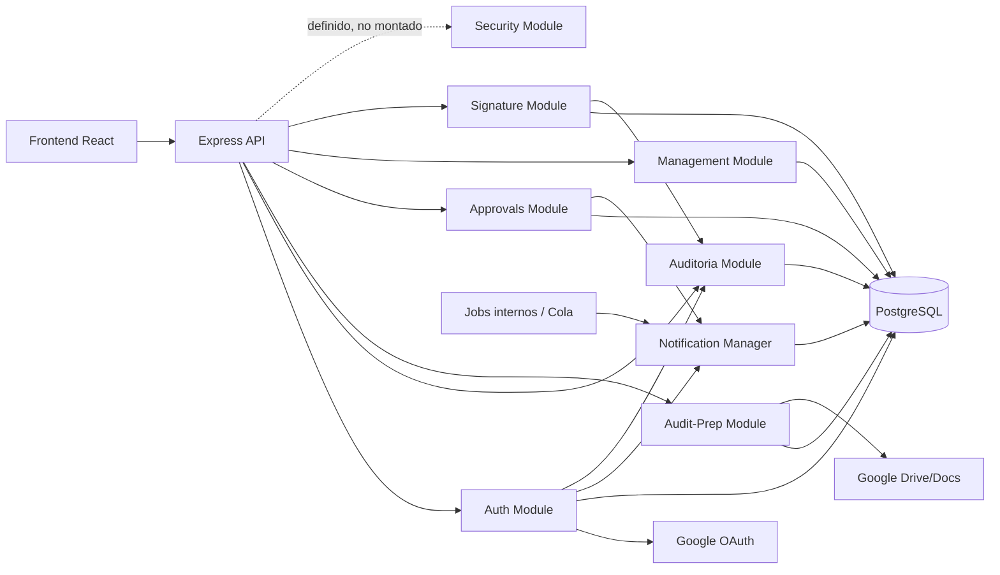
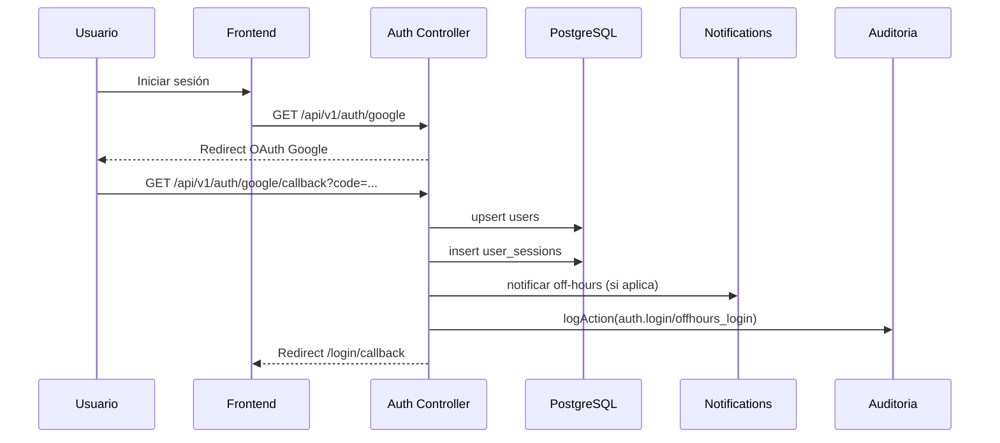
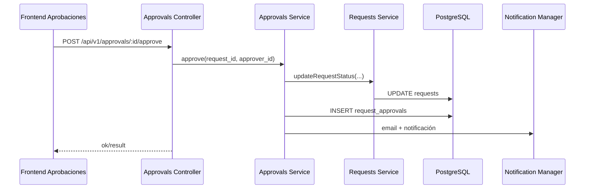
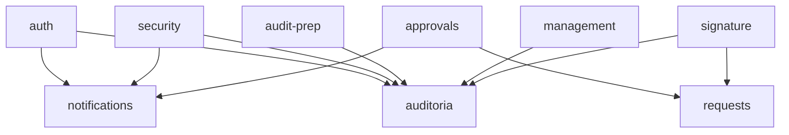

# DOCUMENTO DE DISEÑO DETALLADO DEL SISTEMA (DDS)
## Área 01: Gobierno, Seguridad y Cumplimiento

## 1. Introducción
### 1.1 Propósito
Definir el diseño técnico detallado del área de Gobierno, Seguridad y Cumplimiento del Sistema de Procesos Internos (SPI), basado en la implementación real del repositorio.

### 1.2 Alcance
Este DDS cubre los módulos:
- `auth`
- `security`
- `auditoria`
- `audit-prep`
- `approvals`
- `management`
- `signature`

Incluye backend, frontend, persistencia de datos, seguridad, manejo de errores, integraciones y diagramas técnicos.

### 1.3 Fuentes analizadas
- Backend Express:
  - `backend/src/app.js`
  - `backend/src/server.js`
  - `backend/src/modules/*` (módulos del área)
  - `backend/src/middlewares/*`
  - `backend/src/utils/*`
  - `backend/src/config/*`
- Frontend React:
  - `spi_front/src/core/api/*`
  - `spi_front/src/core/auth/*`
  - `spi_front/src/modules/audit-prep/*`
  - `spi_front/src/modules/auditoria/*`
  - `spi_front/src/modules/servicio/*` (aprobaciones)
  - `spi_front/src/modules/signature/*`
  - `spi_front/src/routes/AppRoutes.jsx`
- Base de datos:
  - `backend/src/actualsindatos.sql`
  - Migraciones relevantes (`017`, `026`, `027`, `029`, `048`, `050`, `105`)
- Base funcional:
  - `validacion_sistema/FRS/areas/FRS_area_01_gobierno_seguridad.md`

### 1.4 Contexto de implementación
- Arquitectura monolítica modular en Node.js/Express.
- Exposición API bajo prefijos mixtos:
  - Principal: `/api/v1/*`
  - Firma digital: montada en `/api` (sin `/v1`).
- Persistencia en PostgreSQL.
- Integración con Google (OAuth, Drive, Docs, Gmail).
- Trazabilidad transversal mediante `x-correlation-id` (middleware de contexto de request).

## 2. Arquitectura del sistema
### 2.1 Arquitectura general
El área opera sobre una arquitectura por capas:
- Capa de Presentación: React (`spi_front`).
- Capa API: Express (`backend/src/app.js`).
- Capa de Servicios de Negocio: controladores + servicios por módulo.
- Capa de Persistencia: PostgreSQL (`config/db.js` + SQL/migraciones).
- Capa de Integraciones:
  - Google OAuth2 (login federado).
  - Google Drive/Docs (carga y evidencia documental).
  - Notificaciones (email/chat) y cola de despacho.

### 2.2 Capas técnicas y responsabilidades
- Frontend:
  - Gestión de sesión JWT en `AuthContext`.
  - Consumo API por clientes axios (`core/api`).
  - UI de auditoría, aprobaciones, preparación de auditoría, firma y verificación.
- API Backend:
  - Middlewares globales: `helmet`, `cors`, `rate-limit`, `verifyToken`, auditoría automática.
  - Routing modular por dominio.
  - Normalización de payloads y manejo global de errores.
- Servicios:
  - Lógica de autenticación, sesiones, aprobaciones, evidencias de auditoría, firma digital.
- Datos:
  - Tablas de usuarios, sesiones, solicitudes, auditoría, documentos, firmas y notificaciones.
- Jobs y colas:
  - Cola de notificaciones asíncronas procesada por job interno (`/internal/jobs/notifications/dispatch`).

### 2.3 Componentes backend relevantes del área
- Autenticación y sesión: `modules/auth/*`
- Seguridad operativa (off-hours): `modules/security/*`
- Bitácora de auditoría: `modules/auditoria/*`
- Preparación de auditorías: `modules/audit-prep/*`
- Flujo de aprobaciones: `modules/approvals/*`
- Dashboard gerencial y trazabilidad: `modules/management/*`
- Firma y verificación documental: `modules/signature/*`

### 2.4 Componentes frontend relevantes del área
- Sesión y protección de rutas:
  - `core/auth/AuthContext.jsx`
  - `core/auth/ProtectedRoute.jsx`
- Clientes API:
  - `core/api/authApi.js`
  - `core/api/auditoriaApi.js`
  - `core/api/auditPrepApi.js`
  - `core/api/approvalsApi.js`
  - `core/api/signatureApi.js`
- Pantallas:
  - Login callback y firma inicial.
  - Auditoría.
  - Preparación de auditoría.
  - Aprobaciones.
  - Firma y verificación pública.

### 2.5 Actualizacion de endurecimiento 2026-03-06
- El endurecimiento inicial de accesos criticos se implemento moviendo autorizacion sensible a middleware de ruta en endpoints expuestos y agregando `ProtectedRoute` especificos en frontend para rutas administrativas.
- La referencia operativa de esta entrega queda en `validacion_sistema/informes/informe_ejecucion_paso_03_accesos_criticos.md`.

## 3. Componentes del sistema
| Componente | Responsabilidad | Archivos principales | Dependencias |
|---|---|---|---|
| Auth Service | Login federado, emisión JWT, refresh, logout, perfil y aceptación LOPDP interno | `modules/auth/auth.controller.js`, `auth.routes.js`, `session.repository.js` | `users`, `departments`, `user_sessions`, `user_lopdp_consents`, `notifications`, `utils/audit`, OAuth Google |
| Security Service | Consulta/revisión/exportación de logins fuera de horario | `modules/security/security.controller.js`, `security.routes.js` | `auditoria.logs`, `notifications`, `users`, `departments`, `security.privacy` |
| Audit Service | Consulta y exportación de bitácora general | `modules/auditoria/audit.controller.js`, `auditoria.service.js` | `auditoria.logs`, roles middleware, CSV stringify |
| Audit Prep Service | Activación de modo auditoría, secciones, carga documental, accesos externos | `modules/audit-prep/auditPrep.controller.js`, `auditPrep.service.js` | `audit_settings`, `audit_sections`, `audit_documents`, `audit_access_grants`, Google Drive |
| Approvals Service | Pendientes, aprobar/rechazar solicitudes, notificación | `modules/approvals/approvals.controller.js`, `approvals.service.js` | `requests`, `request_approvals`, `requests.service`, mailer, auditoría |
| Management Service | Métricas globales, listado de solicitudes, trazabilidad y documentos | `modules/management/management.controller.js`, `management.service.js` | `requests`, `request_types`, `attachments`, `request_versions` |
| Signature Service | Firma avanzada, hash, sello/QR, verificación pública, dashboard y audit trail documental | `modules/signature/signature.controller.js`, `signature.routes.js` | `documents`, `document_hashes`, `document_signatures_advanced`, `document_seals`, `document_qr_codes`, `document_signature_logs`, funciones SQL |

## 4. Diseño de módulos
### 4.1 Módulo `auth`
**Responsabilidad técnica**
- Orquestar OAuth2 Google y creación/actualización de usuarios.
- Emitir `accessToken` (8h) y `refreshToken` (7d).
- Gestionar ciclo de sesión (`user_sessions`).
- Registrar eventos de auditoría de login.
- Ejecutar validación de login fuera de horario y notificación a TI.

**Entradas/salidas clave**
- Entradas: `code` OAuth, JWT headers, `x-refresh-token`, datos LOPDP interno.
- Salidas: redirección con tokens, perfil usuario, sesión renovada, cierre sesión.

**Dependencias**
- DB (`users`, `departments`, `user_sessions`, `user_lopdp_consents`).
- Google OAuth.
- Drive para evidencias LOPDP internas.
- `offHoursPolicy`, `geoip`, `notifications.service`.

### 4.2 Módulo `security`
**Responsabilidad técnica**
- Exponer consultas operativas de eventos `offhours_login`.
- Permitir revisión y exportación de eventos de seguridad.
- Aplicar sanitización de datos sensibles (`IP` y `user-agent`) en respuestas/export.

**Subcomponentes**
- `security.controller.js`: endpoints de consulta/revisión/export.
- `security.privacy.js`: enmascaramiento.
- `security.whitelist.js`: reglas whitelist (servicio no integrado en flujo auth).
- `security.siem.js`: envío SIEM (servicio no integrado en flujo auth).
- `security.holidays.ec.js`: soporte de feriados.

**Dependencias**
- `auditoria.logs`, `notifications`, `users`, `departments`.

### 4.3 Módulo `auditoria`
**Responsabilidad técnica**
- Consultar y exportar auditoría transversal de acciones de sistema.
- Filtrar por usuario, módulo, acción, fechas y contexto relacional.

**Dependencias**
- Tabla `auditoria.logs`.
- Middleware `requireRole` (`middlewares/roles.js`).

### 4.4 Módulo `audit-prep`
**Responsabilidad técnica**
- Administrar configuración de auditoría (`audit_mode`, ventana de fechas).
- Gestionar catálogo de secciones auditables por rol.
- Cargar/descargar documentos de respaldo en Drive.
- Gestionar accesos temporales de auditores externos.

**Reglas técnicas destacadas**
- Límite 15MB por archivo.
- MIME permitidos: PDF, DOC, DOCX, PNG, JPG.
- Máximo 2 auditores externos activos.
- Validación de permisos por sección y rol.

### 4.5 Módulo `approvals`
**Responsabilidad técnica**
- Listar solicitudes pendientes.
- Aprobar/rechazar solicitudes.
- Registrar decisión en `request_approvals`.
- Actualizar estado de solicitud y disparar notificaciones.

**Dependencias**
- `requests.service.updateRequestStatus`.
- `sendMail` y notificaciones.

### 4.6 Módulo `management`
**Responsabilidad técnica**
- Entregar métricas gerenciales y vistas de solicitudes.
- Exponer trazabilidad por solicitud.
- Exponer documentos/versiones por solicitud.

**Control de acceso**
- `verifyToken` + `requireRole(["gerente_general","admin"])`.

### 4.7 Módulo `signature`
**Responsabilidad técnica**
- Firmar documento con hash criptográfico y registro de firma.
- Crear sello institucional y QR de verificación.
- Bloquear documento firmado.
- Verificación pública por token QR.
- Consultar audit trail documental y métricas.

**Dependencias**
- Funciones SQL: `create_document_seal_and_qr`, `track_qr_access`, `get_document_audit_trail`.

## 5. Modelo de datos
### 5.1 Entidades principales del área
| Entidad | PK | Campos principales | Relaciones clave |
|---|---|---|---|
| `auditoria.logs` | `id` | `usuario_id`, `usuario_email`, `modulo`, `accion`, `datos_nuevos`, `ip`, `duracion_ms`, `creado_en` | Auditoría transversal (sin FK explícita a `users`) |
| `users` | `id` | `email`, `fullname`, `role`, `department_id`, `lopdp_internal_*`, `can_sign_documents`, `signature_role` | FK a `departments(id)` |
| `departments` | `id` | `code`, `name` | Referenciada por `users` |
| `user_sessions` | `id` | `user_email`, `login_time`, `logout_time`, `refresh_token`, `ip`, `user_agent` | Relación lógica por email a `users` |
| `user_lopdp_consents` | `id` | `user_id`, `user_email`, `status`, `pdf_file_id`, `signature_file_id`, `ip` | Historial de consentimiento interno |
| `notifications` | `id` | `user_id`, `title`, `type`, `status`, `priority`, `meta` | FK `user_id -> users(id)` |
| `requests` | `id` | `requester_id`, `request_type_id`, `status`, `payload`, `created_at` | FK `requester_id -> users`, FK `request_type_id -> request_types` |
| `request_types` | `id` | `code`, `title`, `schema` | Referenciada por `requests`, `documents` |
| `request_approvals` | `id` | `request_id`, `approver_id`, `action`, `comments`, `acted_at` | FK a `requests` y `users` |
| `audit_settings` | `id` | `audit_mode`, `audit_start_date`, `audit_end_date`, `drive_root_id` | Configuración única de auditoría |
| `audit_sections` | `id` | `code`, `title`, `area`, `allowed_roles`, `storage_path` | Referenciada por `audit_documents(section_code)` |
| `audit_documents` | `id` | `section_code`, `name`, `status`, `drive_file_id`, `uploaded_by` | FK `section_code -> audit_sections(code)`, FK `uploaded_by -> users(id)` |
| `audit_access_grants` | `id` | `email`, `active`, `expires_at`, `created_by`, `revoked_by` | FK `created_by/revoked_by -> users(id)` |
| `documents` | `id` | `request_id`, `request_type_id`, `signature_status`, `current_hash_id`, `is_locked`, `locked_by` | FK a `requests`, `request_types`, `document_hashes`, `users` |
| `document_hashes` | `id` | `document_id`, `hash_sha256`, `calculated_by`, `is_current` | FK `document_id -> documents`, FK `calculated_by -> users` |
| `document_signatures_advanced` | `id` | `document_id`, `signer_user_id`, `signer_name`, `signer_email`, `signer_role`, `ip_address`, `auth_method`, `document_hash_id` | FK a `documents`, `users`, `document_hashes` |
| `document_seals` | `id` | `document_id`, `seal_code`, `authorized_role`, `authorized_user_id`, `document_hash_id`, `seal_token` | FK a `documents`, `users`, `document_hashes` |
| `document_qr_codes` | `id` | `document_id`, `seal_id`, `qr_url`, `verification_token`, `is_active`, `access_count` | FK a `documents` y `document_seals` |
| `document_signature_logs` | `id` | `document_id`, `event_type`, `event_hash`, `previous_event_hash`, `event_data`, `user_id` | FK `user_id -> users(id)` |
| `document_verification_info` (VIEW) | N/A | consolidado de firma/sello/QR/hash | Join lógico sobre `documents`, `document_seals`, `document_qr_codes`, `document_hashes`, `document_signatures_advanced` |

### 5.2 Reglas de integridad observadas
- Estados de `requests` restringidos por `CHECK` (`pendiente`, `en_revision`, `aprobado`, `rechazado`, `cancelado`).
- `documents` depende de `requests` y `request_types`.
- Cadena de evidencia de firma:
  - `documents.current_hash_id -> document_hashes.id`
  - `document_signatures_advanced.document_hash_id -> document_hashes.id`
  - `document_seals.document_hash_id -> document_hashes.id`

## 6. Interfaces API
### 6.1 Endpoints operativos montados (implementación activa)
| Módulo | Método | Ruta real | Descripción técnica | Errores principales |
|---|---|---|---|---|
| auth | GET | `/api/v1/auth/google` | Redirige a OAuth Google | `500` |
| auth | GET | `/api/v1/auth/google/callback` | Procesa `code`, crea/actualiza usuario, emite tokens y redirige frontend | redirecciones con `error=*` |
| auth | GET | `/api/v1/auth/me` | Perfil autenticado + auto clock-in | `401`, `404`, `500` |
| auth | POST | `/api/v1/auth/refresh` | Renueva access/refresh token | `401` |
| auth | POST | `/api/v1/auth/logout` | Cierra sesión activa | `500` |
| auth | POST | `/api/v1/auth/lopdp/accept` | Registra consentimiento y evidencia interna | `400`, `401`, `404`, `500` |
| auth | GET | `/api/v1/auth/sessions` | Lista sesiones (roles TI/Gerencia) | `401`, `403`, `500` |
| auth | GET | `/api/v1/auth/active-users` | Lista usuarios con sesión activa | `401`, `403`, `500` |
| auditoria | GET | `/api/v1/auditoria` | Listado paginado de logs | `401`, `403`, `500` |
| auditoria | GET | `/api/v1/auditoria/:id` | Detalle de log | `401`, `403`, `404`, `500` |
| auditoria | GET | `/api/v1/auditoria/export/csv` | Exportación CSV | `401`, `403`, `500` |
| audit-prep | GET | `/api/v1/audit-prep/status` | Estado y ventana de auditoría | `401`, `500` |
| audit-prep | PUT | `/api/v1/audit-prep/status` | Activar/desactivar y fechas de auditoría | `401`, `403`, `500` |
| audit-prep | GET | `/api/v1/audit-prep/sections` | Secciones permitidas por rol | `401`, `500` |
| audit-prep | POST | `/api/v1/audit-prep/sections` | Alta/actualización de secciones | `400`, `401`, `403`, `500` |
| audit-prep | GET | `/api/v1/audit-prep/documents` | Listado documental por rol | `401`, `500` |
| audit-prep | POST | `/api/v1/audit-prep/documents/upload` | Carga documento a Drive | `400`, `403`, `409`, `413`, `415`, `500` |
| audit-prep | PATCH | `/api/v1/audit-prep/documents/:id/status` | Cambia estado documental | `400`, `403`, `404`, `500` |
| audit-prep | GET | `/api/v1/audit-prep/documents/:id/download` | Descarga documento | `403`, `404`, `500` |
| audit-prep | GET | `/api/v1/audit-prep/external-access` | Lista accesos externos | `401`, `403`, `500` |
| audit-prep | POST | `/api/v1/audit-prep/external-access` | Otorga acceso externo temporal | `400`, `401`, `403`, `500` |
| audit-prep | DELETE | `/api/v1/audit-prep/external-access/:id` | Revoca acceso externo | `401`, `403`, `404`, `500` |
| approvals | GET | `/api/v1/approvals/pending` | Pendientes de aprobación | `401`, `403`, `500` |
| approvals | POST | `/api/v1/approvals/:id/approve` | Aprueba solicitud | `401`, `403`, `500` |
| approvals | POST | `/api/v1/approvals/:id/reject` | Rechaza solicitud | `401`, `403`, `500` |
| management | GET | `/api/v1/management/stats` | Métricas globales | `401`, `403`, `500` |
| management | GET | `/api/v1/management/requests` | Listado de solicitudes para gerencia | `401`, `403`, `500` |
| management | GET | `/api/v1/management/trace/:id` | Trazabilidad por solicitud | `401`, `403`, `500` |
| management | GET | `/api/v1/management/documents/:id` | Documentos y versiones por solicitud | `401`, `403`, `500` |
| signature | POST | `/api/documents/:documentId/sign` | Flujo FamSign (hash + firma + sello + QR + bloqueo) | `400`, `401`, `500` |
| signature | GET | `/api/verificar/:token` | Verificación pública por token QR | `404`, `429`, `500` |
| signature | GET | `/api/documents/:documentId/audit-trail` | Trail de auditoría documental | `401`, `403`, `404`, `500` |
| signature | GET | `/api/dashboard` | Dashboard de firmas | `401`, `500` |
| signature | GET | `/api/verify/:token` | Alias legacy de verificación | `404`, `429`, `500` |

### 6.2 Endpoints definidos pero no expuestos en runtime
| Módulo | Ruta definida | Estado |
|---|---|---|
| security | `/api/v1/security/offhours-logins` y subrutas | No montado en `app.js` |

### 6.3 Integraciones frontend API (consumo real)
- `authApi.js` consume `/auth/*` sobre base `/api/v1`.
- `auditoriaApi.js` consume `/auditoria/*`.
- `auditPrepApi.js` consume `/audit-prep/*`.
- `approvalsApi.js` consume `/approvals/*`.
- `signatureApi.js` consume `/api/signature/*` (desalineado con backend activo en `/api/*`).

## 7. Flujos técnicos
### 7.1 Flujo de autenticación (OAuth + sesión)
1. Usuario accede a `/api/v1/auth/google`.
2. Callback OAuth en `/api/v1/auth/google/callback`.
3. Backend crea/actualiza usuario en `users`.
4. Genera JWT access/refresh y registra `user_sessions`.
5. Evalúa login fuera de horario (`offHoursPolicy`) y notifica TI.
6. Registra evento en `auditoria.logs`.
7. Redirige frontend con tokens en fragmento URL.

### 7.2 Flujo de autorización y protección
1. Middleware global JWT en `app.js` protege rutas privadas.
2. Excepciones explícitas para salud, OAuth callback, verificación pública y jobs internos.
3. Módulos aplican `requireRole` local (desde `middlewares/auth` o `middlewares/roles`).
4. Si falla autenticación/autorización: `401/403`.

### 7.3 Flujo de aprobación
1. Aprobador consulta `/api/v1/approvals/pending`.
2. Ejecuta `approve` o `reject`.
3. `approvals.service` actualiza estado en `requests`.
4. Inserta registro en `request_approvals`.
5. Dispara notificaciones por correo y en-app.
6. Se registra trazabilidad operativa.

### 7.4 Flujo de firma documental (FamSign)
1. Cliente envía documento base64 + consentimiento.
2. Backend calcula hash SHA-256 (`document_hashes`).
3. Inserta firma avanzada (`document_signatures_advanced`).
4. Ejecuta función `create_document_seal_and_qr`.
5. Genera URL/imagen QR de verificación.
6. Bloquea documento (`documents.is_locked = true`).
7. Verificación pública consulta `document_verification_info`.

### 7.5 Flujo de preparación de auditoría
1. TI activa modo auditoría y ventana.
2. Usuarios consultan secciones según rol.
3. Se cargan documentos por sección a Drive.
4. Se administran accesos temporales de auditor externo.
5. Cambios quedan en bitácora de auditoría.

## 8. Seguridad del sistema
### 8.1 Controles implementados
- Autenticación:
  - JWT en headers (`Authorization` / `x-access-token`).
  - Validación de claims (`iss`, `aud`, `sub`).
- Autorización:
  - Restricción por rol con `requireRole`.
- Sesión:
  - `user_sessions` + refresh token.
  - Cierre por email o refresh token.
- Seguridad de API:
  - `helmet`, `cors`, `rate-limit`.
- Auditoría:
  - Middleware de auditoría para métodos mutables.
  - Registro de IP, user-agent, duración y contexto.
- Trazabilidad:
  - `x-correlation-id` por request.

### 8.2 Protección de datos
- Sanitización en módulo `security` para exposición/export de IP/UA.
- Evidencias sensibles en Drive (LOPDP interno y auditoría).
- Verificación pública limitada por rate-limit en endpoint de firma.

### 8.3 Controles pendientes o parciales
- Matriz de permisos granular (permiso/recurso) no implementada; el control es predominantemente por rol.
- Módulo `security` no activo en runtime por falta de montaje de rutas.
- Integración SIEM y whitelist disponibles en código pero no integradas en el flujo de login actual.

## 9. Manejo de errores
### 9.1 Esquema global
Manejador global de errores en `app.js`:
- `status`, `code`, `message`, `details`, `retryable`, `request_id`.

### 9.2 Códigos observados
- `401`: token ausente/inválido o sesión no autorizada.
- `403`: rol sin permisos.
- `404`: recurso no encontrado (logs, documentos, token QR).
- `409`: conflicto de estado (ej. auditoría no activa para carga).
- `413`: archivo excede tamaño permitido.
- `415`: tipo de archivo no permitido.
- `429`: límite de solicitudes.
- `500`: error interno no controlado.

### 9.3 Discrepancias FRS vs implementación actual
1. `security` no expuesto en API:
- FRS contempla capacidades operativas de seguridad; en código no existe `app.use("/api/v1/security", ...)`.

2. Desalineación en rutas de firma frontend/backend:
- Backend firma está montado en `/api/*`.
- Frontend consume `/api/signature/*`.

3. Autorización por permiso no implementada:
- FRS define rol y permiso; implementación usa control por rol sin motor de permisos por recurso.

4. Errores de implementación en módulo `security`:
- `security.routes.js` importa `emitOffHoursTest`, pero no existe en exports de `security.controller.js`.
- Consultas timeline usan `created_en`; el esquema de auditoría define `creado_en`.

5. Inconsistencia en `management`:
- `getTrace` consulta `audit_logs`, tabla no presente en SQL analizado.
- Métricas `approved/rejected` pueden no reflejar estados en español (`aprobado/rechazado`).

6. Inconsistencia de trazabilidad en `approvals`:
- `approvals.service` invoca `audit.logAction` con claves `user_id/action/module` que no coinciden con la firma de `utils/audit.logAction` (`usuario_id/accion/modulo`), afectando completitud de auditoría.

7. Riesgo de incompatibilidad en `signature` con esquema:
- Inserción usa columna `consent_text` y no incluye `signer_email`; en SQL/migraciones revisadas, `signer_email` es requerida y `consent_text` no está en `document_signatures_advanced`.

8. Regla de admin en audit trail de firma:
- Validación usa `req.user.roles?.includes('admin')`, pero el token normalizado utiliza `role` (string), no `roles` (array).

## 10. Diagramas de arquitectura
### 10.1 Arquitectura lógica del área

### 10.2 Secuencia técnica de autenticación y control off-hours

### 10.3 Secuencia técnica de aprobación

### 10.4 Dependencias entre módulos del área

