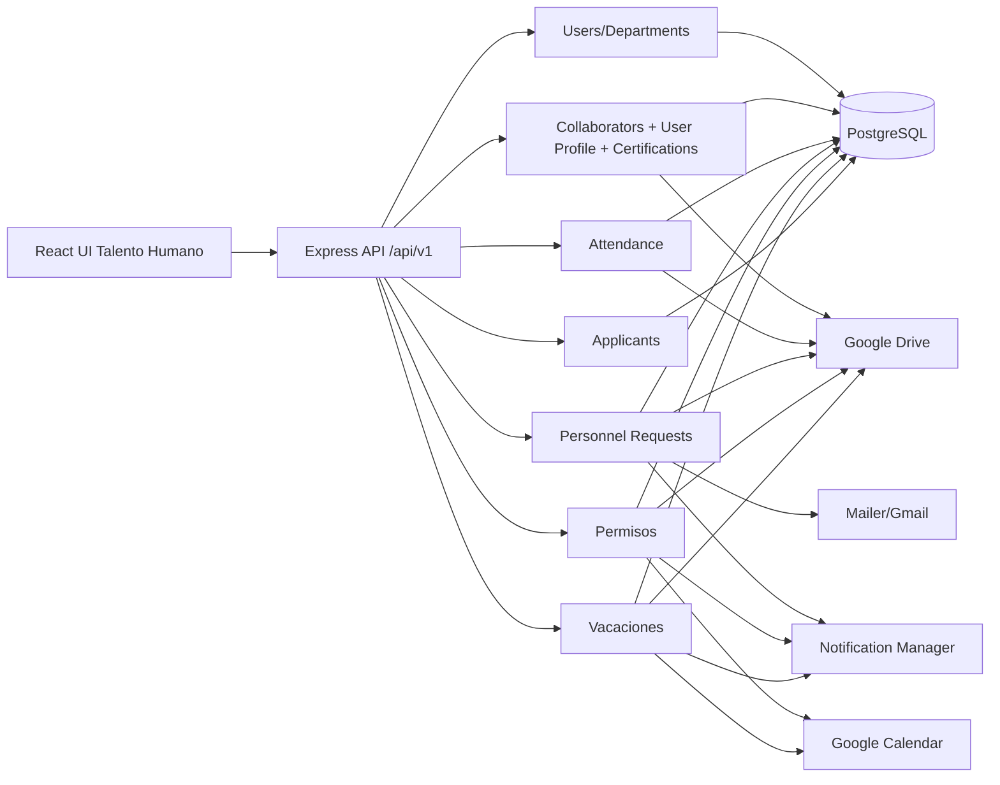
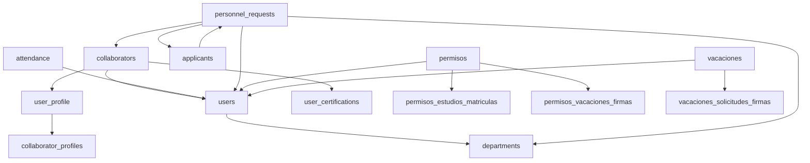
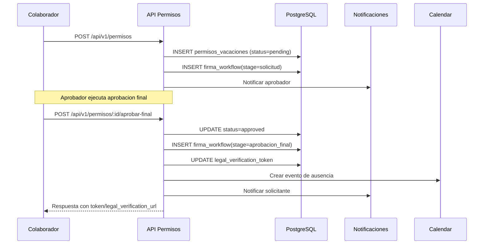

# DOCUMENTO DE DISENO DETALLADO DEL SISTEMA (DDS)
## Area 02: Talento Humano

## 1. Introduccion
### 1.1 Proposito
Definir el diseno tecnico detallado del Area 02 (Talento Humano) del Sistema de Procesos Internos (SPI), tomando como fuente exclusiva la implementacion real del repositorio.

### 1.2 Alcance
Este DDS cubre los modulos funcionales activos del area1:
- `users`
- `departments`
- `collaborators`
- `user-profile`
- `user-certifications`
- `attendance`
- `personnel-requests`
- `permisos`
- `vacaciones`
- `applicants`
- `talento_humano/hr` (implementacion legacy)

### 1.3 Fuentes analizadas
- Backend (Express):
  - `backend/src/app.js`
  - `backend/src/modules/users/*`
  - `backend/src/modules/departments/*`
  - `backend/src/modules/collaborators/*`
  - `backend/src/modules/user-profile/*`
  - `backend/src/modules/user-certifications/*`
  - `backend/src/modules/attendance/*`
  - `backend/src/modules/personnel-requests/*`
  - `backend/src/modules/permisos/*`
  - `backend/src/modules/vacaciones/*`
  - `backend/src/modules/applicants/*`
  - `backend/src/modules/talento_humano/*`
  - `backend/src/middlewares/auth.js`
  - `backend/src/middlewares/roles.js`
  - `backend/src/middlewares/auditMiddleware.js`
  - `backend/src/middlewares/applicantsApiKey.js`
  - `backend/src/utils/audit.js`
  - `backend/src/utils/drive.js`
  - `backend/src/utils/calendar.js`
  - `backend/src/utils/mailer.js`
  - `backend/src/modules/notifications/notificationManager.js`
- Frontend (React):
  - `spi_front/src/routes/AppRoutes.jsx`
  - `spi_front/src/core/api/*` (clientes de talento humano)
  - `spi_front/src/modules/talento/*`
  - `spi_front/src/modules/profile/*`
  - `spi_front/src/modules/shared/solicitudes/*`
  - `spi_front/src/core/ui/widgets/*` (widgets de asistencia, vacaciones, solicitudes)
- Datos:
  - `backend/src/actualsindatos.sql`
  - `backend/migrations/025_add_overtime_support.sql`
  - `backend/migrations/051_user_certifications.sql`
  - `backend/migrations/105_timeoff_signature_hardening.sql`
  - `backend/migrations/create_personnel_requests.sql`
- Base funcional:
  - `validacion_sistema/URS/areas/area_02_talento_humano.md`
  - `validacion_sistema/FRS/areas/FRS_area_02_talento_humano.md`

### 1.4 Contexto de implementacion
- Arquitectura monolitica modular: Node.js/Express + React.
- Prefijo principal de API privada: `/api/v1/*`.
- Persistencia: PostgreSQL.
- Integraciones externas: Google Drive/Docs, Google Calendar, Gmail, notificaciones internas.
- Seguridad transversal: JWT global, middleware de roles, auditoria de cambios.

## 2. Arquitectura del sistema
### 2.1 Arquitectura general
El area de Talento Humano opera sobre cinco capas tecnicas:
- Presentacion: UI React (dashboard y workspaces de talento humano).
- API: enrutamiento Express con middlewares globales.
- Servicios de negocio: controladores + servicios por dominio.
- Persistencia: tablas base en PostgreSQL + tablas extendidas creadas por migracion/servicio.
- Integraciones: Drive (documentos), Calendar (eventos de ausencias), Mailer/Gmail y notificaciones.

### 2.2 Capas y responsabilidades
- Frontend:
  - Gestion de sesiones JWT y consumo API mediante axios.
  - Vistas de colaboradores, asistencia, permisos/vacaciones, perfil y postulantes.
- API backend:
  - Validacion/autenticacion (`verifyToken`) y autorizacion (`requireRole`).
  - Exposicion REST por modulo.
  - Auditoria automatica para operaciones de escritura.
- Servicios:
  - Reglas de negocio (aprobaciones, estados, consistencia documental, calculos de dias/horas).
- Datos:
  - Entidades de usuarios, estructura organizacional, asistencia y ciclo de talento.
- Integraciones:
  - Drive para evidencia documental.
  - Calendar para eventos de permisos/vacaciones.
  - Mailer y notificaciones para alertas de flujo.

### 2.3 Componentes backend del area
- Core de personas: `users`, `departments`, `collaborators`, `user-profile`, `user-certifications`.
- Control de jornada: `attendance`.
- Flujo de ciclo laboral: `personnel-requests`, `applicants`, `talento_humano/hr`.
- Ausencias y licencias: `permisos`, `vacaciones`.

### 2.4 Componentes frontend del area
- Dashboards y hubs:
  - `modules/talento/Dashboard.jsx`
  - `modules/talento/pages/ColaboradoresHub.jsx`
  - `modules/talento/pages/CollaboratorWorkspace.jsx`
  - `modules/talento/pages/PersonnelWorkspace.jsx`
  - `modules/talento/pages/AsistenciaReportes.jsx`
- Perfil y certificaciones:
  - `modules/profile/MyProfilePage.jsx`
  - `modules/profile/components/CertificationsBoard.jsx`
- Solicitudes de ausencias:
  - `modules/shared/solicitudes/pages/PermisosPage.jsx`
  - `modules/shared/solicitudes/components/*`
  - `modules/shared/solicitudes/modals/*`
- Widgets transversales:
  - `core/ui/widgets/AttendanceWidget.jsx`
  - `core/ui/widgets/VacationRequestsWidget.jsx`
  - `core/ui/widgets/HRPersonnelRequestsWidget.jsx`

## 3. Componentes del sistema
| Componente | Responsabilidad tecnica | Archivos principales | Dependencias |
|---|---|---|---|
| Users Service | CRUD de usuarios internos, asignacion de rol y departamento, baja con limpieza relacional | `modules/users/users.controller.js`, `users.routes.js` | `users`, `departments`, tablas de requests/documentos/firmas |
| Departments Service | CRUD de departamentos y validacion de duplicados por codigo/nombre | `modules/departments/departments.controller.js`, `departments.routes.js` | `departments`, FK desde `users`, `personnel_requests` |
| Collaborators Service | Hub de colaboradores, perfil laboral, documentos y metricas de completitud | `modules/collaborators/*.js` | `users`, `departments`, `collaborator_profiles`, `collaborator_documents`, `user_profile`, `user_certifications`, Drive |
| User Profile Service | Perfil propio, avatar, preferencias y sincronizacion con `collaborator_profiles` | `modules/user-profile/*.js` | `users`, `user_profile`, `collaborator_profiles`, Drive |
| User Certifications Service | Alta/lista/baja logica de certificaciones, carga documental, PDF consolidado | `modules/user-certifications/*.js` | `users`, `user_certifications`, Drive, auditoria |
| Attendance Service | Marcaciones, excepciones de salida, horas extra y PDF RH-09 | `modules/attendance/*.js` | `user_attendance_records`, `attendance_exceptions`, `attendance_overtime`, `users`, `departments`, Drive |
| Personnel Requests Service | Solicitudes de personal, estado/aprobacion, perfil/documentos, vinculacion y contratacion | `modules/personnel-requests/*.js` | `personnel_requests`, historial/comentarios, perfiles/documentos, `users`, `departments`, `applicants`, `collaborator_*`, notifications, mailer, Gmail, Drive |
| Permisos Service | Permisos/vacaciones en flujo por etapas, matriculas de estudio, firma legal, cancelacion y recuperacion | `modules/permisos/*.js` | `permisos_vacaciones`, `permisos_estudios_matriculas`, `permisos_vacaciones_firmas`, notifications, calendar, PDFs, Drive |
| Vacaciones Service | Solicitudes de vacaciones, aprobacion, cancelacion en dos etapas, firma workflow, verificacion legal | `modules/vacaciones/*.js` | `vacaciones_solicitudes`, `vacaciones_solicitudes_firmas`, `users`, `departments`, notifications, calendar, Drive |
| Applicants Service | Ingesta de postulantes (Google Forms/API), normalizacion de datos y expediente de documentos | `modules/applicants/*.js`, `middlewares/applicantsApiKey.js` | `applicants`, tablas normalizadas `applicant_*`, Drive |
| HR Legacy Service | CRUD basico de `employees` y carga de documentos (uso residual) | `modules/talento_humano/*.js` | `employees`, `users`, `audit`, Drive, mailer |

## 4. Diseno de modulos
### 4.1 Modulo `users`
- Responsabilidad: administrar usuarios internos (alta, consulta, actualizacion y eliminacion).
- Regla tecnica destacada: la eliminacion ejecuta limpieza previa en tablas relacionadas para evitar violaciones FK.
- Dependencias: `departments`, `requests`, `request_approvals`, `request_attachments`, `document_signatures`, `inventory_movements`.

### 4.2 Modulo `departments`
- Responsabilidad: gestionar catalogo de departamentos.
- Reglas: `code` y `name` obligatorios, rechazo de duplicados al crear.
- Dependencias: `users.department_id`, `personnel_requests.department_id`.

### 4.3 Modulo `collaborators`
- Responsabilidad: consolidar expediente de colaborador (perfil + documentos + certificaciones + avance).
- Reglas: filtrado de perfiles de postulantes (`applicant_source=google_forms`) en listados.
- Persistencia extendida: crea `collaborator_profiles` y `collaborator_documents` si no existen.
- Integraciones: Drive para documentos; sincronizacion bidireccional parcial con `user_profile`.

### 4.4 Modulo `user-profile`
- Responsabilidad: administrar perfil propio (`/users/me/profile`) con metadatos y preferencias.
- Validaciones: avatar PNG/JPEG/WEBP, maximo 2 MB.
- Seguridad de datos: sanitizacion de metadata (bloqueo de claves sensibles como email/google_id).
- Integracion: almacenamiento de avatar en Drive con fallback a data URI.

### 4.5 Modulo `user-certifications`
- Responsabilidad: gestionar certificaciones individuales y masivas, con soporte documental y PDF consolidado.
- Validaciones: tipo de credencial, tamano de archivo (2 MB), MIME permitido.
- Integraciones: Drive (carpeta por usuario), PDFKit para consolidado.
- Control de acceso: consulta de terceros solo para roles autorizados.

### 4.6 Modulo `attendance`
- Responsabilidad: controlar marcaciones de jornada, excepciones de salida y overtime.
- Flujo tecnico: `clock-in` -> `clock-out-lunch` -> `clock-in-lunch` -> `clock-out`.
- Excepciones: estado de ciclo `ACTIVE`, `ON_SITE`, `RETURNING`, `COMPLETED`.
- Salida documental: PDF RH-09 con firma de usuario (`lopdp_internal_signature_file_id`).

### 4.7 Modulo `personnel-requests`
- Responsabilidad: ciclo de solicitud de personal desde creacion hasta contratacion.
- Estados detectados: `pendiente`, `en_revision`, `aprobada`, `rechazada`, `en_proceso`, `completada`, `cancelada`.
- Funciones clave:
  - gestion de perfil del candidato (`personnel_request_profiles`)
  - gestion documental (`personnel_request_documents`)
  - vinculacion de colaborador/postulante
  - contratacion (`hire`) con alta/actualizacion en `users` y sincronizacion a `collaborator_*`.
- Integraciones: notificaciones, SMTP/Gmail, Drive.

### 4.8 Modulo `permisos`
- Responsabilidad: gestionar permisos y vacaciones en flujo multi-etapa con trazabilidad legal.
- Funciones clave:
  - crear solicitud (`permiso` o `vacaciones`)
  - aprobar parcial/final o rechazar
  - subir justificantes
  - flujo de cancelacion con revision
  - matriculas de estudio y su aprobacion
  - plan de recuperacion de horas (`recovery_plan`).
- Trazabilidad legal: hash SHA-256 encadenado, token de verificacion legal publico, PDF de validacion legal.
- Integraciones: Calendar, notificaciones, Drive, generacion de formato FRH-10.

### 4.9 Modulo `vacaciones`
- Responsabilidad: flujo especializado de vacaciones (paralelo al de `permisos`).
- Funciones clave:
  - crear/listar solicitudes
  - actualizar estado (aprobado/rechazado)
  - cancelacion por solicitante y revision por aprobador
  - resumen de dias
  - verificacion legal publica por token.
- Trazabilidad legal: `vacaciones_solicitudes_firmas` con firma workflow y token legal.

### 4.10 Modulo `applicants`
- Responsabilidad: ingestar y consultar postulantes de procesos internos.
- Entrada critica: `/api/applicants/import` protegida por API key + rate limit.
- Normalizacion: mapeo de payload heterogeneo (Google Forms) a estructura tipificada.
- Persistencia: tabla principal `applicants` + tablas normalizadas `applicant_*` + documentos.

### 4.11 Modulo `talento_humano/hr` (legacy)
- Responsabilidad: CRUD basico en tabla `employees` y carga de documento en Drive.
- Estado actual: modulo existente pero sin consumo frontend identificado.
- Observacion tecnica: rutas internas declaradas con prefijo absoluto `/api/v1/hr/*` y montadas en `/api/v1/talento-humano`, generando rutas efectivas no alineadas con convencion de area.

## 5. Modelo de datos
### 5.1 Entidades principales del area
| Entidad | PK | Campos principales | Relaciones |
|---|---|---|---|
| `users` | `id` | `email`, `fullname`, `role`, `department_id`, datos LOPDP interno | FK `department_id -> departments.id` |
| `departments` | `id` | `code`, `name`, `description` | Referenciada por `users`, `personnel_requests`, `vacaciones_solicitudes` |
| `user_profile` | `id` | `user_id`, `avatar_url`, `avatar_drive_id`, `metadata`, `preferences` | FK `user_id -> users.id` |
| `user_certifications` | `id` | `user_id`, `title`, `issuer`, `credential_type`, `drive_file_id`, `is_active` | FK `user_id -> users.id` |
| `user_attendance_records` | `id` | `user_id`, `date`, horas de jornada y ubicaciones | FK `user_id -> users.id` |
| `attendance_exceptions` | `id` | `user_id`, `type`, `description`, `status`, marcas de ciclo | FK `user_id -> users.id` |
| `attendance_overtime` | `id` | `user_id`, `date`, `hours`, `reason` | FK `user_id -> users.id` |
| `personnel_requests` | `id` | `request_number`, `requester_id`, `department_id`, perfil de vacante, `status` | FK a `users` (`requester/approved_by*`), FK `department_id` |
| `personnel_request_history` | `id` | `personnel_request_id`, `previous_status`, `new_status`, `changed_by` | FK a `personnel_requests`, `users` |
| `personnel_request_comments` | `id` | `personnel_request_id`, `user_id`, `comment`, `is_internal` | FK a `personnel_requests`, `users` |
| `personnel_request_profiles` | `id` | `personnel_request_id`, `profile`, `updated_by` | FK a `personnel_requests`, `users` |
| `personnel_request_documents` | `id` | `personnel_request_id`, `doc_type`, `drive_file_id`, `uploaded_by` | FK a `personnel_requests`, `users` |
| `collaborator_profiles` | `id` | `user_id`, `profile`, `updated_by` | FK a `users` |
| `collaborator_documents` | `id` | `user_id`, `doc_type`, `drive_file_id`, `uploaded_by` | FK a `users` |
| `permisos_vacaciones` | `id` | `tipo_solicitud`, `tipo_permiso`, fechas, `status`, aprobaciones, firma legal, cancelacion | FK operativas a `users`, `departments` |
| `permisos_estudios_matriculas` | `id` | vigencia, archivo matricula, `status`, aprobador | FK a `users` |
| `permisos_vacaciones_firmas` | `id` | `solicitud_id`, `stage`, firmante, hashes, `is_current` | FK a `permisos_vacaciones`, `users` |
| `vacaciones_solicitudes` | `id` | `requester_id`, `approver_id`, fechas, `status`, token legal, cancelacion | FK operativas a `users`, `departments` |
| `vacaciones_solicitudes_firmas` | `id` | `solicitud_id`, `stage`, firmante, hashes, `is_current` | FK a `vacaciones_solicitudes`, `users` |
| `applicants` | `id` | `email`, `fullname`, `profile`, `status` | Relacionada con `personnel_requests.applicant_id` |
| `applicant_*` | `id` | datos personales, salud, educacion, experiencia, referencias, documentos | FK `applicant_id -> applicants.id` |
| `employees` | `id` | `nombre`, `cedula`, `cargo`, `fecha_ingreso`, `estado` | Modulo legacy RH |
| `notifications` | `id` | `user_id`, `title`, `message`, `type`, `status`, `meta` | FK `user_id -> users.id` |

### 5.2 Relaciones clave del area
- `users` es entidad central para asistencia, perfiles, certificaciones, solicitudes y aprobaciones.
- `personnel_requests` conecta vacante, aprobadores y postulacion/contratacion.
- `collaborator_profiles` y `user_profile` mantienen sincronizacion parcial de datos personales/laborales.
- `permisos_vacaciones` y `vacaciones_solicitudes` conviven en paralelo para ausencias, con modelos y estados distintos.

### 5.3 Observaciones de persistencia
- Varias tablas del area se crean de forma dinamica por servicio (`ensureTable` / `CREATE TABLE IF NOT EXISTS`) y no solo por migracion SQL.
- La criticidad de trazabilidad legal se apoya en indices unicos por token y por etapa de firma `is_current`.

## 6. Interfaces API
### 6.1 `users` (`/api/v1/users`)
| Endpoint | Descripcion | Entradas | Salida | Errores posibles |
|---|---|---|---|---|
| `GET /` | Lista usuarios con departamento | Query opcional | `ok`, `count`, `data[]` | `500` |
| `GET /:id` | Consulta usuario por ID | `id` | `ok`, `data` | `404`, `500` |
| `POST /` | Crea usuario | body: email, role, fullname, department | `201`, `data` | `500` |
| `PUT /:id` | Actualiza usuario | `id`, body parcial | `ok`, `data` | `404`, `500` |
| `DELETE /:id` | Elimina usuario con limpieza relacional | `id` | `ok`, `meta` limpieza | `400`, `404`, `500` |

### 6.2 `departments` (`/api/v1/departments`)
| Endpoint | Descripcion | Entradas | Salida | Errores posibles |
|---|---|---|---|---|
| `GET /` | Lista departamentos | - | `ok`, `total`, `data[]` | `500` |
| `GET /:id` | Consulta departamento | `id` | `ok`, `data` | `404`, `500` |
| `POST /` | Crea departamento | body: `code`, `name`, `description` | `201`, `data` | `400`, `500` |
| `PUT /:id` | Actualiza departamento | `id`, body parcial | `ok`, `data` | `404`, `500` |
| `DELETE /:id` | Elimina departamento | `id` | `ok`, mensaje | `404`, `500` |

### 6.3 `collaborators` (`/api/v1/collaborators`)
| Endpoint | Descripcion | Entradas | Salida | Errores posibles |
|---|---|---|---|---|
| `GET /stats` | Estadisticas de completitud | - | `ok`, `data` | `500` |
| `GET /` | Lista colaboradores con filtros | query: search, department_id, cargo, page | `ok`, `data`, `pagination` | `500` |
| `GET /:id/profile` | Perfil completo de colaborador | `id` | `ok`, `data` | `404`, `500` |
| `PUT /:id/profile` | Crea/actualiza perfil JSON | `id`, body profile | `ok`, `data` | `500` |
| `POST /:id/documents` | Sube documento de colaborador | `id`, multipart (`docType`, `file`) | `ok`, `data` | `400`, `500` |

### 6.4 `user-profile` (`/api/v1/users/me/profile`)
| Endpoint | Descripcion | Entradas | Salida | Errores posibles |
|---|---|---|---|---|
| `GET /` | Obtiene identidad + perfil propio | token JWT | `ok`, `data` | `500` |
| `POST /` | Crea/actualiza perfil propio | multipart: `metadata`, `preferences`, `avatar` | `201`, `data` | `400`, `500` |
| `PUT /` | Actualiza perfil propio | multipart/json | `ok`, `data` | `400`, `500` |

### 6.5 `user-certifications` (`/api/v1/users`)
| Endpoint | Descripcion | Entradas | Salida | Errores posibles |
|---|---|---|---|---|
| `POST /me/certifications` | Crea certificacion propia | body validado + archivo opcional | `201`, `data` | `400`, `404`, `500` |
| `POST /me/certifications/bulk` | Carga masiva certificaciones | multipart `files[]` + metadata JSON | `201`, resumen y resultados | `400`, `404`, `500` |
| `GET /me/certifications` | Lista certificaciones propias | query: `include_inactive` | `ok`, `data[]` | `500` |
| `GET /:id/certifications` | Lista certificaciones de tercero (roles) | `id` | `ok`, `data[]` | `400`, `403`, `500` |
| `DELETE /me/certifications/:certId` | Baja logica de certificacion | `certId` | `ok`, mensaje | `400`, `403`, `404`, `500` |
| `GET /:id/certifications/pdf` | PDF consolidado de certificaciones | `id` | `application/pdf` | `400`, `403`, `404`, `500` |

### 6.6 `attendance` (`/api/v1/attendance`)
| Endpoint | Descripcion | Entradas | Salida | Errores posibles |
|---|---|---|---|---|
| `POST /clock-in` | Marca entrada | body: `location` | `ok`, registro | `401`, `400`, `500` |
| `POST /clock-out-lunch` | Marca salida almuerzo | body: `location` | `ok`, registro | `401`, `400`, `500` |
| `POST /clock-in-lunch` | Marca retorno almuerzo | body: `location` | `ok`, registro | `401`, `400`, `500` |
| `POST /clock-out` | Marca salida jornada | body: `location`, `isOvertime` | `ok`, registro y overtime | `401`, `400`, `500` |
| `POST /exception` | Inicia excepcion de salida | body: `type`, `description`, `location` | `ok`, excepcion activa | `401`, `400`, `500` |
| `POST /exception/status` | Avanza estado de excepcion | body: `status`, `location` | `ok`, excepcion actualizada | `401`, `400`, `404`, `500` |
| `GET /exception/active` | Consulta excepcion en curso | - | `ok`, `data` | `401`, `500` |
| `POST /overtime` | Registra horas extra manuales | body: `hours`, `reason`, `location` | `ok`, registro | `401`, `400`, `500` |
| `GET /overtime` | Lista overtime por rango | query: `start`, `end` | `ok`, `data`, `summary` | `401`, `400`, `500` |
| `GET /today` | Asistencia del dia (usuario actual) | - | `ok`, `data` | `401`, `500` |
| `GET /user/:userId` | Asistencia por usuario y fecha | `userId`, query `date` | `ok`, `data` | `400`, `500` |
| `GET /range` | Reporte de asistencia por rango | query `start`, `end`, `userId` opcional | `ok`, `total`, `data[]` | `400`, `500` |
| `GET /pdf/:userId` | Genera PDF RH-09 por periodo | `userId`, query `start`, `end` | archivo PDF | `400`, `500` |

### 6.7 `personnel-requests` (`/api/v1/personnel-requests`)
| Endpoint | Descripcion | Entradas | Salida | Errores posibles |
|---|---|---|---|---|
| `POST /` | Crea solicitud de personal | body perfil vacante | `201`, `data` | `400`, `500` |
| `GET /` | Lista solicitudes (filtros/rol) | query: status, urgency, page, my_requests | `success`, `data`, `pagination` | `500` |
| `GET /stats` | Estadisticas de solicitudes | query opcional `department_id` | `success`, `data` | `500` |
| `GET /:id` | Consulta solicitud por ID | `id` | `success`, `data` | `404`, `500` |
| `PATCH /:id/status` | Cambia estado de solicitud | `id`, body `status`, `notes` | `success`, `data` | `400`, `500` |
| `POST /:id/comments` | Agrega comentario | `id`, body `comment`, `is_internal` | `201`, `data` | `400`, `500` |
| `GET /:id/profile` | Obtiene perfil de candidato ligado a solicitud | `id` | `success`, `data` | `500` |
| `PUT /:id/profile` | Actualiza perfil de candidato | `id`, body JSON | `success`, `data` | `500` |
| `POST /:id/documents` | Sube documento de solicitud | `id`, multipart (`doc_type`, `file`) | `success`, `data` | `400`, `500` |
| `PATCH /:id/collaborator` | Vincula colaborador existente | `id`, `collaborator_user_id` | `success`, `data` | `500` |
| `PATCH /:id/applicant` | Vincula postulante | `id`, `applicant_id` | `success`, `data` | `500` |
| `POST /:id/hire` | Contrata y cierra solicitud | `id` | `success`, `data` | `400`, `500` |

### 6.8 `permisos` (`/api/v1/permisos`)
| Endpoint | Descripcion | Entradas | Salida | Errores posibles |
|---|---|---|---|---|
| `GET /legal-verification/:token` | Verificacion legal publica | `token` | HTML o JSON | `400`, `404`, `500` |
| `POST /` | Crea solicitud de permiso/vacacion | body de negocio | `201`, `data` | `400`, `500` |
| `POST /estudios/matricula` | Registra matricula de estudios | multipart + datos vigencia | `201`, `data` | `400`, `500` |
| `GET /estudios/matricula/activa` | Consulta matricula activa | query opcional fecha | `ok`, `data` | `500` |
| `GET /estudios/matriculas` | Lista matriculas propias | - | `ok`, `data[]` | `500` |
| `GET /estudios/matriculas/pendientes` | Lista matriculas pendientes de revision | - | `ok`, `data[]` | `500` |
| `POST /estudios/matriculas/:id/revisar` | Aprueba/rechaza matricula | `id`, `decision`, `reason` | `ok`, `data` | `400`, `403`, `404`, `409`, `500` |
| `POST /:id/aprobar-parcial` | Aprobacion parcial | `id` | `ok`, `data` | `403`, `404`, `500` |
| `POST /:id/justificantes` | Sube justificantes | multipart archivos | `ok`, `data` | `400`, `404`, `500` |
| `POST /:id/aprobar-final` | Aprobacion final | `id` | `ok`, `data` | `403`, `404`, `500` |
| `POST /:id/rechazar` | Rechaza solicitud | `id`, `observaciones` | `ok`, `data` | `403`, `404`, `500` |
| `POST /:id/cancelar` | Solicita o ejecuta cancelacion | `id`, `reason` | `ok`, `data` | `400`, `403`, `409`, `500` |
| `POST /:id/cancelar/revisar` | Revisa cancelacion pendiente | `id`, `decision`, `reason` | `ok`, `data` | `400`, `403`, `409`, `500` |
| `POST /:id/recovery-plan` | Actualiza plan de recuperacion | `id`, `recovery_plan`, `action` | `ok`, `data` | `400`, `403`, `500` |
| `GET /pendientes` | Lista pendientes para aprobador | query: `stage` | `ok`, `data[]` | `500` |
| `GET /mis-solicitudes` | Lista solicitudes del usuario | - | `ok`, `data[]` | `500` |
| `GET /resumen-colaboradores` | Vista consolidada TH/gerencia | - | `ok`, `data[]` | `403`, `500` |
| `GET /legal-coverage` | Metricas de cobertura legal | - | `ok`, `data` | `403`, `500` |

### 6.9 `vacaciones` (`/api/v1/vacaciones`)
| Endpoint | Descripcion | Entradas | Salida | Errores posibles |
|---|---|---|---|---|
| `GET /legal-verification/:token` | Verificacion legal publica | `token` | HTML o JSON | `400`, `404`, `500` |
| `POST /` | Crea solicitud de vacaciones | body de fechas/periodo | `201`, `data` | `400` |
| `GET /` | Lista solicitudes (mine/pending/all) | query filtros | `ok`, `data[]` | `500` |
| `PATCH /:id/status` | Aprueba/rechaza solicitud | `id`, body `status` | `ok`, `data` | `400`, `500` |
| `POST /:id/cancel` | Solicita/ejecuta cancelacion | `id`, `reason` | `ok`, `data` | `400`, `500` |
| `POST /:id/cancel/review` | Revisa cancelacion | `id`, `decision`, `reason` | `ok`, `data` | `400`, `500` |
| `GET /summary/data` | Resumen de dias disponibles/consumo | query `all` | `ok`, `data` | `500` |

### 6.10 `applicants` (`/api/applicants`)
| Endpoint | Descripcion | Entradas | Salida | Errores posibles |
|---|---|---|---|---|
| `GET /` | Lista postulantes | query: cargo, search, page, pageSize | `ok`, `data`, `pagination` | `500` |
| `GET /:id` | Obtiene postulante por ID | `id` | `ok`, `data` | `404`, `500` |
| `POST /import` | Importa postulante externo | body payload + header `x-api-key` | `ok`, `elapsed_ms`, `data` | `401`, `429`, `500` |

### 6.11 `talento_humano/hr` (legacy)
| Endpoint efectivo | Descripcion | Entradas | Salida | Errores posibles |
|---|---|---|---|---|
| `POST /api/v1/talento-humano/api/v1/hr/employees` | Crea empleado legacy | body: nombre, cedula, cargo, fecha, estado | `201`, empleado | `400`, `500` |
| `GET /api/v1/talento-humano/api/v1/hr/employees` | Lista empleados legacy | - | `200`, lista | `500` |
| `PUT /api/v1/talento-humano/api/v1/hr/employees/:id` | Actualiza empleado legacy | `id`, body | `200`, empleado | `400`, `500` |
| `POST /api/v1/talento-humano/api/v1/hr/documents/:id` | Sube documento de empleado | multipart `file` | `200`, `drive_file_id` | `400`, `500` |

## 7. Flujos tecnicos
### 7.1 Flujo de asistencia diaria
1. Usuario autenticado envia `clock-in`.
2. API valida existencia de marcacion previa del dia.
3. Se crea/actualiza `user_attendance_records`.
4. Usuario registra salida y retorno de almuerzo.
5. En `clock-out`, el sistema calcula horas totales y overtime.
6. Si aplica, se registran horas extra y se expone resumen.

### 7.2 Flujo de excepcion de salida en jornada
1. Usuario registra excepcion (`type`, `description`).
2. Se crea registro `attendance_exceptions` en estado `ACTIVE`.
3. Usuario avanza estados (`ON_SITE`, `RETURNING`, `COMPLETED`).
4. Sistema persiste marcas de tiempo y ubicaciones por etapa.

### 7.3 Flujo de permisos/vacaciones (modulo `permisos`)
1. Solicitante crea solicitud (`pending`) con metadata legal.
2. Se determina aprobador por matriz de rol.
3. Aprobador ejecuta aprobacion parcial o final (segun tipo).
4. Sistema genera firma workflow con hash encadenado.
5. Si finaliza aprobado, se emite token legal y PDF de validacion.
6. Si se requiere cancelacion, se activa flujo en dos pasos (solicitud/revision).
7. Para permisos recuperables, se gestiona plan de recuperacion y coordinacion.

### 7.4 Flujo de vacaciones (modulo `vacaciones`)
1. Solicitante crea solicitud con fechas y periodo.
2. Sistema calcula disponibilidad y define aprobador.
3. Aprobador aprueba/rechaza.
4. Se registra firma workflow, token legal y opcion de evento en Calendar.
5. Si se pide cancelacion, el aprobador revisa y confirma/rechaza.

### 7.5 Flujo de solicitud de personal y contratacion
1. Jefatura crea solicitud de personal (`personnel_requests`).
2. TH/gerencia revisa estado y agrega comentarios.
3. Se alimenta perfil del candidato y documentos requeridos.
4. Se vincula postulante y/o colaborador.
5. En `hire`, se valida completitud de perfil/documentos.
6. Sistema crea/actualiza `users`, sincroniza `collaborator_profiles/documents` y marca solicitud `completada`.

### 7.6 Flujo de importacion de postulantes
1. Proveedor externo envia payload a `/api/applicants/import` con `x-api-key`.
2. Middleware valida API key y rate limit.
3. Servicio normaliza estructura heterogenea y elimina campos binarios peligrosos.
4. Se persiste en `applicants` y tablas `applicant_*`.
5. Se generan documentos en Drive cuando corresponde.

## 8. Seguridad del sistema
### 8.1 Controles implementados
- Autenticacion JWT global con validacion de claims (`iss`, `aud`, `sub`).
- Autorizacion por rol (`middlewares/roles.js`) en modulos sensibles.
- Proteccion de importacion de postulantes con API key + `timingSafeEqual` + rate limit.
- Validaciones de archivo (MIME/tamano) en perfil, certificaciones y documentos.
- Auditoria transversal en escrituras (`auditMiddleware`) y logs por servicio.
- Trazabilidad legal avanzada en permisos/vacaciones (firma hash + token publico).

### 8.2 Riesgos de seguridad detectados
- `users` y `departments` exponen CRUD con `verifyToken` sin `requireRole` explicito.
- `GET /api/applicants` y `GET /api/applicants/:id` quedan en bloque publico de `app.js`.
- Inconsistencia de firma de `logAction` en varios servicios puede degradar auditoria efectiva.

## 9. Manejo de errores
### 9.1 Estrategia general
- Controladores devuelven errores especificos de validacion en `400/401/403/404/409` segun regla.
- Error handler global normaliza respuestas con `code` y mensaje en fallos no controlados.
- En servicios con integraciones externas (Drive/Calendar/Mail), fallos parciales se registran y en varios casos no detienen el flujo principal.

### 9.2 Codigos observados por el area
| Codigo | Escenarios tipicos |
|---|---|
| `400` | Validacion de payload, estado invalido, campos obligatorios, archivos faltantes |
| `401` | Token ausente/invalido o API key ausente/incorrecta |
| `403` | Rol sin permiso o accion no autorizada sobre recurso |
| `404` | Recurso no encontrado (usuario, solicitud, postulante, token legal) |
| `409` | Conflicto de estado (cancelaciones o revisiones fuera de secuencia) |
| `429` | Limite de tasa en importacion de postulantes |
| `500` | Errores internos o excepciones no controladas |

## 10. Diagramas de arquitectura y discrepancias
### 10.1 Diagrama de arquitectura (alto nivel)

### 10.2 Diagrama de dependencias funcionales

### 10.3 Diagrama de secuencia tecnica (permiso con aprobacion final)

### 10.4 Discrepancias FRS vs implementacion real
1. El FRS del area describe una exposicion "controlada" de datos de personal; en codigo, el listado/detalle de postulantes (`/api/applicants`) queda en ruta publica.
2. El FRS modela permisos/vacaciones como bloque unico; la implementacion mantiene dos modulos (`permisos` y `vacaciones`) con solapamiento funcional y modelos distintos.
3. El modulo `talento_humano/hr` existe en backend, pero sus rutas estan prefijadas de forma no consistente con el montaje y no se detecto consumo frontend activo.
4. El FRS asume control de acceso estricto para gestion humana; en `users` y `departments` no hay `requireRole` explicito, solo autenticacion.
5. La trazabilidad de auditoria definida en FRS se ve afectada por llamadas heterogeneas a `logAction` (firmas y nombres de campos no uniformes).
6. En `user-certifications`, la auditoria del PDF usa `INSERT INTO auditoria` en lugar de `auditoria.logs`, lo que no coincide con el esquema principal observado.
