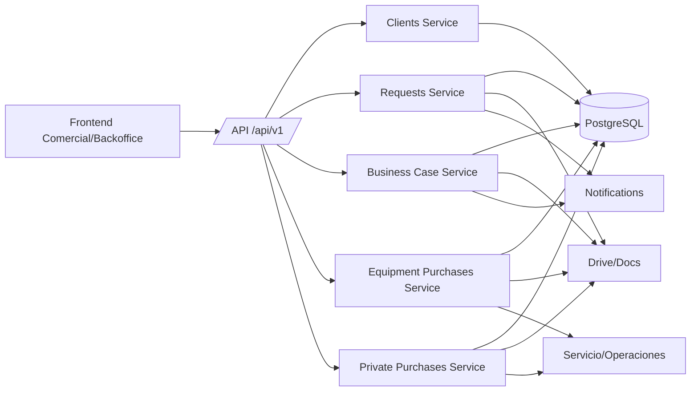
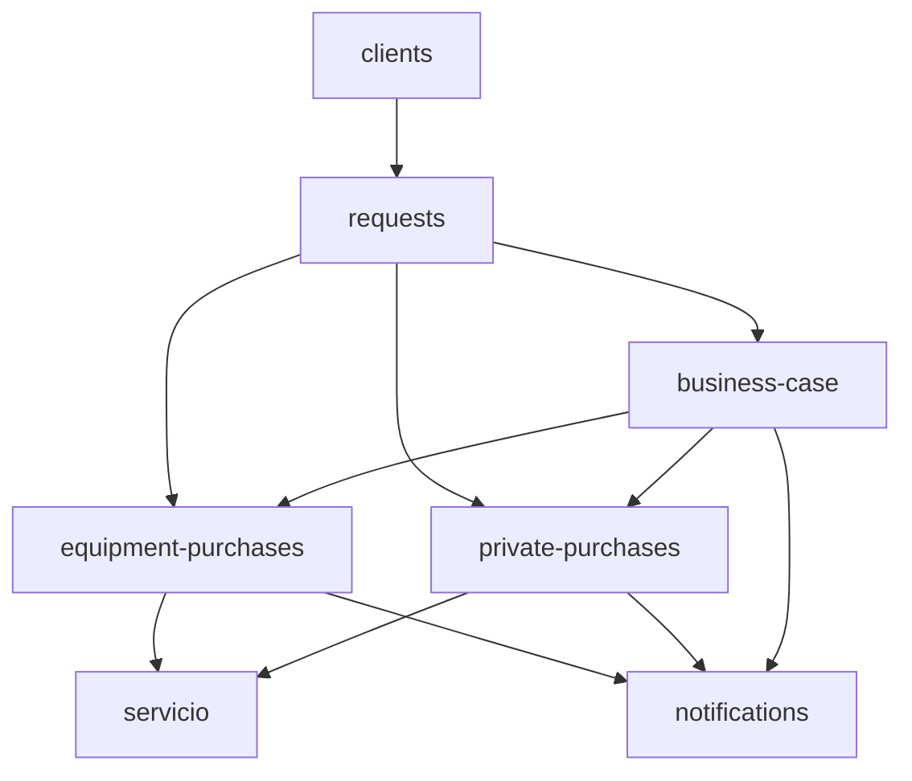
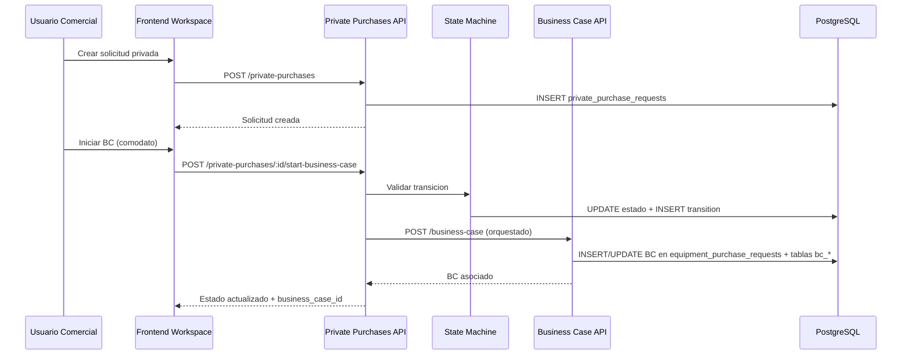

# DOCUMENTO DE DISENO DETALLADO DEL SISTEMA (DDS)
## Area 03: Comercial y Gestion de Demanda

## 1. Introduccion
### 1.1 Proposito
Definir el diseno tecnico detallado del Area 03 (Comercial y Gestion de Demanda) del Sistema de Procesos Internos (SPI), basado en la implementacion real del repositorio.

### 1.2 Alcance
Este DDS cubre los modulos funcionales activos del area:
- `clients`
- `requests`
- `business-case`
- `equipment-purchases`
- `private-purchases`

Incluye tambien artefactos legacy relacionados (`modules/comercial`) y su estado tecnico actual.

### 1.3 Fuentes analizadas
- Backend (Express):
  - `backend/src/app.js`
  - `backend/src/modules/clients/*`
  - `backend/src/modules/requests/*`
  - `backend/src/modules/business-case/*`
  - `backend/src/modules/equipment-purchases/*`
  - `backend/src/modules/private-purchases/*`
  - `backend/src/modules/comercial/*` (legacy)
  - `backend/src/middlewares/auth.js`
  - `backend/src/middlewares/roles.js`
  - `backend/src/middlewares/businessCaseValidation.js`
- Frontend (React):
  - `spi_front/src/routes/AppRoutes.jsx`
  - `spi_front/src/core/api/clientsApi.js`
  - `spi_front/src/core/api/requestsApi.js`
  - `spi_front/src/core/api/businessCaseApi.js`
  - `spi_front/src/core/api/equipmentPurchasesApi.js`
  - `spi_front/src/core/api/privatePurchasesApi.js`
  - `spi_front/src/core/api/schedulesApi.js`
  - `spi_front/src/modules/comercial/*`
  - `spi_front/src/modules/backoffice/*`
  - `spi_front/src/modules/shared/purchases-workspace/*`
- Datos y migraciones:
  - `backend/src/actualsindatos.sql`
  - `backend/migrations/007_clients_and_approvals.sql`
  - `backend/migrations/009_client_request_approval_letter.sql`
  - `backend/migrations/010_client_request_consent_record.sql`
  - `backend/migrations/014_private_purchase_requests.sql`
  - `backend/migrations/016_business_case_core_tables.sql`
  - `backend/migrations/036_business_case_state_machine_schema.sql`
  - `backend/migrations/038_business_case_data_ownership_schema.sql`
  - `backend/migrations/080_create_bc_consumption_items.sql`
  - `backend/migrations/104_bc_dispatch_workspace.sql`
  - `backend/migrations/109_bc_determinations_documents.sql`
- Base funcional:
  - `validacion_sistema/URS/areas/area_03_comercial_demanda.md`
  - `validacion_sistema/FRS/areas/FRS_area_03_comercial_demanda.md`

### 1.4 Contexto de implementacion
- Arquitectura monolitica modular: Node.js/Express + React.
- Prefijo principal de API privada: `/api/v1/*`.
- Persistencia principal: PostgreSQL.
- Integraciones del area: Google Drive/Docs (evidencias), notificaciones internas, agenda/calendario tecnico.
- Seguridad transversal: JWT, control de roles por endpoint, auditoria global.

## 2. Arquitectura del sistema
### 2.1 Arquitectura general
El area Comercial y Demanda opera sobre cinco capas:
- Presentacion: workspaces React para gestion comercial, backoffice y compras.
- API: rutas Express privadas bajo `/api/v1`.
- Servicios de negocio: controladores + servicios por modulo.
- Persistencia: tablas transaccionales de solicitudes, clientes, BC y compras.
- Integraciones: Drive/Docs, notificaciones y agenda tecnica.

### 2.2 Capas y responsabilidades
- Frontend:
  - Formularios de clientes, solicitudes, business case, compras publicas/privadas.
  - Control de acceso por rol en `ProtectedRoute`.
  - Consumo API mediante clientes `core/api`.
- API backend:
  - Orquesta validacion de token y roles.
  - Exposicion REST + SSE para seguimiento de compras.
  - Aplicacion de middlewares de validacion de negocio (BC).
- Servicios:
  - Gestion de estados, transiciones, checklist, ownership y trazabilidad.
  - Integracion documental y sincronizacion con modulos operativos.
- Datos:
  - Entidades de clientes, solicitudes, business case, compras y transiciones.
- Integraciones:
  - Adjuntos en Drive, documentos del flujo, notificaciones y agenda de entregas.

### 2.3 Componentes backend del area
- Gestion comercial base: `clients`, `requests`.
- Evaluacion y factibilidad: `business-case`.
- Compras asociadas a demanda:
  - compra publica/equipos: `equipment-purchases`
  - compra privada: `private-purchases`
- Artefacto legacy no operativo en runtime actual: `comercial`.

### 2.4 Componentes frontend del area
- Comercial:
  - `modules/comercial/pages/Dashboard.jsx`
  - `modules/comercial/pages/Solicitudes.jsx`
  - `modules/comercial/pages/Clientes.jsx`
  - `modules/comercial/pages/NewClientRequest.jsx`
  - `modules/comercial/pages/EquipmentPurchases.jsx`
  - `modules/comercial/pages/ACPEquipmentPurchases.jsx`
  - `modules/comercial/pages/BusinessCaseWorkspace.jsx`
  - `modules/comercial/pages/BusinessCaseObservabilityDashboard.jsx`
  - `modules/comercial/pages/PlanificacionMensual.jsx`
  - `modules/comercial/pages/AprobacionCronogramas.jsx`
- Backoffice comercial:
  - `modules/backoffice/pages/ClientRequests.jsx`
  - `modules/backoffice/pages/ClientRequestReview.jsx`
  - `modules/backoffice/pages/PrivatePurchases.jsx`
- Workspace transversal de compras:
  - `modules/shared/purchases-workspace/PurchasesWorkspace.jsx`

## 3. Componentes del sistema
| Componente | Responsabilidad tecnica | Archivos principales | Dependencias |
|---|---|---|---|
| Clients Service | Gestion de cartera comercial, asignaciones, detalle cliente y visitas | `modules/clients/clients.controller.js`, `clients.service.js`, `clients.routes.js` | `client_requests`, `client_assignments`, `client_visit_logs`, `prospect_visits`, `users` |
| Requests Service | Solicitudes generales + flujo de nuevo cliente con consentimiento y checklist de calidad | `modules/requests/requests.controller.js`, `requests.service.js`, `requests.routes.js` | `requests`, `request_types`, `request_versions`, `request_attachments`, `client_requests`, `client_request_*`, `users` |
| Business Case Service | Modelado economico/operativo, ownership de secciones, calculos, export y observabilidad | `modules/business-case/*.js`, `businessCase.routes.js` | `equipment_purchase_requests`, `v_business_cases*`, `bc_*`, `business_case_*`, `users` |
| Equipment Purchases Service | Flujo de compra de equipos con disponibilidad, proforma, contrato, inspeccion y entrega | `modules/equipment-purchases/*.js` | `equipment_purchase_requests`, `equipment_purchase_provider_contacts`, `requests`, `client_requests`, `servicio.*`, `users` |
| Private Purchases Service | Flujo de compras privadas por estado/circuito comercial-operaciones-logistica | `modules/private-purchases/*.js` | `private_purchase_requests`, `private_purchase_state_transitions`, `client_requests`, `servicio.*`, `users`, `documents` |
| Comercial Legacy | Artefactos de frontend dentro de backend (sin consumo runtime) | `modules/comercial/*` | Sin rutas montadas en `app.js` |

## 4. Diseno de modulos
### 4.1 Modulo `clients`
- Responsabilidad: administracion de cartera y visitas comerciales.
- Funciones detectadas:
  - listado y detalle de clientes
  - asignacion de responsable comercial
  - actualizacion de datos con adjuntos multipart
  - registro de estado de visita y visitas de prospecto
- Dependencias: solicitudes de cliente (`client_requests`) y trazabilidad de asignacion/visitas.

### 4.2 Modulo `requests`
- Responsabilidad: canal principal de entrada de demanda.
- Subflujos:
  - solicitudes generales (`requests`)
  - solicitudes de nuevo cliente (`client_requests`) con consentimiento LOPDP
- Capacidades:
  - creacion, listado, detalle, reenvio y cancelacion
  - tokens de consentimiento y validacion por codigo
  - checklist de calidad para revision de backoffice/calidad
  - registro de adjuntos y versionado de payload

### 4.3 Modulo `business-case`
- Responsabilidad: evaluacion de factibilidad tecnica/economica y datos operativos.
- Caracteristicas tecnicas detectadas:
  - endpoints de observabilidad y metricas
  - feature flags (autosave)
  - ownership de secciones y bloqueo/desbloqueo
  - determinaciones, calculos, inversiones, consumos, despacho
  - exportacion PDF/Excel
  - orquestador de etapas y validaciones
  - generacion asincrona de hojas (queue jobs)
- Nota arquitectonica: el BC moderno se soporta sobre `equipment_purchase_requests` y vistas `v_business_cases*`.

### 4.4 Modulo `equipment-purchases`
- Responsabilidad: flujo de compras de equipos para demanda comercial.
- Funciones clave:
  - creacion/listado/estadisticas
  - eventos SSE (`/events`) para actualizacion en tiempo real
  - gestion de disponibilidad con proveedor
  - proforma, contrato, reserva y renovacion
  - inspeccion tecnica (solicitud, coordinacion, revision, acta)
  - ventanas de entrega y cierre de entrega
- Dependencias directas: `servicio` (cronogramas), `requests`, `client_requests`, usuarios por rol.

### 4.5 Modulo `private-purchases`
- Responsabilidad: workflow completo de compra privada con maquina de estados canonica.
- Funciones clave:
  - CRUD y filtros por rol (`mine`, `by-role`)
  - transiciones validadas por estado/rol
  - oferta y contratos (documentos firmados)
  - registro cliente, ACP disponibilidad, inspeccion
  - despacho, acta de entrega, timeline y estadisticas
- Regla central: transiciones gobernadas por `privatePurchaseStateMachine` + `privatePurchaseStates.constants`.

### 4.6 Modulo `comercial` (legacy)
- Estado: directorio presente en backend con archivos `.jsx` vacios y sin montaje en `app.js`.
- Impacto: no participa en la ejecucion real del backend.

## 5. Modelo de datos
### 5.1 Entidades principales del area
| Entidad | PK | Campos principales detectados | Relaciones |
|---|---|---|---|
| `client_requests` | `id` | datos comerciales cliente, estado, evidencias, consentimiento | base para clientes potenciales, visitas y compras |
| `client_assignments` | `id` | `client_request_id`, `assignee_user_id`, `assigned_by`, `active` | FK a `client_requests`, `users` |
| `client_visit_logs` | `id` | `client_request_id`, `user_email`, `status`, `visit_date`, geodatos | FK a `client_requests` |
| `prospect_visits` | `id` | datos de visita prospecto, ubicacion y notas | relacion con viaticos/comercial |
| `requests` | `id` | `request_group_id`, `requester_id`, `request_type_id`, `payload`, `status` | FK a `users`, `request_types` |
| `request_types` | `id` | `code`, `title` | catalogo de tipo solicitud |
| `request_versions` | `id` | `request_id`, `version_number`, `payload` | versionado de solicitudes |
| `request_attachments` | `id` | `request_id`, `drive_file_id`, `drive_link`, `mime_type`, `uploaded_by` | FK a `requests`, `users` |
| `client_request_consent_tokens` | `id` | email destino, codigo/token, estado, expiracion, intentos | flujo consentimiento nuevo cliente |
| `client_request_consents` | `id` | `client_request_id`, hash/evidencia consentimiento, fecha | FK a `client_requests` |
| `client_request_quality_checks` | `id` | item, estado, notas, usuario revisor | FK a `client_requests` |
| `equipment_purchase_requests` | `id` | cliente, estado, etapa BC, metadata flujo compra, timestamps | entidad central BC/compras publicas |
| `equipment_purchase_provider_contacts` | `id` | email/proveedor para disponibilidad | FK logica con `equipment_purchase_requests` |
| `private_purchase_requests` | `id` | snapshot cliente, estado, documentos, fechas flujo | entidad central compras privadas |
| `private_purchase_state_transitions` | `id` | estado origen/destino, actor, motivo | auditoria de transiciones privadas |
| `business_case_state_transitions` | `id` | estado BC origen/destino, actor, motivo | auditoria de estados BC |
| `business_case_section_ownership` | `id` | seccion, responsable, estado completitud | ownership del workspace BC |
| `business_case_section_ownership_audit` | `id` | cambios de ownership/completitud por actor | trazabilidad ownership |
| `business_case_feature_flags` | `id` | flags de autosave/comportamiento | configuracion funcional BC |
| `business_case_idempotency_keys` | `id` | llave idempotente, operacion, expiracion | control de reintentos |
| `bc_determinations` | `id` | determinaciones por BC, cargas y formula | FK a BC |
| `bc_calculations` | `business_case_id` | resultados de calculo, version de calculo | FK a BC |
| `bc_investments` | `id` | item inversion, cantidad, costo, proveedor | FK a BC |
| `bc_consumption_items` | `id` | item consumo y parametros de calculo | FK a BC |
| `bc_consumption_excluded` | `id` | item excluido para calculo | FK a BC |
| `bc_dispatch_items` | `id` | plan/comentarios despacho comercial-operaciones | FK a BC |
| `bc_determinations_documents` | `id` | documentos de soporte de determinaciones | FK a BC |
| `bc_sheet_generation_jobs` | `id` | estado job de generacion de hojas BC | FK a BC |

### 5.2 Relaciones clave del area
- `client_requests` es pivote entre captacion comercial, visitas, compras y viaticos.
- `requests` soporta solicitudes generales con versionado (`request_versions`) y evidencia (`request_attachments`).
- `equipment_purchase_requests` concentra BC moderno y parte del workflow de compras publicas.
- `private_purchase_requests` mantiene su propia maquina de estados y timeline de transiciones.
- Las tablas `business_case_*` y `bc_*` segmentan ownership, trazabilidad, calculo y datos complementarios del BC.

### 5.3 Observaciones de persistencia
- Existe convivencia entre modelo modern y legado para BC (vistas `v_business_cases`, `v_business_cases_complete`, `v_business_cases_legacy`).
- Mecanismos de idempotencia y ownership se incorporan por migraciones especializadas.
- Parte de las tablas/campos evolucionan por `ALTER TABLE` progresivo en migraciones.

## 6. Interfaces API
### 6.1 `clients` (`/api/v1/clients`)
| Endpoint | Descripcion | Entradas | Salida | Errores posibles |
|---|---|---|---|---|
| `GET /` | Lista clientes y resumen comercial | query opcional | `data`, `prospects`, `summary` | `401`, `500` |
| `GET /:id` | Detalle cliente | `id` | objeto cliente | `401`, `404`, `500` |
| `PUT /:id` | Actualiza cliente + adjuntos | multipart/form-data | cliente actualizado | `400`, `401`, `403`, `500` |
| `POST /:id/assign` | Asigna responsable comercial | body (`assignee_email`) | asignacion activa | `400`, `401`, `403`, `500` |
| `POST /:id/visit-status` | Registra estado visita | body (`status`, notas) | log/estado visita | `400`, `401`, `500` |
| `POST /prospect-visit` | Registra visita prospecto | body visita | visita registrada | `400`, `401`, `500` |

### 6.2 `requests` (`/api/v1/requests`)
| Endpoint | Descripcion | Entradas | Salida | Errores posibles |
|---|---|---|---|---|
| `GET /public/consent/:token` | Consentimiento publico nuevo cliente | token URL | confirmacion consentimiento | `400`, `404` |
| `POST /new-client/consent-token` | Emite token de consentimiento por correo | email cliente/receptor | token emitido | `400`, `401`, `500` |
| `POST /new-client/consent-token/verify` | Verifica codigo de consentimiento | `token_id`, `code` | token verificado | `400`, `401`, `409` |
| `POST /new-client` | Crea solicitud nuevo cliente | multipart con evidencias | solicitud creada | `400`, `401`, `500` |
| `GET /new-client/my` | Lista solicitudes propias nuevo cliente | filtros | listado paginado | `401`, `500` |
| `GET /new-client` | Lista global para backoffice/calidad | filtros | listado paginado | `401`, `403`, `500` |
| `GET /new-client/summary` | Resumen por estado | filtros | resumen | `401`, `403`, `500` |
| `GET /new-client/:id` | Detalle solicitud nuevo cliente | `id` | detalle completo | `401`, `403`, `404` |
| `PUT /new-client/:id/quality-checklist` | Actualiza checklist de calidad | item, estado, notas | checklist actualizado | `400`, `401`, `403` |
| `PUT /new-client/:id/process` | Aprueba/rechaza solicitud | `action`, `rejection_reason` | estado procesado | `400`, `401`, `403`, `409` |
| `PUT /new-client/:id` | Corrige solicitud nuevo cliente | multipart | solicitud actualizada | `400`, `401`, `500` |
| `POST /` | Crea solicitud general | multipart (`payload`, archivos) | solicitud creada | `400`, `401`, `403` |
| `GET /` | Lista solicitudes generales | filtros y paginacion | `rows`, `count` | `401`, `403`, `500` |
| `GET /:id` | Detalle solicitud general | `id` | solicitud + adjuntos | `401`, `403`, `404` |
| `PUT /:id/resubmit` | Reenvia solicitud rechazada | `id` | nueva version/estado | `400`, `401`, `403`, `409` |
| `POST /:id/cancel` | Cancela solicitud | `id` | estado cancelado | `400`, `401`, `403`, `409` |

### 6.3 `business-case` (`/api/v1/business-case`)
| Endpoint | Descripcion | Entradas | Salida | Errores posibles |
|---|---|---|---|---|
| `GET /` | Lista business case | filtros | listado BC | `401`, `403`, `500` |
| `POST /` | Crea BC | payload comercial | BC creado | `400`, `401`, `403` |
| `GET /:id` | Obtiene BC | `id` | detalle BC | `401`, `403`, `404` |
| `PUT /:id` | Actualiza BC | payload parcial | BC actualizado | `400`, `401`, `403` |
| `DELETE /:id` | Elimina BC | `id` | confirmacion | `401`, `403`, `404` |
| `GET /:id/ui-guidance` | Guia UI y permisos por seccion | `id` | reglas ownership/acciones | `401`, `403` |
| `GET /:id/ownership` | Estado ownership secciones | `id` | ownership actual | `401`, `403` |
| `POST /:id/ownership/complete` | Marca seccion completada | seccion/estado | ownership actualizado | `400`, `401`, `403` |
| `POST /:id/sections/:section/lock` | Bloquea seccion | seccion | lock aplicado | `401`, `403`, `409` |
| `POST /:id/sections/:section/unlock` | Desbloquea seccion | seccion | unlock aplicado | `401`, `403`, `409` |
| `GET /:id/determinations` | Lista determinaciones | `id` | determinaciones | `401`, `403` |
| `POST /:id/determinations` | Crea determinacion | payload validado | determinacion creada | `400`, `401`, `403`, `409` |
| `PUT /:id/determinations/:detId` | Actualiza determinacion | payload | determinacion actualizada | `400`, `401`, `403` |
| `GET /:id/calculations` | Obtiene calculos | `id` | calculos BC | `401`, `403` |
| `POST /:id/recalculate` | Recalcula BC | `id` | calculos actualizados | `400`, `401`, `403` |
| `PUT /:id/economic-data` | Actualiza datos economicos | payload | datos guardados | `400`, `401`, `403` |
| `GET /:id/export/pdf` | Exporta PDF BC | `id` | archivo/stream | `401`, `403`, `500` |
| `GET /:id/export/excel` | Exporta Excel BC | `id` | archivo/stream | `401`, `403`, `500` |
| `POST /:id/feasibility-decision` | Decision factibilidad | decision + justificacion | estado factibilidad | `400`, `401`, `403`, `409` |
| `POST /orchestrator/create-economic` | Crea BC economico unificado | payload | BC base | `400`, `401`, `403` |
| `POST /:id/orchestrator/promote-stage` | Promociona etapa BC | payload etapa | BC promovido | `400`, `401`, `403`, `409` |

### 6.4 Catalogos BC complementarios
- `equipment-catalog` (`/api/v1/equipment-catalog`): listado, detalle, determinaciones/consumibles por equipo, formula de equipo.
- `determinations-catalog` (`/api/v1/determinations-catalog`): CRUD catalogo determinaciones y validacion de formula.
- `calculation-templates` (`/api/v1/calculation-templates`): CRUD de plantillas y aplicacion por item.

### 6.5 `equipment-purchases` (`/api/v1/equipment-purchases`)
| Endpoint | Descripcion | Entradas | Salida | Errores posibles |
|---|---|---|---|---|
| `GET /events` | Stream SSE de cambios | token por query/header | eventos en tiempo real | `401`, `403` |
| `GET /meta` | Metadata del flujo | - | catalogos/metadatos | `401`, `403` |
| `GET /stats` | Estadisticas por estado | - | KPIs flujo | `401`, `403` |
| `GET /technical-schedule` | Calendario tecnico vinculado | filtros | disponibilidad/agenda | `401`, `403` |
| `GET /` | Lista compras del alcance de rol | filtros | listado | `401`, `403` |
| `POST /` | Crea compra equipo | payload compra | compra creada | `400`, `401`, `403` |
| `POST /:id/start-availability` | Inicia solicitud disponibilidad | `id` | estado actualizado | `400`, `401`, `403`, `409` |
| `POST /:id/provider-response` | Registra respuesta proveedor | payload | estado actualizado | `400`, `401`, `403`, `409` |
| `PATCH /:id/public-portal-outcome` | Registra resultado portal publico | payload | estado actualizado | `400`, `401`, `403`, `409` |
| `PATCH /:id/checklist` | Actualiza checklist flujo | payload | checklist persistido | `400`, `401`, `403` |
| `POST /:id/request-proforma` | Solicita proforma | `expected_updated_at` | transicion aplicada | `400`, `401`, `403`, `409` |
| `POST /:id/upload-proforma` | Sube proforma proveedor | multipart (`file`) | documento vinculado | `400`, `401`, `403` |
| `POST /:id/upload-contract` | Sube contrato | multipart (`file`) | contrato vinculado | `400`, `401`, `403` |
| `POST /:id/request-delivery-dates` | Solicita fechas entrega | notas/version | estado actualizado | `400`, `401`, `403` |
| `POST /:id/submit-delivery-dates` | Registra fechas entrega | rango fechas | estado actualizado | `400`, `401`, `403`, `409` |
| `PATCH /:id/site-inspection` | Registra inspeccion tecnica | checklist/resultado | acta y estado | `400`, `401`, `403`, `409` |
| `POST /:id/complete-delivery` | Cierra entrega | notas/version | estado final entrega | `400`, `401`, `403`, `409` |

### 6.6 `private-purchases` (`/api/v1/private-purchases`)
| Endpoint | Descripcion | Entradas | Salida | Errores posibles |
|---|---|---|---|---|
| `GET /events` | Stream SSE compras privadas | token | eventos en tiempo real | `401`, `403` |
| `POST /` | Crea solicitud privada | payload cliente/equipos | solicitud creada | `400`, `401`, `500` |
| `GET /` | Lista solicitudes privadas | filtros | listado | `401`, `500` |
| `GET /mine` | Lista propias | - | listado por usuario | `401` |
| `GET /by-role/:role` | Lista por rol dashboard | `role` | listado filtrado | `401`, `403` |
| `GET /:id` | Detalle solicitud privada | `id` | detalle completo | `401`, `404` |
| `POST /:id/transition` | Cambio de estado controlado | `to_state`, `reason` | estado transicionado | `400`, `401`, `403`, `409` |
| `GET /:id/transitions` | Transiciones permitidas | `id` | lista transiciones | `401`, `403` |
| `POST /:id/validate-transition` | Valida transicion sin ejecutar | payload | validacion | `400`, `401`, `403` |
| `POST /:id/offer` | Envia oferta | payload/documento | oferta enviada | `400`, `401`, `403` |
| `POST /:id/start-business-case` | Inicia BC para comodato | payload | estado BC iniciado | `400`, `401`, `403` |
| `POST /:id/submit-contract` | Carga contrato | multipart/documento | contrato registrado | `400`, `401`, `403` |
| `POST /:id/request-delivery-dates` | Solicita fechas entrega | payload | estado actualizado | `400`, `401`, `403` |
| `POST /:id/submit-delivery-dates` | Define fechas entrega | payload | estado actualizado | `400`, `401`, `403`, `409` |
| `POST /:id/delivery-act` | Carga acta entrega | documento | acta registrada | `400`, `401`, `403` |
| `GET /:id/timeline` | Traza completa de evento/estado | `id` | timeline | `401`, `404` |

## 7. Flujos tecnicos
### 7.1 Flujo de nuevo cliente con consentimiento
1. Usuario autenticado crea solicitud en `POST /requests/new-client` con adjuntos.
2. Se emite token de consentimiento (`/new-client/consent-token`) al receptor designado.
3. Receptor confirma consentimiento via ruta publica `/requests/public/consent/:token` o verificacion por codigo.
4. Backoffice/calidad revisa checklist y procesa (`/new-client/:id/process`).
5. Solicitud aprobada queda disponible para asignacion y gestion comercial.

### 7.2 Flujo de solicitud general comercial
1. Comercial crea solicitud en `POST /requests`.
2. Sistema registra payload versionado y adjuntos en `request_versions`/`request_attachments`.
3. Solicitud se lista por rol en `GET /requests`.
4. Si es rechazada, jefe comercial ejecuta `PUT /:id/resubmit`.
5. Si aplica, se cancela con `POST /:id/cancel`.

### 7.3 Flujo de Business Case moderno
1. Comercial crea BC (`POST /business-case`).
2. Workspace consume `GET /:id/ui-guidance` para permisos, ownership y flags.
3. Usuarios completan secciones (lab/equipment/lis/requirements/investments/consumption/dispatch).
4. Sistema ejecuta calculos (`POST /:id/recalculate`) y evalua factibilidad.
5. Decision de viabilidad (`POST /:id/feasibility-decision`) y promocion de etapa.
6. Opcional: generacion de hojas por cola (`/sheets/generate`) y seguimiento de job.

### 7.4 Flujo de compra de equipos (publica)
1. Comercial crea solicitud en `equipment-purchases`.
2. ACP/gerencia inicia disponibilidad con proveedor.
3. Se registra proforma, reserva, contrato y control de checklist.
4. Si aplica, se ejecuta inspeccion tecnica (solicitud, coordinacion, revision, acta).
5. Se solicitan/registran fechas de entrega y se cierra entrega.
6. El frontend mantiene sincronizacion por SSE (`/events`).

### 7.5 Flujo de compra privada
1. Comercial/backoffice crea solicitud privada.
2. Workflow transiciona por oferta, firma y registro cliente.
3. Segun caso, se activa disponibilidad ACP o BC de comodato.
4. Continuan etapas de contrato, inspeccion y entrega.
5. Operaciones/logistica completan despacho y acta.
6. Timeline y transiciones quedan auditables.

## 8. Seguridad del sistema
### 8.1 Controles implementados
- JWT obligatorio en rutas privadas (con excepciones controladas en `app.js`).
- `requireRole` por endpoint con matrices de rol especificas por modulo.
- Validaciones de negocio en capas de servicio (estados permitidos, expected version, checklist).
- Soporte de trazabilidad por transiciones (`private_purchase_state_transitions`, `business_case_state_transitions`).
- Auditoria global por `auditMiddleware` en escritura.

### 8.2 Riesgos de seguridad detectados
- Rutas legacy/no montadas pueden inducir confusion de superficie API real.
- SSE usa token por query en algunos clientes; requiere control estricto de exposicion en logs y proxies.
- Amplia matriz de roles en `requests` exige pruebas de autorizacion por combinatoria de perfil.

## 9. Manejo de errores
### 9.1 Estrategia general
- Manejo de excepciones por modulo + `error handler` global en `app.js`.
- Respuesta estandarizada con `message`, `code`, `details`, `retryable`, `request_id`.
- Control de conflictos de estado/transicion en workflows largos (409).

### 9.2 Codigos observados por el area
- `400/422`: payload invalido, archivos faltantes, reglas de negocio no satisfechas.
- `401`: token ausente/invalido.
- `403`: rol no autorizado para etapa/accion.
- `404`: entidad no encontrada (cliente, solicitud, compra, BC).
- `409`: transicion no permitida, estado obsoleto, conflicto de concurrencia.
- `500`: error interno o de dependencia tecnica.

Errores de dominio detectados en flujos de compra (`equipment-purchases`):
- `INVALID_TRANSITION`
- `STALE_REQUEST_STATE`
- `CHECKLIST_INCOMPLETE`
- `PROFORMA_REQUEST_LOCKED`
- `TECHNICAL_SCHEDULE_FULL`
- `SITE_INSPECTION_RESULT_REQUIRED`

## 10. Diagramas de arquitectura y discrepancias
### 10.1 Diagrama de arquitectura (alto nivel)

### 10.2 Diagrama de dependencias funcionales

### 10.3 Diagrama de secuencia tecnica (compra privada con BC)

### 10.4 Discrepancias FRS vs implementacion real
1. `FRS_area_03` referencia modulo `comercial` como modulo backend funcional; en codigo backend `modules/comercial` contiene artefactos `.jsx` vacios y no esta montado en `app.js`.
2. El dominio Business Case no usa una tabla unica `business_case`; la implementacion moderna usa `equipment_purchase_requests` + vistas `v_business_cases*` + tablas `bc_*`.
3. El FRS describe integracion lineal con aprobaciones; en codigo el flujo usa principalmente estados/transiciones propios por modulo (requests/equipment/private/business-case), sin dependencia directa obligatoria de `/api/v1/approvals` en cada endpoint del area.
4. Existen endpoints de observabilidad, feature flags y orquestador en `business-case` no explicitados en FRS de alto nivel.
