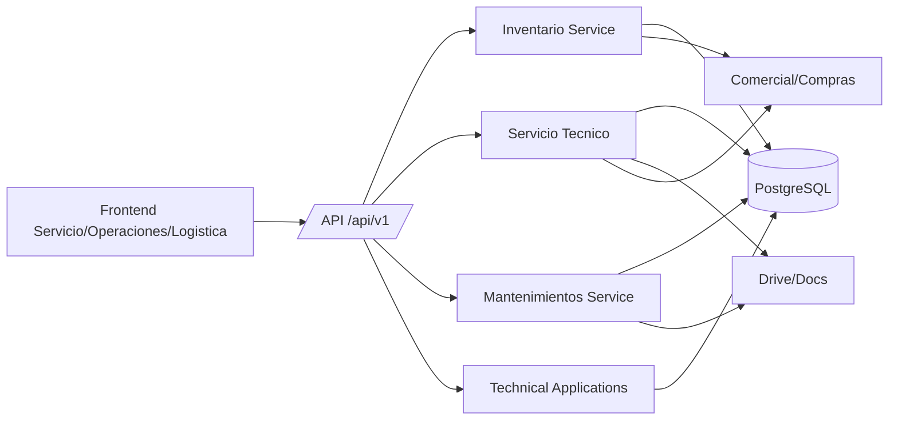
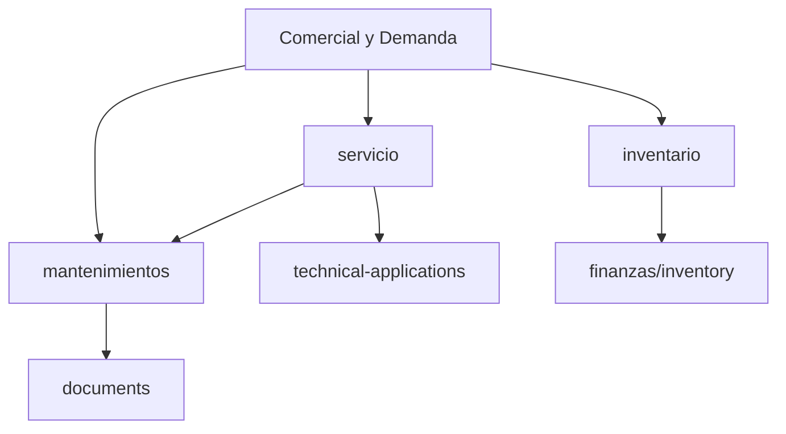
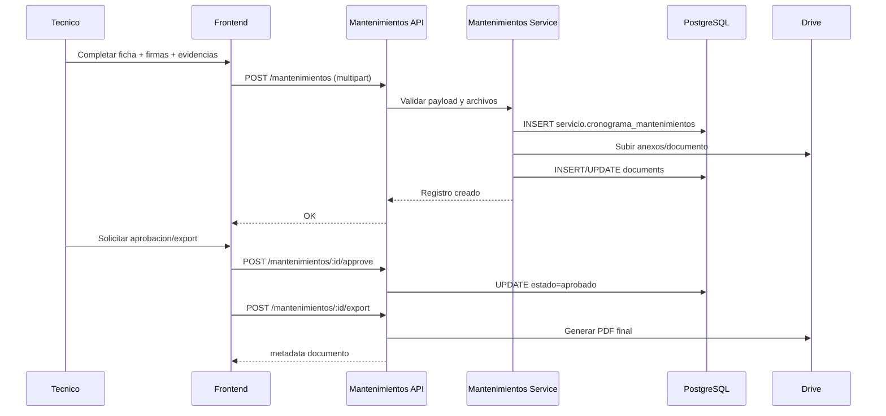

# DOCUMENTO DE DISENO DETALLADO DEL SISTEMA (DDS)
## Area 04: Operaciones, Servicio y Logistica

## 1. Introduccion
### 1.1 Proposito
Definir el diseno tecnico detallado del Area 04 (Operaciones, Servicio y Logistica) del Sistema de Procesos Internos (SPI), con base exclusiva en la implementacion real del repositorio.

### 1.2 Alcance
Este DDS cubre los modulos funcionales activos del area:
- `inventario`
- `servicio`
- `mantenimientos`
- `technical-applications`

Tambien documenta modulos legacy relacionados (`operaciones`, `logistica`, `tecnico`) y su estado en runtime.

### 1.3 Fuentes analizadas
- Backend (Express):
  - `backend/src/app.js`
  - `backend/src/modules/inventario/*`
  - `backend/src/modules/servicio/*`
  - `backend/src/modules/mantenimientos/*`
  - `backend/src/modules/technical-applications/*`
  - `backend/src/modules/operaciones/operaciones.routes.js` (legacy)
  - `backend/src/modules/logistica/logistica.routes.js` (legacy)
  - `backend/src/modules/tecnico/tecnico.routes.js` (legacy)
  - `backend/src/middlewares/auth.js`
  - `backend/src/middlewares/roles.js`
- Frontend (React):
  - `spi_front/src/routes/AppRoutes.jsx`
  - `spi_front/src/core/api/inventarioApi.js`
  - `spi_front/src/core/api/servicioApi.js`
  - `spi_front/src/core/api/mantenimientosApi.js`
  - `spi_front/src/core/api/technicalApplicationsApi.js`
  - `spi_front/src/modules/servicio/*`
  - `spi_front/src/modules/operaciones/*`
  - `spi_front/src/modules/logistica/*`
  - `spi_front/src/modules/MantenimientosPage.jsx`
- Datos y migraciones:
  - `backend/src/actualsindatos.sql`
  - `backend/migrations/013_add_request_id_to_equipos_unidad.sql`
  - `backend/migrations/019_servicio.sql`
  - `backend/migrations/098_technical_activity_schedule.sql`
  - `backend/migrations/100_servicio_workflow_documents.sql`
- Base funcional:
  - `validacion_sistema/URS/areas/area_04_operaciones_servicio_logistica.md`
  - `validacion_sistema/FRS/areas/FRS_area_04_operaciones_servicio_logistica.md`

### 1.4 Contexto de implementacion
- Arquitectura monolitica modular sobre Node.js/Express + React.
- Rutas privadas bajo `/api/v1/*` con JWT global.
- Persistencia en PostgreSQL con tablas en `public` y schema `servicio`.
- Integraciones relevantes: Google Drive/Docs para evidencias PDF de servicio/mantenimiento.

## 2. Arquitectura del sistema
### 2.1 Arquitectura general
El area opera sobre cinco capas tecnicas:
- Presentacion: dashboards de servicio, operaciones y logistica.
- API: rutas REST protegidas por JWT y roles.
- Servicios de negocio: inventario, cronogramas tecnicos, mantenimientos y disponibilidad.
- Persistencia: tablas de inventario, cronogramas y documentos.
- Integraciones: generacion documental (Drive/PDF) y acople con modulos comerciales/compras.

### 2.2 Capas y responsabilidades
- Frontend:
  - Vistas de inventario, solicitudes tecnicas, capacitaciones, mantenimientos y entregas.
  - Consumo API por clientes centralizados (`core/api`).
- API backend:
  - Publicacion de endpoints por modulo.
  - Aplicacion de `verifyToken` + `requireRole` por operacion.
- Servicios:
  - Reglas de consistencia de estado/stock.
  - Generacion de documentos tecnicos en flujo.
- Datos:
  - Entidades de unidades de equipo, movimientos, cronogramas, disponibilidad y evidencias.
- Integraciones:
  - Drive para anexos y documentos PDF de proceso tecnico.

### 2.3 Componentes backend del area
- Control de inventario y activos: `inventario`.
- Gestion de servicio tecnico y cronogramas: `servicio`.
- Ejecucion/cierre de mantenimientos: `mantenimientos`.
- Consulta de aplicaciones tecnicas disponibles: `technical-applications`.
- Legacy no operativo en montaje actual: `operaciones`, `logistica`, `tecnico`.

### 2.4 Componentes frontend del area
- Servicio tecnico:
  - `modules/servicio/pages/Dashboard.jsx`
  - `modules/servicio/pages/Mantenimientos.jsx`
  - `modules/servicio/pages/Solicitudes.jsx`
  - `modules/servicio/pages/Disponibilidad.jsx`
  - `modules/servicio/pages/Capacitaciones.jsx`
  - `modules/servicio/pages/Equipos.jsx`
  - `modules/servicio/pages/Aprobaciones.jsx`
  - `modules/servicio/pages/Aplicaciones.jsx`
  - `modules/servicio/pages/Desinfeccion.jsx`
  - `modules/servicio/pages/Asistencia.jsx`
  - `modules/servicio/pages/VerificacionEquipos.jsx`
  - `modules/servicio/pages/TechnicalProcedureWorkspace.jsx`
  - `modules/servicio/pages/PrivatePurchaseDeliveries.jsx`
  - `modules/servicio/pages/TecnicoPrivatePurchases.jsx`
- Operaciones y logistica:
  - `modules/operaciones/Dashboard.jsx`
  - `modules/operaciones/pages/DeterminationsCatalog.jsx`
  - `modules/operaciones/pages/OperacionesPrivatePurchases.jsx`
  - `modules/logistica/Dashboard.jsx`
  - `modules/logistica/pages/LogisticaPrivatePurchases.jsx`
- Componente compartido:
  - `modules/MantenimientosPage.jsx`

## 3. Componentes del sistema
| Componente | Responsabilidad tecnica | Archivos principales | Dependencias |
|---|---|---|---|
| Inventario Service | Consulta inventario consolidado, altas de unidad, captura serial, asignacion y movimientos | `modules/inventario/inventario.controller.js`, `inventario.service.js`, `inventario.routes.js` | `equipos_modelo`, `equipos_unidad`, `equipos_historial`, `inventory_movements`, `v_inventario_completo` |
| Servicio Controller + PDF Services | Gestion de cronogramas (capacitaciones/actividades/mantenimientos), disponibilidad y generacion de formatos tecnicos PDF | `modules/servicio/servicio.controller.js`, `desinfeccion.service.js`, `entrenamiento.service.js`, `asistencia-entrenamiento.service.js`, `verificacion-equipos.service.js` | `servicio.cronograma_*`, `servicio.workflow_documents`, `servicio.disponibilidad_tecnicos`, `equipment_models`, `users`, `documents`, Drive |
| Mantenimientos Service | Registro, firma, aprobacion y export de mantenimientos | `modules/mantenimientos/mantenimientos.controller.js`, `mantenimientos.service.js`, `mantenimientos.routes.js` | `servicio.cronograma_mantenimientos`, `documents`, Drive |
| Technical Applications | Consulta de aplicaciones tecnicas habilitadas para tecnicos | `modules/technical-applications/technicalApplications.controller.js`, `technicalApplications.routes.js` | `servicio.aplicaciones_tecnicas` |
| Legacy Ops/Logistica/Tecnico | Rutas antiguas de aprobacion/completado de solicitudes | `modules/operaciones/logistica/tecnico/*.routes.js` | imports legacy no resueltos en estructura actual |

## 4. Diseno de modulos
### 4.1 Modulo `inventario`
- Responsabilidad: ciclo de vida de equipos fisicos y trazabilidad de movimientos.
- Capacidades detectadas:
  - inventario consolidado (`v_inventario_completo`)
  - listado de equipos disponibles y por cliente
  - alta de unidad desde modelo
  - captura/validacion de serial unico
  - asignacion de unidad a cliente/sucursal
  - cambio de estado y registro de historial
  - registro de movimientos de inventario
- Integracion: referencias cruzadas con solicitudes y compras para asignacion de equipos.

### 4.2 Modulo `servicio`
- Responsabilidad: ejecucion operativa del servicio tecnico y documentos de flujo.
- Capacidades detectadas:
  - CRUD de capacitaciones
  - gestion de disponibilidad de tecnicos
  - planificacion/registro de actividades tecnicas
  - consulta/creacion de equipos
  - consulta de mantenimientos y mantenimientos anuales
  - generacion de formatos PDF:
    - desinfeccion
    - coordinacion de entrenamiento
    - lista de asistencia
    - verificacion de equipos
  - consulta de `workflow_documents` por fuente y resumen multi fuente

### 4.3 Modulo `mantenimientos`
- Responsabilidad: registro formal de mantenimientos con evidencias y ciclo de aprobacion.
- Capacidades detectadas:
  - creacion con firmas y anexos (`multipart`)
  - listado general o por tecnico
  - detalle con evidencia documental
  - firma posterior (`/sign`)
  - aprobacion gerencial
  - exportacion a PDF
- Integracion: persiste metadatos en `documents` y actualiza estado en `servicio.cronograma_mantenimientos`.

### 4.4 Modulo `technical-applications`
- Responsabilidad: exposicion de aplicaciones tecnicas disponibles para ejecucion en campo.
- Endpoint activo:
  - `GET /api/v1/technical-applications/available`
- Dependencia: tabla `servicio.aplicaciones_tecnicas`.

### 4.5 Modulos `operaciones`, `logistica`, `tecnico` (legacy)
- Estado:
  - existen rutas en repositorio
  - no estan montadas en `backend/src/app.js`
  - referencian `../auth/auth.middleware` (ruta no alineada con middlewares actuales)
- Resultado: no forman parte del runtime activo.

## 5. Modelo de datos
### 5.1 Entidades principales del area
| Entidad | PK | Campos principales detectados | Relaciones |
|---|---|---|---|
| `inventory` | `id` | item, cantidad, ultima actualizacion | base para movimientos de inventario |
| `inventory_movements` | `id` | `inventory_id`, tipo, cantidad, razon, `created_by` | FK a `inventory`, `users` |
| `equipos_modelo` | `id` | nombre, modelo, metadatos de equipo | FK desde `equipos_unidad` |
| `equipos_unidad` | `id` | `modelo_id`, serial, estado, `cliente_id`, `sucursal_id`, `request_id` | FK a `equipos_modelo` y referencias de negocio |
| `equipos_historial` | `id` | `unidad_id`, evento, detalle, request, cliente/sucursal, actor | FK a `equipos_unidad` |
| `v_inventario_completo` | vista | inventario consolidado de unidades/modelos/estado | alimenta consultas operativas |
| `servicio.cronograma_capacitacion` | `id_capacitacion` | tecnico, fecha, estado, observaciones | cronograma de capacitacion |
| `servicio.disponibilidad_tecnicos` | `id` | `user_id`, estado disponibilidad, nota | FK a `users` |
| `servicio.cronograma_actividades_tecnicas` | `id` | `user_id`, fecha, actividad, estado | FK a `users` |
| `servicio.cronograma_mantenimientos` | `id` | equipo, frecuencia, fecha, estado, tecnico | referencia de mantenimientos |
| `servicio.cronograma_mantenimientos_anuales` | `id` | plan anual de mantenimiento por equipo | relacion con `equipment_models` |
| `servicio.workflow_documents` | `id` | `source_type`, `source_id`, `request_id`, `document_id`, estatus | relaciona documentos de flujo |
| `servicio.aplicaciones_tecnicas` | `id` | aplicacion, estado activo/archivado, fechas | fuente de `technical-applications` |
| `documents` | `id` | `request_id`, `doc_drive_id`, `pdf_drive_id`, `signed` | soporte documental de mantenimientos/servicio |

### 5.2 Relaciones clave del area
- `equipos_unidad` -> `equipos_modelo` define estructura de activos por unidad fisica.
- `equipos_historial` asegura trazabilidad cronologica de cambios de estado/asignacion.
- Tablas `servicio.cronograma_*` concentran planificacion y ejecucion tecnica.
- `servicio.workflow_documents` vincula documentos tecnicos a `source_type/source_id`.
- `documents` actua como repositorio de evidencias PDF generadas por flujo.

### 5.3 Observaciones de persistencia
- El area combina tablas en `public` y `servicio`.
- Parte de la consistencia de inventario se resuelve en capa de servicio (validaciones previas a update).
- Generacion documental y almacenamiento en Drive complementan el registro SQL.

## 6. Interfaces API
### 6.1 `inventario` (`/api/v1/inventario`)
| Endpoint | Descripcion | Entradas | Salida | Errores posibles |
|---|---|---|---|---|
| `GET /` | Inventario completo | filtros opcionales | dataset inventario | `401`, `500` |
| `GET /equipos-disponibles` | Equipos disponibles para asignacion | filtros | lista equipos | `401`, `500` |
| `GET /equipos-cliente/:cliente_id` | Equipos asociados a cliente | `cliente_id` | lista por cliente | `401`, `404` |
| `GET /modelos` | Catalogo de modelos | filtros | lista modelos | `401`, `500` |
| `POST /equipos-unidad` | Crea unidad de equipo | payload unidad | unidad creada | `400`, `401`, `409` |
| `POST /equipos-unidad/:id/serial` | Captura/actualiza serial | serial | unidad actualizada | `400`, `401`, `409` |
| `POST /equipos-unidad/:id/asignar` | Asigna unidad | cliente/sucursal/request | unidad asignada | `400`, `401`, `404` |
| `POST /equipos-unidad/:id/cambiar-estado` | Cambia estado unidad | nuevo estado + motivo | unidad actualizada | `400`, `401`, `409` |
| `POST /movimiento` | Registra movimiento inventario | tipo/cantidad/razon | movimiento registrado | `400`, `401`, `500` |

### 6.2 `servicio` (`/api/v1/servicio`)
| Endpoint | Descripcion | Entradas | Salida | Errores posibles |
|---|---|---|---|---|
| `GET /capacitaciones` | Lista capacitaciones | filtros | `rows` | `401`, `403`, `500` |
| `POST /capacitaciones` | Crea capacitacion | payload | registro creado | `400`, `401`, `403` |
| `PUT /capacitaciones/:id` | Actualiza capacitacion | payload | registro actualizado | `400`, `401`, `403`, `404` |
| `DELETE /capacitaciones/:id` | Elimina capacitacion | `id` | confirmacion | `401`, `403`, `404` |
| `GET /disponibilidad` | Consulta disponibilidad tecnicos | filtros | disponibilidad | `401`, `403` |
| `POST /disponibilidad` | Actualiza disponibilidad tecnico | estado/nota | disponibilidad actualizada | `400`, `401`, `403` |
| `GET /actividades` | Lista actividades tecnicas | rango (`from`,`to`) | actividades | `400`, `401`, `403` |
| `POST /actividades` | Crea actividad tecnica | payload actividad | actividad creada | `400`, `401`, `403`, `409` |
| `GET /equipos` | Lista equipos tecnicos | - | lista equipos | `401`, `403` |
| `POST /equipos` | Crea equipo tecnico | payload | equipo creado | `400`, `401`, `403` |
| `GET /mantenimientos` | Consulta mantenimientos | filtros | lista mantenimientos | `401`, `403` |
| `GET /mantenimientos-anuales` | Consulta mantenimiento anual | filtros | lista anual | `401`, `403` |
| `POST /mantenimientos-anuales` | Crea mantenimiento anual | payload | registro creado | `400`, `401`, `403` |
| `POST /desinfeccion/pdf` | Genera PDF desinfeccion | payload + firmas | documento generado | `400`, `401`, `403`, `500` |
| `POST /entrenamiento/pdf` | Genera PDF coordinacion entrenamiento | payload + firma | documento generado | `400`, `401`, `403`, `500` |
| `POST /entrenamiento/asistencia/pdf` | Genera lista asistencia PDF | payload + firma | documento generado | `400`, `401`, `403`, `500` |
| `POST /entrenamiento/verificacion/pdf` | Genera verificacion equipos PDF | payload + anexos | documento generado | `400`, `401`, `403`, `500` |
| `GET /workflow-documents` | Lista docs de workflow por fuente | `source_type`, `source_id` | documentos | `401`, `403` |
| `GET /workflow-documents/summary` | Resumen docs por lote | `source_type`, `source_ids` | resumen | `401`, `403` |

### 6.3 `mantenimientos` (`/api/v1/mantenimientos`)
| Endpoint | Descripcion | Entradas | Salida | Errores posibles |
|---|---|---|---|---|
| `POST /` | Crea mantenimiento con firmas/evidencias | multipart | mantenimiento creado | `400`, `401`, `403`, `500` |
| `GET /` | Lista mantenimientos | filtros | listado | `401`, `500` |
| `GET /:id` | Obtiene detalle mantenimiento | `id` | detalle + documentos | `401`, `404` |
| `POST /:id/sign` | Firma mantenimiento | firma/payload | mantenimiento firmado | `400`, `401`, `403` |
| `POST /:id/sign-advanced` | Firma avanzada (endpoint expuesto) | payload firma avanzada | respuesta de firma | `400`, `401`, `403`, `500` |
| `POST /:id/approve` | Aprueba mantenimiento | `id` | estado aprobado | `401`, `403`, `409` |
| `POST /:id/export` | Exporta a PDF | `id` | documento PDF/metadata | `401`, `403`, `500` |

### 6.4 `technical-applications` (`/api/v1/technical-applications`)
| Endpoint | Descripcion | Entradas | Salida | Errores posibles |
|---|---|---|---|---|
| `GET /available` | Lista aplicaciones tecnicas no archivadas | - | listado aplicaciones | `401`, `403`, `500` |

## 7. Flujos tecnicos
### 7.1 Flujo de alta y asignacion de equipo
1. Operador consulta modelos y stock operativo (`/inventario/modelos`, `/inventario/equipos-disponibles`).
2. Crea unidad (`POST /equipos-unidad`) y captura serial (`POST /equipos-unidad/:id/serial`).
3. Asigna unidad a cliente/sucursal (`POST /equipos-unidad/:id/asignar`).
4. Sistema registra evento en `equipos_historial` y actualiza estado.
5. Si aplica, se registra movimiento en `inventory_movements`.

### 7.2 Flujo de actividad tecnica programada
1. Tecnico/servicio consulta agenda (`GET /servicio/actividades`).
2. Registra actividad (`POST /servicio/actividades`) con ventana y responsable.
3. Supervisores consultan disponibilidad y carga de actividades.
4. Actividad queda trazable para integracion con compras/entregas.

### 7.3 Flujo de mantenimiento con evidencia
1. Tecnico crea mantenimiento (`POST /mantenimientos`) con firmas y anexos.
2. Servicio guarda registro en `servicio.cronograma_mantenimientos`.
3. Se vincula evidencia documental en `documents`/Drive.
4. Gerencia aprueba (`POST /mantenimientos/:id/approve`).
5. Sistema exporta ficha final a PDF (`POST /mantenimientos/:id/export`).

### 7.4 Flujo de documentos de servicio
1. Usuario tecnico ejecuta formulario de desinfeccion/entrenamiento/verificacion en frontend.
2. Backend genera documento con plantilla y contenido recibido.
3. Documento se guarda en Drive y se relaciona en `servicio.workflow_documents`.
4. Otros modulos consultan resumen por `source_type/source_id`.

## 8. Seguridad del sistema
### 8.1 Controles implementados
- JWT global en rutas privadas via middleware en `app.js`.
- Autorizacion por rol en endpoints de servicio/mantenimiento.
- Separacion de privilegios:
  - tecnico: ejecucion y registro
  - jefaturas/gerencia: aprobacion y control
- Validaciones de negocio para prevenir duplicidad de serial y estados invalidos.

### 8.2 Riesgos de seguridad detectados
- Endpoints legacy presentes en repositorio pueden inducir exposicion accidental si se montan sin refactor.
- Upload de archivos en `/tmp` requiere monitoreo de limpieza/retencion.
- `sign-advanced` expuesto en rutas de mantenimientos sin implementacion valida de servicio.

## 9. Manejo de errores
### 9.1 Estrategia general
- Respuesta de error gestionada por controladores/servicios y error handler global.
- Uso predominante de codigos HTTP estandar + mensaje de negocio.
- En operaciones de inventario/estado, se prioriza rechazo temprano por validacion.

### 9.2 Codigos observados por el area
- `400/422`: datos operativos incompletos o invalidos.
- `401`: sesion/token invalido.
- `403`: rol no autorizado para operacion tecnica.
- `404`: recurso no encontrado (unidad, mantenimiento, aplicacion).
- `409`: conflicto de estado/serial duplicado.
- `500`: error interno o dependencia externa (Drive/PDF/DB).

## 10. Diagramas de arquitectura y discrepancias
### 10.1 Diagrama de arquitectura (alto nivel)

### 10.2 Diagrama de dependencias funcionales

### 10.3 Diagrama de secuencia tecnica (mantenimiento)

### 10.4 Discrepancias FRS vs implementacion real
1. `FRS_area_04` incluye `operaciones`, `logistica` y `tecnico` como modulos backend activos; en codigo actual esas rutas no estan montadas en `app.js`.
2. Las rutas legacy (`operaciones/logistica/tecnico`) referencian `../auth/auth.middleware`, no alineado con la estructura vigente (`middlewares/auth.js`), indicando deuda tecnica/obsolescencia.
3. El endpoint `POST /api/v1/mantenimientos/:id/sign-advanced` esta publicado, pero `mantenimientos.service.js` no expone implementacion funcional equivalente de `signAdvanced`.
4. Parte de la funcionalidad de logistica operacional real se ejecuta en flujos de compras (`equipment-purchases` y `private-purchases`) del Area 03, no en un modulo logistica backend dedicado.
