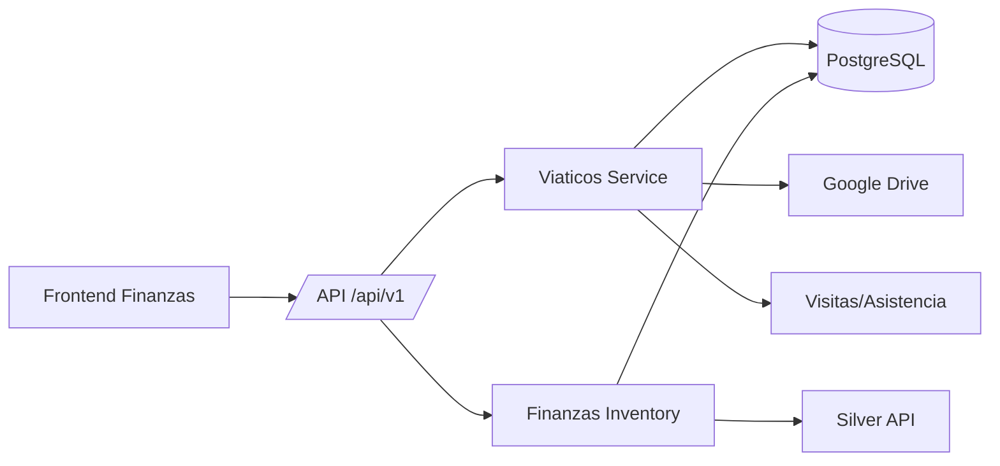
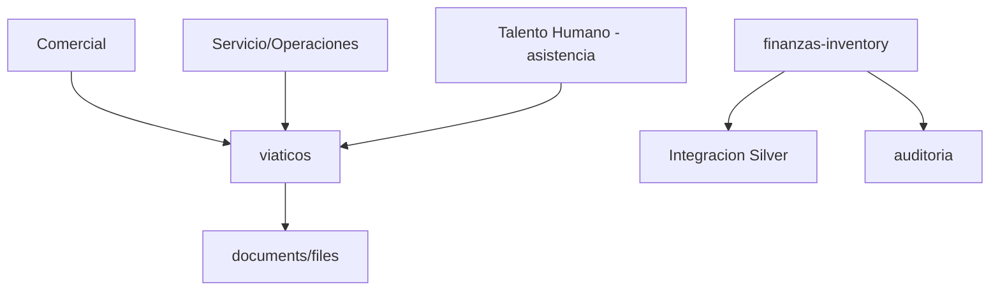
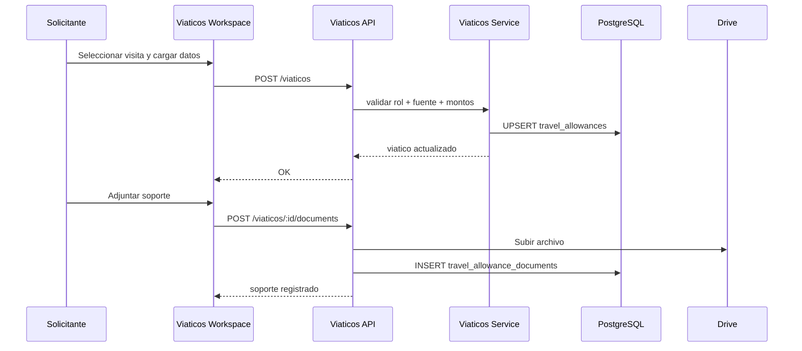

# DOCUMENTO DE DISENO DETALLADO DEL SISTEMA (DDS)
## Area 05: Finanzas

## 1. Introduccion
### 1.1 Proposito
Definir el diseno tecnico detallado del Area 05 (Finanzas) del Sistema de Procesos Internos (SPI), basado en la implementacion real del codigo.

### 1.2 Alcance
Este DDS cubre los modulos funcionales del area:
- `viaticos`
- `finanzas`

El alcance incluye backend, frontend, persistencia, seguridad, manejo de errores y discrepancias respecto al FRS del area.

### 1.3 Fuentes analizadas
- Backend (Express):
  - `backend/src/app.js`
  - `backend/src/modules/viaticos/*`
  - `backend/src/modules/finanzas/*`
  - `backend/src/middlewares/auth.js`
  - `backend/src/middlewares/roles.js`
  - `backend/src/utils/audit.js`
- Frontend (React):
  - `spi_front/src/routes/AppRoutes.jsx`
  - `spi_front/src/core/api/viaticosApi.js`
  - `spi_front/src/modules/finanzas/Dashboard.jsx`
  - `spi_front/src/modules/finanzas/pages/ViaticosWorkspace.jsx`
- Datos y migraciones:
  - `backend/src/actualsindatos.sql`
  - `backend/migrations/087_travel_allowances.sql`
  - `backend/migrations/089_viaticos_documents_and_validation.sql`
- Base funcional:
  - `validacion_sistema/URS/areas/area_05_finanzas.md`
  - `validacion_sistema/FRS/areas/FRS_area_05_finanzas.md`

### 1.4 Contexto de implementacion
- Arquitectura monolitica modular: Node.js/Express + React.
- API privada bajo `/api/v1/*` con autenticacion JWT.
- Persistencia en PostgreSQL.
- Integraciones del area:
  - Google Drive para evidencias de viaticos.
  - API externa Silver para sincronizacion de inventario financiero.

## 2. Arquitectura del sistema
### 2.1 Arquitectura general
El area financiera se implementa en dos subdominios:
- Subdominio de viaticos (`viaticos`): flujo transaccional completo con validaciones de asistencia y evidencia documental.
- Subdominio de inventario financiero (`finanzas`): movimientos de inventario, reporte CSV y conciliacion con Silver.

### 2.2 Capas y responsabilidades
- Frontend:
  - UI de viaticos para captura, revision y consulta documental.
  - Dashboard financiero en rutas protegidas.
- API backend:
  - Endpoints REST con control de roles.
  - Capa de servicios para reglas de negocio y consistencia.
- Servicios:
  - `viaticos.service.js`: autorizacion, reglas de negocio, esquema dinamico, validacion geoespacial/asistencia.
  - `finanzas.controller.js`: operaciones CRUD operativas de inventario y sincronizacion externa.
- Datos:
  - tablas de viaticos/documentos y tablas de inventario/movimientos.
- Integraciones:
  - Drive para soportes.
  - Silver API para sincronizacion externa.

### 2.3 Componentes backend del area
- `viaticos`: candidato de viatico, alta/actualizacion, cambio de estado, documentos y reporte.
- `finanzas`: inventario financiero, movimiento, reporte y sync.

### 2.4 Componentes frontend del area
- `modules/finanzas/Dashboard.jsx`
- `modules/finanzas/pages/ViaticosWorkspace.jsx`
- `core/api/viaticosApi.js`

## 3. Componentes del sistema
| Componente | Responsabilidad tecnica | Archivos principales | Dependencias |
|---|---|---|---|
| Viaticos Service | Gestion completa de viaticos con validacion por rol, fuente y asistencia | `modules/viaticos/viaticos.controller.js`, `viaticos.service.js`, `viaticos.routes.js` | `travel_allowances`, `travel_allowance_documents`, `client_visit_logs`, `prospect_visits`, `user_attendance_records`, `users`, Drive |
| Finanzas Inventory Controller | Movimiento de inventario, reporte CSV y conciliacion con Silver | `modules/finanzas/finanzas.controller.js`, `finanzas.routes.js` | `inventory`, `inventory_movements`, `users`, `audit`, Silver API |

## 4. Diseno de modulos
### 4.1 Modulo `viaticos`
- Responsabilidad: controlar solicitud, validacion y liquidacion de viaticos derivados de visitas o viajes manuales.
- Roles y acceso:
  - acceso operativo: `finanzas`, `comercial`, `backoffice_comercial`, `servicio_tecnico`, `tecnico`
  - acciones financieras exclusivas: cambio de estado y reporte (`finanzas`)
- Reglas de negocio detectadas:
  - `source_type` permitido: `client_visit`, `prospect_visit`, `manual_trip`
  - estados permitidos: `pending`, `approved`, `paid`, `rejected`
  - validacion de distancia, combustible y campo `outside_labor_area`
  - verificacion de asistencia/geo con estados: `unchecked`, `matched`, `review`, `mismatch`, `no_attendance`, `insufficient_geo`
- Capacidad tecnica: `ensureSchema()` crea/alinea tablas y constraints en runtime si no existen.

### 4.2 Modulo `finanzas`
- Responsabilidad: control de inventario financiero y conciliacion externa.
- Funciones detectadas:
  - listar inventario
  - registrar movimiento entrada/salida (transaccional)
  - generar reporte CSV de movimientos
  - ejecutar comparacion de discrepancias con Silver API
- Observacion de madurez:
  - implementacion centrada en inventario; no se detecta motor financiero amplio de transacciones contables en este modulo.

## 5. Modelo de datos
### 5.1 Entidades principales del area
| Entidad | PK | Campos principales detectados | Relaciones |
|---|---|---|---|
| `travel_allowances` | `id` | `source_type`, `source_id`, `requester_email`, `visit_date`, `status`, `amount`, `distance_km`, `fuel_amount`, `liquidation_amount`, `approved_amount`, `attendance_check_status` | FK a `users` (`requester_user_id`, `finance_user_id`, `reviewed_by_user_id`) |
| `travel_allowance_documents` | `id` | `allowance_id`, `doc_type`, `file_name`, `drive_file_id`, `drive_link`, `amount`, `expense_date`, `invoice_number` | FK a `travel_allowances`, `users` |
| `client_visit_logs` | `id` | visita de cliente, usuario, fecha, geodatos | fuente para candidatos de viatico |
| `prospect_visits` | `id` | visita prospecto, usuario, fecha, geodatos | fuente para candidatos de viatico |
| `user_attendance_records` | `id` | marcas de asistencia y ubicacion | validacion de coherencia de viatico |
| `inventory` | `id` | item inventario, cantidad, `last_updated`, `sku` | base de inventario financiero |
| `inventory_movements` | `id` | `inventory_id`, `type`, `quantity`, `reason`, `created_by`, `silver_tx_id` | FK a `inventory`, `users` |

### 5.2 Relaciones clave del area
- `travel_allowances` relaciona solicitud financiera con evento origen (`client_visit_logs` / `prospect_visits` / viaje manual).
- `travel_allowance_documents` conserva soportes con metadatos financieros y referencia a Drive.
- `inventory_movements` mantiene trazabilidad de entradas/salidas con actor y posible referencia externa (`silver_tx_id`).

### 5.3 Observaciones de persistencia
- `viaticos.service.js` gestiona evolucion de esquema con `CREATE TABLE IF NOT EXISTS` y `ALTER TABLE` en runtime.
- Existe indice unico parcial para evitar duplicidad por visita (`uq_travel_allowances_visit_source`).
- `finanzas` usa transacciones SQL explicitas (`BEGIN/COMMIT/ROLLBACK`) para movimientos de inventario.

## 6. Interfaces API
### 6.1 `viaticos` (`/api/v1/viaticos`)
| Endpoint | Descripcion | Entradas | Salida | Errores posibles |
|---|---|---|---|---|
| `GET /candidates` | Lista candidatos de viatico por rango/filtros | `startDate`, `endDate`, `status`, `requesterEmail` | listado candidatos + match de viatico | `400`, `401`, `403`, `500` |
| `GET /` | Lista viaticos registrados | filtros | lista viaticos | `401`, `403`, `500` |
| `POST /` | Crea o actualiza viatico (`upsert`) | payload financiero y origen | viatico persistido | `400`, `401`, `403`, `409` |
| `PATCH /:id/status` | Cambia estado viatico (finanzas) | `status`, notas, fecha pago | viatico actualizado | `400`, `401`, `403`, `404` |
| `GET /:id/documents` | Lista soportes de viatico | `id` | documentos asociados | `401`, `403`, `404` |
| `POST /:id/documents` | Agrega soporte documental | payload/base64 doc | documento registrado | `400`, `401`, `403`, `500` |
| `GET /:id/report` | Reporte consolidado del viatico | `id` | reporte tecnico-financiero | `401`, `403`, `404`, `500` |

### 6.2 `finanzas` (`/api/v1/finanzas`)
| Endpoint implementado en router | Descripcion | Entradas | Salida | Errores posibles |
|---|---|---|---|---|
| `GET /api/v1/inventory` | Lista inventario financiero | - | items inventario | `401`, `403`, `500` |
| `POST /api/v1/inventory/move` | Registra movimiento entrada/salida | `inventory_id`, `type`, `quantity`, `reason` | movimiento registrado | `400`, `401`, `403`, `404`, `500` |
| `GET /api/v1/inventory/report` | Exporta reporte CSV | - | archivo CSV | `401`, `403`, `500` |
| `POST /api/v1/inventory/sync` | Compara inventario local vs Silver | - | lista discrepancias | `401`, `403`, `500`, `502` |

Nota tecnica de ruteo: el router de `finanzas` esta montado en `/api/v1/finanzas`, por lo que los paths absolutos declarados generan rutas efectivas con prefijo doble (`/api/v1/finanzas/api/v1/inventory...`).

## 7. Flujos tecnicos
### 7.1 Flujo de viatico desde visita
1. Usuario consulta candidatos (`GET /viaticos/candidates`) para visitas del periodo.
2. Frontend registra viatico (`POST /viaticos`) con montos y detalle.
3. Servicio valida acceso, tipo de fuente y consistencia de datos.
4. Sistema realiza `upsert` en `travel_allowances`.
5. Finanzas revisa y actualiza estado (`PATCH /:id/status`).
6. Se anexan soportes (`POST /:id/documents`) y se consulta reporte consolidado (`GET /:id/report`).

### 7.2 Flujo de validacion de asistencia/geografia en viatico
1. Al registrar/revisar viatico, servicio obtiene ubicaciones y marcas de asistencia del actor.
2. Calcula coherencia geodesica (distancia) entre visita y asistencia.
3. Asigna `attendance_check_status` segun reglas (`matched`, `review`, `mismatch`, etc.).
4. Resultado queda persistido en `attendance_check_payload` para auditoria.

### 7.3 Flujo de movimiento de inventario financiero
1. Usuario de finanzas solicita movimiento (`POST /inventory/move`).
2. Sistema valida tipo (`in/out`) y cantidad positiva.
3. Ejecuta transaccion SQL:
   - actualiza `inventory`
   - inserta `inventory_movements`
4. Intenta sincronizacion con Silver API y, si obtiene id remoto, actualiza `silver_tx_id`.
5. Registra accion en auditoria (`logAction`).

## 8. Seguridad del sistema
### 8.1 Controles implementados
- JWT obligatorio en ambos modulos.
- `requireRole` en router y validaciones de rol adicionales en servicio (`assertFinance`, `assertViaticosAccess`).
- Separacion de responsabilidades:
  - solicitantes/operativos capturan datos
  - finanzas decide estado y emite reporte
- Auditoria de movimiento de inventario via `logAction`.

### 8.2 Riesgos de seguridad detectados
- En `viaticos`, la amplitud de roles de acceso requiere pruebas exhaustivas de segregacion de funciones.
- Ruteo no estandar en `finanzas.routes.js` puede provocar exposicion involuntaria o endpoints no consumidos.
- Integracion Silver depende de secretos/env vars; requiere monitoreo de error de dependencia externa.

## 9. Manejo de errores
### 9.1 Estrategia general
- Validacion temprana de payload y rol.
- Uso de codigos HTTP estandar por tipo de error.
- Transacciones con rollback para evitar inconsistencia en inventario.
- Manejo tolerante de falla externa Silver (warning + conciliacion posterior).

### 9.2 Codigos observados por el area
- `400`: tipo/estado invalido, montos inconsistentes, cantidad no valida.
- `401`: token ausente o invalido.
- `403`: accion no autorizada (especialmente estados/reportes financieros).
- `404`: viatico/inventario no encontrado.
- `409`: conflicto de unicidad/estado en upsert.
- `500`: error interno de DB/servicio.
- `502/504` potencial: dependencia Silver no disponible.

## 10. Diagramas de arquitectura y discrepancias
### 10.1 Diagrama de arquitectura (alto nivel)

### 10.2 Diagrama de dependencias funcionales

### 10.3 Diagrama de secuencia tecnica (viatico)

### 10.4 Discrepancias FRS vs implementacion real
1. `FRS_area_05` plantea un alcance financiero general; en codigo, la parte robusta del area esta concentrada en `viaticos`, mientras `finanzas` se limita a inventario y sync externo.
2. `finanzas.routes.js` define paths absolutos (`/api/v1/inventory...`) dentro de un router montado en `/api/v1/finanzas`, generando estructura de ruta inconsistente con la convencion del sistema.
3. `modules/finanzas/finanzas.service.js` e `index.js` estan vacios (0 bytes), por lo que la logica efectiva reside en el controlador.
4. No se detecta cliente frontend dedicado para `finanzas` inventory en `core/api`; el consumo frontend principal del area se concentra en `viaticosApi.js`.
