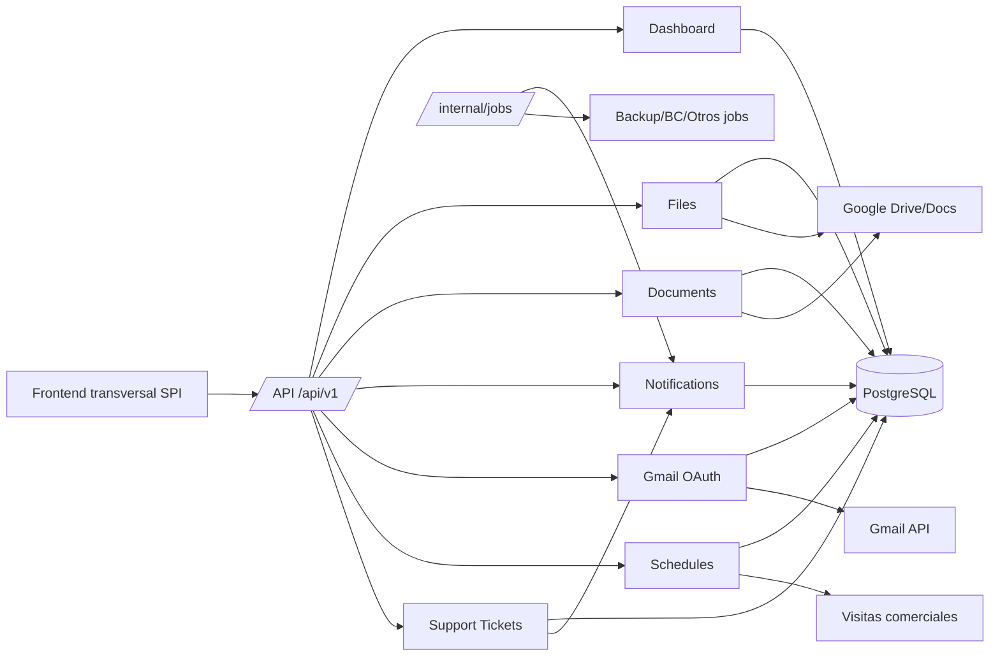
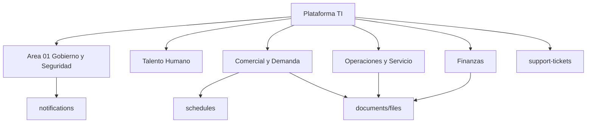
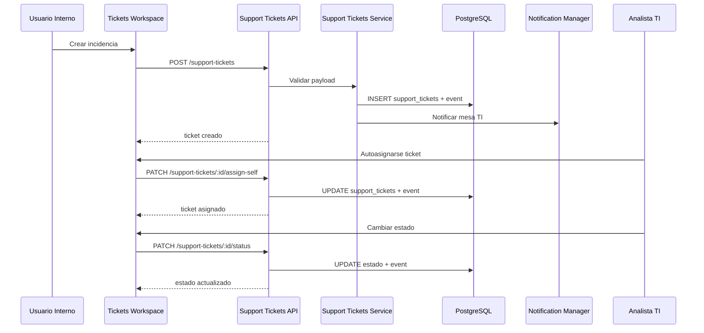

# DOCUMENTO DE DISENO DETALLADO DEL SISTEMA (DDS)
## Area 06: Plataforma TI e Integraciones

## 1. Introduccion
### 1.1 Proposito
Definir el diseno tecnico detallado del Area 06 (Plataforma TI e Integraciones) del Sistema de Procesos Internos (SPI), en base al comportamiento implementado en el repositorio.

### 1.2 Alcance
Este DDS cubre los modulos funcionales activos del area:
- `dashboard`
- `files`
- `documents`
- `notifications`
- `gmail`
- `schedules`
- `support-tickets`
- `calendar` (servicio interno)
- `database backup` (job interno expuesto para Cloud Scheduler)

Se incluye el modulo `integrations` para documentar su estado tecnico actual.

### 1.3 Fuentes analizadas
- Backend (Express):
  - `backend/src/app.js`
  - `backend/src/modules/dashboard/*`
  - `backend/src/modules/files/*`
  - `backend/src/modules/documents/*`
  - `backend/src/modules/notifications/*`
  - `backend/src/modules/gmail/*`
  - `backend/src/modules/schedules/*`
  - `backend/src/modules/support-tickets/*`
  - `backend/src/modules/calendar/calendar.service.js`
  - `backend/src/jobs/databaseBackupToDrive.js`
  - `backend/src/modules/integrations/*`
  - `backend/src/routes/internalJobs.routes.js`
  - `backend/src/middlewares/jobsAuth.js`
  - `backend/src/jobs/*` (jobs invocados por rutas internas)
  - `backend/src/middlewares/auth.js`
  - `backend/src/middlewares/roles.js`
- Frontend (React):
  - `spi_front/src/routes/AppRoutes.jsx`
  - `spi_front/src/core/api/dashboardApi.js`
  - `spi_front/src/core/api/filesApi.js`
  - `spi_front/src/core/api/documentsApi.js`
  - `spi_front/src/core/api/notificationsApi.js`
  - `spi_front/src/core/api/schedulesApi.js`
  - `spi_front/src/core/api/supportTicketsApi.js`
  - `spi_front/src/core/ui/NotificationContext.jsx`
  - `spi_front/src/core/ui/widgets/GmailAuthWidget.jsx`
  - `spi_front/src/modules/ti/pages/TicketsWorkspace.jsx`
  - `spi_front/src/modules/DocumentsPage.jsx`
- Datos y migraciones:
  - `backend/src/actualsindatos.sql`
  - `backend/migrations/008_gmail_oauth_tokens.sql`
  - `backend/migrations/017_notifications.sql`
  - `backend/migrations/054_notification_recipients_config.sql`
  - `backend/migrations/086_support_tickets_workspace.sql`
  - `backend/migrations/088_support_tickets_maturity.sql`
  - `backend/migrations/102_notification_dispatch_queue.sql`
  - `backend/migrations/108_notification_dispatch_queue_process_key.sql`
  - `backend/migrations/113_notification_process_email_threads.sql`
- Base funcional:
  - `validacion_sistema/URS/areas/area_06_plataforma_ti_integraciones.md`
  - `validacion_sistema/FRS/areas/FRS_area_06_plataforma_ti_integraciones.md`

### 1.4 Contexto de implementacion
- Arquitectura monolitica modular Node.js/Express + React.
- API privada bajo `/api/v1/*` con JWT global.
- Persistencia principal en PostgreSQL.
- Integraciones externas:
  - Google OAuth/Gmail API
  - Google Drive/Docs
  - Google Calendar (service account)
  - Cloud Scheduler para jobs tecnicos
  - Secret Manager para secretos operativos
- Jobs internos protegidos por `JOBS_KEY` (`/internal/jobs/*`).
- Respaldos de base de datos ejecutados desde `Cloud Scheduler` hacia `Cloud Run`.

## 2. Arquitectura del sistema
### 2.1 Arquitectura general
El area Plataforma TI provee servicios transversales a todas las areas funcionales:
- tableros
- documentos y archivos
- notificaciones
- correo/autorizacion Gmail
- agenda comercial
- mesa de ayuda TI
- ejecucion de jobs internos
- respaldo automatico de base de datos

### 2.2 Capas y responsabilidades
- Frontend:
  - clientes API reutilizables y componentes transversales (notificaciones, Gmail auth, mesa TI).
- API backend:
  - endpoints de servicios comunes con seguridad por token/rol.
- Servicios:
  - persistencia y reglas de negocio para documentos, tickets, agenda y notificaciones.
- Datos:
  - tablas de notificaciones, documentos, adjuntos, calendarios y tickets.
- Integraciones:
  - Gmail OAuth y envio de correo.
  - Drive/Docs para gestion documental.
  - Calendar para eventos de entrega.
- Jobs:
  - cola de notificaciones, backups, vencimientos y procesos de mantenimiento/BC.

### 2.3 Componentes backend del area
- Observabilidad de tablero: `dashboard`.
- Gestion de archivos de solicitud: `files`.
- Gestion de documentos y firma: `documents`.
- Notificaciones sincrono/asincrono: `notifications`.
- Gmail OAuth y envio: `gmail`.
- Agenda de visitas comerciales: `schedules`.
- Mesa de ayuda TI: `support-tickets`.
- Integracion de eventos calendario para entregas: `calendar.service`.
- Jobs internos orquestados por endpoint: `routes/internalJobs.routes.js`.

### 2.4 Componentes frontend del area
- Dashboards y paginas transversales:
  - `modules/DocumentsPage.jsx`
  - `modules/ti/pages/TicketsWorkspace.jsx`
- Clientes API:
  - `core/api/dashboardApi.js`
  - `core/api/filesApi.js`
  - `core/api/documentsApi.js`
  - `core/api/notificationsApi.js`
  - `core/api/schedulesApi.js`
  - `core/api/supportTicketsApi.js`
- Widgets/contexto:
  - `core/ui/NotificationContext.jsx`
  - `core/ui/widgets/GmailAuthWidget.jsx`

## 3. Componentes del sistema
| Componente | Responsabilidad tecnica | Archivos principales | Dependencias |
|---|---|---|---|
| Dashboard Service | Resumen comercial con KPIs y cache in-memory | `modules/dashboard/dashboard.controller.js`, `dashboard.service.js`, `dashboard.routes.js` | `bc_master`, `requests`, `clients`, `users` |
| Files Service | Carga/listado/descarga/eliminacion de adjuntos por solicitud | `modules/files/files.controller.js`, `file.service.js`, `files.routes.js` | `request_attachments`, Drive |
| Documents Service | Generacion desde plantilla, firma, export PDF, consulta por solicitud | `modules/documents/documents.controller.js`, `document.service.js`, `documents.routes.js` | `documents`, `document_signatures`, `requests`, Drive/Docs |
| Notifications Service + Manager | CRUD de notificaciones y despacho asincrono por cola | `modules/notifications/notifications.service.js`, `notificationManager.js`, `notificationRecipientsConfig.service.js`, `notifications.routes.js` | `notifications`, `notification_recipients_config`, `notification_dispatch_queue`, `notification_process_email_threads`, `users` |
| Gmail Controller | OAuth Gmail (URL/callback/status/revoke) y envio de correo | `modules/gmail/gmail.controller.js`, `gmail.routes.js` | `user_gmail_tokens`, Google OAuth/Gmail API |
| Schedules Service | Cronogramas comerciales, visitas planificadas y aprobacion de agenda | `modules/schedules/schedules.controller.js`, `schedules.service.js`, `schedules.routes.js` | `visit_schedules`, `scheduled_visits`, `client_requests`, `client_visit_logs`, `prospect_visits`, `users` |
| Support Tickets Service | Mesa de ayuda TI con eventos, comentarios, asignacion y KPIs | `modules/support-tickets/supportTickets.controller.js`, `supportTickets.service.js`, `supportTickets.routes.js` | `support_tickets`, `support_ticket_events`, `support_ticket_comments`, `users`, notifications |
| Calendar Service | Creacion de eventos de entrega y resolucion de asistentes por rol | `modules/calendar/calendar.service.js` | Google Calendar API, `users` |
| Database Backup Job | Generacion de dump PostgreSQL, compresion y carga en Google Drive | `jobs/databaseBackupToDrive.js`, `routes/internalJobs.routes.js`, `middlewares/jobsAuth.js` | PostgreSQL, `pg_dump`, Drive, Secret Manager, Cloud Scheduler |
| Internal Jobs Router | Exposicion protegida de jobs batch (notificaciones, backup, expiraciones, overtime, BC queue) | `routes/internalJobs.routes.js` | schedulers/jobs internos, `jobsAuth` |
| Integrations Module | Artefacto placeholder sin implementacion | `modules/integrations/*.js` | archivos vacios, no montados |

## 4. Diseno de modulos
### 4.1 Modulo `dashboard`
- Responsabilidad: proveer resumen de indicadores para dashboard comercial.
- Endpoint activo:
  - `GET /api/v1/dashboard/comercial/summary`
- Caracteristicas tecnicas:
  - cache en memoria (TTL 60s)
  - clasificacion de errores de schema (`42P01`, `42703`)
  - consultas paralelas de KPIs
- Actualizacion 2026-03-06:
  - la autorizacion del resumen comercial se movio a middleware de ruta usando `middlewares/roles.js`
  - el frontend ahora protege `/dashboard/comercial` con `ProtectedRoute` especifico para roles comerciales/gerenciales

### 4.2 Modulo `files`
- Responsabilidad: gestion de archivos adjuntos relacionados a solicitudes.
- Funciones:
  - upload multiple por request
  - listado por request
  - metadata y descarga
  - eliminacion por rol (gerencia/admin)
- Persistencia en `request_attachments` + archivos en Drive.

### 4.3 Modulo `documents`
- Responsabilidad: ciclo documental estructurado.
- Funciones:
  - crear documento desde plantilla
  - insertar firma (estandar y avanzada)
  - exportar a PDF
  - listar documentos por solicitud y consulta puntual
- Acople con modulo de firma del sistema y evidencias de proceso.

### 4.4 Modulo `notifications`
- Responsabilidad: emision, lectura y despacho de notificaciones.
- Funciones:
  - CRUD de notificaciones usuario
  - configuracion de destinatarios por evento/fuente
  - cola de despacho asincrona con estados/reintentos
  - soporte de hilos de correo por proceso (`notification_process_email_threads`)
- Actualizacion 2026-03-06:
  - `POST /api/v1/notifications` ya no permite enviar a terceros desde usuarios comunes
  - el endpoint HTTP queda restringido para destino ajeno a roles privilegiados
  - los flujos internos siguen operando por `notificationManager` y `notifications.service`

### 4.5 Modulo `gmail`
- Responsabilidad: autorizacion delegada por usuario y envio de correo.
- Flujo:
  - generar URL OAuth
  - callback de autorizacion
  - verificar estado de autorizacion
  - enviar correo usando cuenta autorizada
  - revocar acceso
- Frontend asociado: `GmailAuthWidget`.

### 4.6 Modulo `schedules`
- Responsabilidad: cronograma de visitas comerciales y su aprobacion gerencial.
- Funciones:
  - CRUD de cronogramas mensuales
  - gestion de visitas planificadas por cronograma
  - submit/aprobacion/rechazo
  - vista de pendientes, equipo y analitica
  - consulta de cronograma aprobado vigente

### 4.7 Modulo `support-tickets`
- Responsabilidad: mesa de ayuda TI para usuarios internos.
- Funciones:
  - creacion de ticket y bandeja personal
  - timeline de eventos y comentarios
  - reapertura/cierre y satisfaccion
  - workspace TI: listado, KPI, autoasignacion, cambio de estado
- Control de roles TI por `TI_ROLES`.

### 4.8 Servicio `calendar`
- Responsabilidad: crear eventos de entrega en Google Calendar para compras privadas.
- Funciones:
  - resolver asistentes por rol
  - crear evento con recordatorios y metadatos de compra
  - retornar referencia de evento sin bloquear flujo en error (fallback controlado)

### 4.9 Modulo `integrations`
- Estado tecnico:
  - `integrations.routes.js`, `integrations.controller.js`, `integrations.service.js`, `oracle.service.js` con tamano 0 bytes.
  - no montado en `backend/src/app.js`.

### 4.10 Job `database backup`
- Responsabilidad: generar respaldo de la base PostgreSQL activa y cargarlo en Google Drive.
- Flujo tecnico:
  - resolver configuracion DB desde `DATABASE_URL` o variables `DB_*`
  - ejecutar `pg_dump`
  - comprimir salida en `gzip`
  - cargar archivo a Drive
  - responder via endpoint interno `POST /internal/jobs/database/backup`
- Seguridad:
  - el endpoint se protege mediante `jobsAuth`
  - en produccion requiere `JOBS_KEY`
  - el modo esperado de ejecucion es `Cloud Scheduler`, no scheduler interno en memoria
- Dependencias externas:
  - Cloud Run
  - Cloud Scheduler
  - Secret Manager
  - Google Drive
  - cliente `postgresql-client`

## 5. Modelo de datos
### 5.1 Entidades principales del area
| Entidad | PK | Campos principales detectados | Relaciones |
|---|---|---|---|
| `notifications` | `id` | `user_id`, `title`, `message`, `type`, `source`, `status`, `priority`, `meta`, `created_at` | FK a `users` |
| `notification_recipients_config` | `id` | `event_type`, `event_source`, reglas destinatarios | FK logica con `users` |
| `notification_dispatch_queue` | `id` | `notification_id`, `process_key`, estado despacho, reintentos | FK a `notifications` |
| `notification_process_email_threads` | `id` | `process_key`, thread/email context | enlaza notificaciones por proceso |
| `request_attachments` | `id` | `request_id`, `drive_file_id`, `drive_link`, `mime_type`, `uploaded_by` | FK a `requests`, `users` |
| `documents` | `id` | `request_id`, `doc_drive_id`, `pdf_drive_id`, `signed`, `folder_drive_id` | FK a `requests` |
| `document_signatures` | `id` | `document_id`, `signer_user_id`, `role_at_sign`, `signed_at` | FK a `documents`, `users` |
| `user_gmail_tokens` | `id` | `user_id`, tokens OAuth, expiracion, alcance | FK a `users` |
| `visit_schedules` | `id` | `user_email`, `month`, `year`, `status`, notas | relacion con `users` por email |
| `scheduled_visits` | `id` | `schedule_id`, `client_request_id`, fecha planificada, ciudad, prioridad | FK a `visit_schedules`, `client_requests` |
| `support_tickets` | `id` | `code`, `requester_id`, `assigned_ti_user_id`, prioridad, estado, categoria, satisfaccion | FK a `users` |
| `support_ticket_events` | `id` | `ticket_id`, actor, tipo evento, payload, timestamp | FK a `support_tickets`, `users` |
| `support_ticket_comments` | `id` | `ticket_id`, autor, visibilidad, mensaje, timestamp | FK a `support_tickets`, `users` |

### 5.2 Relaciones clave del area
- `notifications` se alimenta de eventos funcionales y se despacha por cola asincrona.
- `request_attachments` y `documents` soportan evidencia transversal de multiples areas.
- `visit_schedules`/`scheduled_visits` conectan planificacion comercial con visitas ejecutadas.
- `support_tickets` y sus tablas hijas modelan ciclo completo de atencion TI.
- `user_gmail_tokens` habilita autenticacion delegada por usuario para envio de correo.

### 5.3 Observaciones de persistencia
- El sistema combina operaciones sincronas (CRUD API) con procesos asincronos (notification queue jobs).
- `dashboard.service.js` depende de tablas de negocio (`bc_master`, `requests`, `clients`) y puede fallar por drift de esquema.
- `calendar.service.js` no persiste eventos localmente, retorna metadata de evento remoto.
- el backup de base de datos depende de configuracion correcta en Cloud Run y Cloud Scheduler; no debe validarse solo a nivel de codigo.

## 6. Interfaces API
### 6.1 `dashboard` (`/api/v1/dashboard`)
| Endpoint | Descripcion | Entradas | Salida | Errores posibles |
|---|---|---|---|---|
| `GET /comercial/summary` | Resumen KPI comercial | `fresh` opcional | KPIs + charts + metadata cache | `401`, `403`, `500`, `503` |

### 6.2 `files` (`/api/v1/files`)
| Endpoint | Descripcion | Entradas | Salida | Errores posibles |
|---|---|---|---|---|
| `POST /upload/:requestId` | Sube archivos de solicitud | multipart `files[]` | archivos cargados | `400`, `401`, `403`, `500` |
| `GET /by-request/:requestId` | Lista adjuntos de solicitud | `requestId` | lista adjuntos | `401`, `403`, `404` |
| `GET /:fileId/metadata` | Metadata de archivo | `fileId` | metadata | `401`, `404` |
| `GET /:fileId/download` | Descarga archivo | `fileId` | stream/binario | `401`, `404`, `500` |
| `DELETE /:fileId` | Elimina adjunto | `fileId` | confirmacion | `401`, `403`, `404` |

### 6.3 `documents` (`/api/v1/documents`)
| Endpoint | Descripcion | Entradas | Salida | Errores posibles |
|---|---|---|---|---|
| `POST /from-template` | Crea documento desde plantilla | payload documento | documento creado | `400`, `401`, `403`, `500` |
| `POST /:documentId/sign` | Firma en etiqueta | base64/tag | documento firmado | `400`, `401`, `403`, `404` |
| `POST /:documentId/sign-advanced` | Firma avanzada | payload firma avanzada | documento firmado | `400`, `401`, `403`, `404` |
| `POST /:documentId/export-pdf` | Exporta documento a PDF | `documentId` | metadata/pdf | `401`, `403`, `404`, `500` |
| `GET /by-request/:requestId` | Lista documentos de solicitud | `requestId` | lista documentos | `401`, `404` |
| `GET /:documentId` | Consulta documento | `documentId` | detalle documento | `401`, `404` |

### 6.4 `notifications` (`/api/v1/notifications`)
| Endpoint | Descripcion | Entradas | Salida | Errores posibles |
|---|---|---|---|---|
| `GET /` | Lista notificaciones del usuario | `status` opcional | listado + no leidas | `401`, `500` |
| `POST /` | Crea notificacion | payload | notificacion creada | `400`, `401`, `500` |
| `PATCH /read-all` | Marca todas como leidas | - | conteo actualizado | `401`, `500` |
| `PATCH /:id/read` | Marca notificacion leida | `id` | notificacion actualizada | `401`, `404` |
| `DELETE /clear` | Limpia bandeja usuario | - | confirmacion | `401`, `500` |
| `DELETE /:id` | Elimina notificacion | `id` | confirmacion | `401`, `404` |

### 6.5 `gmail` (`/api/v1/gmail`)
| Endpoint | Descripcion | Entradas | Salida | Errores posibles |
|---|---|---|---|---|
| `GET /auth/url` | URL de autorizacion OAuth | - | `authUrl` | `401`, `500` |
| `GET /auth/callback` | Callback OAuth publico | params OAuth | confirmacion/redirect | `400`, `500` |
| `GET /auth/status` | Estado de autorizacion usuario | - | `authorized`, `email` | `401`, `500` |
| `POST /send` | Envio de correo con cuenta autorizada | `to`, `subject`, `html/text`, opcionales | resultado envio | `400`, `401`, `500`, `502` |
| `DELETE /auth/revoke` | Revoca token OAuth | - | confirmacion | `401`, `500` |

### 6.6 `schedules` (`/api/v1/schedules`)
| Endpoint | Descripcion | Entradas | Salida | Errores posibles |
|---|---|---|---|---|
| `GET /` | Lista cronogramas del asesor | filtros | lista cronogramas | `401`, `403`, `500` |
| `GET /pending-approval` | Pendientes de aprobacion | - | lista pendientes | `401`, `403` |
| `GET /team` | Cronogramas del equipo | - | lista equipo | `401`, `403` |
| `GET /analytics` | Analitica cronogramas | - | KPIs | `401`, `403` |
| `GET /approved/current` | Cronograma aprobado vigente | parametros opcionales | cronograma | `401`, `403` |
| `GET /:id` | Detalle cronograma | `id` | detalle + visitas | `401`, `403`, `404` |
| `POST /` | Crea cronograma | payload | cronograma creado | `400`, `401`, `403`, `409` |
| `PUT /:id` | Actualiza cronograma | payload | cronograma actualizado | `400`, `401`, `403`, `409` |
| `DELETE /:id` | Elimina cronograma | `id` | confirmacion | `401`, `403`, `404` |
| `POST /:id/submit` | Envia a aprobacion | `id` | estado actualizado | `401`, `403`, `409` |
| `POST /:id/visits` | Agrega visita planificada | payload visita | visita creada | `400`, `401`, `403` |
| `PUT /:id/visits/:visitId` | Actualiza visita | payload visita | visita actualizada | `400`, `401`, `403`, `404` |
| `DELETE /:id/visits/:visitId` | Elimina visita | `id`, `visitId` | confirmacion | `401`, `403`, `404` |
| `POST /:id/approve` | Aprueba cronograma | comentarios | cronograma aprobado | `401`, `403`, `409` |
| `POST /:id/reject` | Rechaza cronograma | motivo | cronograma rechazado | `401`, `403`, `409` |

### 6.7 `support-tickets` (`/api/v1/support-tickets`)
| Endpoint | Descripcion | Entradas | Salida | Errores posibles |
|---|---|---|---|---|
| `POST /` | Crea ticket de soporte | payload ticket | ticket creado | `400`, `401`, `500` |
| `GET /my` | Lista tickets del solicitante | filtros | listado tickets | `401`, `500` |
| `GET /:id/events` | Lista eventos del ticket | `id` | timeline eventos | `401`, `403`, `404` |
| `GET /:id/comments` | Lista comentarios | `id` | comentarios | `401`, `403`, `404` |
| `POST /:id/comments` | Agrega comentario | mensaje/visibilidad | comentario creado | `400`, `401`, `403` |
| `POST /:id/reopen` | Reabre ticket | motivo opcional | ticket reabierto | `401`, `403`, `409` |
| `POST /:id/close` | Cierre por solicitante | observacion opcional | ticket cerrado | `401`, `403`, `409` |
| `POST /:id/satisfaction` | Califica atencion | score/comentario | satisfaccion registrada | `400`, `401`, `403` |
| `GET /workspace/list` | Lista TI workspace | filtros | listado de gestion TI | `401`, `403` |
| `GET /workspace/kpi` | KPI workspace TI | filtros | indicadores | `401`, `403` |
| `PATCH /:id/assign-self` | Autoasignacion TI | `id` | ticket asignado | `401`, `403`, `409` |
| `PATCH /:id/status` | Cambia estado TI | nuevo estado | ticket actualizado | `400`, `401`, `403`, `409` |

### 6.8 Jobs internos (`/internal/jobs/*`)
Endpoints protegidos por `jobsAuth` (JOBS_KEY):
- `/mantenimiento/reminders`
- `/equipment/reservations/expired`
- `/equipment/contracts/reminders`
- `/attendance/overtime`
- `/notifications/dispatch`
- `/business-case/preflow/expiry`
- `/business-case/determinations-gate/expiry`
- `/business-case/sheets/process-queue`
- `/database/backup`

## 7. Flujos tecnicos
### 7.1 Flujo de documento firmado
1. Usuario crea documento (`POST /documents/from-template`).
2. Firma en punto definido (`POST /documents/:id/sign` o `sign-advanced`).
3. Sistema registra firma en `document_signatures` y actualiza `documents`.
4. Usuario exporta PDF (`POST /documents/:id/export-pdf`).

### 7.2 Flujo de notificacion asincrona
1. Evento funcional crea notificacion (`notifications` o manager).
2. Se inserta/actualiza item en `notification_dispatch_queue`.
3. Job interno `/internal/jobs/notifications/dispatch` procesa cola por lotes.
4. Se registran resultado, retries y estado final.

### 7.3 Flujo Gmail OAuth
1. Usuario abre widget y solicita URL (`GET /gmail/auth/url`).
2. Usuario autoriza en Google y retorna a callback (`/gmail/auth/callback`).
3. Sistema persiste token en `user_gmail_tokens`.
4. Usuario envia correo (`POST /gmail/send`) o revoca (`DELETE /gmail/auth/revoke`).

### 7.4 Flujo de cronograma comercial
1. Asesor crea cronograma (`POST /schedules`) y visitas asociadas.
2. Envia a aprobacion (`POST /:id/submit`).
3. Jefatura aprueba/rechaza (`/approve` o `/reject`).
4. Sistema disponibiliza agenda aprobada (`GET /approved/current`).

### 7.5 Flujo de ticket TI
1. Usuario crea ticket (`POST /support-tickets`).
2. TI revisa workspace y autoasigna ticket (`PATCH /assign-self`).
3. TI actualiza estado y registra eventos/comentarios.
4. Solicitante puede cerrar/reabrir y calificar satisfaccion.

## 8. Seguridad del sistema
### 8.1 Controles implementados
- JWT global en rutas privadas del area.
- Autorizacion por rol en endpoints sensibles:
  - archivos/documentos (roles operativos/gerencia)
  - cronogramas (asesor vs manager)
  - workspace TI (`TI_ROLES`)
- Callback OAuth de Gmail expuesto publicamente solo para handshake de autorizacion.
- Jobs internos protegidos por middleware especifico (`jobsAuth`).

### 8.2 Riesgos de seguridad detectados
- Dependencia fuerte de credenciales y secretos de Google/SMTP/API keys.
- Superficie de jobs internos requiere control estricto de rotacion de `JOBS_KEY`.
- Gestion de archivos/documentos exige politicas de retencion y acceso por metadata.
- Modulo `integrations` vacio puede inducir supuestos incorrectos de capacidades activas.

## 9. Manejo de errores
### 9.1 Estrategia general
- Manejo central de errores en `app.js` con respuesta estructurada.
- Clasificacion explicita de errores en `dashboard.service` (schema vs DB).
- Reintentos y estados de fallo en cola de notificaciones.
- Tolerancia controlada en `calendar.service` para no bloquear flujo principal.

### 9.2 Codigos observados por el area
- `400/422`: payload invalido, parametros faltantes, transicion no valida.
- `401`: sesion/token invalido.
- `403`: accion no permitida por rol.
- `404`: recurso no encontrado (archivo, documento, ticket, cronograma).
- `409`: conflicto de estado o concurrencia (tickets/cronogramas).
- `500`: error interno del servicio.
- `502/504`: dependencia externa no disponible (Gmail/Google API).
- `503`: DB no disponible o error clasificado de infraestructura.

## 10. Diagramas de arquitectura y discrepancias
### 10.1 Diagrama de arquitectura (alto nivel)

### 10.2 Diagrama de dependencias funcionales

### 10.3 Diagrama de secuencia tecnica (ticket TI)

### 10.4 Discrepancias FRS vs implementacion real
1. `FRS_area_06` contempla `integrations` como modulo funcional; en codigo actual `modules/integrations/*` esta vacio (0 bytes) y no esta montado en `app.js`.
2. El FRS plantea gestion explicita de calendario como modulo API; en implementacion actual existe `calendar.service.js` sin router publico propio (consumo interno desde flujos de compras privadas).
3. El alcance de tablero en FRS es amplio; en API se detecta un endpoint principal activo para resumen comercial (`/dashboard/comercial/summary`).
4. Parte de la trazabilidad tecnica descrita en FRS se implementa mediante jobs internos y cola de notificaciones, no solo por endpoints directos de modulo.
5. El respaldo de base de datos es un job interno transversal y debe tratarse como servicio tecnico del area, no como detalle operativo aislado.
